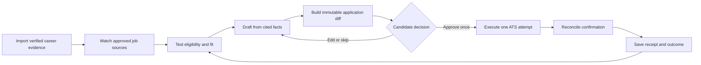
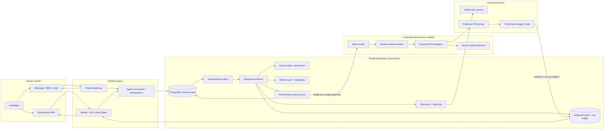
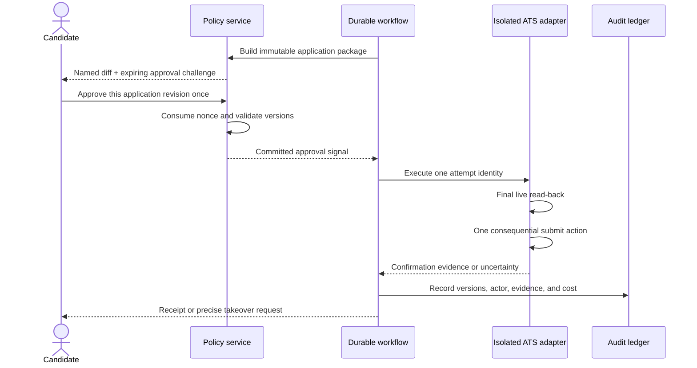

# RoleDawn

<p align="center">
  
</p>

<p align="center">
  <strong>Your job search has a night shift.</strong><br />
  A trust-first career agent that finds fitting roles, prepares evidence-backed applications, asks for one precise approval, and returns a verifiable receipt.
</p>

<p align="center">
  
  
  
  
  
</p>

---

RoleDawn explores a hard product question: how do you delegate the repetitive work of a job search without delegating your identity, facts, or final authority?

The answer is not one immortal browser agent. It is a durable, event-driven system with an evidence graph, explicit application states, versioned ATS adapters, isolated credentials, single-use approval, and proof after every consequential action. iMessage is a fast control surface; the web dashboard remains the canonical place to inspect diffs, exceptions, and history.

> **Repository status:** the responsive landing page and dashboard are working prototypes backed by illustrative local data. The production control plane, workflow engine, database, messaging, and ATS execution layers below are implementation-ready architecture—not shipped infrastructure. Nothing in this repository can submit a real job application.

## What is here now

| Area | Current state | Evidence |
|---|---|---|
| Landing experience | Implemented responsive prototype | [`src/components/landing`](src/components/landing) |
| Candidate dashboard | Implemented responsive product shell | [`src/components/dashboard`](src/components/dashboard) |
| Brand and interaction system | Implemented in prototype; working name | [Brand kit](docs/brand/brand-kit.md) |
| Product definition | Detailed, sequenced, and decision-tracked | [PRD](docs/product/prd.md) · [Decision log](docs/execution/decision-log.md) |
| System architecture | Designed through services, state authority, recovery, scale, and cost | [Architecture map](docs/architecture/roledawn-system-architecture-map.md) |
| Security and approval model | Threat-modeled design; not independently audited | [Data, security, and trust](docs/architecture/data-security-and-trust.md) |
| ATS execution | Adapter and reconciliation design; not connected to live employers | [ATS automation](docs/architecture/ats-automation.md) |
| iMessage and channels | Provider-neutral contract; Photon remains an alpha candidate | [Channel strategy](docs/product/channel-strategy.md) |
| Market and competitor research | Source-labeled research corpus | [Source register](docs/research/source-register.md) |

## The product loop



The launch promise is intentionally narrower than unattended autopilot:

> Wake up to verified applications ready for your approval.

Standing authorization is a later permission tier that must be earned by measured reliability, explicit policy, and candidate trust.

## System architecture



This diagram is the repository-level view. The [full architecture companion](docs/architecture/roledawn-system-architecture-map.md) explains all trust zones, twelve numbered transitions, three distinct authorities, failure-safe loops, and open vendor choices. Its [editable Excalidraw source](docs/architecture/roledawn-system-architecture.excalidraw) is checked in for design reviews.

### Three authorities, three different jobs

| Authority | Owns | Never substitutes for |
|---|---|---|
| PostgreSQL | Candidate facts, policy, jobs, applications, approvals, attempts, receipts | Workflow retry history |
| Temporal | Timers, waits, activity attempts, cancellation, replay | Candidate facts or customer-visible proof |
| Append-only ledger | Consequential actors, versions, evidence, latency, and cost | Mutable application state |

Messages, model memory, browser replay, and dashboard projections are contextual or derived. None of them can authorize a side effect.

## The consequential-action boundary



If the network disappears near **Submit**, RoleDawn reconciles the same attempt. It does not click again and hope.

## Engineering invariants

- Models can interpret and draft. They cannot grant themselves permission.
- Every material application claim resolves to approved candidate evidence.
- One approval binds one user, one job version, one artifact set, one field diff, one action, one expiry, and one nonce.
- OTP, CAPTCHA, login, unknown certification, or sensitive answers pause for the candidate.
- Credentials stay outside prompts, normal database rows, screenshots, analytics, and support views.
- No application becomes **Submitted** without confirmation evidence.
- Uncertain side effects enter reconciliation before retry.
- Provider-specific behavior stays behind channel, model, browser, and ATS adapters.

## Prototype

The prototype shows the acquisition story and the authenticated operating surface: nightly matches, the approval queue, evidence-backed materials, application state, receipts, search controls, and responsive mobile behavior.

```bash
npm install
npm run dev
```

Open:

- `http://127.0.0.1:3000/` — public landing experience.
- `http://127.0.0.1:3000/dashboard` — interactive candidate dashboard.
- `http://127.0.0.1:3000/mobile-preview/landing` — 390 px landing QA harness.
- `http://127.0.0.1:3000/mobile-preview` — 390 px dashboard QA harness.

Validate the repository with:

```bash
npm run lint
npm run build
```

The GitHub workflow runs the same checks on every push and pull request.

## Repository map

```text
.
├── src/
│   ├── app/                    Next.js routes, metadata, and responsive QA pages
│   ├── components/             Landing, dashboard, and shared interface components
│   └── data/                   Illustrative prototype state
├── docs/
│   ├── architecture/           Runtime, trust, ATS, integration, scale, and model design
│   ├── brand/                  Identity, typography, color, voice, and visual rules
│   ├── execution/              Roadmap, implementation handoff, GTM, and decision log
│   ├── product/                PRD, onboarding, channels, writing policy, and interface specs
│   ├── research/               Source register and competitive studies
│   └── strategy/               Positioning and initial customer
├── assets/brand/               Editable/reference brand artifacts
└── public/brand/               Production-served visual assets
```

## Read the project at the right altitude

| Reader | Start here |
|---|---|
| Hiring manager or engineer | [Implementation handoff](docs/execution/implementation-handoff.md) → [System architecture](docs/architecture/system-architecture.md) → [Decision log](docs/execution/decision-log.md) |
| Product or design | [PRD](docs/product/prd.md) → [Landing blueprint](docs/product/landing-page-blueprint.md) → [Dashboard experience](docs/product/dashboard-and-responsive-experience.md) |
| Founder or investor | [Founder brief](docs/00-founder-brief.md) → [Positioning](docs/strategy/positioning-and-icp.md) → [Roadmap](docs/execution/roadmap.md) |
| Security reviewer | [Data, security, and trust](docs/architecture/data-security-and-trust.md) → [ATS automation](docs/architecture/ats-automation.md) → [Integrations](docs/architecture/integrations-and-oauth.md) |
| Research reviewer | [Source register](docs/research/source-register.md) → [Market and competitors](docs/research/market-and-competitors.md) |

The complete [documentation map](docs/README.md) explains authority and recommended reading paths.

## Delivery sequence

1. Freeze typed domain events, approval contracts, and safety fixtures.
2. Build identity, Career Vault, evidence review, and draft-only workflows.
3. Add durable discovery, fitting, writing, and approval queues.
4. Run browser shadow mode against Greenhouse, Lever, and Ashby fixtures.
5. Graduate one adapter at a time from extraction to candidate-authorized submission.
6. Add iMessage as a replaceable channel after the web approval loop works.
7. Admit a ten-user concierge alpha only after failure-injection gates pass.

See the [twelve-week roadmap](docs/execution/roadmap.md) and [canonical build handoff](docs/execution/implementation-handoff.md) for gates, reversal triggers, and work packages.

## Evidence discipline

This repository separates **verified observation**, **company claim**, **inference**, **recommendation**, **hypothesis**, and **open question**. External claims belong in the dated [source register](docs/research/source-register.md). Employer outcomes are never inflated: application, recruiter response, interview, offer, and hire remain distinct events.

RoleDawn is a working name. Preliminary screening is documented, but formal trademark and legal clearance remain open. Brand, pricing, vendors, database/auth provider, model mix, browser provider, iMessage bridge, and standing-authorization rules remain hypotheses until their roadmap gates pass.

## Working on the repository

Read [`AGENTS.md`](AGENTS.md) before changing strategy, product behavior, architecture, brand, or launch copy. It defines the evidence, safety, documentation, and review rules for humans and coding agents.

- [Contributing](CONTRIBUTING.md)
- [Security policy](SECURITY.md)

No open-source license has been granted for this repository.
