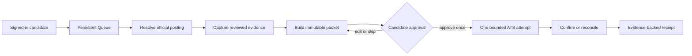

# RoleDawn

<p align="center">
  
</p>

<p align="center">
  <strong>Your job search has a night shift.</strong><br />
  A trust-first career agent that prepares evidence-bound applications, asks for
  one precise approval, and records what happened.
</p>

<p align="center">
  
  
  
  
  
</p>

RoleDawn asks a narrow product question: how do you delegate repetitive job
search work without delegating your identity, facts, or final authority?

## Current status

The current runtime is persistent-only:

1. `/` redirects to `/dashboard`.
2. Anonymous users are sent to `/login`.
3. A signed-in candidate sees Application Kits backed by an RLS-scoped Queue.
4. Pasting a supported official Greenhouse, Lever, or Ashby URL records durable
   preparation intent.
5. The candidate can open database-backed application detail.
6. The candidate can upload one PDF or DOCX résumé in `/vault`, review or edit
   its extracted text, replace it with a new version, or delete it.

There is no candidate-facing sample workspace, Browse, Swipe, or marketing
landing route. The Career Vault is database-backed. The only in-memory
implementation is an explicit test-support adapter for the computer-session
contract.

The authenticated shell groups **Prepare**, **Apply**, and **Interview**.
Application Kits and Résumé are live. Cover Letters, Auto Apply, Search, Saved,
Interview Buddy, and Mock Interviews are labeled **Soon** and do not link to
empty or mock routes.

**Verified live:** HireWire development run `20260812135034` passed the hosted
Milestone 0 harness for Auth, RLS, Queue, intake, outbox recovery, and one
official-source resolution. Career Vault run `20260812170337` separately passed
the complete two-user upload, private-path isolation, finalization, deterministic
extraction, review, stale-write rejection, replacement-safety, deletion, and
cleanup sequence after all 18 migrations through `20260812182500` were present
in the hosted ledger.

Those results prove the persistent foundation, narrow resolver, and current
Career Vault data lifecycle. They do not prove model drafting, browser/CUA form
fill, approval consumption, employer submission, confirmation, or receipts.
Nothing in this repository can submit a real job application.

See [current state](docs/execution/current-state.md),
[backend build status](docs/execution/backend-build-status.md), and the
[changelog](CHANGELOG.md).

## What is implemented

| Area | Repository evidence | Current boundary |
|---|---|---|
| Authenticated web | Supabase SSR, magic-link callback, session validation | Two ordinary hosted sessions accepted in Milestone 0 |
| Persistent Queue | RLS-scoped newest-first read model | Self-tenancy and cross-tenant denial verified live; no broad discovery runtime |
| Pasted-link intake | Identity-derived transactional command and outbox | Replay, mismatch rejection, and canonical-URL dedup verified; preparation intent only |
| Application detail | Database-backed candidate route | No rendered materials or approval yet |
| Job resolution | Fixed-origin Greenhouse, Lever, and Ashby adapters | One official-source worker resolution verified live |
| Career Vault | Private PDF/DOCX source, deterministic transcription, candidate text review, replacement, and deletion | Two-user hosted acceptance passed in run `20260812170337` |
| Database contracts | 18 forward migrations through `20260812182500` | Hosted ledger aligned; schema lint returned no errors |
| Application packet | Immutable snapshots, provenance, citations, diffs, no-slop checks | Offline contract; no model or renderer |
| Browser lifecycle | Provider-neutral bounded session contract | No live driver, form fill, or submit |
| Runtime data | Persistent Supabase records only | No candidate-facing mock data or sample workspace; test fixtures remain isolated from runtime |

## Not connected

- Malware scanning, quarantined or isolated parsing, OCR, structured reviewed
  facts, retention controls, or export. Uploaded versions are recorded as
  `NOT_SCANNED`.
- Model/company research, drafting, artifact rendering, or artifact upload.
- Temporal or another durable workflow deployment.
- Live browser/CUA, credentials, takeover, ATS fill, submit, reconciliation, or
  external confirmation evidence.
- iMessage, SMS, email, push, billing, analytics, or support tooling.

An application row means “prepare this job.” It is not an application sent,
confirmed, or received by an employer.

## Product loop



Persistent Queue/job resolution and Career Vault now have separate hosted
acceptance evidence. The remaining steps are staged behind explicit release
gates.

## Authority model

| Authority | Owns | Does not own |
|---|---|---|
| Supabase/PostgreSQL | Candidate facts, jobs, applications, approvals, attempts, receipts | Workflow retry history |
| Future durable workflow | Timers, waits, activity attempts, cancellation, replay | Candidate facts or confirmation proof |
| Append-only evidence | Consequential actors, versions, external confirmation | Mutable application state |

Messages, model memory, browser state, and dashboard projections cannot grant
authority.

## Engineering invariants

- Models may interpret and draft; they may not authorize a side effect.
- Every material candidate claim must resolve to approved evidence.
- Sensitive or legal answers are explicit candidate policy, never inference.
- One approval binds one candidate, application, immutable packet/diff, action,
  expiry, and nonce.
- A material change invalidates approval.
- One attempt crosses the submit boundary at most once.
- Uncertain outcomes reconcile before retry.
- Confirmed requires external evidence.
- Provider IDs and secrets stay behind owned adapters.

## Run locally

Use Node.js 22 or newer.

```bash
npm install
npm run dev -- --hostname 127.0.0.1 --port 3001
```

Configure public Supabase values and `APP_BASE_URL` from `.env.example` in an
ignored `.env.local`. The authenticated runtime has no sample fallback.

Keep `SUPABASE_SECRET_KEY` server-only. Do not paste it into a browser, commit,
issue, chat, or any variable prefixed with `NEXT_PUBLIC_`.

The development-only database test candidate remains hidden unless every
loopback, environment, fixed-identity, flag, and server-secret gate passes. It
creates a normal Supabase session; it never injects a fake actor or uses the
service role for ordinary reads.

## Validate

```bash
npm test
npm run typecheck
npm run lint
npm run check:docs
npm run build
git diff --check
```

The GitHub workflow runs tests, typecheck, lint, documentation checks, and the
build. Hosted acceptance is a separate, explicitly gated operator run.

With server-only Supabase configuration present, one bounded resolver batch can
run with:

```bash
npm run worker:once
```

The worker resolves and versions an official posting. It does not research,
draft, fill, approve, or submit.

## Repository map

```text
src/app/                 authenticated routes and Server Actions
src/components/          persistent Queue, application, and Career Vault interface
src/domain/              typed contracts and deterministic tests
src/lib/supabase/        browser, server, admin, proxy, and generated types
src/server/              auth, Queue reads, ingestion, resume parsing, Vault, and workers
scripts/                 bounded operator entrypoints
supabase/migrations/     forward-only database changes
docs/                    product, architecture, execution, and research
```

## Read next

| Reader | Start here |
|---|---|
| Founder | [Current state](docs/execution/current-state.md) → [Founder brief](docs/00-founder-brief.md) → [Roadmap](docs/execution/roadmap.md) |
| Engineer | [Backend status](docs/execution/backend-build-status.md) → [Implementation handoff](docs/execution/implementation-handoff.md) → [Career Vault intake](docs/architecture/career-vault-resume-intake.md) → [Backend architecture](docs/architecture/backend-operating-model.md) |
| Product | [PRD](docs/product/prd.md) → [Dashboard contract](docs/product/dashboard-and-responsive-experience.md) → [Frontend/backend contract](docs/architecture/frontend-backend-contract.md) |
| Security | [Data, security, and trust](docs/architecture/data-security-and-trust.md) → [ATS automation](docs/architecture/ats-automation.md) |
| Research | [Source register](docs/research/source-register.md) → [Market and competitors](docs/research/market-and-competitors.md) |

The full [documentation map](docs/README.md) explains authority and routed
references.

## Evidence discipline

This repository distinguishes **Implemented**, **Previously recorded**,
**Designed**, **Not connected**, and **Verified live**. External claims belong in
the dated source register. Application, recruiter response, interview, offer,
and hire remain separate outcomes.

RoleDawn is a working name pending formal clearance. No open-source license has
been granted for this repository. Read [AGENTS.md](AGENTS.md) before changing
strategy, product behavior, architecture, brand, or launch copy.
