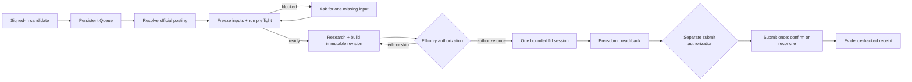

# RoleDawn

<p align="center">
  
</p>

<p align="center">
  <strong>Your job search has a night shift.</strong><br />
  A career agent that matches jobs to your experience, prepares tailored
  applications, and sends them under your chosen authorization.
</p>

<p align="center">
  
  
  
  
  
</p>

RoleDawn asks a narrow product question: how do you delegate repetitive job
search work without delegating your identity, facts, or final authority?

## Home, Jobs, Profile

The signed-in product has three places. **Home** is where you paste a job link, see what needs you, turn autopilot on or off, follow your applications, and apply to your top matches. **Jobs** searches the full catalog (about 40,000 open roles from 436 reviewed boards as of 2026-09-28). **Profile** holds your résumé, organized experience, stories from a short interview, the answers every application asks, and what you're looking for. Each application page shows its progress, a preview of the cover letter and résumé written for that job, short answers, and the research behind them. See [current state](docs/execution/current-state.md).

Autopilot ranks matches across the fresh catalog and applies with standing consent. The pilot defaults to at most one attempted automatic submission per hour and 24 per UTC day. PostgreSQL enforces consent, actual submission capacity, duplicate prevention and uncertainty recovery. Profile changes pause auto-apply. Greenhouse and Lever have concrete delivery adapters; Ashby supports preparation while its delivery adapter remains open. See [current matching and auto-apply acceptance](docs/execution/matching-and-auto-apply-acceptance.md). No real-employer outcome is implied by synthetic acceptance.

## Three product systems

RoleDawn is one product with three linked systems:

| System | Owns | Current boundary |
|---|---|---|
| **Candidate Intelligence** | Private sources, reviewed evidence, exact answers, and permitted use | Guided onboarding, a database readiness gate, durable résumé/source versions, exact answers, and source-linked evidence review work; OCR, malware isolation, stories, and voice policy remain open |
| **Opportunity Intelligence** | Shared attributable jobs plus private saves, eligibility, and recommendations | 25 reviewed Greenhouse, Lever and Ashby boards, daily refresh, source health, cursor-based browsing, saves and deterministic fit reasons; watchlists and learned ranking remain open |
| **Application Delivery** | Research, application revisions, writing policy, browser execution, reconciliation, and proof | Editable profession-neutral writing policies; separate files and a combined PDF; named-job delegation; acknowledged uploads, configured multi-page execution, one-use final dispatch, missing-answer restart and receipts. Controlled synthetic acceptance passes; real-employer acceptance and broader ATS coverage remain open |

<p align="center">
  
</p>

Auth, Storage, commands, events, policy, models, workflows, browser providers,
audit, and channels form one shared control plane rather than a fourth product
system. Start with the presentation-ready
[architecture at a glance](docs/architecture/architecture-at-a-glance.md), then
use the canonical
[three-system product architecture](docs/architecture/three-system-product-architecture.md)
for subsystem detail.

## Current status

**2026-09-17 testing access:** the hosted app temporarily opens the existing single test account automatically. Sign-in, sign-out and account switching are hidden. All sessions are pinned to the server-configured test identity; ordinary Supabase permissions still apply. Set `ROLEDAWN_SINGLE_ACCOUNT_MODE=false` and redeploy to restore the normal login flow. While enabled, anyone with the site URL can use that shared test workspace. See [single-account testing](docs/execution/single-account-testing.md).

**2026-09-16 supply and hosting update:** the catalog contains 5,879 fresh open roles across 25 reviewed employers. Jobs streams successive pages and mixes employers within each daily cohort. Netlify hosts the web app and scheduled, database-leased worker lanes. See the [hosting and catalog acceptance](docs/execution/catalog-and-hosted-workers-acceptance.md) for measured activation state, commands, recovery and remaining launch limits.

**2026-09-16 application update:** editable [writing policies](policies/application-writing/README.md) drive every newly generated résumé and cover letter, with release/hash provenance and a combined cover-letter-first PDF. **Apply for me** delegates one named job. The delivery lane verifies uploads, navigates configured steps, requests missing answers, rebuilds an expired browser, sends once and records receipt evidence. A real Agents API acceptance completed this loop against a local test server: two fresh browsers, two acknowledged uploads and one synthetic submission. No employer application was sent. See the [execution design](docs/architecture/agents-application-execution.md) and [current acceptance record](docs/execution/application-autopilot-acceptance.md). Older milestone details below retain their original scope.

The current runtime is database-backed and fail-closed:

1. `/` redirects to `/dashboard`.
2. Anonymous users are sent to `/login`, which opens the fixed test account automatically while single-account testing is enabled.
3. A signed-in candidate with an incomplete profile enters onboarding: résumé,
   basics, what they're looking for, and an optional story interview.
   The database requires a reviewed résumé, candidate-entered name components,
   exact contact/location, and job goals before activation. Missing or unresolved
   work authorization stays visible as a job-specific review item.
4. An active candidate sees **Home**, backed by an RLS-scoped Queue.
5. Pasting a supported official Greenhouse, Lever, or Ashby URL records durable
   preparation intent.
6. The candidate can open database-backed application detail.
7. The candidate can upload one PDF or DOCX résumé in `/vault`, review or edit
   its extracted text, replace it with a new version, or delete it.
8. The candidate can save reviewed identity, contact, location, and
   country-scoped work-eligibility answers in `/vault/answers`.
9. The candidate can review exact résumé passages in `/vault/facts`, approve or
   reject them, edit with attestation, and restrict how approved evidence may be
   used.
10. The candidate can search the first allowlisted catalog in `/search`, save
    roles in `/saved`, see a deterministic fit explanation, and start an
    application from one current job version.
11. A leased preparation worker can freeze one exact job version plus the
    candidate's current reviewed résumé, approved narrative-evidence versions,
    approved exact-fact version references, and application policy into an
    immutable Application Input Snapshot.
12. Deterministic preflight either marks that snapshot `READY_FOR_DRAFTING` or
    stores a typed blocker and a candidate action. It creates no résumé, cover
    letter, approval, browser session, or employer side effect.
13. The founder dogfood candidate has one live `READY_FOR_DRAFTING` input
    snapshot. The Application Kit worker consumed its drafting request and
    committed one current `READY` revision.
14. Exact-snapshot research and drafting contracts, a strict model-output
    parser, immutable research/revision provenance, and a server-only OpenAI
    Responses adapter for `gpt-5.6-terra` are implemented.
15. The hosted worker used that exact snapshot to create one official-posting
    research bundle, run deterministic and semantic checks, merge exact facts
    outside the model, render four QA-passed private artifacts, and publish the
    event only after an atomic commit.
16. Application detail offers authenticated downloads for the current résumé
    and cover letter in PDF and DOCX and explicitly states that no application
    has been submitted.
17. Application detail shows the material résumé and cover-letter changes and
    can issue one revision-bound `FILL_APPLICATION_ONCE` authorization. That
    action may release only the named facts and artifacts for form fill; it
    cannot authorize Submit.
18. Hosted PostgreSQL records the fill attempt, computer-session lifecycle,
    private provider reference, execution lease, and append-only redacted
    checkpoints. The provider-neutral coordinator verifies exact fact values
    and artifact bytes before a no-submit driver receives them.
19. A long-running worker service now owns independent catalog, preparation,
    kit, and fill lanes with bounded backoff and health endpoints. It passed a
    live local run against HireWire but is not deployed.
20. A real local Chrome acceptance fills a synthetic ATS form, uploads a PDF,
    leaves a sensitive answer unresolved, and blocks a deliberate submit
    request. A separate live Browserbase acceptance opened a clean 60-second
    session against `example.com`, connected over CDP, verified the origin and
    submit guards, and released it with zero outbound submission requests. No
    real employer form has run. A candidate Live View route is ownership-scoped
    and provider IDs stay server-only. Repository code now retains the guarded
    runtime through review/takeover and awaits durable release reconciliation,
    but the migration is not hosted and no candidate takeover run has passed.

There is no candidate-facing sample workspace, Browse, Swipe, or marketing
landing route. The candidate-facing Profile is database-backed. The only in-memory
implementation is an explicit test-support adapter for the computer-session
contract.

The authenticated shell is mounted once in a shared route-group layout, so it
persists while candidates move among live workspace pages. It exposes only
working destinations: **Profile**, **Applications**, **Search jobs**, and
**Saved jobs**. Profile contains Résumé, Experience, and Application answers.
Unbuilt roadmap destinations are not shown as disabled navigation.

**Verified live:** HireWire development run `20260812135034` passed the hosted
Milestone 0 harness for Auth, RLS, Queue, intake, outbox recovery, and one
official-source resolution. Career Vault run `20260812170337` separately passed
the complete two-user upload, private-path isolation, finalization, deterministic
extraction, review, stale-write rejection, replacement-safety, deletion, and
cleanup sequence after all 18 migrations through `20260812182500` were present
in the hosted ledger.

**Verified live:** candidate-profile run `20260816235136` passed all 13
checkpoints plus cleanup against the current hosted baseline. It proved
anonymous and direct-write denial, two-user isolation, canonical policy,
stable command replay, payload-mismatch rejection, append-only versioning,
non-retryable stale-write rejection, unresolved sensitive answers, immutable
evidence versions, service accounting, and cleanup.

**Verified live on 2026-08-16:** HireWire contains the first 27 checked-in
migrations through `20260817013440`, plus the hosted
`candidate_evidence_segmenter_v2` migration. Candidate-evidence run
`20260816235101` passed all 10 checkpoints plus cleanup. It verified two real
candidates, deterministic proposals, replay, isolation, direct-write denial,
candidate review and edit attestation, stale-write denial, immutable history,
citations, and exact-document purge of the new evidence records while direct
mutation stayed blocked.

**Verified live on 2026-08-18:** the 43-migration activation baseline is present
in HireWire. The hosted ledger now includes release-2 application-quality
enforcement, candidate onboarding/search profiles, separate candidate names,
the corrected résumé and application-specific eligibility readiness checks,
and the service-only Browserbase provider-binding lookup.

Opportunity-catalog run `20260816235350` then passed all 12 checkpoints plus
cleanup. It verified anonymous denial, the allowlisted Anthropic fixture, two
real candidates, the safe 15-field search and filters, save/replay/remove,
stale-version denial, replay-safe queueing with preparation-only authority,
tenant isolation, direct table/raw-column denial, and a byte-for-byte unchanged
shared catalog after candidate actions. Search uses opaque cursor pagination at
24 roles per page.

The 2026-08-18 worker-service proof refreshed the only allowlisted tenant,
Anthropic's official Greenhouse board, and committed 464 observed open jobs.
The current catalog has 480 jobs, 464 open jobs, and 492 immutable versions.
The catalog lane then returned to idle. The worker is still a local process,
not a deployed scheduler.

**Verified live on 2026-08-16:** migrations
`20260817011359_bucket3_preparation_snapshots`,
`20260817013109_bucket3_preparation_fk_indexes`, and
`20260817013440_bucket3_snapshot_reference_fk_indexes` are deployed. One authorized
`worker:once` run claimed and completed preparation run
`35fa282c-4c2a-4cb4-929f-7fef96de056f` for application
`681215c7-0d80-4420-ba13-c4af20296c0d`. It committed immutable input snapshot
`a0238d65-4740-465c-80e7-65a8b3c882e1` as `BLOCKED` with
`RESUME_REQUIRED`. The run created no application revision, artifact, approval,
attempt, submission, or receipt.

An earlier intentional candidate retry created run
`b73713de-6a01-4e51-a7a4-b05ad4e9546b` and snapshot
`bcfa61e7-e159-46f0-9567-62b14db8220d` with the same deterministic hash and
blocker. Replaying that retry command returned the same run and version; a new
retry against stale expected version `3` failed with `PT409
APPLICATION_VERSION_MISMATCH`.

The founder-selected Phoebe résumé was then deterministically extracted and
reviewed. Segmenter `resume-passages/2` created 17 source-linked items; 12 are
approved and five remain in review. Preparation run
`559ec07c-5193-4fda-b3a7-a68be103095b` committed snapshot
`a6a98e45-305b-496f-bd46-754b870a2a4b` as `READY_FOR_DRAFTING` with zero
blockers, 12 evidence references, and one exact-fact reference. The replay-safe
Application Kit worker consumed that message on its second delivery attempt
after the first failed closed on timestamp parsing. The application now has
current revision `8e3c1680-39f7-4211-9157-f04582bdeaed`, official-posting
research bundle `40df390d-2d4b-44bf-829f-f4d8b58ddf98`, and exactly four
private QA-passed artifacts. Approval, attempt, and receipt counts remain zero.

The exact-snapshot drafting context was also loaded against that founder
snapshot. It verified every frozen hash and projected 12 approved evidence
items while excluding candidate identity, exact application facts, raw résumé
text, and internal document identifiers from the provider request. Exact facts
were merged server-side after model validation. The final revision retains 12
evidence references and one exact-fact reference.

Together, those results prove the persistent foundation, narrow resolver,
Career Vault lifecycle, reviewed evidence and opportunity boundaries, first
manual catalog load, blocked and ready immutable preflight paths, and one
durable no-submit Application Kit. Separate rollback acceptance proves the
revision-bound fill authorization and computer-session database lifecycle, and
local tests prove exact execution materialization, recovery rules, teardown,
and a real-Chrome no-submit interlock. A separate live Browserbase synthetic
acceptance proves the cloud-provider, CDP, guard, metadata, and release seam.
These results do not prove deployed automatic polling, recommendation quality,
a real ATS fill, employer submission, confirmation, or receipts.
That statement describes the earlier no-submit milestone. The current opt-in delivery lane can dispatch a named application and record a receipt; only synthetic end-to-end delivery has been accepted. See the current acceptance record above.

See [architecture at a glance](docs/architecture/architecture-at-a-glance.md),
[current state](docs/execution/current-state.md),
[backend build status](docs/execution/backend-build-status.md), and the
[application-drafting foundation acceptance](docs/execution/application-drafting-foundation-hosted-acceptance.md).
The first bounded provider run is recorded in the
[live Terra drafting acceptance](docs/execution/live-terra-drafting-acceptance.md).
The durable no-submit run is recorded in the
[Application Kit hosted acceptance](docs/execution/application-kit-hosted-acceptance.md).
The fill boundary is recorded in the
[Application fill-to-review foundation acceptance](docs/execution/application-fill-foundation-acceptance.md).
The managed-provider proof is in the
[Browserbase live synthetic-session acceptance](docs/execution/browserbase-live-acceptance.md).
The full history is in the [changelog](CHANGELOG.md).

## What is implemented

| Area | Repository evidence | Current boundary |
|---|---|---|
| Authenticated web | Supabase SSR, magic-link callback, session validation | Two ordinary hosted sessions accepted in Milestone 0 |
| Onboarding | Four resumable steps plus a database readiness function and activation command | Desktop and 390 px browser paths verified; the dogfood user is blocked only on candidate-entered given and family names, while unresolved work authorization remains application-specific |
| Applications | RLS-scoped newest-first Queue read model | Self-tenancy and cross-tenant denial verified live; no deployed unattended execution runtime |
| Pasted-link intake | Identity-derived transactional command and outbox | Replay, mismatch rejection, and canonical-URL dedup verified; preparation intent only |
| Application detail | Database-backed candidate route with committed preparation state, current revision, authenticated artifact downloads, material changes, and fill-only authorization | Candidate may authorize one immutable revision for fill; the founder dogfood record has not spent that authorization and the live provider acceptance used no candidate or employer data |
| Job resolution | Fixed-origin Greenhouse, Lever, and Ashby adapters | One official-source worker resolution verified live |
| Career Vault | Private PDF/DOCX source, deterministic transcription, candidate text review, replacement, and deletion | Two-user acceptance passed; candidate-specific source/version RLS is deployed and the current hosted integrity audit found no persistence inconsistency |
| Application answers | Candidate-reviewed legal name, contact, city/region/country, and separate U.S./Canada authorization and sponsorship answers | Current 13-checkpoint regression acceptance plus cleanup passed in run `20260816235136` |
| Résumé evidence | Deterministic source passages, immutable cited versions, and approve/edit/reject/use-policy controls in `/vault/facts` | Hosted 10-checkpoint acceptance passed; founder dogfood now has 12 approved and five review-pending v2 passages; reusable Candidate Evidence Snapshot assembly remains open |
| Opportunity catalog | Allowlisted source registry, leased conditional poll, immutable job versions, Search, Saved, replay-safe queueing, and deterministic candidate fit reasons | The latest worker run observed 464 open jobs from one source; fit is read-time and source breadth remains narrow |
| Database contracts | Accepted foundation through drafting provenance, release-2 quality enforcement, onboarding, fill-only authority, computer sessions, checkpoints, recovery leases, and candidate Live View binding | The 43-migration activation baseline is present in hosted HireWire; later runtime work remains separately gated |
| Application Input Snapshot | Immutable per-application references to one job version, candidate input epoch, reviewed résumé, approved narrative evidence, approved exact facts, and policy releases | Blocked retry controls and one ready founder snapshot are verified live; no revision or authority is created |
| Preparation preflight | Leased claim, deterministic blocker/readiness evaluation, atomic snapshot commit, retry command, events, and drafting handoff | `READY_FOR_DRAFTING` is verified live; the founder drafting event was consumed and published after durable commit |
| Research and drafting | Exact-snapshot verification, official-posting research, provider-safe projection, strict parsing, deterministic and semantic checks, exact-fact merge, and Terra adapter | One hosted research bundle and current `READY` revision are verified with 12 evidence refs and one exact-fact ref |
| Application packet | Two-stage immutable preparation, deterministic PDF/DOCX rendering, private artifacts, exact-byte QA, atomic persistence, signed candidate downloads, and material-change review | Exactly four private `PASSED` artifacts are live; the fill release binds those exact artifacts |
| Fill authorization | Single-use `FILL_APPLICATION_ONCE`, disclosure/artifact manifests, action-scoped foreign keys, fill attempts, sessions, leases, and append-only checkpoints | Hosted rollback acceptance passed; this authority cannot create a submit attempt or receipt |
| Worker service | Independent catalog, preparation, kit, and fill lanes with busy/idle cadence, capped backoff, health endpoints, redacted logs, and graceful stop | All lanes reported ready in a live local run; deployment and alerting remain open |
| Browser lifecycle | Browserbase adapter, provider-neutral coordinator, exact execution materializer, deterministic Greenhouse-style driver, recovery, mandatory submit guard, process-owned retained-runtime supervisor, service-only release reconciliation, synthetic ATS acceptance, and an ownership-scoped Live View route | Focused local tests cover retained review/takeover plus measured and uncertain release; the new migration is not hosted, and retained-candidate plus real-ATS acceptance remain open |
| Runtime data | Persistent Supabase records only | No candidate-facing mock data or sample workspace; test fixtures remain isolated from runtime |

## Not connected

- Malware scanning, quarantined or isolated parsing, OCR, narrative story
  development, Candidate Evidence Snapshot assembly, retention controls, or
  export. Uploaded versions are recorded as `NOT_SCANNED`.
- Deployed catalog scheduling, broader reviewed source allowlists, watchlists,
  persisted fit runs, learned ranking, or recommendation-quality measurement.
- Recurring drafting scheduling, broader company research, renderer-v2 visual
  parity between PDF and DOCX, and a richer packet diff/review surface. One
  official-posting research, validation, atomic revision, rendering, private
  persistence, and candidate-download path is live.
- A hosted long-running worker service or another durable workflow deployment.
- A real ATS driver acceptance, candidate takeover, employer form fill, Submit,
  reconciliation, or external confirmation evidence. The live Browserbase
  proof is bounded to a synthetic public target without candidate data.
- iMessage, SMS, email, push, billing, analytics, or support tooling.

An application row means “prepare this job.” It is not an application sent,
confirmed, or received by an employer.

## Product loop


```mermaid
flowchart LR
    U["Signed-in candidate"] --> Q["Persistent Queue"]
    Q --> J["Resolve official posting"]
    J --> F["Freeze inputs + run preflight"]
    F -->|"blocked"| N["Ask for one missing input"]
    N --> F
    F -->|"ready"| P["Research + build immutable revision"]
    P --> A{"Fill-only authorization"}
    A -->|"edit or skip"| P
    A -->|"authorize once"| X["One bounded fill session"]
    X --> V["Pre-submit read-back"]
    V --> S{"Separate submit authorization"}
    S --> R["Submit once; confirm or reconcile"]
    R --> O["Evidence-backed receipt"]
```

Persistent Queue/job resolution, the résumé lifecycle, candidate-reviewed
answers, blocked and ready input-freeze/preflight paths, and the drafting
provenance seam have separate hosted evidence. One official-posting provider
output, semantic validation, rendering, atomic persistence, candidate downloads,
material-diff review, fill-only authority, and the database session lifecycle
are also accepted. One managed provider executed only the synthetic connection
and guard path; no real ATS has executed the fill path.

## Authority model

| Authority | Owns | Does not own |
|---|---|---|
| Supabase/PostgreSQL | Candidate facts, jobs, applications, approvals, attempts, receipts | Workflow retry history |
| Future durable workflow | Timers, waits, activity attempts, cancellation, replay | Candidate facts or confirmation proof |
| Append-only evidence | Consequential actors, versions, external confirmation | Mutable application state |

Messages, model memory, browser state, and dashboard projections cannot grant
authority.

## Engineering invariants

- Models may interpret and draft; they may not authorize a side effect.
- Every material candidate claim must resolve to approved evidence.
- Sensitive or legal answers are explicit candidate policy, never inference.
- Each fill or submit authorization binds one candidate, application, immutable
  packet/diff, named action, expiry, and nonce. Fill authority cannot submit.
- A material change invalidates approval.
- One attempt crosses the submit boundary at most once.
- Uncertain outcomes reconcile before retry.
- Confirmed requires external evidence.
- Provider IDs and secrets stay behind owned adapters.

## Run locally

Use Node.js 22 or newer.

```bash
npm install
npm run dev:full
```

`dev:full` starts the Next.js app on `http://127.0.0.1:3001` and the four-lane
worker service together. Use `npm run dev` only when you intentionally want the
UI without catalog, preparation, kit, or browser-fill processing.

Configure public Supabase values and `APP_BASE_URL` from `.env.example` in an
ignored `.env.local`. The authenticated runtime has no sample fallback.

Keep `SUPABASE_SECRET_KEY` server-only. Do not paste it into a browser, commit,
issue, chat, or any variable prefixed with `NEXT_PUBLIC_`.

The development-only database test candidate remains hidden unless every
loopback, environment, fixed-identity, flag, and server-secret gate passes. It
creates a normal Supabase session; it never injects a fake actor or uses the
service role for ordinary reads.

## Validate

```bash
npm test
npm run typecheck
npm run lint
npm run check:docs
npm run build
git diff --check
```

The GitHub workflow runs tests, typecheck, lint, documentation checks, and the
build. Hosted acceptance is a separate, explicitly gated operator run.

With server-only Supabase configuration present, one bounded resolver batch can
run with:

```bash
npm run worker:once
```

The worker resolves and versions an official posting or freezes and checks one
application's exact inputs, depending on the claimed message. It does not fill,
approve, or submit.

One ready drafting request can be processed manually with:

```bash
npm run worker:kit
```

This is not a scheduler. It can research the official posting, draft and
validate one revision, render four private files, and commit them atomically. It
has no browser, approval, upload, or submit authority.

One due allowlisted catalog source can be polled manually with:

```bash
npm run worker:catalog
```

This command is not a scheduler. It leases at most one due source, persists an
authoritative complete snapshot or a conditional `NOT_MODIFIED` result, and
stops.

One already-authorized fill-only request can be processed manually with:

```bash
npm run worker:fill
```

This is an operator command, not a smoke test. It may consume one live
`FILL_APPLICATION_ONCE` authorization and disclose its exact approved facts
and files to the named employer form. It remains no-submit, but it must not be
run casually or as a generic health check.

The credentialed provider seam can be checked safely against the synthetic
`example.com` target with:

```bash
RUN_BROWSERBASE_SMOKE_ACCEPTANCE=true npm run acceptance:browserbase
```

That acceptance creates and explicitly releases one short-lived Browserbase
session. It uses no candidate, employer, artifact, login, or ATS data and
verifies the origin and no-submit guards; it does not prove a real ATS fill.

## Repository map

```text
src/app/                 authenticated routes and Server Actions
src/components/          persistent Applications, Profile, and application-detail interface
src/domain/              typed contracts and deterministic tests
src/lib/supabase/        browser, server, admin, proxy, and generated types
src/server/              auth, Queue reads, ingestion, resume parsing, Vault, and workers
scripts/                 bounded operator entrypoints
supabase/migrations/     forward-only database changes
docs/                    product, architecture, execution, and research
```

## Read next

| Reader | Start here |
|---|---|
| Founder | [Product readiness audit](docs/execution/product-readiness-audit.md) → [Current state](docs/execution/current-state.md) → [Founder brief](docs/00-founder-brief.md) → [Roadmap](docs/execution/roadmap.md) |
| Engineer | [Backend status](docs/execution/backend-build-status.md) → [Implementation handoff](docs/execution/implementation-handoff.md) → [Career Vault intake](docs/architecture/career-vault-resume-intake.md) → [Backend architecture](docs/architecture/backend-operating-model.md) |
| Product | [PRD](docs/product/prd.md) → [Dashboard contract](docs/product/dashboard-and-responsive-experience.md) → [Frontend/backend contract](docs/architecture/frontend-backend-contract.md) |
| Security | [Data, security, and trust](docs/architecture/data-security-and-trust.md) → [ATS automation](docs/architecture/ats-automation.md) |
| Research | [Source register](docs/research/source-register.md) → [Market and competitors](docs/research/market-and-competitors.md) |

The full [documentation map](docs/README.md) explains authority and routed
references.

## Evidence discipline

This repository distinguishes **Implemented**, **Previously recorded**,
**Designed**, **Not connected**, and **Verified live**. External claims belong in
the dated source register. Application, recruiter response, interview, offer,
and hire remain separate outcomes.

RoleDawn is a working name pending formal clearance. No open-source license has
been granted for this repository. Read [AGENTS.md](AGENTS.md) before changing
strategy, product behavior, architecture, brand, or launch copy.
