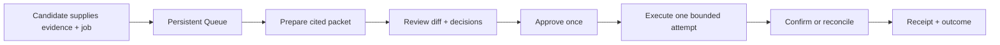

# Founder brief

## The decision

Build **RoleDawn**, a trust-first career agent for active job seekers.

> Your job search has a night shift.

The MVP prepares a small verified Queue and asks for one precise approval per
immutable application. Unattended submission is outside the MVP. iMessage is a
future control surface; the authenticated web application remains canonical.

## Current repository state

**Implemented:** one persistent-only web path. `/` redirects to the authenticated
dashboard. A signed-in candidate can view an RLS-scoped Queue, paste a supported
official Greenhouse, Lever, or Ashby posting, and open its database-backed
application detail. The candidate can also use `/vault` to upload one PDF or
DOCX résumé, inspect and edit its deterministic text transcription, save the
reviewed text, replace the source with a new version, or delete it. Repository
contracts cover safe resolution, immutable packets, approval, reconciliation,
and browser-session boundaries.

**Verified live:** hosted run `20260812135034` proved two-user Auth/RLS
isolation, pasted-link intake, Queue/detail, bounded outbox recovery, and one
official-source resolution. Career Vault run `20260812170337` separately proved
the two-user upload, private object-path isolation, finalization, extraction,
review, stale-write rejection, replacement safety, deletion, and cleanup path
after all 18 migrations were present.

**Not connected:** malware scanning and isolated parsing, OCR, structured
reviewed facts, model drafting, artifact rendering, durable workflows, live
browser/CUA, ATS fill or submit, messaging, and external receipt evidence.
Nothing in the repository can submit a real job application.

See [current state](execution/current-state.md), [backend status](execution/backend-build-status.md),
and the root [changelog](../CHANGELOG.md).

## Why this product

Candidates want to offload repetitive work without a black box inventing
experience, answering legal questions, leaking private data, or sending a
broken application. The defensible product is reliable delegation with sourced
facts, explicit authority, safe recovery, and proof.

**Inference:** Tsenta shows demand for cloud execution, cross-ATS workflows,
messaging, review controls, and receipts. Its public product and user feedback
also suggest an opening around truth, reliability, cancellation, billing
clarity, profile isolation, and outcome quality. Research is recorded in the
[source register](research/source-register.md); company claims are not treated
as independent verification.

## Initial customer

Target a search state, not a generation:

- U.S.-based active seeker, initially iPhone-first.
- Roughly 0–8 years into a career, using early-career and recent layoffs as an
  acquisition wedge rather than a permanent age identity.
- Applying to repeatable tech, business, operations, sales, customer success,
  marketing, or analytical roles.
- Values speed but fears reputational damage.
- Pays to remove repetitive work, not to generate more generic applications.

## Product loop

## Technical direction

- Next.js/React authenticated web application; native mobile later.
- Supabase Auth/PostgreSQL as the bounded first control-plane authority.
- Shared workers, not one permanent agent/container per candidate.
- Temporal or an equivalent tested durable coordinator for waits and retries.
- Versioned evidence, prompt, policy, model, renderer, and ATS-adapter releases.
- Browserbase + Playwright as the first browser benchmark; bounded DOM/computer
  use only as fallback.
- Photon only after diligence, behind `ChannelAdapter`, with web/SMS fallback.

PostgreSQL owns candidate facts, applications, approvals, attempts, and receipts.
Workflow history owns timers and replay. Models own neither.

Career Vault uses three distinct evidence layers: the private original file, an
immutable deterministic transcription, and an immutable candidate-reviewed text
version. Reviewed résumé text may support later narrative drafting. Exact
application answers still require structured candidate-approved records.

## Business model hypothesis

Do not compete on price per application. Test pricing only after measuring
full-utilization browser/model cost, retries, and support. A billable unit should
be a confirmed application; failed, canceled, uncertain, or duplicate attempts
should not count. Current price points remain hypotheses in the decision log.

## Immediate founder priorities

1. Move untrusted parsing behind quarantine, malware scanning, and an isolated
   worker; add OCR only as a reviewed fallback.
2. Add structured candidate fact review, retention, and export.
3. Produce one immutable, cited, no-submit application packet from a named
   reviewed résumé version.
4. Benchmark 100 forms without submitting and continue counsel, browser, model,
   channel, and trademark work
   in parallel.

The go/no-go bar is zero invented claims, zero unauthorized or duplicate
submissions, reliable state recovery, and repeated evidence that candidates
return because the product reduces anxiety as well as effort.
