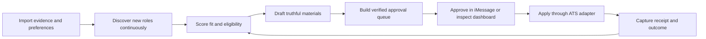

# Founder brief

## The decision

Build **RoleDawn**, a trust-first career agent for iPhone-first active job seekers. It works continuously in the cloud, communicates through iMessage, and gives the candidate a dashboard for evidence, approvals, exceptions, and outcomes.

The working tagline is:

> Your job search has a night shift.

The first product should not promise unattended submission. It should promise a verified queue prepared overnight and make approving it unusually fast. Full autopilot is a graduated permission, not the acquisition hook we need to prove on day one.

## Why now

Job-search burnout and AI-assisted applications are already mainstream enough that the market does not need another lesson on AI writing. The unresolved problem is delegation with trust. Candidates want more reach and less repetitive work, but they do not want a black box inventing experience, answering legal questions, leaking private email, or firing off a broken resume.

Tsenta proves the surface is compelling: cloud execution, cross-ATS automation, messaging, review controls, receipts, and aggressive pricing. Its own public product and user feedback also expose the opening: reliability, truth, profile isolation, cancellation, billing clarity, privacy consistency, and the difference between high volume and good outcomes.

## Initial customer

Target a search state, not a generation:

- U.S.-based, iPhone-first, active seeker.
- Roughly 0–8 years into a career, initially concentrated around 22–34.
- Applying to repeatable tech, business, operations, sales, customer success, marketing, or analytical roles.
- Values speed but fears reputational damage.
- Will pay to remove hours of repetitive work, not simply to produce more generic applications.

Use early-career candidates and recent layoffs as the acquisition wedge. Do not make the permanent brand feel like a college utility. International and OPT candidates are a valuable later segment, after work-authorization controls and counsel review are mature.

## Product loop

## What actually needs to be built

The durable asset is not a chatbot. It is:

- A structured candidate evidence graph with provenance, versions, and usage policy.
- Durable per-application workflows with explicit states and recovery behavior.
- Versioned adapters for the major ATS families.
- A secure browser-session broker and human-takeover path.
- An approval policy engine that cannot be overridden by model output or webpage text.
- An audit/receipt system that proves what was sent.
- Outcome data that improves fit and eventually supports credible placement proof.

## Technical direction

- Next.js/React PWA for onboarding and dashboard; native mobile later.
- TypeScript control plane on AWS ECS Fargate.
- Managed PostgreSQL, S3/KMS, Secrets Manager, and a redacted append-only audit ledger.
- Temporal Cloud for durable schedules, retries, signals, and human-in-the-loop waits.
- Managed isolated browsers with deterministic ATS adapters; computer-use reasoning only as fallback.
- Photon for the iMessage alpha behind a channel adapter; web/SMS fallback from the start.
- OpenAI Responses API and Agents SDK where useful, with task-level model routing and provider abstraction.

There is no permanent agent process per user. Each user has a durable logical agent—identity, facts, preferences, policies, workflows, encrypted browser state, and history. Shared workers wake when an event or schedule needs work.

Apple does not expose a general public server API for a personal iMessage bot. Messages for Business and Messages app extensions solve different, constrained use cases. Photon is therefore an alpha bridge with platform/vendor risk, not a foundation the company can assume will remain available. If written authorization/security/portability diligence or delivery testing fails, launch the same workflow through the PWA and consented SMS while keeping iMessage on hold.

## Hermes decision

Hermes is useful for internal prototypes because it packages tools, browser control, memory, cron, and channels. It should not own production identity, memory, permissions, policy, credentials, workflow state, or audit. A broad, self-modifying agent runtime creates the wrong multi-tenant boundary. If used at all, pin and sandbox it as a replaceable task executor.

## Business model hypothesis

Do not enter a price-per-application race. After the concierge alpha, test a $99 Founding plan with 30 confirmed applications and a $149 Pro plan with 75. These are experiments, not launch commitments. A billable unit is one confirmed application; failed, canceled, uncertain, or duplicate attempts do not consume it. Publish only after measured browser, model, retry, payment, and support cost supports the margin gate in the GTM plan.

The North Star is **qualified applications that reach a documented outcome**, supported by:

- Time saved per candidate.
- Approval-to-submission conversion.
- Verified submission success rate.
- Recruiter-response and interview rate by cohort.
- Unsupported-claim rate, duplicate submission rate, and unauthorized side effects—all targeted at zero.

## Twelve-week founder goal

Recruit ten design partners and deliver a concierge alpha that supports Greenhouse, Lever, and Ashby; prepares an evidence-backed nightly queue; accepts single-application approvals over iMessage; submits only with a human-authorized final action; and captures a receipt every time.

The go/no-go bar is not application volume. It is zero invented claims, zero unauthorized or duplicate submissions, reliable state recovery, and repeated evidence that candidates return because the product reduces anxiety as well as effort.

## Immediate next actions

1. Run counsel review on ATS terms, candidate attestations, messaging consent, privacy, and employer-logo claims.
2. Interview 20 candidates across early-career, recently laid-off, and employed-searching cohorts.
3. Diligence Photon in writing and preserve a web/SMS fallback.
4. Benchmark 100 real application forms without submitting.
5. Prototype the evidence graph, onboarding, nightly queue, approval token, and one Greenhouse adapter.
6. Reserve brand handles/domains only after founder approval; commission a formal trademark screen.
