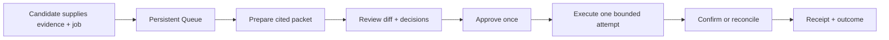

# Founder brief

## The decision

Build **RoleDawn**, a trust-first career agent for active job seekers.

> Your job search has a night shift.

The founder wants **Applications** to be the main page: a profile-ranked shortlist, an auto-apply switch, and a ledger of individual applications. All jobs remains the complete shared inventory. Default-off auto-apply authorizes selection and submission of strong supported matches from approved profile information, with a pilot maximum of one attempt per hour and 24 per UTC day. Each job gets tailored materials, immutable packet provenance, a single-use submission record and observed outcome. Missing facts stay candidate-owned. Pause stops unsent automatic work; uncertain submissions are reconciled. The managed Agents API interprets forms through bounded browser tools; the database and trusted workers enforce authority. See [matching and auto-apply acceptance](execution/matching-and-auto-apply-acceptance.md).

## Current repository state

**2026-09-16 update:** account auto-apply, full-catalog profile matching and a simpler Applications page extend the earlier named-job flow. Greenhouse and Lever have concrete delivery adapters; Ashby remains preparation-only.

**Earlier 2026-09-16 evidence:** named-job autopilot, editable profession-neutral writing policies and a combined application PDF are implemented. A live Agents API test completed a two-page synthetic application across two browser sessions, including missing-answer continuation and one confirmed test submission. The concrete delivery adapter targets US Greenhouse hosted boards. See [current acceptance and limits](execution/application-autopilot-acceptance.md). No real employer application has been submitted. The dated foundation evidence below is historical.

**Implemented:** one persistent-only web path. `/` redirects to the authenticated
dashboard. A signed-in candidate can view an RLS-scoped Queue, paste a supported
official Greenhouse, Lever, or Ashby posting, and open its database-backed
application detail. The candidate can also use `/vault` to upload one PDF or
DOCX résumé, inspect and edit its deterministic text transcription, save the
reviewed text, replace the source with a new version, or delete it. The candidate
can review source-linked résumé evidence in `/vault/facts`, search the first
allowlisted job catalog, save roles, and add a current job version to
Application Kits. Repository contracts cover safe resolution, immutable
packets, approval, reconciliation, and browser-session boundaries.
`/vault/answers` stores a narrow set of
candidate-reviewed exact answers for legal name, contact, city/region/country,
and country-scoped U.S./Canada work eligibility.

The earlier application detail showed four generated artifacts and a separate
fill-only release. New packets add a combined PDF, and the opt-in delivery lane
adds the named-job delegation described above. The earlier fill-only lane remains
separate. The hosted control plane can
consume `FILL_APPLICATION_ONCE` once for one unchanged revision, reserve an
isolated computer-session identity, and record redacted checkpoints. Local
worker code verifies the exact authorized fact values and artifact bytes,
enforces a no-submit network guard, destroys the runtime, and recovers stale
work without re-driving a session that may already have disclosed data.

**Verified live:** hosted run `20260812135034` proved two-user Auth/RLS
isolation, pasted-link intake, Queue/detail, bounded outbox recovery, and one
official-source resolution. Career Vault run `20260812170337` separately proved
the two-user upload, private object-path isolation, finalization, extraction,
review, stale-write rejection, replacement safety, deletion, and cleanup path
after all 18 migrations were present.

**Verified live:** candidate-profile run `20260812195628` passed all 13
checkpoints plus cleanup after 21 migrations through `20260812190000` were
present. It proved the current reviewed-answer command, candidate-self RLS,
immutable versions, stale-write denial, unresolved sensitive-answer behavior,
and cleanup.

**Verified live on 2026-08-16:** blocked and ready input snapshots, one complete
no-submit Application Kit, and the fill-only database lifecycle have separate
hosted evidence. Remote and local ledgers align at 37 migrations. The current
founder kit has one revision, one official-posting
research bundle, and four private QA-passed artifacts. A rollback-only harness
then proved revision-bound fill authorization, one-time consumption, computer-
session reservation/activation/destruction, immutable checkpoints, recovery
fencing, and the structural separation between fill and submit authority. The
founder application remains `READY` at aggregate version 8 with zero
fill/session/submit/receipt rows.

**Earlier foundation gaps (2026-08-16; superseded where noted above):** malware scanning and isolated parsing, OCR, the reusable
Candidate Evidence Snapshot, durable workflow deployment, validated
Browserbase credentials, a credentialed session or real ATS fill, secure takeover, final submit,
messaging, and external receipt evidence. Official-posting research, bounded
model drafting, generated-claim validation, and artifact rendering are
connected for one founder Application Kit.
That foundation run did not implement submission; the current delivery lane above now has a gated submit path.

See [current state](execution/current-state.md), [backend status](execution/backend-build-status.md),
the [fill-to-review acceptance](execution/application-fill-foundation-acceptance.md),
and the root [changelog](../CHANGELOG.md).

## Why this product

Candidates want to offload repetitive work without a black box inventing
experience, answering legal questions, leaking private data, or sending a
broken application. The defensible product is reliable delegation with sourced
facts, explicit authority, safe recovery, and proof.

**Inference:** Tsenta shows demand for cloud execution, cross-ATS workflows,
messaging, review controls, and receipts. Its public product and user feedback
also suggest an opening around truth, reliability, cancellation, billing
clarity, profile isolation, and outcome quality. Research is recorded in the
[source register](research/source-register.md); company claims are not treated
as independent verification.

## Initial customer

Target a search state, not a generation:

- U.S.-based active seeker, initially iPhone-first.
- Roughly 0–8 years into a career, using early-career and recent layoffs as an
  acquisition wedge rather than a permanent age identity.
- Applying to repeatable tech, business, operations, sales, customer success,
  marketing, or analytical roles.
- Values speed but fears reputational damage.
- Pays to remove repetitive work, not to generate more generic applications.

## Product loop

```mermaid
flowchart LR
    U["Candidate supplies evidence + job"] --> Q["Persistent Queue"]
    Q --> P["Prepare cited packet"]
    P --> R["Review diff + decisions"]
    R --> A["Approve once"]
    A --> E["Execute one bounded attempt"]
    E --> C["Confirm or reconcile"]
    C --> O["Receipt + outcome"]
```

## Three product systems

1. **Candidate Intelligence** turns candidate-provided sources into reviewed,
   source-linked evidence, exact answers, preferences, and explicit use policy.
2. **Opportunity Intelligence** maintains the attributable shared job catalog
   and each candidate's private saves, passes, watchlists, eligibility, and
   recommendations.
3. **Application Delivery** combines one candidate snapshot with one job
   version to research, draft, review, execute, reconcile, and prove one
   application.

They share one deterministic control plane. They should be built as thin
vertical slices, not completed as three separate apps. The canonical boundaries,
current-state map, and build order are in the
[three-system product architecture](architecture/three-system-product-architecture.md).

## Technical direction

- Next.js/React authenticated web application; native mobile later.
- Supabase Auth/PostgreSQL as the bounded first control-plane authority.
- Shared workers and short-lived per-application computers, not one permanent
  agent or virtual machine per candidate. A persistent browser context may be
  scoped to one candidate and one ATS origin only when login continuity needs
  it; PostgreSQL remains the memory.
- Temporal or an equivalent tested durable coordinator for waits and retries.
- Versioned evidence, prompt, policy, model, renderer, and ATS-adapter releases.
- Browserbase + Playwright as the first browser benchmark behind
  `BrowserSessionBroker`; bounded DOM/computer use only as fallback. The
  credential-gated adapter and deterministic Greenhouse-style no-submit driver
  exist, but no credentialed provider session has run and production selection
  still depends on the benchmark.
- Photon only after diligence, behind `ChannelAdapter`, with web/SMS fallback.

PostgreSQL owns candidate facts, applications, approvals, attempts, and receipts.
Workflow history owns timers and replay. Models own neither.

Career Vault uses three distinct evidence layers: the private original file, an
immutable deterministic transcription, and an immutable candidate-reviewed text
version. Reviewed résumé text may support later narrative drafting. Exact
application answers come from separate immutable candidate-attested records;
exact-field answers do not enter narrative model context.

## Business model hypothesis

Do not compete on price per application. Test pricing only after measuring
full-utilization browser/model cost, retries, and support. A billable unit should
be a confirmed application; failed, canceled, uncertain, or duplicate attempts
should not count. Current price points remain hypotheses in the decision log.

## Immediate founder priorities

1. Validate Browserbase server credentials behind the explicit gate and connect
   the existing Greenhouse-style no-submit driver to the accepted fill-only
   broker, materializer, lease, and recovery contracts.
2. Run one founder application to a complete filled read-back and stop before
   Submit; verify takeover, drift, teardown, and zero submission requests.
3. In the public-upload safety lane, add quarantine, malware scanning, killable
   isolated parsing, OCR fallback, retention, and export.
4. Continue the 100-form no-submit provider/driver benchmark and counsel,
   model, channel, and trademark work in parallel.

The go/no-go bar is zero invented claims, zero unauthorized or duplicate
submissions, reliable state recovery, and repeated evidence that candidates
return because the product reduces anxiety as well as effort.
