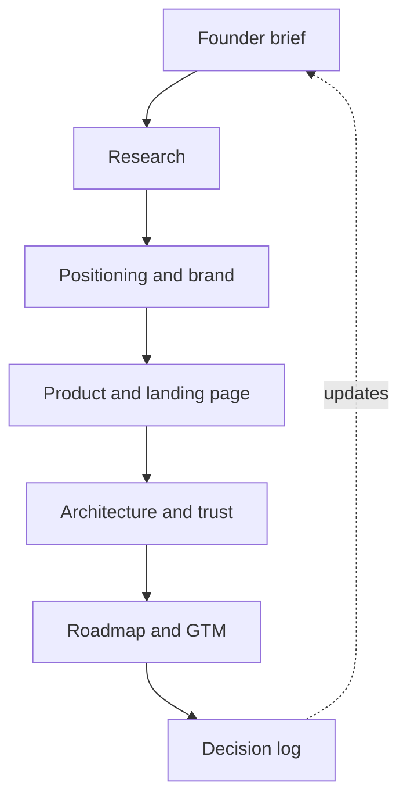

# Documentation map

The files are arranged from thesis to evidence to execution. Each document is written to be usable by a founder, designer, engineer, or LLM without relying on hidden chat context.

Source quality follows this order: official platform documentation; directly observed public product behavior; reputable research; company self-report; user review; archived or mirrored material. The last three categories are useful signals, not verified independent truth.

## Canonical reading paths

### Founder or investor

1. [Founder brief](00-founder-brief.md)
2. [Positioning and ICP](strategy/positioning-and-icp.md)
3. [PRD](product/prd.md)
4. [Go-to-market](execution/go-to-market.md)
5. [Decision log](execution/decision-log.md)

### Product and design

1. [Brand kit](brand/brand-kit.md)
2. [Viktor design study](research/viktor-design-study.md)
3. [Landing-page blueprint](product/landing-page-blueprint.md)
4. [Night-shift storyboard](product/night-shift-storyboard.md)
5. [Dashboard and responsive experience](product/dashboard-and-responsive-experience.md)
6. [Onboarding and messaging](product/onboarding-and-messaging.md)

### Engineering

1. [Implementation handoff](execution/implementation-handoff.md)
2. [Claude handoff reconciliation](research/claude-handoff-reconciliation.md)
3. [System architecture](architecture/system-architecture.md)
4. [Scale, cost, and capacity](architecture/scale-cost-and-capacity.md)
5. [Integrations and OAuth](architecture/integrations-and-oauth.md)
6. [Job discovery](architecture/job-discovery.md)
7. [ATS automation](architecture/ats-automation.md)
8. [Data, security, and trust](architecture/data-security-and-trust.md)
9. [Model routing and evals](architecture/model-routing-and-evals.md)

### Evidence and research

1. [Source register](research/source-register.md)
2. [Tsenta teardown](research/tsenta-teardown.md)
3. [Market and competitors](research/market-and-competitors.md)
4. [Claude handoff reconciliation](research/claude-handoff-reconciliation.md)

## Authority rule

If documents appear to conflict, use the most recent accepted entry in the [decision log](execution/decision-log.md), then the implementation handoff, then the specialized architecture or product specification. Research and external handoffs inform decisions; they do not override them.
