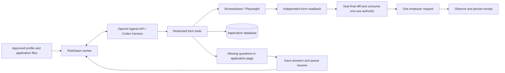

# Agents API application execution

## Product direction

**Accepted:** candidates delegate a named application once through **Apply for me**. RoleDawn fills ordinary fields from saved information, writes supported narrative answers from the approved résumé and cover letter, collects missing answers together, and continues after one save. This authority covers that job and frozen packet only.

**Implemented:** the managed Codex harness chooses permitted form operations. Exact fact values and file bytes remain behind RoleDawn tools. Missing answers are stored against the application, revision and field fingerprint. Saving them queues a new pass that can rebuild the browser from frozen inputs. Exact saved answers are applied and read back directly; a model turn is skipped when the step is already resolved. The browser closes while waiting; answers are not tied to its short lifetime. A delegation expires after seven days. A cross-application answer library is not implemented.

The existing fill-only lane remains available behind its original controls. The separate delivery lane verifies employer upload acknowledgements, follows adapter-defined steps, seals the actual final request, creates a durable attempt, and records independently observed receipt evidence. Saved-search-wide submission permission is out of scope.

## Responsibilities

**Verified:** the API provides a managed harness and function-tool protocol. It does not automatically supply the desktop app's browser integration. RoleDawn supplies browser operations using its existing Browserbase session. We use `environment: none`, disable programmatic tool calling, and expose no shell, arbitrary script, arbitrary selector, arbitrary URL or submit tool. See [primary sources](../research/source-register.md#agents-api-implementation-sources--checked-2026-09-16).

The API reasoning loop can be replaced independently of the application database, résumé parsing, preparation pipeline, approval model, browser provider, or candidate UI.

## Answer policy

| Question | Automatic behavior |
|---|---|
| Saved identity, contact, location or country-specific work eligibility | Fill the exact authorized fact through its immutable ID |
| Project, experience or other narrative answer | Draft from approved document evidence; independently check factual entailment before writing |
| Missing legal, sensitive or personal preference answer | Ask the candidate in one small application-specific form |
| Unknown field or invalid/stale answer | Preserve existing content and request help; do not claim completion |
| CAPTCHA, MFA or account login | Stop for candidate help; no challenge solving or account creation |

“Guess” means interpreting equivalent labels or expressing supported evidence in new wording. It does not mean inventing employers, credentials, dates, consent, salary preferences or eligibility. Even an exact excerpt requires an entailment check: a substring can omit a negation from its source.

## Persistence and recovery

- Persist a run before creating its provider session; persist the session binding before executing any tool.
- Store each tool call's ID, arguments hash and result. An unfinished call is uncertain and is not executed again. A completed call can resend its saved result after a lost acknowledgement.
- Check active candidate/workspace membership, the exact current revision, candidate input version, delegation, pause/cancel state and worker lease before new tool execution.
- Keep provider IDs and tool results service-only. Candidate replies require the owning authenticated user; workers cannot insert replies directly.
- Bind autopilot replies to the application, frozen revision and observed field fingerprint. Saving the batch and requeueing happen atomically. The older fill-only continuation still uses its original fill/session binding.
- Require actual completed turn status; an idle session does not prove success. Independently inspect the resulting browser values.
- Delete each provider session when its pass ends and require a matching deletion acknowledgement (or a 404 on replay). This confirms public-API removal, not instantaneous physical storage erasure. The delivery browser closes on questions or completion. A private resource ledger and independent cleanup lane retry unacknowledged release/deletion.
- Session creation sends generic tools, a generic bootstrap message and opaque run metadata only. Candidate/form input is sent after the session ID is durably bound. A lost creation response can leave a generic bootstrap session whose ID is unknown; metadata-based reconciliation is not implemented, and it is not reported as deleted. The documented list API has no metadata filter.
- Pending known-session deletion uses service-only atomic claims with five-minute backoff, so a failed oldest batch yields to newer records. Drain pending provider deletion before any tenant/computer-session purge; cascading database deletion does not delete upstream sessions.
- Rebuild a pre-submit pass from the start URL after recovery, so earlier pages are re-observed and included in the sealed review. After an attempt exists, never restart the form.
- Persist the final attempt before releasing the browser's paused submission request. A lost response never grants another submit. Post-attempt claims are read-only reconciliation; a newly opened static thank-you page is not proof. Persisted driver-observed receipt evidence can complete reconciliation after a worker crash.

## Configuration and operations

Apply these migrations before enabling the driver:

1. `20260916221952_application_agent_questions.sql`
2. `20260916222021_application_agents_runtime.sql`
3. `20260916222023_qualify_application_fill_resume_version.sql`
4. `20260916222722_application_agent_cleanup_retry_queue.sql`

Set `ROLEDAWN_FORM_DRIVER=agents` in both the web and worker environments. The default remains `deterministic`. The existing `OPENAI_API_KEY` is used server-side; this project's key passed live Agents API creation, tool execution, completion and deletion. No new credential was created.

The separate `ROLEDAWN_AUTOPILOT_ENABLED=true` flag enables the candidate action and worker delivery/cleanup lanes. Apply the named-job delegation and combined-PDF migrations before enabling it. `npm run worker:autopilot` processes one claim; the long-running worker polls this lane independently. See the [autopilot acceptance record](../execution/application-autopilot-acceptance.md) for exact deployed migration versions.

The initial model is configurable through `ROLEDAWN_APPLICATION_AGENT_MODEL` (default `gpt-6-astra`). The default pass timeout is 180 seconds, maximum 240 seconds, leaving time inside the existing five-minute resume lease. `ROLEDAWN_APPLICATION_AGENT_MAX_ACTIONS` defaults to 80. These are limits, not latency or cost promises.

Use the long-running worker to process queued answers automatically. In the legacy fill-only lane, continuation requires the supervised retained browser. The new delivery lane can instead rebuild a fresh browser from frozen inputs and saved answers. Run `npm run agents:cleanup` for an explicit session cleanup pass, including after reverting the feature flag. Never expose the OpenAI key through a `NEXT_PUBLIC_` setting.

`RUN_AGENTS_FORM_ACCEPTANCE=true npm run acceptance:agents` runs a real API test against a synthetic local form, using an explicit in-memory test ledger and question repository. It does not use the hosted candidate database or an employer form. Hosted SQL acceptance is a separate rollback-only check.

## Browser coverage

Native text, textarea, select, radio, checkbox, multi-select and file controls are implemented. Static ARIA comboboxes are supported when the page declares a listbox, exposes stable option IDs and proves the selected option with `aria-selected`. The Greenhouse delivery adapter also supports its React Select implementation by requiring agreement between the selected display and the observed selected-option state. Search text alone is never accepted. Unknown, remote, filtered, virtualized or multi-select custom menus remain takeover cases. Synthetic Chromium tests cover these paths. A passive guarded Greenhouse inspection read 26 fields, including 12 supported short screening menus, with no candidate entries or submit requests; the optional long phone-country menu remained unsupported. Real-employer end-to-end acceptance is still pending.

## Delivery scope and remaining work

The isolated delivery runtime checks the actual uploaded bytes, the upload response and the employer's visible filename acknowledgement. Navigation uses trusted adapter rules, and the model cannot provide arbitrary selectors or endpoints. The current concrete adapter targets US Greenhouse hosted boards. The step engine supports configured multi-page forms; that capability does not establish support for another ATS without an adapter and acceptance run.

Remaining work includes binding official conditional question schemas, broader custom-control support, account/CAPTCHA handoff, cross-application answer reuse, and real-employer benchmarking before broader coverage claims. The database records an application only when receipt evidence exists; it does not infer a recruiter response, interview, offer or hire.

The agent connection and synthetic acceptance do not establish “any form,” a submitted employer application, an interview, or a hire. See [acceptance evidence](../execution/agents-application-execution-acceptance.md).
