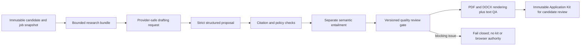

# Application quality system

RoleDawn may reuse the *method* behind a strong personal application workflow,
but it must not ship one candidate's private background, fixed positioning,
preferred phrases, or bundled skill text to every user. The product owns a
general, versioned policy and evaluates each packet only against that
candidate's approved evidence, the exact job, and attributable research.

## Current quality path



The runtime is deliberately hybrid. PostgreSQL, typed workers, and deterministic
validators own state, policy, evidence, retries, and permission. A bounded model
drafts prose and a separate bounded model assesses factual entailment. No
manager-style agent or Agent SDK owns the workflow today.

## What is implemented

| Capability | Current evidence |
|---|---|
| Evidence map | Every material generated claim carries a candidate-evidence, frozen-job, or research citation. Candidate evidence has immutable source and review versions. |
| Truth gate | Structural validation rejects unsupported citations, misuse of cover-letter-only evidence, target drift, invented numbers, and policy violations. A separate entailment adapter must mark every frozen claim supported. |
| General writing policy | `roledawn-writing-policy/2` sets bounded length and paragraph ranges, proof and role-context minimums, and prohibited language. The exact release is frozen in the Application Input Snapshot. |
| Quality review gate | `roledawn-application-quality-evaluator/1` blocks thin or generic letters, missing candidate proof, missing role context, missing employer or role names, unresolved placeholders, internal workflow metadata, and tailored résumés without cited proof. |
| Database enforcement | A new-revision trigger requires Application Kit release 2, writing-policy release 2, the exact evaluator release, and `readyForCandidateReview=true` before a revision may be inserted as `PASSED`. Historical release-1 kits remain readable. |
| Human-writing signals | The evaluator warns on application-ceremony openings, rhetorical questions, repeated paragraphs, weak résumé section structure, and heavy em-dash use. Warnings remain visible in the immutable manifest rather than being silently ignored. |
| Research transparency | A kit generated from the official posting alone is labeled `OFFICIAL_POSTING_ONLY` and carries a `RESEARCH_DEPTH_LIMITED` warning. The warning does not pretend that broader company research ran. |
| Artifact integrity | The renderer produces exactly four private PDF/DOCX artifacts, re-extracts text, requires at least 95% expected-token coverage, hashes bytes, and binds QA metadata into the packet hash. |
| Candidate authority | Passing quality gates creates a candidate-review kit only. It grants neither fill nor submit authority. |

## What is not implemented

| Missing capability | Why it matters | Next bounded slice |
|---|---|---|
| Broader company research | Official-posting facts support basic specificity but not a high-quality view of product, customers, strategic direction, or the likely hiring problem. | Add a primary-source research adapter behind the existing research contract. Require dated employer pages, docs, filings, or primary publications; preserve citation, conflict, and freshness rules. |
| Role-family strategy releases | A good application angle differs across deployed engineering, sales, operations, healthcare, and other role families. | Create licensed Role Strategy releases containing screening dimensions and evidence-selection rules, never candidate claims or slogans. Route by an evaluated classifier and record the release. |
| Candidate voice profile | The current policy removes common bad patterns but does not learn an individual candidate's cadence or preferred level of formality. | Add opt-in approved writing samples and derived, candidate-editable voice signals. Keep raw samples private and version the selected voice profile in the input snapshot. |
| Iterative quality improvement | The worker fails a blocking gate but does not yet feed typed issues into a bounded revision attempt. | Allow one or two capped revision attempts using only issue codes and the same frozen evidence. Never relax truth or permission gates. |
| Narrative application answers | Exact profile answers exist, but long-form employer questions do not use a prompt-specific, non-redundancy, word-limit, and voice gate. | Add a separate answer contract and evaluator; do not paste the cover letter into form fields. |
| Visual page inspection | Current QA proves extractable expected text, hashes, and media types. It does not inspect page count, clipping, density, or cross-format visual consistency. | Add deterministic page-count bounds plus rendered-page inspection before promotion. Preserve text extraction as a separate ATS gate. |
| Fixed blind evaluation corpus | Passing one packet proves plumbing, not generalized quality. | Build consented, de-identified job/evidence fixtures across role families. Measure unsupported claims, role specificity, user edit distance, factual corrections, and accepted-output cost before changing model or prompt releases. |
| Browser/form consistency score | Fill materialization is exact, but the quality report does not yet compare every final form answer with the packet and profile. | Extend the pre-submit diff with a form-consistency evaluator before the separate submit approval. |

## Portability rule

The personal FDE workflow remains a private benchmark and source of process
ideas. Production code may adopt reusable controls such as research before
drafting, evidence mapping, document-specific jobs, bounded prose rules,
mechanical QA, and an improve-then-recheck loop. It may not copy its text,
candidate background, fixed identity claims, named set pieces, or role-specific
positioning into a shared prompt.

The right product abstraction is:

```text
Candidate Evidence Snapshot
+ Job and Research Snapshot
+ Versioned Role Strategy
+ Versioned Writing and Quality Policy
-> Draft Proposal
-> Truth, Quality, and Artifact Gates
-> Candidate Review
```

This keeps quality modular. Models, research providers, renderers, role
strategies, and evaluators can change independently while exact evidence and
candidate authority remain stable.

## Release conditions

A new prompt, model, role strategy, evaluator, or renderer must:

1. keep the same immutable evidence and job fixture set;
2. pass every hard truth and permission invariant;
3. improve or hold unsupported-claim rate, candidate edit distance, accepted
   output rate, latency, and cost;
4. run in shadow before founder or design-partner canary traffic; and
5. record the exact releases and actual provider model in the durable manifest.

The current quality report is a deterministic readiness report, not a claim
that a subjective 100-point human review has occurred. Migration
`20260819025852_enforce_application_quality_manifest` is deployed and enforces
the release-2 manifest for new `PASSED` revisions. The existing hosted founder
kit predates that migration and remains release-1 history; a fresh release-2
kit still needs hosted acceptance before the quality category can pass.
