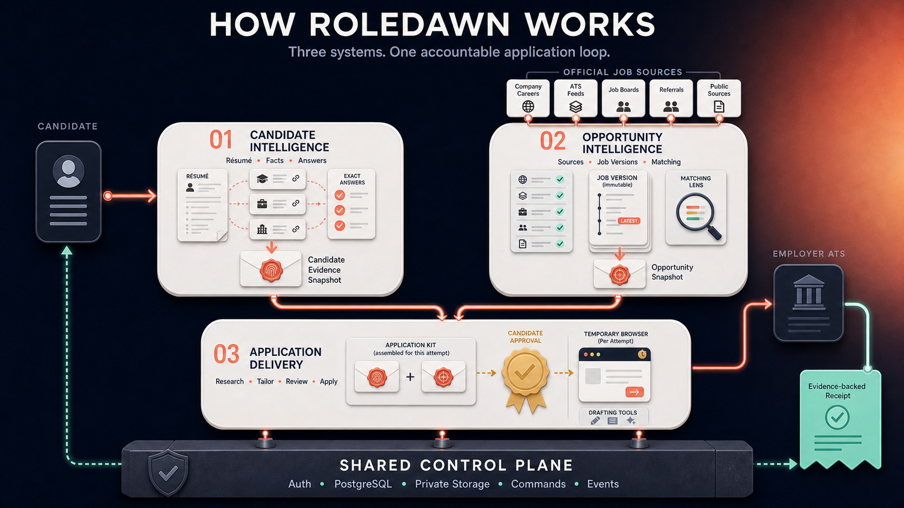

# RoleDawn architecture at a glance

This diagram and its implementation labels describe the 2026-08-18 snapshot.
Submission, story, catalog, and hosting status have changed since then. Read
[the application playbook](../execution/application-playbook.md) and
[current state](../execution/current-state.md) before using this historical
architecture as implementation guidance.

RoleDawn is a modular application, not one permanent agent per user. Two
independent systems build trustworthy inputs—what the candidate has approved
and what the employer has published. A third system combines one immutable
version of each into one application workflow.

The simplest correct mental model is:

> **Approved candidate evidence + exact job version + application policy = one reviewable Application Kit.**

The kit is still a draft. Separate authority is required to release candidate
data to an employer form, and another single-use approval is required to submit.

## Status legend

| Label | Meaning |
|---|---|
| **WORKING** | Connected in the current product; repository behavior is locally testable and the core Supabase boundary has dated hosted evidence. |
| **CONTRACT ONLY** | Real typed code or schema exists, but no production runtime calls it. |
| **NEXT** | The next product-critical vertical slice. |
| **PLANNED** | Designed but not connected. Provider choice may remain open. |

## The whole system in one picture

Candidate Intelligence and Opportunity Intelligence operate independently.
Their immutable snapshots meet only inside Application Delivery. A fill-only
release comes before the temporary browser. A separate single-use Submit
approval comes after read-back, and a receipt appears only after the employer
system returns confirmation evidence. This poster explains ownership
and the target loop; the status labels and tables below remain authoritative
for what is actually connected today.

## LLM-readable component map

```mermaid
flowchart LR
    CANDIDATE["Candidate"]
    SOURCES["Official job sources<br/>and pasted links"]
    ATS["Employer ATS"]

    subgraph EXPERIENCE["Experience layer · WORKING"]
      WEB["Next.js web app<br/>Onboarding · Applications · Search · Saved · Résumé"]
    end

    subgraph CANDIDATE_SYSTEM["1 · Candidate Intelligence · private"]
      RESUME["Résumé upload +<br/>reviewed text<br/>WORKING"]
      ANSWERS["Exact reusable<br/>answers<br/>WORKING"]
      EVIDENCE["Exact source-linked evidence<br/>review + use policy<br/>WORKING"]
      STORY["Structured stories +<br/>voice policy<br/>PLANNED"]
      CSNAPSHOT["Candidate Evidence<br/>Snapshot<br/>PLANNED"]

      RESUME --> EVIDENCE --> CSNAPSHOT
      STORY --> CSNAPSHOT
      ANSWERS --> CSNAPSHOT
    end

    subgraph OPPORTUNITY_SYSTEM["2 · Opportunity Intelligence · shared catalog + private relations"]
      INTAKE["Greenhouse · Lever · Ashby<br/>pasted-link resolver<br/>WORKING"]
      POLL["Anthropic Greenhouse board<br/>conditional ETag poll<br/>WORKING · local worker service"]
      JOB["Canonical job +<br/>immutable version<br/>WORKING"]
      DISCOVERY["Search · Saved ·<br/>queue from catalog<br/>WORKING"]
      MATCH["Search goals + deterministic fit<br/>WORKING · ranking/watchlists PLANNED"]

      INTAKE --> JOB
      POLL --> JOB --> DISCOVERY
      JOB --> MATCH
    end

    subgraph DELIVERY_SYSTEM["3 · Application Delivery · one candidate + one job"]
      QUEUE["Application Kit queue<br/>WORKING"]
      INPUT["Application Input Snapshot<br/>+ deterministic preflight<br/>WORKING · READY + BLOCKED"]
      CONTRACTS["Exact-snapshot context · cited research<br/>strict parsers · Terra drafting adapter<br/>WORKING"]
      PREP["Research · semantic validation<br/>consumer · atomic persist · render<br/>WORKING"]
      REVISION["Immutable research + revision<br/>four private artifacts<br/>WORKING"]
      REVIEW["Material review + single-use<br/>fill-only release<br/>WORKING"]
      FILL["Fill materializer · Browserbase coordinator<br/>leases + recovery + owned Live View lookup<br/>SYNTHETIC ACCEPTANCE · real ATS NEXT"]
      SUBMIT["Separate submit approval +<br/>one attempt<br/>PLANNED"]
      PROOF["Reconcile uncertainty +<br/>evidence-backed receipt<br/>PLANNED"]

      QUEUE --> INPUT --> CONTRACTS --> PREP --> REVISION --> REVIEW --> FILL --> SUBMIT --> PROOF
    end

    CANDIDATE --> WEB
    WEB --> RESUME
    WEB --> ANSWERS
    WEB --> EVIDENCE
    WEB --> INTAKE
    WEB --> DISCOVERY
    WEB --> QUEUE
    SOURCES --> INTAKE
    SOURCES --> POLL
    EVIDENCE -->|"approved versions"| INPUT
    ANSWERS -->|"approved exact-fact refs"| INPUT
    CSNAPSHOT -. "planned reusable handoff" .-> INPUT
    JOB --> QUEUE
    JOB -->|"exact job version"| INPUT
    SUBMIT --> ATS -->|"confirmation or uncertainty"| PROOF
    PROOF --> WEB

    subgraph PLATFORM["Shared control plane · logical foundation, not a fourth product system"]
      DATA["Supabase Auth · PostgreSQL 17 + RLS<br/>private Storage · WORKING"]
      COMMANDS["Typed commands · versions · events<br/>transactional outbox · WORKING"]
      WORKFLOW["Four-lane long-running worker service<br/>local proof · deployment NEXT"]
      MODELS["Terra drafting adapter<br/>one hosted no-submit kit · WORKING"]
      BROKER["BrowserSessionBroker + Browserbase adapter<br/>retained-runtime foundation · hosted proof NEXT"]
      CHANNELS["iMessage · SMS · email · push<br/>LATER"]

      COMMANDS --> DATA
      DATA --> WORKFLOW
      WORKFLOW --> MODELS
      WORKFLOW --> BROKER
      DATA --> CHANNELS
    end

    WEB --> COMMANDS
    DATA -. "authoritative candidate state" .-> CSNAPSHOT
    DATA -. "authoritative job state" .-> JOB
    DATA -. "authoritative application state" .-> QUEUE
    DATA -. "candidate input epoch" .-> INPUT
    MODELS -. "proposes; never authorizes" .-> EVIDENCE
    MODELS -. "drafts; never submits" .-> PREP
    BROKER -. "executes only released data" .-> FILL
    CHANNELS -. "commands and derived status only" .-> CANDIDATE

    classDef working fill:#dff5e9,stroke:#237a51,color:#123c2a;
    classDef next fill:#fff1c7,stroke:#a87400,color:#4c3500;
    classDef planned fill:#f4f2fa,stroke:#746c85,color:#393442,stroke-dasharray:5 4;
    classDef contract fill:#eee8ff,stroke:#6650a8,color:#35245f,stroke-dasharray:3 3;
    classDef external fill:#eaf1ff,stroke:#4f6fa9,color:#20365d;
    classDef authority fill:#dce8ff,stroke:#284e91,color:#172f59;

    class WEB,RESUME,ANSWERS,EVIDENCE,INTAKE,POLL,JOB,DISCOVERY,MATCH,QUEUE,INPUT,COMMANDS,CONTRACTS,PREP,REVISION,REVIEW,MODELS,WORKFLOW,BROKER working;
    class FILL next;
    class STORY,CSNAPSHOT,SUBMIT,PROOF,CHANNELS planned;
    class CANDIDATE,SOURCES,ATS external;
    class DATA authority;
```

Green components work now. Amber is the immediate vertical slice. Purple
components have a design or contract but no connected runtime. Blue components
are people, external systems, or the authoritative data plane.

The three product systems are logical ownership boundaries inside one modular
application. They are not three microservices, and the diagram does not imply
one always-running AI process or cloud computer per candidate.

## How data moves

| Step | Flow | Durable result | Status |
|---:|---|---|---|
| 1 | Candidate signs in and follows guided onboarding. | Database-derived readiness tracks résumé, job goals, exact application answers, and remaining blockers; protected routes return to the unfinished step. | **WORKING locally against hosted candidate state; Google OAuth configuration OPEN** |
| 2 | Candidate uploads one PDF or DOCX résumé and reviews exact reusable answers. | Original bytes go to private Storage; source, extraction, reviewed-text, evidence, and immutable fact versions go to PostgreSQL. | **WORKING for controlled dogfood** |
| 3 | The long-running worker service invokes the catalog lane for one due allowlisted source. | One leased complete snapshot writes its run, observations, listings, canonical jobs, immutable versions, source health, and ETag; a 304 records `NOT_MODIFIED`. | **WORKING locally; hosted worker deployment OPEN** |
| 4 | Candidate searches, receives deterministic advisory fit labels, saves, or adds a current catalog job to Applications through opaque-cursor pages. | Shared job truth remains unchanged; candidate goals and verified work-authorization facts produce `Good fit`, `Needs review`, or `Eligibility issue`; private saved state or one version-bound application intent is committed. | **WORKING; fit is read-time advisory and not learned ranking** |
| 5 | Candidate pastes a supported official job URL. | One transaction creates the intake, application, preparation run, event, and outbox message. | **WORKING** |
| 6 | A leased worker resolves the pasted posting. | The fixed provider adapter writes employer, source listing, canonical job, and immutable job version records. | **WORKING** |
| 7 | Candidate reviews exact résumé evidence. | Stable passages, citations, immutable decisions, attested edits, and allowed-use policy are persisted; candidate-requested exact-document purge covers those records. | **WORKING; 10-checkpoint hosted acceptance passed** |
| 8 | Candidate Intelligence assembles a reusable evidence handoff. | Approved evidence, exact answers, policy, stories, voice, and explicit gaps form a Candidate Evidence Snapshot. | **PLANNED; distinct from the application-specific snapshot below** |
| 9 | The preparation worker freezes one application's exact inputs. | One exact job version, candidate input epoch, reviewed résumé hashes, approved evidence/fact version references, and policy releases form an immutable Application Input Snapshot. Deterministic preflight stores `READY_FOR_DRAFTING` or one typed blocker. | **WORKING; ready and blocked snapshots, retry replay, and stale-version denial verified live** |
| 10 | The Application Kit worker receives the exact committed snapshot locator. | It revalidates hashes, researches the official posting, calls Terra through a minimized schema, runs deterministic and semantic gates, merges exact facts server-side, renders four private artifacts, verifies bytes, and commits one revision atomically. | **WORKING; one hosted founder kit accepted** |
| 11 | Candidate inspects what may be released. | Application detail shows the four artifacts, material changes, destination, and stop conditions. One `FILL_APPLICATION_ONCE` command binds the unchanged revision, exact fact/artifact manifest, policy, expiry, and nonce. | **WORKING; hosted fill-authority rollback acceptance passed** |
| 12 | A temporary Browserbase session fills the employer form. | The service materializes only authorized exact values and hash-verified bytes. The coordinator requires origin and submit-network guards, uses the database session ID as provider idempotency, and records redacted checkpoints. A process-owned supervisor retains the guarded runtime through review/takeover, then awaits service-only release reconciliation. The candidate-owned Live View route exposes an active, unexpired session only. Unknown, legal, OTP, CAPTCHA, or login terrain pauses. | **RETAINED-RUNTIME FOUNDATION IN REPOSITORY; MIGRATION, CANDIDATE TAKEOVER, AND REAL ATS PROOF OPEN** |
| 13 | One attempt crosses Submit at most once. | External confirmation creates a receipt. Ambiguity creates a reconciliation state under the same attempt ID—not an automatic retry. | **PLANNED** |
| 14 | UI and later messaging channels show status. | Read models derive candidate-visible state from committed records and receipt evidence. Chat history and provider state never become truth. | **Queue/Search/Saved/review status WORKING; channels PLANNED** |

## The current tech stack

| Layer | Current implementation | Why it exists | Status |
|---|---|---|---|
| Web experience | Next.js `16.3.0`, React `19.2.8`, TypeScript `6.0.3`, Node.js 22+ | Responsive authenticated application, Server Components/Actions, candidate review surfaces | **WORKING locally** |
| Identity | Supabase Auth through `@supabase/ssr` | Normal candidate sessions; database identity is derived from `auth.uid()` | **WORKING; hosted acceptance recorded** |
| Domain data | Supabase PostgreSQL 17, 41 aligned local/hosted forward-only migrations, RLS | Canonical candidate, onboarding, search goals, evidence, job, application, fill authority, computer session, Live View binding, checkpoint, submit-attempt, and receipt state | **WORKING foundation; exact hosted versions recorded in acceptance docs** |
| Documents | Private Supabase Storage plus immutable hashes and metadata | Original résumé and generated Application Kit bytes | **WORKING; one founder source plus four QA-passed private artifacts** |
| Commands and events | PostgreSQL RPCs, optimistic aggregate versions, command deduplication, domain events, transactional outbox | Atomic state changes, replay safety, and worker handoff | **WORKING** |
| Current workers | One Node/TypeScript service with independent catalog, preparation, Application Kit, and fill lanes, plus the underlying one-shot commands | Resolves jobs; freezes inputs; creates one no-submit kit; coordinates authorized fill and recovery; conditionally polls one source | **All four lanes proved locally; deployment and production supervision OPEN** |
| Job-source adapters | RoleDawn-owned Greenhouse, Lever, and Ashby adapters over bounded official read endpoints | Converts one posting or complete board snapshot into provider-neutral versions | **WORKING; full-board live evidence is Anthropic Greenhouse only** |
| Résumé parsing | `unpdf` and `mammoth` behind deterministic size, type, complexity, and timeout checks | Produces candidate-reviewable text from PDF/DOCX | **WORKING for dogfood; not isolated or scanned** |
| Application packet | Typed packet validator/finalizer, exact-snapshot context, provider-safe request, strict output parser, cited research, semantic validation, deterministic renderer, private artifacts, and RoleDawn writing policy | Produces one evidence-bound immutable kit without trusting provider output | **WORKING for one hosted founder kit** |
| Application preflight | Typed deterministic snapshot assembler plus leased SQL claim/commit/retry commands | Freezes version references, rejects stale input, and stops on a typed blocker before model spend | **WORKING; ready and blocked paths accepted live** |
| Durable workflow | Existing outbox pattern now; Temporal or an equivalent coordinator before long waits, takeover, and reconciliation | Coordinates retries and human/browser waits without owning domain truth | **NOT DEPLOYED** |
| Research and models | OpenAI SDK `7.4.0` behind a provider-neutral adapter; `gpt-5.6-terra` is the bounded founder route | Official-posting research, evidence selection, and drafting inside typed boundaries | **WORKING for one hosted no-submit kit; broader route/evals open** |
| Rendering | Deterministic PDF/DOCX renderer plus exact-byte QA and private persistence | Produces the exact four files reviewed and later released | **WORKING for one founder kit; typography v2 open** |
| Browser/CUA | `BrowserSessionBroker`, credentialed Browserbase adapter, exact execution materializer, provider-neutral coordinator, deterministic Greenhouse-style no-submit driver, fill-only database lifecycle, leases/recovery, process-owned retained-runtime supervision, service-only release reconciliation, candidate-owned Live View lookup, and real-Chrome synthetic ATS harness | Temporary isolated form fill without granting Submit | **RETAINED FOUNDATION IMPLEMENTED; hosted migration, candidate takeover, real ATS, and production selection OPEN** |
| Channels | `ChannelAdapter` boundary is designed | iMessage/SMS/email/push as command and notification surfaces | **LATER; Photon not selected** |
| Hosting and operations | Hosted HireWire Supabase development project; local Next.js app and worker service; GitHub Actions validation | Current development foundation | **Web/worker hosting, production telemetry, backups, and incident operations remain open** |

Supabase is the selected first control plane. OpenAI/Terra is the initial local
drafting benchmark, not a final production route. Temporal, a research provider,
a renderer, a managed browser/CUA provider, a web host, and messaging providers
remain unselected until a benchmark and recorded decision selects them.

## Data ownership

| Owner | Authoritative records | Important rule |
|---|---|---|
| Candidate Intelligence | `candidates`, `source_documents`, `source_document_versions`, `source_document_extractions`, `source_document_text_reviews`, `source_evidence_passages`, `candidate_evidence_items`, `candidate_evidence_versions`, `candidate_evidence_citations`, `candidate_facts`, `candidate_fact_versions`, `fact_sources` | Exact source passages and candidate-reviewed versions are separate from exact application answers. Models may propose; only candidate-reviewed versions become reusable evidence. |
| Opportunity Intelligence | `employers`, `job_sources`, `ingestion_runs`, `source_job_observations`, `source_job_listings`, `jobs`, `job_versions`, `candidate_job_decisions` | Employer source text stays attributable and immutable. Candidate saves, passes, and applications never mutate a shared job. |
| Application Delivery | `job_intakes`, `applications`, `application_runs`, `application_input_snapshots`, snapshot refs, research bundles, revisions and provenance refs, `artifact_versions`, `approval_challenges`, `approval_consumptions`, `application_fill_attempts`, `computer_sessions`, `application_fill_checkpoints`, `application_attempts`, `receipts` | Input-frozen, drafted, fill-authorized, filled-to-review, submit-authorized, attempted, uncertain, and confirmed are different states. Fill authority cannot satisfy the submit-attempt foreign key. A table or test row is not proof of employer action. |
| Shared control plane | `workspaces`, `workspace_memberships`, `command_dedup`, `domain_events`, `outbox`, `outbox_recovery_actions` | PostgreSQL commits authority. The UI, model, browser, worker memory, and messaging channel do not. |

## How this scales without becoming complicated

1. **Keep a modular monolith first.** One Next.js codebase and one Supabase
   project are enough until measured load or security boundaries justify a
   service split.
2. **Store logical agents, not permanent computers.** Candidate and application
   state lives in PostgreSQL. Workers are leased on demand; browser sessions are
   temporary per attempt and destroyed after evidence capture.
3. **Fetch shared jobs once.** A canonical catalog prevents polling the same
   employer board separately for every candidate. Private candidate relations
   remain separate.
4. **Scale by queue and task type.** Resume processing, source ingestion,
   preparation, browser work, and reconciliation can gain separate worker pools
   and concurrency budgets while preserving the same command and data contracts.
5. **Use the cheapest capable model per typed task.** Model routing comes after
   a fixed evaluation set measures factual support, abstention, output validity,
   latency, and accepted-output cost. A large model is not the control plane.
6. **Introduce durable workflow when the work truly waits.** The current leased
   outbox worker is enough for the first no-submit packet. A durable coordinator
   becomes necessary before workflows wait on review, browser takeover, delayed
   confirmation, cancellation, or reconciliation.

## Where the project stands on 2026-08-18

### Verified now

- The HireWire Supabase project is healthy and uses PostgreSQL 17. Remote and
  local ledgers align at all 41 checked-in migrations, including the quality
  manifest, guided onboarding/search profile, résumé-readiness repair, and
  candidate-owned Browserbase Live View binding.
- Every `public` domain table has RLS enabled.
- Auth-linked tenancy, Queue/intake, outbox recovery, one official posting
  resolution, the résumé lifecycle, exact reusable answers, source-linked
  evidence review/deletion, and the candidate-facing opportunity catalog have
  dated hosted acceptance evidence.
- The current code has guided four-step onboarding, a persistent Applications
  queue, application detail, résumé upload/review, exact source-linked evidence
  review, application-answer review, Search, Saved, queue-from-catalog, and
  deterministic advisory fit labels driven by saved job goals and verified
  eligibility facts.
- Anthropic is the only allowlisted polling tenant. The current hosted catalog
  contains 480 jobs, including 464 open jobs and 492 immutable job versions.
  The latest worker-driven ingestion run succeeded with 464 observations.
- Candidate-evidence run `20260816235101` passed 10 checkpoints plus cleanup;
  opportunity-catalog run `20260816235350` passed 12 plus cleanup. The latter
  proved candidate actions leave the shared catalog byte-for-byte unchanged.
- The blocked preparation path, retry replay, and stale-version denial have
  hosted acceptance evidence. Founder dogfood also produced immutable snapshot
  `a6a98e45-305b-496f-bd46-754b870a2a4b` as `READY_FOR_DRAFTING` with 12
  approved evidence references, one exact-fact reference, and zero blockers.
- The Application Kit worker consumed that exact snapshot, researched the
  official posting, passed deterministic and semantic checks, merged exact
  facts outside the model, rendered four QA-passed private artifacts, and
  committed one current `READY` revision atomically.
- Application detail shows the exact four downloads, material changes, fill-
  only boundary, mandatory stop conditions, and explicit no-submit state on
  desktop and mobile.
- Hosted rollback acceptance proved one-time `FILL_APPLICATION_ONCE`
  consumption, action-scoped separation from Submit, computer-session
  reservation/activation/destruction, RLS, immutable checkpoints, and zero
  submit attempts or receipts.
- Local tests prove exact authorized fact/artifact materialization, database-
  session provider idempotency, origin and submit-network guards, teardown,
  lease-fenced recovery, and a real-Chrome synthetic ATS run with zero
  submission requests. A credentialed Browserbase synthetic run also proved
  the provider seam and explicit release without candidate or employer data.
- The four-lane worker service ran locally with healthy liveness/readiness
  endpoints. Catalog completed one 464-observation run; preparation, kit, and
  fill lanes ran idle without failure; shutdown was graceful.
- The hosted founder account remains honestly `ONBOARDING`: one résumé and 17
  evidence items persist, while application email, phone, location, and search
  rules remain missing. The product does not guess those values.

### Implemented but not production-connected

- The long-running worker service is container-ready but not deployed to an
  always-on runtime. Current end-to-end progress still depends on an operator.
- Candidate-owned Browserbase Live View lookup is implemented for active,
  unexpired sessions. A process-owned supervisor can retain the browser,
  network guard, and lease together and awaits one service-only release
  reconciliation. The additive migration is not deployed and no real candidate
  takeover has exercised the lifecycle.
- Clean ephemeral execution is the default. The schema permits a narrow
  encrypted candidate-by-ATS browser context, but no provider context has been
  created for the founder.
- Final-submit approval, attempts, reconciliation, and receipts remain separate
  unconnected contracts.

### Not built

- Candidate Evidence Snapshot assembly, structured story development,
  voice/presentation policy, or evidence retrieval.
- A founder-owned real Greenhouse fill, retained candidate takeover, or
  production browser operations.
- Final submission, external confirmation classification, same-attempt
  reconciliation, or receipt capture.
- Hosted worker scheduling, source breadth beyond one allowlisted tenant,
  watchlists, persisted ranking, recommendation evaluation, and feedback
  learning.
- Production web/worker deployment, iMessage/SMS/email/push, billing,
  analytics, and support operations.

Nothing in the current repository can submit a real job application. A Queue
row means **prepare this job**; `PRE_SUBMIT_REVIEW` means **filled and waiting
for a separate decision**, never **applied**.

## Assumptions and open decisions

| Status | Assumption or decision | Consequence if wrong |
|---|---|---|
| **Accepted decision** | The three systems are logical ownership boundaries, not three deployable microservices. | Premature service separation would add operational cost without improving the first application. |
| **Accepted decision** | PostgreSQL is the domain authority; models and browsers cannot authorize or declare side effects. | Weakening this creates unreplayable approvals and untrustworthy status. |
| **Recommendation** | One supported pasted job is enough to prove the first value loop before broad discovery. | If direct-link coverage is too narrow, add another reviewed source without skipping evidence and approval gates. |
| **Hypothesis** | Candidates will review cited evidence and one complete Application Kit when the UI makes changes and gaps obvious. | If review is too burdensome, improve batching and defaults; do not silently invent or submit. |
| **Open question** | Which first role family has the best demand and most regular application forms? | It determines evaluation fixtures, source coverage, form schemas, and launch positioning. |
| **Open question** | Which model and research routes win on factual support, abstention, quality, latency, and accepted-output cost? | Do not couple domain records to a provider before a blind evaluation. |
| **Accepted decision** | A deterministic renderer produces the four founder artifacts and fill authority binds those exact hashes and bytes. | Renderer v2 may improve PDF/DOCX typography but cannot weaken byte and provenance binding. |
| **Open question** | Does Browserbase win a representative no-submit benchmark on isolation, recovery, latency, takeover, support, and accepted-output cost? | The implemented adapter is a benchmark candidate, not production selection; Playwright remains the deterministic driver boundary. |
| **Accepted decision** | `FILL_APPLICATION_ONCE` separately releases candidate PII and artifacts for one draft fill. | A no-submit browser run still discloses data, so fill authority cannot be inferred from later submit approval. |
| **Open question** | How will employer confirmation be recognized across ATS families? | A click is never enough; uncertain outcomes need provider-specific reconciliation. |
| **Open question** | What rights, polling limits, retention, and attribution apply to each job source? | Public readability does not automatically grant unlimited storage, redistribution, or automation rights. |
| **Open question** | What are the production region, backup, recovery, observability, incident, retention, and deletion controls? | The current healthy development project is not a production-readiness claim. |
| **Later** | iMessage, native mobile, billing, fine-tuning, embeddings, and broad ATS coverage. | None belongs on the critical path to one excellent reviewable application. |

### Security and operations review from the live project

- **Verified baseline:** the accepted pre-fill security advisor had no errors.
  Candidate commands use explicit identity and ownership checks while protected
  tables remain directly unwritable. A warning is not by itself proof of either
  safety or exploitability.
- **Open security task:** leaked-password protection must be enabled through the
  Supabase Auth platform setting before public traffic. See
  [Supabase RLS guidance](https://supabase.com/docs/guides/database/postgres/row-level-security)
  for the database authorization context.
- **Verified current advisor read:** security returned 24 findings: 8
  intentional deny-all RLS `INFO`, 15 intentional authenticated
  `SECURITY DEFINER` `WARN`, and 1 leaked-password protection `WARN`.
  Performance returned 64 `INFO`: 63 unused indexes, including expected new
  indexes with no traffic history, plus the Auth connection-strategy advisory.
  It reported zero unindexed foreign keys.
- **Open production task:** public résumé upload remains closed until files are
  quarantined, scanned, parsed in a killable isolated process, and covered by
  retention/export/deletion operations.

## Architecture-driven build order

### 0. Freeze the foundation

Compare exact local and hosted migration names, then review and intentionally
commit the forward-only worktree. Rerun tests, typecheck, lint, documentation
links, production build, whitespace checks, advisors, and the relevant hosted
acceptance after any authority or schema change.

**Exit gate:** one clean recovery point whose local migrations match the hosted
ledger.

### 1. Preserve the accepted ready Application Input Snapshot boundary

The founder dogfood snapshot has already proved `READY_FOR_DRAFTING` with exact
job and candidate version references, approved narrative evidence, stable
hashing, retry controls, and stale-input denial. Rerun this acceptance after any
input authority, source lifecycle, or snapshot protocol change.

**Exit gate:** the same permitted inputs produce the same hash; unresolved or
private evidence cannot enter the snapshot; a stale input epoch cannot publish
the drafting handoff. Build the reusable Candidate Evidence Snapshot separately
inside System 1; do not conflate it with this per-application record.

### 2. Preserve the accepted no-submit Application Kit

The founder worker already consumes only the committed Application Input
Snapshot, researches the official posting, drafts through one versioned model
adapter, validates material claims, renders exact bytes, persists one revision,
and exposes four authenticated downloads. Schedule and monitor it without
weakening the accepted atomic commit.

**Exit met for one founder kit:** replay did not create a conflicting revision;
the semantic gate passed; rendered bytes and hashes match persisted artifacts.

### 3. Preserve fill-only review and authority controls

Application detail now shows artifacts, material changes, destination, and stop
conditions. The candidate can issue one transactional fill-only release. The
database binds and consumes that authority once for one unchanged revision and
cannot use it to create a submit attempt.

**Exit met for the control plane:** wrong owner, stale revision, changed
manifest, expiry, wrong destination, and mismatched replay fail closed.

### 4. Complete Greenhouse-first browser shadow mode

The credentialed synthetic Browserbase run and candidate-owned Live View lookup
prove the provider seam. Add a worker-owned session supervisor so the browser,
network guard, lease, and candidate takeover remain alive together. Then connect
the Greenhouse-style no-submit driver to one founder-owned real application,
fill and upload one released revision, perform a final read-back, and stop
before Submit. Route OTP, CAPTCHA, login, unknown, legal, and sensitive fields
to secure candidate takeover.

**Exit gate:** one founder application reaches read-back through a real provider;
drift and failure injection prove no unapproved data, artifact, or final click
crosses the boundary.

### 5. Add controlled submission, reconciliation, and proof

Consume `SUBMIT_APPLICATION_ONCE` immediately before one attempt identity
crosses Submit. Reconcile ambiguous outcomes under the same attempt; create a
receipt only from external evidence.

**Exit gate:** duplicate calls cannot submit twice, uncertainty cannot appear as
success, and pause/cancel/takeover/incident paths work.

### 6. Scale Opportunity Intelligence

First deploy bounded scheduling and source-health alerts around the existing
Anthropic allowlist, observations, immutable versions, Search, and Saved.
Expand the reviewed source allowlist, then add watchlists, deterministic
eligibility, and versioned fit assessments.

**Exit gate:** one failed source run cannot mass-close jobs, candidate relations
remain private, and every recommendation names its job version and evidence.

## Work that can run in parallel

- Upload quarantine, malware scanning, isolated parsing, OCR, retention, export,
  and deletion scheduling.
- Model/research/renderer bakeoffs against fixed fixtures while the Candidate
  Evidence Snapshot is being built.
- A 100-form no-submit browser benchmark using synthetic identities and files.
- Scheduler and source-health work around the current one-tenant catalog,
  without widening the allowlist until rights, provenance, completeness, and
  failure gates pass.
- First-role-family research, ATS/source terms review, cost telemetry, vendor
  diligence, incident response, and the live Supabase advisor review.

## Related detail

- [Three-system product architecture](three-system-product-architecture.md)
- [Backend operating model](backend-operating-model.md)
- [System architecture](system-architecture.md)
- [Current state](../execution/current-state.md)
- [Decision log](../execution/decision-log.md)
