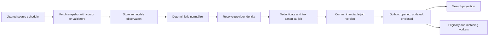
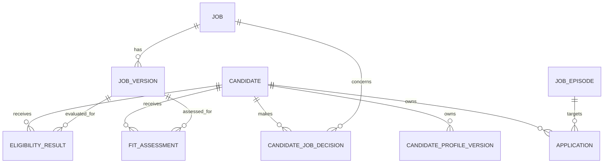
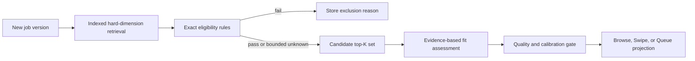
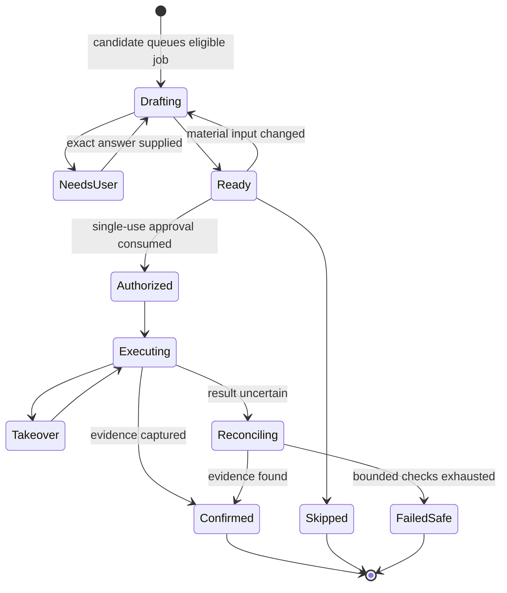
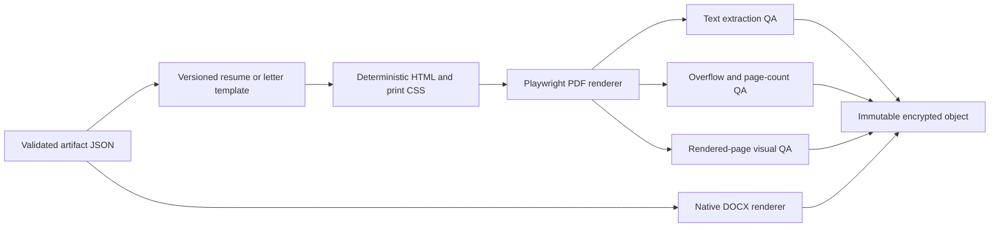
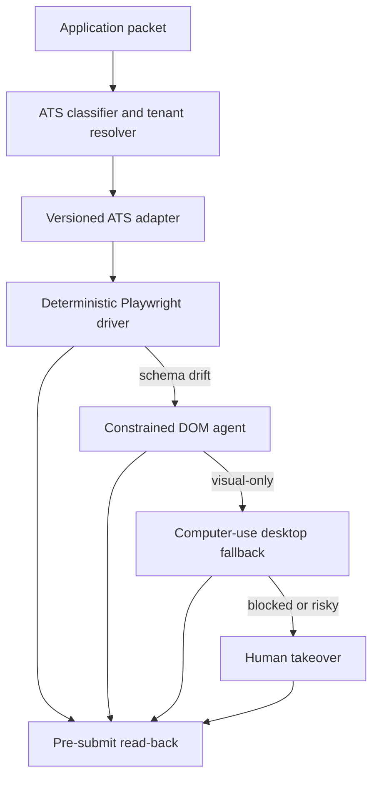

# Backend operating model

## Executive decision

Build RoleDawn as a **deterministic application system with agentic specialists**.

The product is agentic because company research, evidence selection, writing, form interpretation, and unfamiliar browser terrain require judgment. It is not one free-running agent because candidate truth, workflow state, permissions, credentials, final submission, and confirmation require deterministic authority.

The operating rule is:

> **Deterministic spine. Agentic edges.**

- PostgreSQL owns durable domain truth.
- Temporal owns long-running workflow execution.
- Bounded model runs interpret, research, select, draft, and propose.
- Typed services validate claims, policy, approvals, state transitions, and side effects.
- Browser workers are temporary hands. They never become the brain or source of truth.

This document is the canonical end-to-end backend model. The [pasted-link application engine](pasted-link-application-engine.md) is the first backend vertical slice. The other focused companion specifications remain authoritative for [job discovery](job-discovery.md), [ATS execution](ats-automation.md), [model routing and evaluation](model-routing-and-evals.md), [security](data-security-and-trust.md), [scale and cost](scale-cost-and-capacity.md), [OAuth and credentials](integrations-and-oauth.md), and the [frontend contract](frontend-backend-contract.md).

## What is known about Tsenta

### Verified first-party statements

Tsenta publicly says it monitors company career pages across Workday, Greenhouse, Lever, Ashby, and other ATS families; matches jobs to candidate preferences; generates tailored application materials; fills forms; routes replies; and exposes application status. Its privacy policy names managed PostgreSQL on Fly.io, Firebase Authentication, OpenAI, Anthropic, PostHog, Sentry, Composio, Resend, and AWS SES. See the dated [Tsenta teardown](../research/tsenta-teardown.md) and [source register](../research/source-register.md).

### Inference, not verified architecture

Those product behaviors are consistent with:

- a registry of employers, ATS families, and tenant identifiers;
- provider-specific polling and normalization adapters;
- a shared canonical job catalog;
- per-candidate match, decision, and application records;
- asynchronous preparation and browser jobs;
- ATS-specific form adapters plus isolated browser sessions;
- a queue/reconciliation layer that translates execution evidence into user-visible status.

Tsenta does not publicly establish its private schema, source-enumeration method, polling cadence, deduplication algorithm, browser provider, match algorithm, or exact worker topology. RoleDawn should copy none of those assumptions blindly.

## Whole-system view

```mermaid
flowchart LR
    subgraph SOURCES["Shared job supply"]
      REG["Reviewed employer and ATS registry"]
      ADP["Source adapters"]
      RAW["Immutable raw observations"]
      CAT[("Canonical job catalog")]
      REG --> ADP --> RAW --> CAT
    end

    subgraph CANDIDATE["Candidate-specific state"]
      VAULT["Career Vault and policies"]
      ELIG["Deterministic eligibility"]
      FIT["Bounded fit assessment"]
      DEC["Seen, save, pass, queue"]
      VAULT --> ELIG --> FIT --> DEC
    end

    subgraph PREP["Application preparation"]
      WF["Temporal application workflow"]
      RES["Company and role research"]
      EVID["Immutable evidence packet"]
      WRITE["Resume, letter, and answer specialists"]
      VALID["Claim, policy, and quality gates"]
      RENDER["Deterministic document renderer"]
      WF --> RES --> EVID --> WRITE --> VALID --> RENDER
    end

    subgraph EXEC["Application execution"]
      FORM["ATS inspection and form schema"]
      FILL["Deterministic fill with bounded fallback"]
      DIFF["Immutable pre-submit diff"]
      APPROVE["Single-use approval"]
      SUBMIT["One submit attempt"]
      RECON["Confirmation reconciliation"]
      FORM --> FILL --> DIFF --> APPROVE --> SUBMIT --> RECON
    end

    CAT --> ELIG
    DEC -->|"Queue"| WF
    VAULT --> EVID
    RENDER --> FORM
    RECON --> RECEIPT["Receipt or honest uncertainty"]
```



The catalog is shared because fetching the same Greenhouse board once per user is wasteful. Candidate decisions and applications are private because they describe one person's preferences, evidence, and actions.

## The six backend primitives

Everything in the first product should compose from six primitives.

| Primitive | Purpose | Deterministic authority | Agentic work allowed |
|---|---|---|---|
| Catalog | Know what jobs exist and which version is current | Source registry, identity, versions, closure | Ambiguous description normalization only |
| Candidate profile | Know exact facts, rules, voice, and permissions | Career Vault records and policy | Narrative retrieval and evidence suggestions |
| Match | Decide whether a job deserves candidate attention | Hard eligibility rules and immutable inputs | Evidence-based fit reasoning on bounded candidates |
| Application packet | Prepare exactly what would be sent | Versioned facts, answers, artifacts, and hashes | Research, evidence selection, drafting, editing |
| Execution | Fill one live employer form | Adapter, policy, approval, attempt identity | Bounded form mapping and visual fallback |
| Proof | Say what actually happened | Stored confirmation evidence and reconciliation | Evidence classification, never final authority |

If a proposed feature does not fit one of these primitives, it probably belongs outside the first backend.

## 1. Job ingestion and the shared catalog

### Recommended source order

1. Greenhouse, Lever, Ashby, and Workable public employer-scoped endpoints.
2. User-pasted official job links using `JobPosting` structured data and visible content when permitted.
3. A small allowlisted Workday employer set with adapter-health monitoring and legal review.
4. Licensed job data after a measured bakeoff.
5. Additional ATS families based on observed candidate demand.

Do not begin with LinkedIn scraping, Indeed automation, or a general web crawler. Their official surfaces do not provide the universal candidate-side search and submission permissions the product would need. A smaller attributable catalog with good freshness and closure state is a stronger MVP than a huge stale catalog.

### The registry is the asset

The public ATS endpoints are tenant-scoped. None of them is a complete directory of every employer. RoleDawn therefore needs an owned `career_source` registry that maps an employer to its ATS family, tenant key, list endpoint, application domain, policy status, polling rules, and adapter version.



### Catalog tables

| Table | Responsibility |
|---|---|
| `employers` | Canonical employer identity, verified domains, aliases |
| `career_sources` | ATS/provider, tenant key, endpoints, legal/redisplay policy, polling and adapter version |
| `ingestion_runs` | Start/end, checkpoint, response status, completeness, counts, errors |
| `source_job_observations` | Immutable raw-payload reference, headers, hash, parser version, observed time |
| `source_job_listings` | Provider-scoped external identity, source/apply URL, first/last seen, current state |
| `jobs` | Canonical opening identity |
| `job_episodes` | One open/reopen cycle so a repost does not overwrite prior candidate history |
| `job_versions` | Immutable normalized title, description, requirements, work mode, timestamps, provenance |
| `job_locations` | Repeatable normalized locations with source provenance |
| `job_compensation` | Currency, period, minimum, maximum, confidence, provenance |
| `job_aliases` | Source identities and URLs mapped to a canonical job |

Raw payloads belong in object storage when retention and source policy permit. PostgreSQL stores their hashes, metadata, normalized records, and provenance.

### Identity and deduplication

Apply identity rules in order:

1. Exact provider + tenant + external job ID.
2. Exact canonical official application URL.
3. Exact employer + normalized requisition ID.
4. Explicit cross-source alias.
5. Same employer + identical normalized description hash.
6. High similarity in employer, title, location, description, and posting time.

Rules 1–5 may merge automatically when unambiguous. Rule 6 creates a review/suppression candidate; it does not silently merge. Never merge solely on title and location.

Close a listing only after an authoritative closed/404 signal or repeated absence from a complete healthy snapshot. A transient source failure must not mass-close jobs.

## 2. Candidate-to-job relationships

Do not add `seen`, `passed`, `applied`, or `match_score` columns to `jobs`. One canonical job can relate differently to every candidate, and each relationship has independent versioning.



### Separate records, separate meanings

| Record | Examples | Why separate |
|---|---|---|
| `eligibility_results` | eligible, ineligible, unknown; rule IDs and exact reasons | Deterministic and versioned against profile/search/job inputs |
| `fit_assessments` | strengths, gaps, dimensions, confidence, evidence, route version | Model-assisted and replaceable; not permission |
| `candidate_job_decisions` | viewed, saved, passed, queued, undo | Explicit user behavior; append-only event plus current projection |
| `applications` | current customer-meaningful application state | Exists only after a candidate queues the job |
| `application_outcomes` | recruiter response, interview, rejection, offer, hire | Outcome truth must remain distinct from submission truth |

A candidate who never needed to see a job has no decision row. A hard-rule exclusion may have an eligibility result without creating a visible match. A saved job is not an application. A queued job starts preparation, not permission to submit.

Candidate-job decisions have their own lifecycle:

```text
UNSEEN → VIEWED → SAVED | PASSED | QUEUED
SAVED → PASSED | QUEUED
PASSED → UNDO
```

`eligibility_results` and `fit_assessments` are evaluations, not lifecycle states. `QUEUED` is the boundary that creates an application.

### Match pipeline



#### Deterministic hard rules

- Country and explicit work authorization.
- Required sponsorship policy.
- Work mode and allowed locations.
- Employment type and schedule.
- Explicit compensation minimum when reliable compensation exists.
- Excluded employers, titles, role families, or job age.
- Closed, stale, missing-apply-link, or already-applied jobs.

#### Bounded model reasoning

Only after hard rules pass, a model may assess role alignment, transferable evidence, seniority tension, relevant strengths, gaps, and why the candidate might care. It receives a bounded evidence packet—not the entire Career Vault—and returns a strict schema with citations.

Do not present a fake precision score as truth. The UI can show a fit band or explained dimensions after calibration. A number is a ranked model output tied to versions, not an objective probability of getting hired.

Explicit candidate decisions may improve ranking. Protected attributes and voluntary demographic answers must not enter match features.

## 3. One durable workflow per queued application

Queueing a job creates an `application` tied to the exact candidate, job episode, and job version, then starts one Temporal workflow with a stable application workflow ID.



Discovery, eligibility, fit, and pass/save behavior belong to candidate-job relation records. The application aggregate begins at `Drafting` only after `QUEUED` creates it. User-facing Queue labels may say **Preparing**, **Needs you**, **Ready**, **Applying**, **Reconciling**, and **Submitted** without changing the internal enum.

The workflow can branch, call tools, wait for a candidate, retry safe activities, and choose a stronger model. The workflow definition remains deterministic: database, network, browser, and model calls execute as typed activities whose inputs and outputs are recorded.

### Preparation sequence

```text
freeze_job_version
→ research_company_and_role
→ build_evidence_packet
→ plan_resume
→ draft_resume
→ draft_cover_letter
→ draft_required_narrative_answers
→ extract_material_claims
→ validate_exact_facts_and_claim_support
→ apply_voice_and_no-slop_policy
→ render_and_QA_documents
→ inspect_live_form
→ resolve_exact_fields
→ request_missing_answers
→ fill_draft
→ create_immutable_pre_submit_packet
→ wait_for_single_use_approval
→ submit_once
→ reconcile_confirmation
```

Each step receives immutable version references and returns a strict schema or typed failure. Do not let an agent carry hidden conversational state from one application into another.

## 4. Company research as a separate, cached capability

Company research should be its own bounded activity because it has different freshness, citation, cost, and reuse rules from candidate evidence.

```ts
interface ResearchProvider {
  researchCompany(input: {
    employerId: string;
    jobVersionId: string;
    objective: "APPLICATION_MATERIALS";
    freshnessPolicyId: string;
  }): Promise<CompanyResearchBundle>;
}
```

`CompanyResearchBundle` contains:

- claim and stable internal ID;
- exact source URL and source class;
- observed/published date;
- short supporting excerpt or content hash;
- confidence and conflict status;
- employer-stable versus job-specific scope;
- expiry/freshness class.

Cache stable employer facts by employer and source hashes. Run a smaller job-specific delta for each requisition. Company research may support why-this-company language and product context. It never supports claims about the candidate.

Research sources should follow the same evidence discipline as the repository: official company and regulatory sources first, then clearly labeled secondary sources. If current facts cannot be verified, the writing specialist omits them.

## 5. Career Vault and immutable evidence packets

The Career Vault is not a vector database full of resume text. It is a versioned evidence and policy system.

### Durable evidence records

- `source_documents` and immutable document versions;
- `candidate_facts` and immutable fact versions;
- `fact_sources` and `fact_source_spans`;
- `fact_usage_policies`;
- `answer_policies` for exact recurring form questions;
- `voice_policy_versions` and candidate-approved writing examples;
- `evidence_packets` and their fact/research membership.

Exact fields—name, address, titles, dates, metrics, education, authorization, sponsorship, and legal answers—must resolve to structured approved records. Retrieval may suggest narrative passages; it cannot become the authority for exact or sensitive answers.

Every application gets an immutable evidence packet containing only facts and source passages permitted for that application context. This makes a draft replayable and prevents an unrelated private fact from leaking into a form.

## 6. Writing and document generation

### Productize the current skills as policies and evals

The existing application workflow, resume-tailoring workflow, cover-letter workflow, and no-slop standard are useful product specifications. Do not execute arbitrary mutable skill files in production. Recreate their behavior as:

- versioned task definitions;
- strict schemas and tool contracts;
- prompt releases;
- evidence and claim validators;
- deterministic document templates;
- checked-in evaluation cases;
- immutable model-route releases.

### Tailoring modes

Use three user-facing strengths with one non-negotiable truth gate:

| Product mode | Backend enum | Allowed behavior |
|---|---|---|
| As uploaded | `AS_UPLOADED` | Use the approved original artifact unchanged |
| Balanced | `REORDER_AND_TIGHTEN` | Reorder, trim, and emphasize supported material |
| Strong tailoring | `REWRITE_FROM_VERIFIED_FACTS` | Rewrite bullets and structure from verified facts using role vocabulary |

Do not label a mode “aggressive” if it implies that facts may bend. The strongest mode may never invent or alter titles, dates, metrics, skills, production status, or responsibility.

### Claim ledger

Before rendering, extract every material generated claim into `artifact_claims`:

```text
artifact_version_id
claim_text and document span
claim_type
supporting_candidate_fact_ids[]
supporting_company_research_ids[]
validator_result and validator_release_id
candidate_disposition
```

Run exact programmatic checks first, then a separate constrained entailment check. Any unsupported material claim blocks artifact promotion. A style score can never average away a truth failure.

### PDF and DOCX pipeline

The model writes structured content; it does not “make a PDF.”



Generate PDF and DOCX from the same structured source. Bind the exact artifact hashes and filenames to the pre-submit approval.

## 7. Browser execution: deterministic first, agentic fallback

Official ATS submission APIs usually require employer or partner credentials, even when public job feeds exist. RoleDawn therefore needs browser execution for broad candidate-side coverage until formal partnerships replace specific paths.

### Execution ladder

1. Authorized employer/ATS API when a legitimate integration credential exists.
2. Versioned ATS adapter over Playwright.
3. Semantic DOM/accessibility locators.
4. Constrained Stagehand-style observe, validate, then act for changed fields.
5. Full visual/computer-use fallback for unresolved terrain.
6. Human takeover for CAPTCHA, OTP, passkey, login, ambiguous certification, sensitive unknown, or unsafe novelty.



### Provider-neutral broker

`BrowserSessionBroker` hides Browserbase, Browser Use, Cua, Hyperbrowser, Steel, Browserless, or Orgo identifiers from the domain.

```ts
interface BrowserSessionBroker {
  provision(input: {
    userId: string;
    atsTenantId: string;
    mode: "browser" | "desktop";
    profilePolicy: "ephemeral" | "persistent";
    allowedDomains: string[];
    region?: string;
  }): Promise<ExecutionSession>;
  getLiveView(sessionId: string): Promise<LiveView>;
  pauseForHuman(sessionId: string, reason: HumanReason): Promise<void>;
  resumeAfterHuman(sessionId: string): Promise<void>;
  close(sessionId: string, persistProfile: boolean): Promise<void>;
}
```

Persist profiles by candidate and ATS tenant, not one global profile per candidate. A Workday account for one employer must not share cookies or credentials with another tenant. Use ephemeral sessions for hosted forms that require no account.

### Recommended first benchmark

- Browser infrastructure: Browserbase.
- Primary driver: Playwright.
- Adaptive DOM fallback: Stagehand behind a constrained driver interface.
- Desktop fallback: Orgo behind the same broker, only when the page needs full desktop interaction.
- Second full-stack benchmark: Browser Use Cloud.
- Disposable full-computer benchmark: Cua Sandbox behind the same broker.
- CAPTCHA and 2FA: secure human takeover; no solver or bypass.

These are benchmark candidates pending the 100-form evaluation in [ATS automation](ats-automation.md), not signed vendor decisions. The [pasted-link engine](pasted-link-application-engine.md) defines the narrower first execution thread and its safe teardown contract.

## 8. Approval, at-most-once submit, and reconciliation

The model never receives a `submit_application` tool.

Before approval, freeze:

- candidate and job version;
- form snapshot and adapter version;
- every exact and narrative answer;
- resume and cover-letter object hashes and filenames;
- fact set, research bundle, prompt, model route, and policy versions;
- full material diff and unresolved warnings.

Approval binds one candidate, application, immutable packet, permitted action, expiry, and one-time nonce. Any material change invalidates it.

### Submit boundary

```text
submission_intent_key = submit:{application_id}:{packet_version}
```

1. Acquire a database-backed commit lease.
2. Validate the unused approval against authoritative state.
3. Commit one `submission_intent` before the external action.
4. Perform one submit click or authorized API call.
5. Capture visible page state, response metadata, URL, timestamp, and external ID when available.
6. Confirm only from stored evidence.
7. If the network or worker disappears near submit, enter `SUBMISSION_UNCERTAIN` and reconcile the same attempt.
8. Never turn ambiguity into another click.

Human and agent control are mutually exclusive during takeover. No password, OTP, cookie, or protected answer belongs in model context, browser recording, analytics, or ordinary support views.

## 9. Runtime and SDK choices

### Recommended division

| Need | Recommended runtime | Why |
|---|---|---|
| Durable application process | Temporal TypeScript SDK | Timers, retries, signals, cancellation, waits, replay |
| One-shot typed language task | OpenAI Responses API behind `ModelAdapter` | RoleDawn owns input, output schema, and branching |
| Bounded multi-tool research or unfamiliar-form planning | OpenAI Agents SDK behind `AgentRuntime` | Tool loop, guardrails, interruptions, traces; still subordinate to Temporal |
| Browser interaction | Playwright behind `InteractionDriver` | Stable locators, uploads, tracing, deterministic adapter surface |
| Adaptive DOM repair | Stagehand or equivalent behind the same driver | Bounded fallback, not submission authority |
| Full desktop escape hatch | Orgo or equivalent behind `BrowserSessionBroker` | Useful only for visual/OS-level flows |

Temporal and the database are not replaced by an Agents SDK. The SDK is a worker implementation inside a workflow activity. A model handoff is not a durable business-process transition.

Start with one focused agent per bounded task. Add specialist-as-tool or manager patterns only when the evaluation set proves that one focused run is inadequate. Every run gets an allowed-tool list, turn limit, wall-clock limit, cost reservation, structured result, and explicit failure mode.

Hermes may remain an internal dogfood executor. It must not own production identity, memory, credentials, permissions, workflow state, policy, or audit.

## 10. Database and cloud recommendation

### Logical stack

| Layer | Alpha recommendation | Portability boundary |
|---|---|---|
| Web | Next.js/React responsive PWA | Typed API and read models |
| API/control plane | Modular TypeScript service; Fastify or NestJS | Domain packages, commands, events |
| Domain database | PostgreSQL | Standard migrations and repository contracts |
| Auth | Managed OIDC | Internal principals and verified bindings |
| Workflow | Temporal Cloud | Typed workflow/activity contracts |
| Documents | S3-compatible object storage with KMS and malware scan | Object service interface and content hashes |
| Browser | Managed provider, initially benchmark Browserbase | `BrowserSessionBroker` |
| Models | OpenAI first benchmark; one alternative provider | `ModelAdapter` and immutable route registry |
| Observability | OpenTelemetry plus Sentry; separate redacted audit ledger | OpenTelemetry and domain events |
| Secrets | Brokered, short-lived, tenant-scoped capabilities | `TokenBroker`; opaque references in domain DB |

### PostgreSQL host decision

**Recommendation:** use PostgreSQL from the first server slice. Supabase is the fastest alpha candidate because it combines managed PostgreSQL and authentication, but it must be used as infrastructure—not as a permission model that bypasses RoleDawn's server command boundary.

If Supabase wins the benchmark:

- put authoritative domain tables in private schemas;
- expose only narrow server-owned APIs/read models;
- keep service credentials out of browsers;
- enforce tenant ownership in application code, composite relations, and RLS defense in depth;
- keep source uploads and generated documents outside public buckets;
- test cross-tenant access at database, API, object, queue, browser, and support layers;
- preserve portable SQL migrations and avoid coupling domain behavior to provider-only features without a recorded reason.

Use AWS RDS/Aurora when network topology, compliance, performance, or operational control justifies the added setup. Do not migrate simply to look more enterprise. The PostgreSQL contract matters more than the logo on the host.

### Deployment shape for alpha

- Vercel or equivalent for the Next.js web surface.
- One containerized TypeScript control plane.
- Separate bounded Temporal worker queues for discovery, preparation, browser, and reconciliation.
- Supabase Postgres/Auth or another managed Postgres/OIDC combination selected by benchmark.
- S3/KMS for candidate documents and immutable artifacts.
- Temporal Cloud.
- Browserbase benchmark environment.

This is intentionally not Kubernetes and not one VM per user.

## 11. Model customization and quality

Candidate personalization is primarily **retrieval plus policy**, not a custom model per user.

### Alpha

1. Versioned evidence packets.
2. Strict tool and output schemas.
3. Versioned prompt and route releases.
4. Candidate voice policy and approved examples.
5. Deterministic exact-fact and claim validators.
6. Offline evaluation and 100% internal alpha review.

### Later

- Preference/ranking models from explicit save, pass, queue, edit, approval, and outcome signals.
- Distillation or fine-tuning for one stable bounded task only after a consented labeled corpus and holdout eval exist.
- Candidate-specific voice remains examples and policy; do not train one model per candidate.
- Training consent, retention, deletion, and provider data controls must be separate from ordinary inference consent.

Fine-tuning is not the remedy for missing current company facts, weak evidence construction, bad tool contracts, or an unreliable browser adapter.

### Evaluation gates

| Area | Required measures |
|---|---|
| Ingestion | detection lag, parse completeness, stale rate, closure precision, duplicate rate |
| Eligibility | zero hard-rule false positives in release corpus |
| Matching | pairwise preference, ranking quality, calibration, explanation usefulness |
| Evidence | relevant-fact recall and unrelated-sensitive-fact leakage |
| Writing | unsupported-claim rate, exact-fact accuracy, candidate edit distance, voice rating |
| Forms | field mapping, artifact upload, blocker classification, abstention |
| Execution | confirmed submission, uncertainty, takeover, duplicate prevention, cost |
| Approval | wrong-user, replay, expiry, changed-packet, ambiguous-message tests |
| Confirmation | zero `Confirmed` records without stored evidence |

Exact graders and invariants run before subjective model graders. A subjective quality win cannot override a factual or authorization failure.

## 12. Core domain schema

The schema should be modular without becoming a microservice diagram disguised as tables.

### Identity and policy

```text
accounts
workspaces
principals
workspace_memberships
candidate_profiles
candidate_profile_versions
consent_versions
search_policies
application_policies
notification_policies
```

### Career Vault

```text
source_documents
source_document_versions
candidate_facts
candidate_fact_versions
fact_sources
fact_source_spans
fact_usage_policies
answer_policies
voice_policy_versions
```

### Jobs and matching

```text
employers
career_sources
ingestion_runs
source_job_observations
source_job_listings
jobs
job_episodes
job_versions
job_locations
job_compensation
job_aliases
eligibility_results
fit_assessments
candidate_job_decisions
```

### Research and preparation

```text
company_research_bundles
company_research_claims
company_research_sources
evidence_packets
evidence_packet_facts
evidence_packet_research
application_revisions
application_answers
artifact_versions
artifact_claims
document_render_runs
```

### Execution and proof

```text
applications
approval_challenges
approval_consumptions
browser_profiles
browser_sessions
form_snapshots
fill_results
submission_intents
application_attempts
confirmation_evidence
receipts
application_outcomes
```

### Platform operations

```text
domain_events
outbox
inbox_dedup
workflow_bindings
adapter_releases
model_route_releases
prompt_releases
tool_schema_releases
eval_runs
cost_events
support_access_events
deletion_requests
```

Tenant-aware keys, immutable version tables, append-only evidence, optimistic aggregate versions, and unique command/attempt keys are non-negotiable. A `tenant_id` column plus hopeful filtering is not isolation.

## 13. Failure and recovery rules

| Failure | Required behavior |
|---|---|
| Source timeout | Retry with bounded backoff; do not close jobs |
| Abnormal source count drop | Abort reconciliation and alert |
| Parser/model schema failure | Repair/escalate once; never publish partial required fields |
| Unsupported generated claim | Reject artifact promotion |
| Missing exact or sensitive answer | `NeedsUser`; never guess |
| Browser failure before submit | Retry within cap or request takeover |
| CAPTCHA, OTP, passkey, login | Pause for secure human takeover |
| Material live-form drift | Invalidate approval and rebuild packet |
| Network loss near submit | Mark uncertain and reconcile same attempt |
| Browser/vendor outage | Preserve workflow and cancellation; back off or route provider |
| Model/vendor outage | Route approved fallback or wait; never weaken policy |
| User pause/cancel | Stop before next consequential boundary and revoke unused authority |
| Database/Temporal divergence | Block consequential work and repair through outbox/inbox reconciliation |

## 14. Cost and scale rules

Cost efficiency comes from architecture, not a cheaper model alone.

- Fetch and normalize each public source once, then match many candidates against one version.
- Parse each job version once; store deterministic structured fields and reuse them.
- Apply indexed hard filters before any model call.
- Run fit reasoning only on bounded top-K candidate-job pairs.
- Cache employer-stable research and fetch only a requisition-specific delta.
- Build the smallest permitted evidence packet; do not resend the full Career Vault.
- Route extraction and classification to the least expensive model that passes the task gate; escalate only on typed failure or uncertainty.
- Deduplicate preparation by immutable input hashes and reuse unchanged renders.
- Provision browser sessions only for queued applications; stop immediately on a blocker instead of spending through it.
- Reserve a per-application cost budget before model or browser work and record accepted-output cost, not just provider calls.
- Use separate worker queues and concurrency caps for discovery, preparation, browser, and reconciliation so browser spikes cannot delay pause, approval invalidation, or cancellation.

Do not add OpenSearch, Kafka, Kubernetes, a self-hosted browser fleet, or a permanent user container until measured load proves PostgreSQL search, the transactional outbox, bounded workers, or managed browsers insufficient. See [scale, cost, and capacity](scale-cost-and-capacity.md) for budgets and overload behavior.

## 15. Build sequence

The first product thread cuts through these phases rather than completing broad supply first: accept one pasted official URL, create its canonical job version, prepare one immutable packet, fill one brokered session in shadow mode, obtain one precise approval, and prove same-attempt reconciliation before enabling controlled submit. Broad source ingestion, matching, Browse, Swipe, and messaging can then feed the same application primitive. See [D-040](../execution/decision-log.md).

### Phase 0 — contracts and evaluation fixtures

- Freeze IDs, states, commands, events, error unions, approval payload, and redaction rules.
- Create ATS fixtures for Greenhouse, Lever, Ashby, and one allowlisted Workday tenant.
- Create writing and field-mapping eval sets from synthetic evidence.
- Prove replay, pause, cancellation, expiry, drift, and uncertain-submit behavior without external side effects.

### Phase 1 — authenticated data foundation

- Managed PostgreSQL and auth.
- Private tenant-aware domain schema and typed command API.
- Career Vault upload quarantine, parsing, fact review, versioning, export, and deletion skeleton.
- Queue/Application read models backed by domain events.

### Phase 2 — shared job catalog

- Career-source registry.
- Greenhouse, Lever, Ashby, and Workable adapters.
- Immutable observations, identity, versions, closure, deduplication, source health.
- Browse/Swipe projections and manual-link intake.

### Phase 3 — matching and preparation

- Deterministic eligibility.
- Bounded top-K fit assessment.
- Company research bundles and cache.
- Evidence packets, resume modes, cover letters, answers, claim ledger.
- Deterministic PDF/DOCX rendering and QA.

### Phase 4 — browser shadow mode

- Browser broker, Playwright adapters, live view, takeover, credential/token boundary.
- Inspect and fill draft only; candidate performs final click.
- 100-form benchmark across ATS, tenant, provider, failure, cost, and latency.

### Phase 5 — controlled submit

- Immutable pre-submit packet and single-use approval.
- At-most-once submission intent.
- Confirmation evidence, uncertain-state reconciliation, and receipt.
- Graduate one adapter/version at a time.

### Phase 6 — channels and learning

- iMessage behind `ChannelAdapter`, then consented fallbacks.
- Outcome capture with separate application/response/interview/offer/hire events.
- Preference learning and route optimization only after data-quality review.

## 16. Decisions versus benchmarks

### Accepted architecture invariants

- Shared workers; no permanent general-purpose process per user.
- PostgreSQL domain authority, Temporal workflow authority, append-only proof.
- Deterministic eligibility before bounded fit reasoning.
- Exact and sensitive facts from approved structured evidence only.
- Model-generated materials must pass claim and policy gates.
- Single-use approval for one immutable application packet.
- One submit attempt followed by reconciliation, never blind retry.
- CAPTCHA, OTP, passkey, and ambiguous legal terrain require human takeover.

### Recommended pending benchmark

- Supabase Postgres/Auth for the alpha data foundation.
- Browserbase + Playwright as the first browser stack.
- Cua Sandbox as a disposable full-computer benchmark behind `BrowserSessionBroker`.
- Stagehand as constrained adaptive DOM fallback.
- Orgo as a desktop-only escape hatch.
- OpenAI Responses API for typed tasks and Agents SDK for bounded multi-tool activities.
- S3/KMS for source documents and generated artifacts.

### Open questions

- Which first role family produces enough fresh jobs and repeatable forms?
- Which managed browser wins the 100-form benchmark?
- Does Supabase meet the tenant-isolation, operations, cost, and portability gates?
- Which model routes win blind task-level quality, safety, latency, and cost evals?
- Which licensed job-data provider improves coverage enough to justify contract cost?
- When, if ever, can a narrow adapter graduate from per-application approval to standing authorization?

## Founder-level takeaway

The moat is not a chatbot, a prompt, or one browser model. It is the compounding system of:

1. fresh attributable jobs;
2. structured candidate evidence and policy;
3. explicit candidate preference data;
4. high-quality application packets with claim provenance;
5. reliable ATS adapters and recovery behavior;
6. verifiable outcomes;
7. evaluation data that improves every module without weakening trust.

Build those primitives behind owned interfaces and RoleDawn can swap model, browser, database host, research provider, and messaging vendor without rebuilding the product contract.
