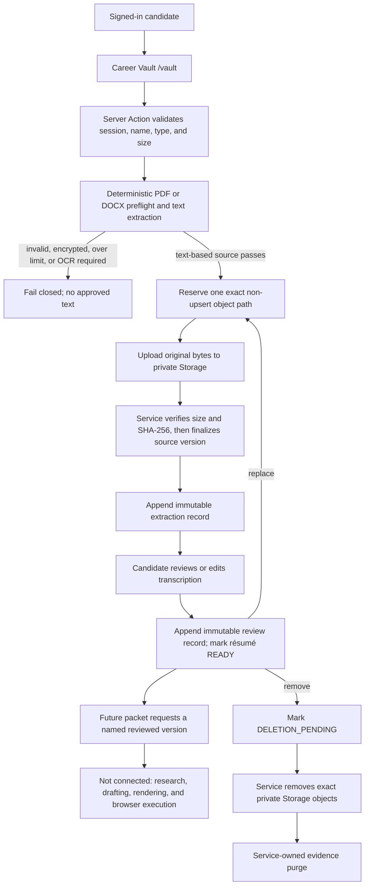

# Career Vault résumé intake

Career Vault keeps one logical résumé per candidate and preserves every accepted
source version. It stores the original file, the deterministic transcription,
and the candidate-reviewed text as separate evidence layers. The reviewed text
is lightweight input for later drafting, but no model or application-packet
consumer is connected yet.

## Current truth

| Claim | Status | Evidence or boundary |
|---|---|---|
| `/vault` is an authenticated persistent route | **Implemented** | Server-authenticated page and Server Actions |
| Original PDF/DOCX bytes use private Supabase Storage | **Implemented** | `career-vault` bucket plus tenant-scoped object policies |
| Source, extraction, and review versions are immutable | **Implemented** | PostgreSQL constraints, append-only triggers, hashes, and version fields |
| Text extraction is deterministic | **Implemented** | Bounded PDF and DOCX parsers with a recorded parser release |
| Candidate can review/edit, replace, and delete | **Implemented** | Career Vault UI and transactional commands |
| All 18 migrations passed the full hosted Vault harness | **Verified live** | Run `20260812170337`; 12 checkpoints and cleanup passed |
| Uploaded files are malware-scanned | **Not connected** | Every current source version is recorded as `NOT_SCANNED` |
| Scanned/image-only PDFs use OCR | **Not connected** | Parser returns `OCR_REQUIRED` |
| Reviewed text generates a tailored résumé or cover letter | **Not connected** | No packet/model/renderer consumer exists |

The older hosted Milestone 0 run `20260812135034` proves Auth/RLS, Queue,
pasted-link intake, outbox recovery, and one official-source resolution through
migration `20260812134739`. Career Vault has its own later acceptance record;
the older run must not be stretched beyond its original scope.

## Why three layers

| Layer | Storage | Purpose | Authority |
|---|---|---|---|
| Original source | Private Storage object selected by an immutable `source_document_versions` row | Preserve the exact candidate upload for provenance, download, and reprocessing | Source evidence only |
| Deterministic transcription | Immutable `source_document_extractions` row | Give the candidate a searchable and editable text copy with parser and hash provenance | Machine observation, not approved truth |
| Candidate-reviewed text | Immutable `source_document_text_reviews` row | Record exactly what the candidate confirmed for later narrative drafting | Reviewed narrative evidence, not an exact application-answer store |

Exact identity, dates, work authorization, protected attributes, legal answers,
and other form fields belong in separate structured candidate-approved records.
A future vector index may retrieve narrative evidence. It may not answer exact
fields or mutate approved facts.

## Current flow



The extraction currently runs before upload inside the Next.js application
server. That gives immediate feedback and keeps failed files out of Storage, but
it is not the production quarantine boundary. Production should upload to a
quarantine path, scan in an isolated worker, parse under resource limits, then
promote only verified source metadata and transcription records.

## Data model

| Record | Mutability | Important fields |
|---|---|---|
| `source_documents` | Mutable aggregate pointer | candidate, status, current version, aggregate version |
| `source_document_upload_reservations` | State transition only | exact path, expected size/type, expiry, reserved actor |
| `source_document_versions` | Immutable | source hash, byte size, MIME type, Storage path, scan status, creator |
| `source_document_extractions` | Immutable | source/text hashes, parser release, output schema, page count, warnings, failure code |
| `source_document_text_reviews` | Immutable | extraction link, reviewed text/hash, review version, candidate actor |

One partial unique index permits one logical résumé per candidate, including
while deletion is pending.
Replacing a résumé appends a source version. The current pointer moves only when
that version extracts successfully, so a failed replacement does not displace
the last reviewed résumé.

## Input bounds

| Boundary | Current value or behavior |
|---|---|
| Formats | PDF and DOCX |
| Source size | 1 byte through 10 MB |
| PDF pages | At most 25 |
| Text | 1 through 200,000 normalized characters |
| PDF | Encrypted, malformed, timed-out, oversized, or image-only files fail closed |
| DOCX | ZIP signature, central directory, safe part paths, at most 256 entries, 8 MiB expanded total, 4 MiB per part, and a 200:1 per-entry expansion ratio |
| Upload | Exact reserved path; `upsert: false` |
| Scan truth | `NOT_SCANNED` until a real scanner reports otherwise |

Supabase documents standard uploads as best suited to small files and recommends
resumable uploads above roughly 6 MB. Before production, either lower RoleDawn's
10 MB cap or move larger files to a resumable upload adapter. See the dated
[source register](../research/source-register.md).

## Storage and access

- The `career-vault` bucket is private.
- Authenticated users receive RLS access only to object paths owned by their
  active personal candidate record.
- Source metadata, extraction text, and review text use candidate-scoped RLS.
- Finalization, extraction recording, and purge completion require the server
  service boundary.
- Service credentials stay out of browser code, Storage metadata, and candidate
  records.
- Deletion uses the Storage API first. The database purge refuses completion
  while a referenced private object remains.

## Failure and recovery

| Failure | Current behavior |
|---|---|
| Parser rejects source before reservation | Show a specific candidate-safe error; create no approved record |
| Object upload fails | Keep the reservation recoverable unless exact cleanup succeeds |
| Finalization fails | Remove the exact object first; cancel only after Storage confirms removal |
| Extraction recording fails after finalization | Preserve the immutable source and append a failure record for recovery |
| Replacement extraction fails | Keep the last successfully reviewed version current |
| Review uses stale aggregate version | Reject and require reload |
| Deletion pauses after request | Keep `DELETION_PENDING`; the UI can resume exact object removal and purge |

Expired-reservation cleanup has a bounded service command. Scheduling that
cleanup is not connected yet.

## Downstream drafting contract

A future packet builder should consume a named immutable snapshot, not “the
latest résumé text” from chat or model memory:

```text
candidate_id
document_id
document_version_id
extraction_id
review_id
reviewed_text_sha256
source_sha256
parser_release
reviewed_at
```

The packet must record those identifiers and hashes before a model call. A later
replacement or edit creates a new snapshot and cannot mutate an existing packet.
Before drafting, the packet builder joins reviewed structured facts for exact
answers and uses reviewed résumé text only as narrative evidence.

## Production hardening sequence

1. Upload into quarantine; scan bytes with a named scanner release; keep the
   source non-current until the result is `CLEAN`.
2. Move PDF/DOCX parsing to an isolated, resource-bounded worker. Keep parser
   provider, release, schema, timing, and hashes in the extraction record.
3. Add OCR as a separate fallback with confidence warnings and mandatory
   candidate review.
4. Add structured fact review with provenance links to source spans. Do not
   promote text extraction into exact facts automatically.
5. Add retention schedules, candidate export, and bounded cleanup for expired
   reservations and failed uploads.
6. Connect one reviewed snapshot to an immutable no-submit application packet;
   keep browser execution and employer submission disconnected until packet and
   approval gates pass.

## Relevant code and migrations

- `src/app/vault/`
- `src/components/vault/`
- `src/domain/career-vault.ts`
- `src/server/resume/extract-resume.ts`
- `src/server/vault/career-vault.ts`
- `src/server/vault/resume-upload-cleanup.ts`
- `scripts/run-career-vault-acceptance.ts`
- `scripts/cleanup-career-vault-acceptance.ts`
- `supabase/migrations/20260812150302_career_vault_resume_intake.sql`
- `supabase/migrations/20260812163000_fix_source_document_purge_trigger.sql`
- `supabase/migrations/20260812164000_source_document_purge_context.sql`
- `supabase/migrations/20260812165000_source_document_explicit_purge.sql`
- `supabase/migrations/20260812172500_use_nonretryable_resume_version_conflicts.sql`
- `supabase/migrations/20260812180000_harden_career_vault_lifecycle.sql`
- `supabase/migrations/20260812182500_harden_resume_upload_cancellation.sql`
