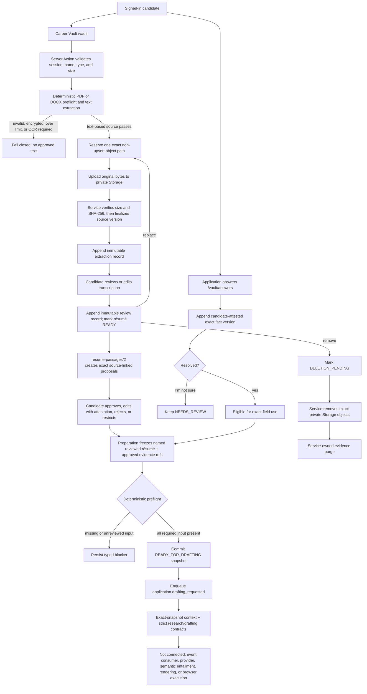

# Career Vault résumé intake

Career Vault keeps one logical résumé per candidate and preserves every accepted
source version. It stores the original file, the deterministic transcription,
and the candidate-reviewed text as separate evidence layers. A separate
Application answers surface now stores candidate-attested exact fields. The
reviewed text can now become candidate-reviewed, source-linked narrative
evidence and can be frozen by one application-scoped preflight. It is not
connected to a drafting model or rendered-packet runtime. Exact-snapshot context,
provider-safe drafting, strict output parsing, and cited-research contracts now
exist as tested foundations around that handoff; they do not consume the event
or produce an artifact.

## Current truth

| Claim | Status | Evidence or boundary |
|---|---|---|
| `/vault` is an authenticated persistent route | **Implemented** | Server-authenticated page and Server Actions |
| Original PDF/DOCX bytes use private Supabase Storage | **Implemented** | `career-vault` bucket plus tenant-scoped object policies |
| Source, extraction, and review versions are immutable | **Implemented** | PostgreSQL constraints, append-only triggers, hashes, and version fields |
| Text extraction is deterministic | **Implemented** | Bounded PDF and DOCX parsers with a recorded parser release |
| Candidate can review/edit, replace, and delete | **Implemented** | Career Vault UI and transactional commands |
| All 18 migrations passed the full hosted Vault harness | **Verified live** | Run `20260812170337`; 12 checkpoints and cleanup passed |
| `/vault/answers` stores reviewed exact answers | **Verified live** | Candidate-profile run `20260812195628`; 13 checkpoints plus cleanup passed |
| `/vault/facts` shows source-linked résumé evidence | **Verified live** | Hosted evidence acceptance passed; founder dogfood has 12 approved and five review-pending `resume-passages/2` items |
| Candidate-profile baseline through 21 migrations was hosted and schema-linted | **Verified historical checkpoint** | Hosted ledger aligned through `20260812190000`; later evidence/preflight checkpoints supersede the migration count without widening that run's proof |
| A real reviewed résumé can reach deterministic input preflight | **Verified live** | Founder snapshot `a6a98e45-305b-496f-bd46-754b870a2a4b` is `READY_FOR_DRAFTING` with 12 evidence refs, one fact ref, and zero blockers |
| Drafting context uses only exact committed versions | **Implemented and tested offline** | The reader has no `latest` method and rechecks snapshot, job, résumé, and approved-evidence hashes |
| Candidate data sent to a drafting provider is minimized | **Implemented; local live acceptance passed** | Candidate identity and exact facts are excluded; `AS_UPLOADED` stays server-side; one Terra proposal used only approved narrative evidence and job context |
| Research/revision/evidence provenance can be stored immutably | **Verified hosted foundation** | The hosted ledger is aligned through migration `20260817025617`; append-only provenance passed deployment and rollback acceptance with no produced research or revision rows |
| Uploaded files are malware-scanned | **Not connected** | Every current source version is recorded as `NOT_SCANNED` |
| Scanned/image-only PDFs use OCR | **Not connected** | Parser returns `OCR_REQUIRED` |
| Reviewed text generates a tailored résumé or cover letter | **Local adapter only** | One bounded Terra proposal passed deterministic checks; no event consumer, semantic validator, durable revision, or renderer exists |

The older hosted Milestone 0 run `20260812135034` proves Auth/RLS, Queue,
pasted-link intake, outbox recovery, and one official-source resolution through
migration `20260812134739`. Career Vault has its own later acceptance record;
the older run must not be stretched beyond its original scope. Candidate answers
have a separate [hosted acceptance record](../execution/candidate-profile-hosted-acceptance.md).

## Why three layers

| Layer | Storage | Purpose | Authority |
|---|---|---|---|
| Original source | Private Storage object selected by an immutable `source_document_versions` row | Preserve the exact candidate upload for provenance, download, and reprocessing | Source evidence only |
| Deterministic transcription | Immutable `source_document_extractions` row | Give the candidate a searchable and editable text copy with parser and hash provenance | Machine observation, not approved truth |
| Candidate-reviewed text | Immutable `source_document_text_reviews` row | Record exactly what the candidate confirmed for later narrative drafting | Reviewed narrative evidence, not an exact application-answer store |

Exact identity, dates, work authorization, protected attributes, legal answers,
and other form fields belong in separate structured candidate-approved records.
A future vector index may retrieve narrative evidence. It may not answer exact
fields or mutate approved facts.

## Current flow


```mermaid
flowchart TD
    U["Signed-in candidate"] --> V["Career Vault /vault"]
    V --> A["Server Action validates session, name, type, and size"]
    A --> P["Deterministic PDF or DOCX preflight and text extraction"]
    P -->|"invalid, encrypted, over limit, or OCR required"| F["Fail closed; no approved text"]
    P -->|"text-based source passes"| R["Reserve one exact non-upsert object path"]
    R --> S["Upload original bytes to private Storage"]
    S --> H["Service verifies size and SHA-256, then finalizes source version"]
    H --> X["Append immutable extraction record"]
    X --> C["Candidate reviews or edits transcription"]
    C --> T["Append immutable review record; mark résumé READY"]
    U --> A2["Application answers /vault/answers"]
    A2 --> F2["Append candidate-attested exact fact version"]
    F2 --> G{"Resolved?"}
    G -->|"yes"| E2["Eligible for exact-field use"]
    G -->|"I'm not sure"| B2["Keep NEEDS_REVIEW"]
    T --> Q["resume-passages/2 creates exact source-linked proposals"]
    Q --> Y["Candidate approves, edits with attestation, rejects, or restricts"]
    Y --> N["Preparation freezes named reviewed résumé + approved evidence refs"]
    E2 --> N
    N --> W{"Deterministic preflight"}
    W -->|"missing or unreviewed input"| B3["Persist typed blocker"]
    W -->|"all required input present"| R2["Commit READY_FOR_DRAFTING snapshot"]
    R2 --> H2["Enqueue application.drafting_requested"]
    H2 --> C2["Exact-snapshot context + strict research/drafting contracts"]
    C2 --> Z["Not connected: event consumer, provider, semantic entailment, rendering, or browser execution"]

    T -->|"replace"| R
    T -->|"remove"| D["Mark DELETION_PENDING"]
    D --> O["Service removes exact private Storage objects"]
    O --> E["Service-owned evidence purge"]
```

The extraction currently runs before upload inside the Next.js application
server. That gives immediate feedback and keeps failed files out of Storage, but
it is not the production quarantine boundary. Production should upload to a
quarantine path, scan in an isolated worker, parse under resource limits, then
promote only verified source metadata and transcription records.

## Founder dogfood takeaways

**Verified live:** the selected one-page résumé produced 3,353 normalized
characters with zero parser warnings. Segmenter `resume-passages/2` produced 17
bounded source-linked items across experience, education, skills, and summary.
Candidate-authorized review approved 12 and left five in `NEEDS_REVIEW`.

The useful signal is not that every line parsed. It is that wrapped experience
content became reviewable without turning contact text into narrative evidence,
and uncertainty survived the process. The 12 approved versions were then frozen
into one `READY_FOR_DRAFTING` Application Input Snapshot. This is enough to
start the separate drafting consumer; it is not evidence that the five remaining
items are wrong, that all résumé layouts will segment cleanly, or that drafting
quality is solved.

## Data model

| Record | Mutability | Important fields |
|---|---|---|
| `source_documents` | Mutable aggregate pointer | candidate, status, current version, aggregate version |
| `source_document_upload_reservations` | State transition only | exact path, expected size/type, expiry, reserved actor |
| `source_document_versions` | Immutable | source hash, byte size, MIME type, Storage path, scan status, creator |
| `source_document_extractions` | Immutable | source/text hashes, parser release, output schema, page count, warnings, failure code |
| `source_document_text_reviews` | Immutable | extraction link, reviewed text/hash, review version, candidate actor |
| `candidate_facts` | Mutable aggregate pointer | candidate, allowlisted key, sensitivity, exact-field policy, verification state, current version |
| `candidate_fact_versions` | Immutable | value, normalized text, candidate attestation, reviewer, review time, version |
| `source_evidence_passages` | Immutable | review/version link, exact offsets, excerpt hash, category, segmenter release |
| `candidate_evidence_items` | Mutable aggregate pointer | source passage, review status, current version, aggregate version |
| `candidate_evidence_versions` | Immutable | claim text/hash, usage policy, disposition, review kind, attestation |
| `candidate_evidence_citations` | Immutable | evidence-version to exact source-passage link |
| `application_input_snapshots` | Immutable | one application's exact job, candidate-input epoch, reviewed source hashes, policy releases, readiness, and blockers |
| `application_snapshot_evidence_refs` | Immutable | approved evidence-version references frozen for one application run |
| `application_snapshot_fact_refs` | Immutable | approved exact-fact-version references frozen for one application run; values are not copied into narrative context |
| `application_research_bundles` | Immutable | cited provider-neutral research manifest, exact input binding, deterministic hash, policy release, and freshness expiry |
| `application_revisions` | Immutable | requires matching input-snapshot and research-bundle IDs/hashes before any revision can persist |
| `application_revision_evidence_refs` | Immutable | exact evidence-version IDs and hashes used by one snapshot-bound revision |

One partial unique index permits one logical résumé per candidate, including
while deletion is pending.
Replacing a résumé appends a source version. The current pointer moves only when
that version extracts successfully, so a failed replacement does not displace
the last reviewed résumé.

## Input bounds

| Boundary | Current value or behavior |
|---|---|
| Formats | PDF and DOCX |
| Source size | 1 byte through 10 MB |
| PDF pages | At most 25 |
| Text | 1 through 200,000 normalized characters |
| PDF | Encrypted, malformed, timed-out, oversized, or image-only files fail closed |
| DOCX | ZIP signature, central directory, safe part paths, at most 256 entries, 8 MiB expanded total, 4 MiB per part, and a 200:1 per-entry expansion ratio |
| Upload | Exact reserved path; `upsert: false` |
| Scan truth | `NOT_SCANNED` until a real scanner reports otherwise |

Supabase documents standard uploads as best suited to small files and recommends
resumable uploads above roughly 6 MB. Before production, either lower RoleDawn's
10 MB cap or move larger files to a resumable upload adapter. See the dated
[source register](../research/source-register.md).

## Storage and access

- The `career-vault` bucket is private.
- Authenticated users receive RLS access only to object paths owned by their
  active personal candidate record.
- Source metadata, extraction text, and review text use candidate-scoped RLS.
- Candidate facts, versions, and source links use candidate-self RLS inside the
  active personal workspace. Shared workspace membership alone is insufficient.
- Finalization, extraction recording, and purge completion require the server
  service boundary.
- Service credentials stay out of browser code, Storage metadata, and candidate
  records.
- Deletion uses the Storage API first. The database purge refuses completion
  while a referenced private object remains.

## Failure and recovery

| Failure | Current behavior |
|---|---|
| Parser rejects source before reservation | Show a specific candidate-safe error; create no approved record |
| Object upload fails | Keep the reservation recoverable unless exact cleanup succeeds |
| Finalization fails | Remove the exact object first; cancel only after Storage confirms removal |
| Extraction recording fails after finalization | Preserve the immutable source and append a failure record for recovery |
| Replacement extraction fails | Keep the last successfully reviewed version current |
| Review uses stale aggregate version | Reject and require reload |
| Deletion pauses after request | Keep `DELETION_PENDING`; the UI can resume exact object removal and purge |

Expired-reservation cleanup has a bounded service command. Scheduling that
cleanup is not connected yet.

## Downstream drafting contract

Preparation already freezes a named immutable Application Input Snapshot. The
drafting consumer contract now accepts that snapshot ID from
`application.drafting_requested`, not “the latest résumé text” from chat, model
memory, or a fresh mutable query:

```text
candidate_id
application_id
preparation_run_id
job_version_id
candidate_input_version
source_document_version_id
source_text_review_id
approved_evidence_version_refs[]
approved_exact_fact_version_refs[]
tailoring_mode
submission_mode
policy_release
assembler_release
snapshot_hash
```

The implemented context reader exposes exact-ID lookups only and revalidates the
snapshot, job, reviewed-résumé, and evidence hashes. Its provider-safe drafting
request excludes candidate identity, exact facts, raw source IDs, and raw
reviewed résumé text. `AS_UPLOADED` is `PRESERVE_SERVER_SIDE`; generated modes
may use only approved narrative evidence permitted for the résumé. Unknown
provider output must pass the strict bounded parser.

Research proposals must pass the cited provider-neutral contract, exact
snapshot/job binding, conflict rules, freshness policy, and deterministic hash
before an immutable bundle can persist. A revision must then bind that bundle,
the input snapshot, and its evidence references. Deterministic checks cannot
mark it passed while semantic entailment remains `REQUIRED_NOT_RUN`.

A later replacement or edit advances candidate input version but cannot mutate
the committed snapshot. Exact fact values remain available only for allowed
deterministic field use and stay outside narrative model context. Unresolved
sensitive answers block preparation. The pending drafting request still has no
consumer. One local Terra call produced an unpersisted proposal, but no research
bundle, semantic pass, revision, artifact, approval, or employer action has
occurred.

## Production hardening sequence

1. Upload into quarantine; scan bytes with a named scanner release; keep the
   source non-current until the result is `CLEAN`.
2. Move PDF/DOCX parsing to an isolated, resource-bounded worker. Keep parser
   provider, release, schema, timing, and hashes in the extraction record.
3. Add OCR as a separate fallback with confidence warnings and mandatory
   candidate review.
4. Harden the accepted v2 source segmentation and review flow across varied
   résumé layouts. Add cited story/voice proposals and the reusable Candidate
   Evidence Snapshot without promoting extraction into exact facts.
5. Add retention schedules, candidate export, and bounded cleanup for expired
   reservations and failed uploads.
6. Connect the existing exact-snapshot/research/drafting contracts to one leased,
   replay-safe no-submit consumer. Add semantic entailment, then render and
   persist one immutable Application Kit. Keep browser execution and employer
   submission disconnected until packet and approval gates pass.

## Relevant code and migrations

- `src/app/(candidate)/vault/` and `src/app/vault/actions.ts`
- `src/app/vault/profile-actions.ts`
- `src/components/vault/`
- `src/domain/career-vault.ts`
- `src/domain/candidate-profile.ts`
- `src/domain/candidate-profile-validation.ts`
- `src/domain/application-drafting.ts`
- `src/domain/application-research.ts`
- `src/server/resume/extract-resume.ts`
- `src/server/resume/segment-reviewed-resume.ts`
- `src/server/applications/drafting-context.ts`
- `src/server/vault/candidate-evidence.ts`
- `src/server/workers/application-preparation.ts`
- `src/server/vault/career-vault.ts`
- `src/server/vault/resume-upload-cleanup.ts`
- `scripts/run-career-vault-acceptance.ts`
- `scripts/cleanup-career-vault-acceptance.ts`
- `scripts/seed-dogfood-candidate.ts`
- `supabase/migrations/20260812150302_career_vault_resume_intake.sql`
- `supabase/migrations/20260812163000_fix_source_document_purge_trigger.sql`
- `supabase/migrations/20260812164000_source_document_purge_context.sql`
- `supabase/migrations/20260812165000_source_document_explicit_purge.sql`
- `supabase/migrations/20260812172500_use_nonretryable_resume_version_conflicts.sql`
- `supabase/migrations/20260812180000_harden_career_vault_lifecycle.sql`
- `supabase/migrations/20260812182500_harden_resume_upload_cancellation.sql`
- `supabase/migrations/20260812185537_harden_resume_reservation_cancellation.sql`
- `supabase/migrations/20260812185553_candidate_profile_answers.sql`
- `supabase/migrations/20260812190000_use_nonretryable_candidate_fact_conflicts.sql`
- `supabase/migrations/20260816233110_candidate_evidence_foundation.sql`
- `supabase/migrations/20260816234940_include_candidate_evidence_in_document_purge.sql`
- `supabase/migrations/20260817011359_bucket3_preparation_snapshots.sql`
- `supabase/migrations/20260817020942_candidate_evidence_segmenter_v2.sql`
- `supabase/migrations/20260817025617_drafting_research_and_revision_provenance.sql`
