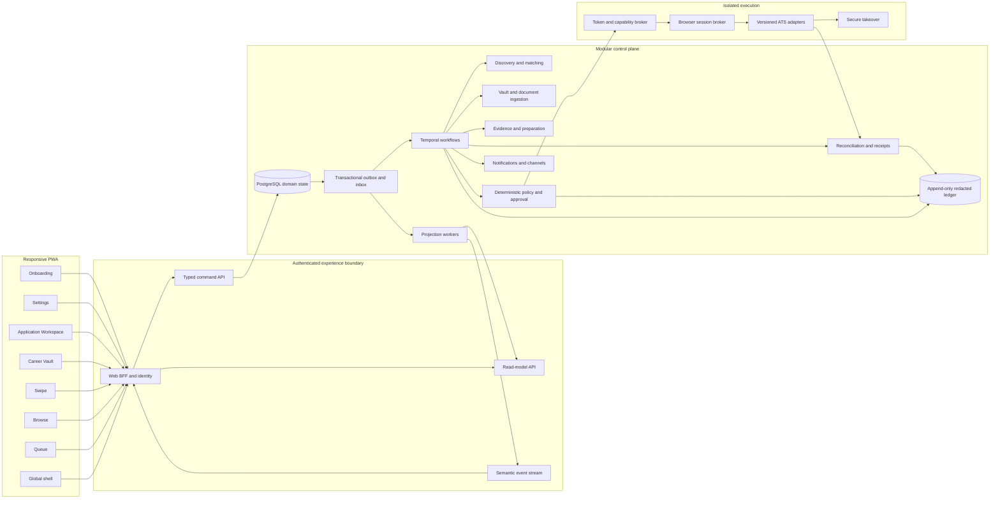

# Frontend-to-backend screen contract

## Purpose

This document maps each candidate screen to the smallest truthful backend contract needed to support it. It is the handoff between the [frontend specification](../product/dashboard-and-responsive-experience.md) and the [system architecture](system-architecture.md).

Primary navigation stays Queue, Browse Jobs, Swipe, and Career Vault. Application Workspace is a routed detail. Settings is an account utility. Onboarding reuses the same Career Vault, search-rule, channel, and authority contracts used after signup.

## Rules shared by every screen

- Internal job, application, revision, approval, attempt, workflow, provider, and requisition IDs are opaque routing keys. Do not render them as ordinary candidate copy.
- Queue sorts by `queued_at DESC, application_id ASC`. It does not sort by update time.
- Every read model returns `version`, `allowedActions`, `generatedAt`, and `stale`.
- The frontend renders server-supplied status and allowed actions. It does not infer authority from display text.
- Every command carries an idempotency key, authenticated actor, and expected aggregate version.
- A version conflict returns a typed conflict. It never overwrites silently.
- Offline or stale screens are read-only for consequential actions.
- PostgreSQL domain state authorizes visible state. Temporal coordinates work but is not the UI source of truth.
- A submission becomes Confirmed only when a receipt has confirmation evidence.
- Candidate timelines contain bounded semantic events, not raw model traces, browser logs, or hidden reasoning.
- Pause blocks new queue additions, preparation, approval, and execution. Browse, Save, inspection, export, and Resume remain available.

### Shared command envelope

```ts
type CommandEnvelope<T> = {
  commandId: string;
  expectedVersion: number;
  payload: T;
};

type CommandResult<T> = {
  aggregateVersion: number;
  committedEventId: string;
  result: T;
};
```

### HTTP behavior

| Result | Response |
|---|---|
| Success | `200`, `201`, or `202` with committed result |
| Unauthenticated | `401` |
| Wrong principal or authority | `403` |
| Version or state conflict | `409` |
| Typed validation or policy failure | `422` |
| User or security pause | `423` |
| Projection unavailable | `503`, without implying the underlying command failed |

Use `Idempotency-Key` for commands and `If-Match` or `expectedVersion` for aggregate mutations.

## Screen summary

| Screen | Primary read | Candidate commands | Backend owner |
|---|---|---|---|
| Global shell | `/v1/app-shell` | Pause, resume, logout | Identity, Policy, Notifications |
| Onboarding | `/v1/onboarding` | Upload, verify, set rules, activate | Identity, Vault, Matching, Channels |
| Queue | `/v1/applications` | Add, skip, cancel | Application Domain, Job Intake |
| Browse Jobs | `/v1/jobs` | Save, unsave, add to Queue | Discovery, Matching, Application Domain |
| Swipe | `/v1/swipe/deck` | Pass, queue, undo | Discovery projection, Application Domain |
| Career Vault | `/v1/vault` | Upload, verify, edit, restrict, remove | Document Ingestion, Vault, Policy |
| Application Workspace | `/v1/applications/:id` | Answer, revise, approve, skip, cancel, takeover, check | Application, Approval, Browser, Reconciliation |
| Settings | `/v1/settings` | Update policy, channels, export, delete | Search Rules, Policy, Notifications, Data Rights |

## Global shell

### Read model

```ts
type AppShellVM = {
  candidate: { displayName: string; avatarUrl: string | null };
  authority: {
    mode: "DRAFT_ONLY" | "PER_APPLICATION_APPROVAL";
    state: "ACTIVE" | "PAUSED_BY_USER" | "PAUSED_BY_SECURITY";
    label: string;
    allowedActions: ("PAUSE" | "RESUME")[];
  };
  attentionCount: number;
  channels: { type: string; state: "CONNECTED" | "DEGRADED" | "DISCONNECTED" }[];
  version: number;
  generatedAt: string;
  stale: boolean;
};
```

### Commands and events

- `POST /v1/authority/pause`
- `POST /v1/authority/resume`
- `POST /v1/session/logout`
- Events: `authority.changed`, `attention.count_changed`, `channel.health_changed`, `security.pause_applied`.

### States and boundary

Use a stable shell skeleton while loading. Offline mode is read-only. Session expiry preserves the intended route. A stale authority projection disables approval. Only the authenticated candidate can pause or resume a user pause; an ordinary Resume action cannot clear a security pause.

Tables: `principals`, `workspace_memberships`, `agent_authority_policies`, `workspace_agent_state`, `channel_bindings`, and shell projections.

## Onboarding

### Flow

Account → resume upload → fact review → search rules → sourced first match → blocking facts → authority review → optional iMessage → Queue.

### Reads and commands

- `GET /v1/onboarding`
- Reuse `GET /v1/vault`, `/v1/search-rules`, `/v1/channels`, and `/v1/jobs/first-match`.
- `POST /v1/vault/documents/upload-intents`
- `POST /v1/vault/documents/:id/complete`
- `PATCH /v1/vault/facts/:id`
- `POST /v1/vault/facts/:id/verify`
- `PUT /v1/search-rules`
- `POST /v1/channels/:provider/connect`
- `POST /v1/onboarding/activate`

### Events and states

Events: document uploaded, scanned, parsed, fact extracted, fact verified, search rules updated, first match ready, channel verified, and candidate activated.

States: uploading, scanning, extracting, needs review, parse failed, no current match, missing eligibility fact, channel connection failed, and resume later. Progress derives from committed facts, documents, rules, consent, and activation state rather than a separate wizard-only truth.

### Boundary

Identity, employers, titles, dates, contact data, and authorization require candidate verification before application approval. Optional protected answers are never collected globally. Employer credentials are collected only when needed and scoped to their origin.

Tables: `candidate_profiles`, `source_documents`, `candidate_facts`, `fact_sources`, `fact_usage_policies`, `searches`, `search_rules`, `consent_versions`, and `channel_bindings`.

## Queue

### Read

```text
GET /v1/applications?status=&query=&cursor=&limit=25&sort=queued_at_desc
```

```ts
type QueueItemVM = {
  applicationId: string; // route key; never rendered as copy
  version: number;
  company: string;
  role: string;
  location: string | null;
  queuedAt: string;
  updatedAt: string;
  status: {
    code: string;
    label: string;
    tone: "NEUTRAL" | "WORKING" | "ATTENTION" | "SAFE" | "CLOSED";
  };
  latestMeaningfulEvent: { label: string; occurredAt: string };
  nextAction: { code: string; label: string } | null;
  allowedActions: string[];
  generatedAt: string;
  stale: boolean;
};
```

### Commands and events

- `POST /v1/applications` with `jobVersionId`.
- `POST /v1/job-intakes` with `canonicalUrl`.
- `POST /v1/applications/:id/skip`.
- `POST /v1/applications/:id/cancel`.
- Events: job intake created/resolved/failed; application created/state changed/action required/approval ready/receipt confirmed/canceled.

A pasted URL creates a durable job intake. The resolver establishes canonical job identity before it creates an application. The Queue may show “Checking job link” without inventing employer data.

### States and boundary

States: empty, filtered empty, loading, stale, paused, intake failed, and command conflict. Adding creates work but no submission authority. When paused, new Queue additions return a typed pause response; Save remains available in Browse.

Tables: `job_intakes`, `jobs`, `job_versions`, `applications`, `application_revisions`, `domain_events`, `outbox`, and the application-list projection.

## Browse Jobs

### Read

```text
GET /v1/jobs?query=&workMode=&location=&roleFamily=&experience=&employment=&postedAfter=&saved=&sort=&cursor=
```

Each job returns source freshness, concise fit reasons, one gap, save state, queue state, and allowed actions.

### Commands and events

- `POST /v1/jobs/:id/save`
- `DELETE /v1/jobs/:id/save`
- `POST /v1/applications` with `jobVersionId`
- `POST /v1/search-rules/recheck-preview` before “Use these filters as my search rules.”
- Events: job saved/unsaved/closed/version changed, application created, and rule-change preview created.

### States and boundary

States: loading, no results, partial source failure, stale source, closed job, already saved, and already queued. Browse is read-only until Save or Add to Queue. Company, role, location, source age, and official URL are candidate-facing; IDs stay internal.

Tables: `source_registry`, `jobs`, `job_versions`, `fit_assessments`, `saved_jobs`, and source-health projections.

## Swipe

### Read and commands

- `GET /v1/swipe/deck?cursor=&limit=10`
- `POST /v1/job-decisions` with `PASS`, `SAVE`, or `QUEUE`.
- `POST /v1/job-decisions/:id/undo`.
- Optional `POST /v1/rule-suggestions` for a selected pass reason.
- Events: job decision recorded/undone, application created, and rule suggestion created.

### States and boundary

States: loading next card, caught up, job closed, decision already recorded, undo expired, and paused. A pass reason may propose a future rule but cannot change policy. Swipe uses the existing Discovery and Application modules; it does not need its own workflow service or duplicate job store.

Tables: `candidate_job_decisions`, `jobs`, `job_versions`, `fit_assessments`, and `applications`.

## Career Vault

### Read and commands

- `GET /v1/vault`
- Create and complete an upload intent.
- Verify, edit, or remove a fact.
- Restrict fact usage.
- Remove a source document.
- Create or update a scoped answer policy.

The read model groups documents, facts, provenance, verification, usage policy, blocking gaps, and profile completeness.

### Events and states

Events: document ingested/rejected, fact extracted/changed/verified, fact usage changed, and application approval invalidated.

States: empty, uploading, scanning, parsing, unsupported file, corrupt file, malware rejection, facts need review, fact blocks named applications, export pending, and deletion pending.

### Boundary

Only candidate-approved structured facts fill exact or sensitive fields. A material fact change invalidates affected unused approvals. Removing evidence previews downstream impact before commit.

Tables: `source_documents`, `candidate_facts`, `fact_sources`, `fact_usage_policies`, `answer_policies`, and affected-application indexes. File bytes live in encrypted object storage, not database rows.

## Application Workspace

### Route and read

```text
/app/applications/:applicationId
GET /v1/applications/:id
POST /v1/artifacts/:id/view-capability
```

The aggregate returns the current immutable revision, allowed actions, authority, frozen job snapshot, match evidence, materials, exact questions, semantic timeline, attempt state, and receipt when confirmed.

### Commands

- `POST /v1/applications/:id/answers`
- `POST /v1/applications/:id/revision-requests`
- `POST /v1/applications/:id/approval-challenges`
- `POST /v1/approval-challenges/:id/consume`
- `POST /v1/applications/:id/skip`
- `POST /v1/applications/:id/cancel`
- `POST /v1/applications/:id/takeover-capabilities`
- `POST /v1/applications/:id/check-submission`
- `POST /v1/applications/:id/outcomes` after confirmation

`check-submission` reconciles the same attempt. It cannot create another submission attempt.

### Events and states

Events: revision created, answer required/committed, approval issued/invalidated/consumed, execution started, takeover required, reconciling, confirmed, failed safe, and outcome recorded.

Submission states: loading, not found, wrong owner, job changed, job closed, answer required, preparing, ready, approval expired, approval invalidated, applying, takeover, checking submission, failed safe, and confirmed.

Outcome states are a separate projection over `outcomes`: no outcome, recruiter response, interview, rejection, offer, hired, or withdrawn. An outcome event never changes or replaces the immutable submission state or receipt.

### Boundary

The candidate sees the target, files, final field values, unresolved decisions, and material diff before approval. One approval consumes one unchanged revision. Models and browser workers cannot issue or consume approval. Outcome events never rewrite submission history.

Tables: `applications`, `application_revisions`, `application_answers`, `artifacts`, `approval_challenges`, `approval_consumptions`, `application_attempts`, `receipts`, `outcomes`, and `domain_events`.

### Concierge operations gate

The first alpha applications may require an internal operations check before candidate approval. This is a revision-bound gate, not a new candidate destination or a second application state machine.

- Application read model: `operationsReview` is `NOT_REQUIRED`, `PENDING`, `APPROVED`, or `CHANGES_REQUESTED`.
- Candidate label while pending: **Internal safety review**. Do not expose operator identity or support notes.
- Internal command: `POST /v1/internal/applications/:id/operations-review` with the exact revision and `APPROVE` or `REQUEST_CHANGES`.
- Events: `application.operations_review_requested`, `application.operations_review_approved`, and `application.operations_changes_requested`.
- Any material revision change clears approval and returns the gate to `PENDING` when the cohort policy still requires it.
- Candidate approval cannot be issued until the current revision passes this gate.

The operator route requires a separate audited support role and is outside candidate navigation. The Application Domain and Policy modules own the gate; no new service is required.

## Settings

### Read and commands

- `GET /v1/settings`
- `GET /v1/search-rules`
- `PUT /v1/search-rules`
- `PUT /v1/application-behavior`
- `PUT /v1/notification-preferences`
- Connect or disconnect a channel.
- Request export or deletion.
- Preview and then confirm a Queue recheck.

Settings groups Search rules, Application behavior, Notifications, and Account and data. Application behavior can control preparation, caps, verified-fact tailoring, cover-letter policy, and unknown-question handling. It cannot disable the MVP’s per-application submission approval.

### Events and states

Events: search rules updated, application behavior updated, notification preferences updated, channel connected/disconnected, queue recheck requested, export requested, and deletion requested.

States: loading, unsaved changes, validation error, save conflict, Queue impact preview, channel pending/degraded/revoked, export pending/ready/expired, and deletion confirmation/pending.

### Boundary

Changes apply to future jobs by default. Rechecking existing Queue items is separate and explicit. No raw provider token or reusable ATS password enters the UI or ordinary domain tables.

Tables: `searches`, `search_rules`, `agent_authority_policies`, `notification_preferences`, `channel_bindings`, `connected_accounts`, `consent_versions`, `data_export_requests`, and `deletion_requests`.

## Event delivery to the frontend

Use server-sent events when useful, with bounded polling fallback. The stream carries semantic projection events such as:

```ts
type CandidateProjectionEvent = {
  eventId: string;
  aggregateType:
    | "APPLICATION"
    | "JOB"
    | "JOB_INTAKE"
    | "JOB_DECISION"
    | "SEARCH_RULES"
    | "VAULT"
    | "SETTINGS"
    | "SHELL"
    | "ONBOARDING";
  aggregateId: string;
  aggregateVersion: number;
  projection: string;
  occurredAt: string;
};
```

The client uses the event to invalidate or patch a read model. It does not treat the event as permission or as proof that an external action succeeded.

## Architecture map



These boxes are logical modules, not a microservice mandate. The alpha should use one Next.js web app, one modular TypeScript API/control-plane deployment, bounded Temporal worker pools, PostgreSQL, object storage, Temporal Cloud, and a managed browser provider. Split deployments only when measured isolation, queueing, cost, or scaling requires it.

## Web routes

| Route | Screen |
|---|---|
| `/app` | Redirect to Queue |
| `/app/queue` | Queue |
| `/app/browse` | Browse Jobs |
| `/app/swipe` | Swipe |
| `/app/vault` | Career Vault |
| `/app/applications/:id` | Application Workspace |
| `/app/settings` | Settings |
| `/onboarding` | Resumable onboarding |
| `/takeover/:capability` | Short-lived secure takeover |
| `/auth/*` | Authentication and recovery |

## First backend slice

Build only the contracts needed to replace browser-local Queue and Career Vault state:

1. Managed identity and one candidate workspace.
2. PostgreSQL migrations for candidate, Vault, job intake, application, revision, event, and outbox records.
3. Typed command API with tenant checks, idempotency, optimistic versions, and pause enforcement.
4. Queue and Application Workspace read models.
5. Signed upload intent, quarantine state, and metadata-only document record before parsing.
6. SSE or polling projection refresh.
7. No model, live ATS submission, iMessage, or billing until this server-side trust loop passes authorization, concurrency, replay, export, and deletion tests.
