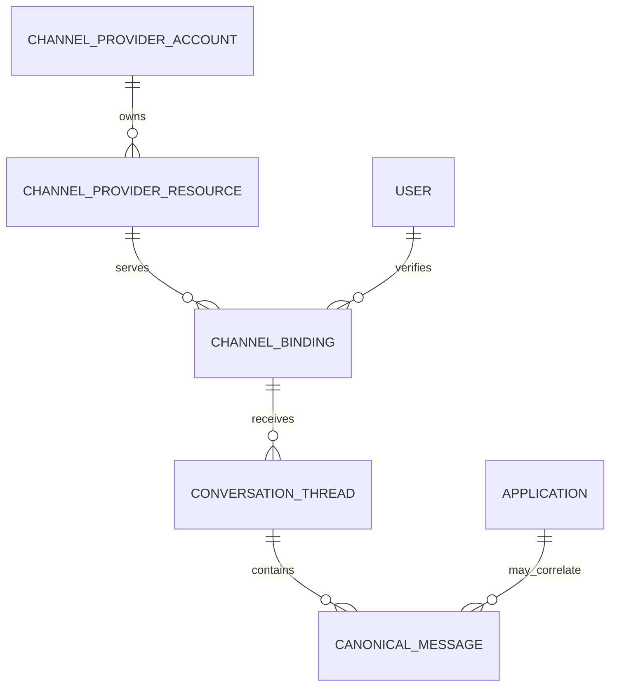
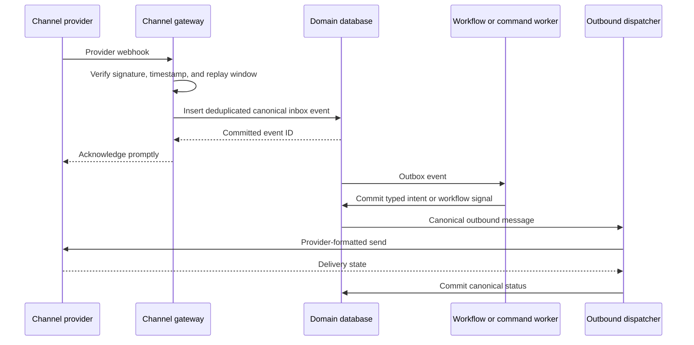
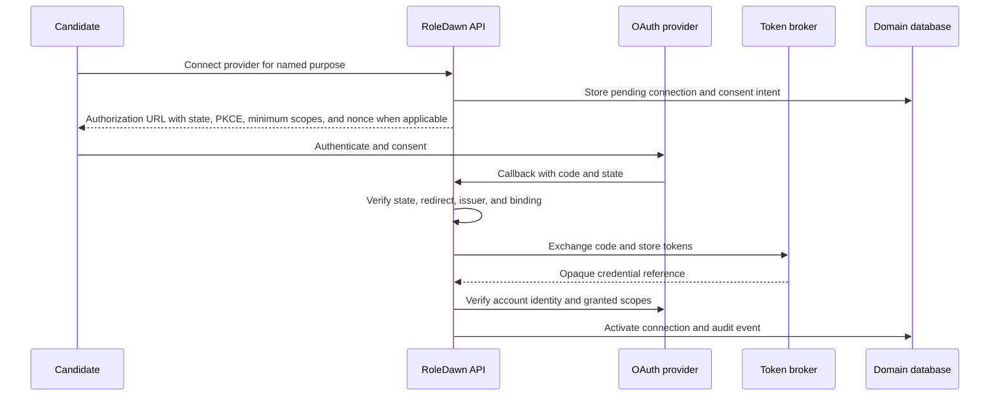

# Integrations and OAuth

## Purpose

RoleDawn needs messaging, browser, email, and later partner integrations without letting any provider own user identity, application state, permission, or secrets. This document defines provider-resource ownership, channel bindings, credential brokering, OAuth, revocation, and build-versus-buy gates.

## Invariants

- A provider account, project, number, token, thread, or delivery receipt is not a RoleDawn user identity.
- A messaging line can serve many users; a user can bind several channels.
- A connection belongs to an authenticated principal and explicit purpose. Tenant membership alone does not grant access.
- Domain state stores opaque credential references, never usable refresh tokens.
- Models never receive passwords, cookies, OTPs, OAuth access tokens, refresh tokens, or provider secrets.
- Tool availability is not authorization for a consequential action.
- Every webhook is authenticated where supported, deduplicated, persisted, and acknowledged before asynchronous work.
- Every provider has a scoped kill switch and an exit path.

## Channel resource versus user binding

Do not model one iMessage number per candidate.



### `channel_provider_resource`

Represents a provider-side line, phone number, sender identity, app, bot, or project resource:

```text
resource_id
provider_account_id
provider
provider_resource_id
allocation: shared_pool / project_dedicated / enterprise_dedicated
display_address or phone number
region and capabilities
capacity policy and cost version
health, suspension, and drain state
created_at / retired_at
```

### `channel_binding`

Represents one verified association between a RoleDawn user and a provider resource:

```text
binding_id
workspace_id / user_id
resource_id
provider sender/recipient identity hash
verification method and verified_at
notification consent version
preferred and fallback status
quiet-hours policy
revoked_at / revoke_reason
```

Provider IDs remain opaque and never substitute for internal user or application IDs.

### Photon alpha interpretation

Source-register entry I06 currently describes Photon as a vendor-dependent alpha option. Its current pricing page says a Business dedicated line is dedicated to one project and can serve all project users. That is different from a line per candidate. Treat published price, capacity, number type, and outreach limits as volatile vendor claims requiring written confirmation.

The alpha may use a provider shared pool or one RoleDawn-dedicated project line. Choose only after testing:

- Who owns and can port the number.
- Whether users initiate the conversation or RoleDawn starts it.
- New-contact, throughput, attachment, and group limits.
- Ordering, at-least-once behavior, delivery/error callbacks, and message IDs.
- Apple/platform authorization and suspension handling.
- DPA, subprocessors, data regions, retention/deletion, security evidence, and incidents.
- Cutover without duplicate messages or identity loss.

## Asynchronous channel ingress



Use provider-specific ingress routes when they simplify key rotation, signatures, payload limits, and incident isolation. Normalize only after verification.

An inbound `YES` becomes an approval only after the deterministic approval service resolves the verified binding, named short code, immutable diff hash, expiry, and unused token. The messaging adapter does not authorize it.

## Outbound message contract

```text
send(canonical_envelope, provider_resource_id, idempotency_key)
  -> accepted / rejected / uncertain

canonical_envelope includes
  internal message ID
  user/binding ID
  optional application/workflow correlation
  template and locale version
  sensitivity and retention class
  fallback policy
```

Persist the canonical message before formatting or sending. Provider delivery does not prove user reading or authorization. Fallback requires explicit user consent and must not spray multiple channels silently.

## Connected-account model

### Domain record

```text
connection_id
workspace_id / owner_user_id
provider
provider_account_subject
credential_ref
approved scopes and purpose
consent version and granted_at
status: pending / active / degraded / revoked / expired
last_refresh_at / expires_at
health and last_error_class
provider configuration version
revoked_at / deletion_completed_at
```

The owner is normally the candidate. A coach, workspace administrator, or support operator does not inherit mailbox or calendar access through workspace membership.

### Token broker

The token broker or managed credential platform:

- Stores access and refresh tokens under envelope encryption or provider-managed equivalent.
- Returns only an opaque `credential_ref` to the domain service.
- Refreshes under a narrow provider-specific worker identity.
- Mints a short-lived capability or performs the API request on behalf of a typed connector tool.
- Enforces owner, provider, scope, purpose, and environment on every use.
- Redacts tokens from logs, traces, analytics, model inputs, support UI, and browser replay.
- Supports immediate revoke, key rotation, provider-wide disable, and deletion evidence.

Do not inject a bearer token into an agent loop or remote MCP server merely because the tool is tenant-scoped.

## OAuth flow



Requirements:

- Own the OAuth client and consent branding where trust or provider policy requires it.
- Request only scopes used by a currently shipped feature.
- Record requested versus actually granted scopes.
- Bind authorization state to one authenticated user, intended provider, redirect, and expiry.
- Use PKCE where the provider supports it.
- Reject callback replay and account-subject mismatch.
- Treat provider webhooks as untrusted until verified.
- Re-consent when purpose or scopes expand.

## Gmail sequence

Gmail is not required for the MVP application loop.

### Phase 0: no mailbox OAuth

- Confirm submission from the portal.
- Let a user manually forward a confirmation when portal evidence is insufficient.
- Evaluate a unique RoleDawn receipt alias only after employer-visible identity, deliverability, abuse, and retention testing.

### Phase 1: send-only, if recruiter follow-up proves valuable

Google currently classifies `gmail.send` as a sensitive scope. It still requires OAuth verification for a public app, but it is different from broad mailbox-reading access. Recheck the [official Gmail scope table](https://developers.google.com/workspace/gmail/api/auth/scopes) before implementation.

### Phase 2: restricted read, only if measured value justifies it

Google currently classifies `gmail.readonly`, `gmail.modify`, `gmail.metadata`, and `gmail.compose` as restricted. If RoleDawn stores or transmits restricted-scope data server-side, an annual third-party security assessment may apply. Verification lead times and requirements change; use the [current Google verification guidance](https://support.google.com/cloud/answer/13464321).

There is no OAuth grant limited to one user-created Gmail label. A query can filter a label, but the token scope remains broader. Do not describe label filtering as scope isolation.

Before restricted read:

- Prove portal-only confirmation is materially insufficient.
- Quantify confirmation/recruiter-response lift.
- Obtain counsel/security approval and complete required verification.
- Minimize content retrieval and retention.
- Exclude unrelated messages from model context, logs, and analytics.
- Give the user visible connection health, recent access, disconnect, and deletion controls.

## Connector tool boundary

Use typed product tools, regardless of whether transport is direct API, managed connector, or MCP:

```text
get_connection_health(connection_id)
search_confirmation_headers(connection_id, application_identity, time_window)
fetch_confirmation_message(connection_id, provider_message_id)
send_approved_recruiter_email(connection_id, artifact_id, approval_id)
revoke_connection(connection_id)
```

The connector service resolves `credential_ref` and executes the provider request. The model sees a sanitized structured result. Search and fetch calls have narrow time, sender, label/query, field, and result limits.

Remote MCP rules:

- Register and pin the server, tool schemas, owner, transport, and auth behavior.
- Allow-list destinations and tool names.
- Treat returned content as untrusted data.
- Do not allow a remote MCP server to consume a RoleDawn approval or obtain a raw token.
- Begin external RoleDawn MCP with read-only status, explanation, and receipt scopes.

## Revocation and incident behavior

### User disconnect

1. Commit `revocation_requested` and stop new connector work.
2. Cancel or park pending connector activities.
3. Revoke the grant at the provider when supported.
4. Delete access and refresh material from the broker.
5. Mark the connection revoked with provider result and time.
6. Delete or expire cached private content according to policy.
7. Confirm the outcome to the user without exposing secret material.

Retries use the same revocation command ID. A provider timeout leaves the connection `revocation_pending`, not falsely revoked.

### Provider incident or compromise

- Disable the provider or affected connector globally.
- Stop token refresh and new authorizations.
- Identify affected connections from broker and audit records.
- Revoke or rotate in a controlled, idempotent job.
- Notify affected users with precise scope and actions.
- Preserve minimal evidence for incident response under disclosed retention.
- Require re-consent before reactivation.

### Lost device or recycled number

Channel binding can be revoked independently of the account and other channels. Moving a number to a new account requires step-up web authentication; possession of the number alone is insufficient.

## Build-versus-buy gates

### Messaging relay

Buy for alpha when a provider passes:

- Written platform authorization/risk explanation.
- Dedicated/shared resource semantics that fit the product.
- Signed events, stable IDs, dedupe, delivery/error callbacks, and replay behavior.
- Number ownership, portability, and exit support.
- Security documentation, DPA, subprocessors, regions, retention, deletion, and incident terms.
- Tested ordering, attachment, opt-out, failure, and PWA fallback behavior.
- Measured cost per active user and message under alpha patterns.

Build or change providers only when measured suspension risk, reliability, capability, compliance, or unit economics justifies it. Do not build a Mac/device fleet merely to avoid an alpha vendor bill.

### OAuth/token broker

Compare direct implementation, Nango, Arcade, Composio, and any later candidate on:

| Gate | Required evidence |
|---|---|
| OAuth-client ownership | Our brand and provider project can be used where required. |
| Credential isolation | Encryption/key custody, tenant/principal binding, no raw-token export to agents. |
| Revocation | Upstream revoke, local deletion, evidence, bulk incident response. |
| Scope fidelity | Requested and granted scopes are visible and enforceable. |
| Security | Independent evidence, penetration history, vulnerability process, incident disclosures. |
| Privacy/compliance | DPA, subprocessors, regions, retention, deletion, restricted-scope support. |
| Reliability | Refresh behavior, rate limits, webhook delivery, retry, SLA, status history. |
| Portability | Export/migration path without forcing every user to reconnect where avoidable. |
| Operations | Audit logs, support, key rotation, environment separation, kill switch. |
| Economics | Fixed and usage cost under measured active connections and API calls. |

No connector count or MCP breadth compensates for failing credential-isolation or revocation gates.

### Current recommendation

- Use Photon only as a bounded messaging alpha behind `ChannelAdapter` if diligence passes.
- Keep the PWA functional without Photon.
- Do not select an OAuth broker before a Gmail or other connection is actually admitted to scope.
- Prefer our own OAuth clients for user-facing production connections.
- Keep secrets out of normal PostgreSQL rows even if Supabase becomes the database/auth provider.
- Revisit build versus buy after one direct provider flow exposes real operational requirements.

## Verification checklist

- Deliver the same provider webhook twice and out of order.
- Rotate webhook signing keys without dropping valid events.
- Rebind a recycled phone number only after step-up authentication.
- Attempt cross-user and cross-workspace connection IDs.
- Confirm no token enters prompt, trace, screenshot, analytics, support UI, or error text.
- Revoke during an active connector call and confirm no later reuse.
- Simulate provider timeout during revoke and preserve `revocation_pending`.
- Disable one provider globally without preventing PWA access.
- Cut over a test binding to another provider without duplicate notification.
- Delete a connection and verify broker, cache, projection, and audit-retention behavior.

Related documents: [channel strategy](../product/channel-strategy.md), [data and trust](data-security-and-trust.md), [system architecture](system-architecture.md), [scale and capacity](scale-cost-and-capacity.md), and [roadmap](../execution/roadmap.md).
