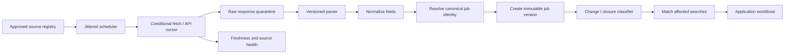

# Job discovery

The [backend operating model](backend-operating-model.md) is the canonical end-to-end context. This document owns the detailed source, identity, freshness, and closure contract.

## Objective

The “night shift” begins before any model writes. RoleDawn needs a reliable, polite, and measurable system that knows which employer sources to watch, notices new or changed requisitions, assigns a stable job identity, and closes stale work before it reaches an application worker.

The launch objective is not the entire internet. It is current coverage of a deliberately selected employer/ATS source registry for the first role families.

## Source hierarchy

Use the most authoritative permitted source available:

1. Official public ATS job API or feed.
2. Official employer career-page feed or structured data.
3. Official employer career-page HTML.
4. User-added employer or job URL using permitted structured data or visible content.
5. Licensed job-data partner with explicit storage, redisplay, attribution, and commercial rights.

Aggregators can suggest a role but do not become the authoritative application snapshot. Resolve the official employer URL before eligibility, drafting, or application.

Do not make LinkedIn scraping, search-engine result scraping, or access-control evasion part of the MVP. A source must pass documented terms/robots/rate review before activation.

## Source registry

Each source record contains:

```text
source_id
employer_id and employer ATS tenant
source_type: greenhouse_api / lever_api / ashby_api / workable_api / employer_feed / employer_html / user_url / licensed_feed
base_url and permitted endpoint pattern
ATS family and tenant identifier
acquisition method and parser version
policy status: allowed / review / disabled
policy evidence URL, reviewer, reviewed_at, review_due_at
robots result where applicable
commercial use, full-text storage, redisplay, and attribution status
application-automation policy status
poll interval, jitter window, and request budget
conditional-fetch cursor: ETag / Last-Modified / API cursor
locale, region, and time zone
last_attempt_at / last_success_at / last_change_at
consecutive failure count and circuit state
owner and notes
```

Source registry changes are audited and deployed through review. A model cannot add a source or increase its request budget.

## Acquisition loop



### Scheduler

- Temporal schedules wake source-poll activities with jitter to avoid synchronized load.
- Poll frequency follows source rate limits, expected posting cadence, terms, and candidate demand.
- Conditional requests and cursors avoid downloading unchanged content.
- Circuit breakers slow or disable failing, blocked, or materially changed sources.
- Backfills and high-frequency monitoring have separate budgets from routine polling.

### Raw capture and parsing

- Store response hash, headers, observed timestamp, URL, status, and parser version.
- Keep raw content only as long as needed for audit/debug and according to source policy.
- Treat all content as untrusted data.
- Parse deterministic structured fields first; use a bounded model only for ambiguous normalized attributes.
- Parser failure never creates a partial “new job” alert without required identity fields.

## Canonical job identity

Preferred identity:

```text
ATS family + employer tenant ID + employer requisition/job ID
```

Fallback identity uses verified employer identity plus canonical employer URL and a stable source-specific ID. A title/location fingerprint can propose a duplicate but cannot silently merge two open requisitions.

Core entities:

- `employer`: canonical company identity and domains.
- `career_source`: one monitored employer/ATS tenant, feed, page, or licensed API.
- `ingestion_run`: one fetch/reconciliation attempt with completeness and anomaly status.
- `source_job_observation`: immutable raw-payload reference and parser inputs.
- `source_job_listing`: provider-scoped listing identity and lifecycle.
- `job`: stable logical requisition.
- `job_episode`: one open/reopen cycle.
- `job_version`: immutable observed representation.
- `job_alias`: source URLs/IDs that resolve to the same job.
- `job_source_event`: first seen, changed, closed, reopened, or source error.

An application binds to one immutable `job_version`, while the UI may show that a newer version exists. A material change in title, location, requirements, compensation, work mode, or authorization invalidates a pending approval.

## Time semantics

Store three different timestamps:

- `source_posted_at`: timestamp asserted by the authoritative source, if present.
- `first_seen_at`: first time RoleDawn observed the requisition.
- `version_observed_at`: time a particular version was captured.

Attach `posted_at_confidence`:

- **authoritative:** stable API/feed field from employer source.
- **derived:** structured page value with reliable parser.
- **unknown:** only `first_seen_at` is known.

Landing/product messages must say “posted 8 minutes ago” only for an authoritative/derived time still inside its validity rules. Otherwise say “first seen 8 minutes ago.”

## Change and closure handling

Classify changes:

- Nonmaterial copy/format update.
- Compensation, location, work-mode, level, requirements, authorization, or question-set change.
- Application URL/ATS migration.
- Closed/removed.
- Reopened.

Closure evidence may come from explicit API state, official page status/404, application endpoint closure, or repeated authoritative absence. One transient fetch failure does not close a job.

When a job closes:

- Stop unapproved drafting/application work.
- Invalidate unused approvals.
- Let an in-progress browser worker reconcile the live portal before continuing.
- Explain the source and timestamp to the user.

## Deduplication

Deduplicate in this order:

1. Exact ATS tenant + requisition ID.
2. Exact official canonical application URL/ID.
3. Verified cross-source alias.
4. Candidate duplicate proposal using employer, normalized title, location, description similarity, and time window.

An identical normalized description hash may support an automatic merge only within the same employer and only when provider/requisition evidence does not conflict. Similarity without exact identity creates a review cluster rather than a silent merge.

Low-confidence proposals go to a merge queue or remain separate. Preserve all source aliases and never lose which posting the candidate approved.

Candidate-level application dedupe remains separate: user + employer tenant + requisition/job ID. A user cannot submit twice simply because the same requisition appeared through two sources.

## User search registry

Each active search defines:

- Role families, title includes/excludes, and level.
- Locations, remote/hybrid/on-site, and relocation.
- Salary bounds when authoritative data exists.
- Employment type and schedule.
- Country-specific authorization/sponsorship constraints.
- Employer/industry include/exclude lists.
- Maximum posting age and daily queue cap.
- Approved source groups or user-added employers.
- Quiet hours and digest schedule.
- Search-policy version.

A job match records which job version and search-policy version produced it. Search edits do not retroactively alter the explanation for an existing queue item; they trigger explicit re-evaluation.

## Matching trigger

New or materially changed job versions are matched first through deterministic constraints. Only eligible candidates receive model-assisted fit scoring. Batch by job/version where possible while keeping candidate evidence isolated.

Do not create an application workflow when:

- The job is closed or source health is uncertain.
- A hard constraint fails.
- Candidate already applied or marked the employer/requisition as duplicate.
- The ATS/application URL is missing.
- The source is disabled or outside reviewed policy.

## Freshness and coverage metrics

| Metric | Definition |
|---|---|
| Source freshness lag | `now - last_success_at` by source and expected poll interval |
| Detection lag | `first_seen_at - source_posted_at` where authoritative timestamp exists |
| Change-detection lag | first observed new version minus authoritative update time, where available |
| Active-source health | sources inside expected success window / enabled sources |
| Parse success | valid normalized job versions / successful changed fetches |
| Identity collision rate | confirmed incorrect merges or splits / job identity decisions |
| Closure precision | correctly closed jobs / jobs classified closed in audited sample |
| Apply-link validity | live valid official application URLs / queued eligible jobs |
| Search coverage | eligible official jobs detected for benchmark employers / known eligible benchmark jobs |

Publish no “50,000 pages monitored” style count until coverage, freshness, and source policy are defined. A smaller healthy registry is more valuable than a large stale one.

## User-added sources

Let users add an official employer career page or job URL. The system:

1. Identifies the employer and ATS.
2. Resolves an existing approved source when possible.
3. Creates a pending source-review record otherwise.
4. Performs one bounded read for preview only when permitted.
5. Never turns a pasted URL into unrestricted crawling.

Show whether a source is monitored, one-time only, pending review, or unsupported.

## Data and consistency

- PostgreSQL owns source registry, normalized jobs, versions, aliases, search definitions, and match records.
- Temporal owns durable poll and matching workflow execution.
- Source/activity results use idempotency keys based on source, cursor/version, and scheduled window.
- An outbox event announces committed job versions to matching workflows.
- A repair job compares source cursors, latest job versions, outbox delivery, and workflow acknowledgments.

See the broader [system consistency contract](system-architecture.md#state-authority-and-consistency-contract).

## MVP rollout

1. Select 100–300 employers relevant to two initial role families.
2. Register official Greenhouse, Lever, Ashby, and Workable sources.
3. Build a benchmark with independently known openings and timestamps.
4. Run read-only for two weeks; measure detection lag, parse accuracy, closure, and duplicates.
5. Enable candidate matching only for healthy sources.
6. Add user-pasted official links with JSON-LD/visible-content provenance and a bounded browser fallback.
7. Pilot a small allowlisted set of Workday tenants; do not market universal support.
8. Compare licensed Adzuna, Lightcast, and LinkUp data against direct ATS truth before selecting a contract.
9. Expand sources through observed candidate demand, not vanity count.

## Safety and policy gates

- Document source terms, robots behavior, rate limits, and review date.
- Identify the service honestly; do not evade blocks or fingerprinting controls.
- Honor explicit access restrictions and deletion/retention requirements.
- Keep public-job data separate from candidate private data.
- Disable a source on legal, platform, or reliability concern through one kill switch.
- Pursue licensed feeds and ATS partnerships as scale increases.
