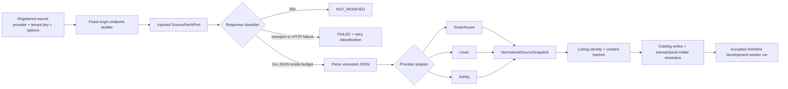
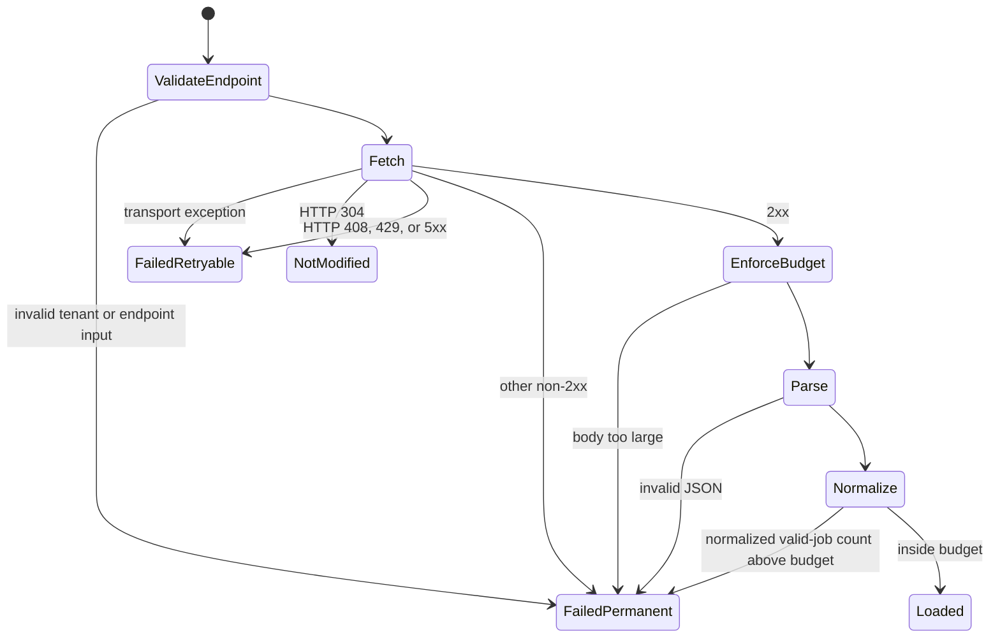
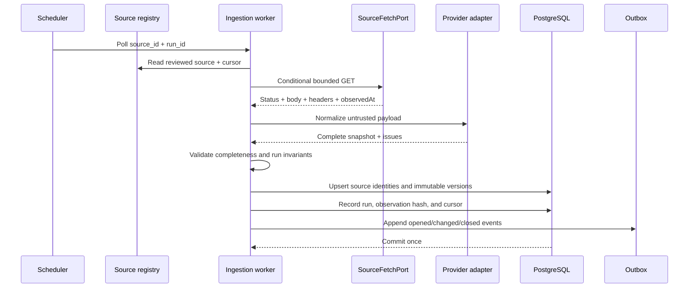

# Job ingestion runtime

## Purpose and current state

This document is the canonical contract for the provider-neutral ingestion module in [`src/server/ingestion`](../../src/server/ingestion). It narrows the broader [job-discovery architecture](job-discovery.md) to behavior that exists in code today and the next production boundary.

- **Verified — implemented:** typed source contracts, fixed-origin endpoint builders, Greenhouse/Lever/Ashby adapters, deterministic normalization, canonical hashes, response classification, a bounded native HTTP port, a one-shot leased outbox worker, catalog persistence, transactional intake resolution, and deterministic tests.
- **Verified live in development:** HireWire acceptance run `20260812135034`
  exercised the server-only worker boundary and completed one official-source
  resolution. All eleven migrations through `20260812134739` are deployed.
- **Verified — not connected:** there is no recurring scheduler, broad source
  registry loop, raw-payload object writer, closure reconciliation, search
  index, packet builder, browser/CUA runtime, or submit path.
- **Recommendation:** keep those concerns outside provider adapters and connect them through narrow ports. The database remains authoritative for source state; the network transport remains replaceable.
- **Open question:** raw-payload retention and redisplay rights must be decided per source before production capture.

The module prepares a normalized source snapshot. It does not itself decide that the snapshot is safe to publish, close missing jobs, merge requisitions, or create candidate matches.

## Runtime boundary



The solid path is implemented and accepted in hosted development. Production
scheduling, packet preparation, browser execution, and submission remain
separate closed gates.

## Module map

| File | Verified responsibility |
|---|---|
| [`contracts.ts`](../../src/server/ingestion/contracts.ts) | Provider discriminated unions, normalized job schema, fetch port, load-result union, and normalization issues |
| [`endpoints.ts`](../../src/server/ingestion/endpoints.ts) | Fixed public ATS origins, tenant-key validation, and bounded Lever pagination inputs |
| [`load-source.ts`](../../src/server/ingestion/load-source.ts) | Transport orchestration, ETag propagation, response limits, JSON parsing, adapter dispatch, and failure classification |
| [`normalize.ts`](../../src/server/ingestion/normalize.ts) | Shared string, HTML-to-text, URL, timestamp, location, employment, workplace, and compensation normalization |
| [`adapters/greenhouse.ts`](../../src/server/ingestion/adapters/greenhouse.ts) | Greenhouse payload-to-canonical mapping |
| [`adapters/lever.ts`](../../src/server/ingestion/adapters/lever.ts) | Lever payload-to-canonical mapping |
| [`adapters/ashby.ts`](../../src/server/ingestion/adapters/ashby.ts) | Ashby payload-to-canonical mapping and URL-derived identity fallback |
| [`canonical.ts`](../../src/server/ingestion/canonical.ts) | Stable JSON serialization, SHA-256 hashing, listing identity, and material job-version projection |
| [`fetch-port.ts`](../../src/server/ingestion/fetch-port.ts) | Fixed-origin native fetch with redirect refusal, timeout, and streamed byte limit |
| [`../workers/application-queued.ts`](../../src/server/workers/application-queued.ts) | One posting resolution, catalog persistence, and transactional intake transition |
| [`../workers/outbox-worker.ts`](../../src/server/workers/outbox-worker.ts) | Leased one-shot claim, acknowledgement, and retry release |
| [`ingestion.test.ts`](../../src/server/ingestion/ingestion.test.ts) | Deterministic fixtures for endpoints, adapters, hashing, transport outcomes, and limits |

## Source contracts

### Registered sources

Every load begins with a reviewed source record represented as a `RegisteredJobSource`:

| Provider | Required input | Optional input | Constructed endpoint |
|---|---|---|---|
| Greenhouse | `sourceId`, `tenantKey` | `includeContent` | `https://boards-api.greenhouse.io/v1/boards/{tenant}/jobs` |
| Lever | `sourceId`, `tenantKey` | `region`, `skip`, `limit` | Global or EU `/v0/postings/{tenant}?mode=json` |
| Ashby | `sourceId`, `tenantKey` | `includeCompensation` | `https://api.ashbyhq.com/posting-api/job-board/{tenant}` |

- **Verified — official documentation:** Greenhouse exposes a public unauthenticated GET list endpoint and `content=true` can include full description, department, and office data. See [source A01](../research/source-register.md#ats-apis-and-partnerships).
- **Verified — official documentation:** Lever exposes global and EU posting endpoints, JSON output, `skip`/`limit` pagination, and only published postings. See [source A04](../research/source-register.md#ats-apis-and-partnerships).
- **Verified — official documentation:** Ashby exposes currently published job postings, optional compensation, hosted/apply URLs, and an `isListed` flag whose false value means direct-link-only. See [source A05](../research/source-register.md#ats-apis-and-partnerships).

Official discovery endpoints do not grant candidate-side submission authority. The ingestion module performs GET-oriented discovery only.

### Injected network port

`SourceFetchPort` is the only network boundary. The caller provides a request implementation and returns status, body, response headers, and `observedAt`. This keeps adapters pure and tests offline.

- **Verified — implemented:** an optional prior ETag is passed to the port as `ifNoneMatch`; a `304` returns `NOT_MODIFIED` without parsing.
- **Verified — implemented:** the port receives an `AbortSignal` and the configured byte budget.
- **Recommendation:** the production port must enforce timeouts, redirect policy, DNS/IP checks, streaming byte limits, a descriptive user agent, and provider-specific rate budgets. The post-fetch byte check is defense in depth, not a substitute for aborting an oversized stream.
- **Recommendation:** keep the fetch port in a worker process, not a client route or browser bundle.

## Normalized snapshot

All three adapters emit `NormalizedSourceSnapshot` with source identity, completeness, valid jobs, and structured issues. Every valid job includes:

- provider, tenant, external identity, and identity basis;
- title, canonical job URL, and apply URL;
- text/HTML description where available;
- normalized locations, department, team, workplace, and employment type;
- requisition/language fields where available;
- source-posted/source-updated timestamps and provenance confidence;
- listing state, compensation components, and observation time.

Required title, canonical URL, apply URL, or external identity failures skip that record and set `complete=false`. Other valid records remain in the returned snapshot.

> **Verified safety boundary:** `LOADED` does not mean publishable. A caller must reject closure and catalog publication when `snapshot.complete` is false unless an explicit reviewed reconciliation policy says otherwise.

### Provider mapping notes

| Provider | Verified implementation | Inference or caveat |
|---|---|---|
| Greenhouse | Uses job-post ID, `absolute_url`, title, content, location, departments, offices, requisition, language, and available timestamps | **Inference:** fields present in payloads but not guaranteed by the current public field table need regression fixtures; missing employment/workplace fields remain `UNSPECIFIED` |
| Lever | Uses documented ID, title, categories, hosted/apply URLs, descriptions, workplace type, country, and salary range | **Inference, labeled in data:** `createdAt` is accepted when observed but was not present in the official field table checked on 2026-08-11, so its confidence is `OBSERVED_UNDOCUMENTED` |
| Ashby | Uses title, locations, department/team, hosted/apply URLs, listing flag, descriptions, timestamps, work/employment type, and compensation | **Verified — direct observation, with safe fallback:** live payloads can include `id`, but the official public field table checked on 2026-08-11 does not document it; the adapter falls back to a SHA-256-derived canonical-URL ID |

Descriptions and provider HTML are untrusted source data. The helper strips tags and executable blocks only when deriving plain text; it does not sanitize stored HTML for browser rendering.

- **Recommendation:** never render `descriptionHtml` without a reviewed sanitizer and restrictive content-security policy.
- **Recommendation:** validate provider-specific hosted/apply domains before passing a normalized URL to any browser-execution worker. The current shared URL validator guarantees public-looking HTTPS syntax, not provider ownership.

## Identity and change detection

Two hashes serve different purposes:

1. `hashSourceListingIdentity` hashes provider + tenant key + external job ID.
2. `hashNormalizedJobVersion` hashes a schema-versioned projection of candidate-material content and application target fields.

The version projection is stable across object-key order, location order, compensation order, and observation-time changes. It includes title, URLs, description, location, department/team, work/employment type, requisition, language, compensation, and provider identity.

It intentionally excludes observation timestamps, source timestamps, posted-time confidence, and listing state.

- **Verified:** changing material projected content changes the content hash; reordering normalized collections or changing `observedAt` does not.
- **Recommendation:** persist listing lifecycle and source timestamps independently. Do not use the content hash alone to infer closure, reopening, or freshness.
- **Recommendation:** version the projection deliberately when adding or changing material fields. Existing hashes use `schemaVersion: 1`.

## Failure and retry semantics



Default limits are 20 MiB per returned body and 5,000 successfully normalized jobs per snapshot.

- **Verified:** `FETCH_FAILED`, HTTP 408, HTTP 429, and 5xx are retryable.
- **Verified:** endpoint validation, other HTTP errors, oversized bodies, invalid JSON, and over-budget normalized snapshots are non-retryable without source/configuration change.
- **Verified:** malformed individual records create issues and an incomplete `LOADED` snapshot; they are not silently treated as a healthy complete snapshot.
- **Recommendation:** add a raw-array record ceiling before per-record normalization. The current 5,000 limit applies to successfully normalized jobs, not the source array's total length.
- **Recommendation:** isolate unexpected adapter exceptions and record the provider, adapter version, source, and redacted failure class without logging full candidate or credential data.

## Production integration contract

The next worker should keep this sequence transactional and idempotent:



- **Recommendation:** acquire one advisory or queue lock per `sourceId`; use a stable `runId` for replay.
- **Recommendation:** store the raw SHA-256 and response metadata even when raw content retention is disallowed.
- **Recommendation:** advance ETag/cursor and source health only in the same transaction that commits the accepted observation.
- **Recommendation:** only a complete healthy snapshot can contribute absence evidence; one failure or incomplete parse cannot mass-close listings.
- **Recommendation:** treat an unexpected zero-count snapshot or large count drop as an anomaly requiring another healthy observation or review before closure.
- **Recommendation:** emit catalog changes through a transactional outbox so matching cannot observe a version the database failed to commit.
- **Open question:** choose poll cadence, raw retention, and full-text redisplay per provider policy and measured source demand.

## Operations and tests

Run the complete domain and ingestion suite:

```bash
npm test
```

Run static validation:

```bash
npm run typecheck
npm run lint
```

The ingestion tests use injected fixtures and make no live network requests. They currently cover:

- fixed provider origins and invalid tenant inputs;
- deterministic Greenhouse, Lever, and Ashby normalization;
- incomplete snapshots for malformed records;
- Ashby URL-derived identity fallback;
- canonical hash stability and material-change sensitivity;
- ETag propagation and `304` behavior;
- retry classification, raw-payload hash, and configured limits.
- direct Greenhouse, Lever, and Ashby URL classification without arbitrary-host fetching;
- official single-post resolution for Greenhouse and Lever;
- exact-job selection from Ashby's board-level public feed;
- fixed-origin native fetch enforcement and bounded response streaming.

## Direct pasted-link resolver

**Implemented:** `parseSupportedJobReference` recognizes only official hosted job URLs from Greenhouse, Lever, and Ashby. `buildSingleJobEndpoint` converts those references into fixed-origin public API requests. A user-supplied hostname never becomes the fetch target.

**Implemented:** the first preparation worker claims `application.queued`, resolves the official posting, writes the provider source/listing/job and immutable job version, then calls a service-only intake command. Unsupported ATS links fail safe with an explicit code. They are not passed to a generic privileged fetcher.

**Verified live in development:** the worker SQL and server-only boundary are
deployed in HireWire. Hosted acceptance run `20260812135034` claimed one
`application.queued` message, resolved one official Greenhouse posting,
persisted its immutable catalog version, acknowledged the message, and created
no receipt. This proves the narrow resolver only; it is not a scheduled broad
catalog service or application-preparation worker.

Provider behavior verified against primary documentation on 2026-08-11:

- Greenhouse exposes one public job with `GET /v1/boards/{board_token}/jobs/{job_id}` and optional questions/pay transparency fields.
- Lever exposes one public posting with `GET /v0/postings/{site}/{posting-id}`.
- Ashby exposes published jobs at the board level; RoleDawn fetches that fixed endpoint and selects the exact URL/ID locally.

Before enabling a source in production, add a redacted contract fixture captured under its permitted use, test the adapter version against that fixture, and run a shadow ingestion that writes no catalog changes. Live endpoint checks are operational probes, not unit tests.

## Definition of production-ready

This runtime becomes a production ingestion service only when all of the following are true:

- reviewed source records and policy evidence exist in the database;
- the fetch port enforces network, timeout, redirect, rate, and byte controls;
- raw and normalized observations are provenance-linked;
- completeness gates and closure safeguards are transactional;
- adapter/parser versions are stored with every run;
- metrics cover freshness, parse success, anomalies, collisions, and closures;
- replay, backfill, circuit-breaker, and dead-letter procedures are tested;
- no ingestion path can authorize or claim an application submission.

Until then, this is a tested normalization runtime—not a deployed job catalog.
