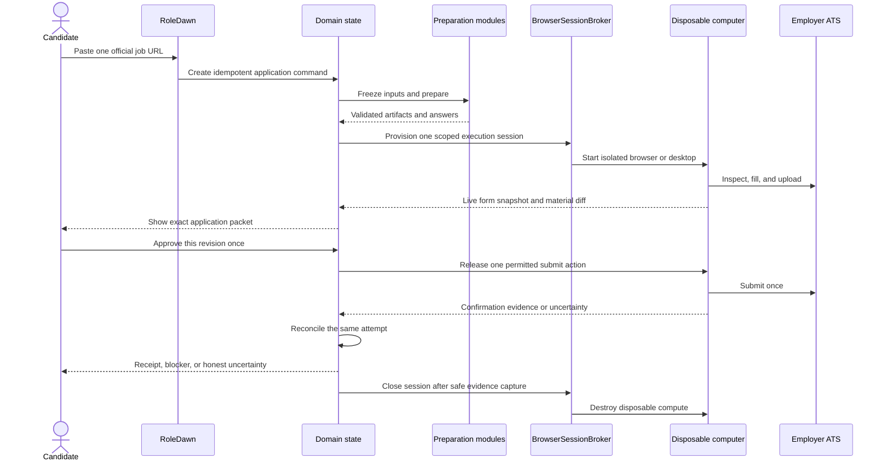

# Pasted-link application engine

## Product decision

The first backend vertical slice should productize the founder's proven workflow:

> Paste a job link. RoleDawn prepares a truthful application, fills the employer form in an isolated computer, asks for one precise approval, submits once, and returns proof.

The interface should feel like one command. The reliability work stays behind it.

```ts
type ApplyToJobCommand = {
  commandId: string;
  candidateId: string;
  jobUrl: string;
  tailoringMode:
    | "AS_UPLOADED"
    | "REORDER_AND_TIGHTEN"
    | "REWRITE_FROM_VERIFIED_FACTS";
};
```

**Invariant:** accepting this command authorizes preparation. It does not authorize submission. Submission requires a later single-use approval tied to the exact immutable packet that now exists.

This slice comes before broad automated job ingestion. The pasted URL still creates or resolves a canonical job, job episode, and immutable job version, so the shared catalog does not need a second model later.

## The consumer experience



The Queue exposes only the useful states: **Preparing**, **Needs you**, **Ready**, **Applying**, **Reconciling**, **Submitted**, **Could not confirm**, or **Stopped**. Provider IDs, workflow IDs, and attempt IDs remain available for support and audit but stay out of ordinary candidate copy.

## One orchestrated workflow, bounded modules

The product is not a mutable folder of prompt files and not a free-running agent with every tool. It recreates the useful behavior of the existing research, resume, cover-letter, application-answer, and writing-quality workflows as licensed, versioned product modules.

| Module | Input authority | Output | Hard gate |
|---|---|---|---|
| Job intake | Visible official page, structured data, source policy | Immutable job version | Source and freshness recorded |
| Company research | Dated, cited sources | Research bundle | Unsupported or stale claims omitted |
| Evidence selection | Approved Career Vault facts and usage policy | Application-scoped evidence packet | Exact and sensitive facts resolve to structured records |
| Resume preparation | Job version, evidence packet, tailoring mode | Structured resume content | No unsupported material claim |
| Cover-letter preparation | Job version, research, evidence, voice policy | Structured letter content | Claim ledger and no-slop review pass |
| Application answers | Form schema and approved answer policies | Provenance-linked answer set | Unknown legal, sensitive, or certification answers pause |
| Rendering | Validated structured content and templates | PDF/DOCX plus hashes | Text, overflow, page, and visual QA pass |
| Form execution | Immutable packet and scoped session | Filled draft and live read-back | No consequential action before approval |

Every module receives immutable references and returns a typed result. Models may research, interpret, select, draft, and propose. They may not grant permission, invent a missing fact, expose credentials, or declare that submission succeeded.

## Immutable application packet

Before the candidate can approve, RoleDawn freezes one packet containing:

- candidate, job episode, and job version;
- Career Vault fact versions and application-scoped evidence packet;
- research bundle and source versions;
- preparation-module, prompt, model-route, validator, renderer, and policy versions;
- exact resume and cover-letter object hashes and filenames;
- every form answer with provenance and candidate disposition;
- form snapshot, adapter version, live field read-back, and material diff;
- unresolved warnings, blockers, and required human actions; and
- packet hash, expiry policy, and intended action.

Any material change creates a new packet version and invalidates the old approval. Model conversation history, browser memory, and screenshots are evidence inputs at most; none is the packet authority.

## Disposable computer boundary

`BrowserSessionBroker` is the owned interface between RoleDawn and any managed browser or full-computer provider. The domain stores RoleDawn session IDs and opaque provider references, never vendor-specific workflow semantics.

**Verified vendor documentation:** Cua documents an SDK for local or cloud sandboxes with screen, mouse, keyboard, clipboard, shell, terminal, window, and tunnel interfaces. Its `Sandbox.ephemeral(...)` context is documented to destroy the sandbox automatically on exit. Cua also describes the model as belonging to the agent while Cua supplies the isolated computer. See [B08](../research/source-register.md) and [B09](../research/source-register.md).

**Recommendation:** add Cua Sandbox to the managed-computer benchmark behind `BrowserSessionBroker`. Cua is not selected. Benchmark its actual lifecycle isolation, browser-profile behavior, live-view/takeover path, secret handling, regional availability, concurrency, observability, support, latency, and accepted-output cost against the other candidates.

An execution session receives only:

- the allowlisted employer and identity-provider domains needed for this attempt;
- the immutable application packet or narrowly scoped artifact downloads;
- short-lived credential capabilities from the token broker; and
- the minimum interaction tools permitted for the current state.

Use deterministic ATS adapters and Playwright first. Escalate to semantic DOM reasoning, then visual computer use, only when the known path fails. CAPTCHA, OTP, passkey, unexpected login, ambiguous certification, or unknown sensitive questions pause for secure candidate takeover; RoleDawn does not solve or bypass them.

### Safe teardown

"Destroy the computer" is the normal end state, not permission to erase evidence prematurely.

1. Capture the final page state, response metadata, URLs, timestamps, and available external identifiers.
2. Commit the attempt result and required redacted audit evidence outside the session.
3. If the outcome is uncertain, reconcile the same attempt without another submit action. Suspend or retain only the minimum session state needed by the bounded recovery policy.
4. Close and destroy disposable compute when confirmation, safe failure, cancellation, timeout, or evidence-preserving teardown permits it.
5. Keep any approved persistent ATS profile encrypted and isolated by candidate and ATS tenant; never treat a disposable VM disk as the durable profile store.

## First vertical slice versus production

The architecture is the production destination. The first implementation intentionally proves one narrow thread.

| Concern | First vertical slice | Production target |
|---|---|---|
| Intake | One pasted, allowlisted official URL | Pasted links plus approved shared job-source registry |
| ATS terrain | Greenhouse, Lever, and Ashby fixtures; one adapter at a time in shadow mode | Versioned adapters with measured tenant coverage |
| Preparation | One versioned path for research, evidence, resume, letter, and answers | Task-level model routing and promoted module releases |
| Execution | Brokered session that inspects, uploads, and fills; no autonomous final action | Controlled submit only after adapter/version graduation |
| Approval | Web review of one immutable packet | Same contract through web or replaceable messaging channels |
| Recovery | Deterministic failure fixtures and same-attempt reconciliation tests | Durable workflow, provider events, support tooling, and SLOs |
| Tenancy | Authenticated server-side candidate state with synthetic evaluation fixtures first | PostgreSQL tenant isolation, encrypted object storage, brokered credentials, deletion/export |
| Supply | No automatic broad catalog required to prove value | Shared catalog, Browse, Swipe, matching, and freshness controls |

### The first external-side-effect gate

The initial runnable boundary is **filled draft ready for candidate action**, not unattended submission. A candidate may perform the final click during shadow/concierge testing. RoleDawn may perform that click only after the adapter version passes the form benchmark, the immutable approval transaction and attempt idempotency are tested, and confirmation reconciliation works under failure injection.

The first slice does not need iMessage, standing authorization, model fine-tuning, a self-hosted browser fleet, broad job feeds, or multiple browser providers in production. Those should not block proof that one pasted link can become one high-quality, reviewable application packet and one safely controlled form run.

## Production scaling shape

Do not run a permanent agent or computer per candidate.

- PostgreSQL retains candidate truth, policy, application state, approvals, attempts, and receipts.
- One durable workflow exists per queued application once external waits and browser work are active.
- Shared preparation and execution workers wake on demand.
- One disposable computer is provisioned per bounded execution attempt; concurrency and cost reservations limit fleet growth.
- Model and computer providers remain replaceable behind `ModelAdapter`, `AgentRuntime`, `InteractionDriver`, and `BrowserSessionBroker`.
- Durable objects and domain records outlive the model run and computer session.

This is why the backend looks more complex than the consumer command: the user sees one action, while the system preserves truth, permission, at-most-once execution, and recoverable proof.

## Acceptance criteria

The pasted-link engine is ready for controlled external testing only when:

- the same command cannot create duplicate applications or attempts;
- every generated material claim has approved support;
- unknown sensitive, legal, and certification answers block progress;
- a packet change invalidates its approval;
- only the named, unexpired, unused approval can release one submit action;
- a worker crash near Submit enters reconciliation instead of retrying;
- **Submitted** requires stored confirmation evidence;
- the candidate can pause, stop, take over, export, and delete within the documented policies;
- credentials and protected answers are absent from prompts, normal traces, screenshots, and support views; and
- session teardown is proven without losing the receipt or required recovery evidence.

Related authority: [backend operating model](backend-operating-model.md), [ATS automation](ats-automation.md), [data, security, and trust](data-security-and-trust.md), [model routing and evals](model-routing-and-evals.md), and [decision log D-040](../execution/decision-log.md).
