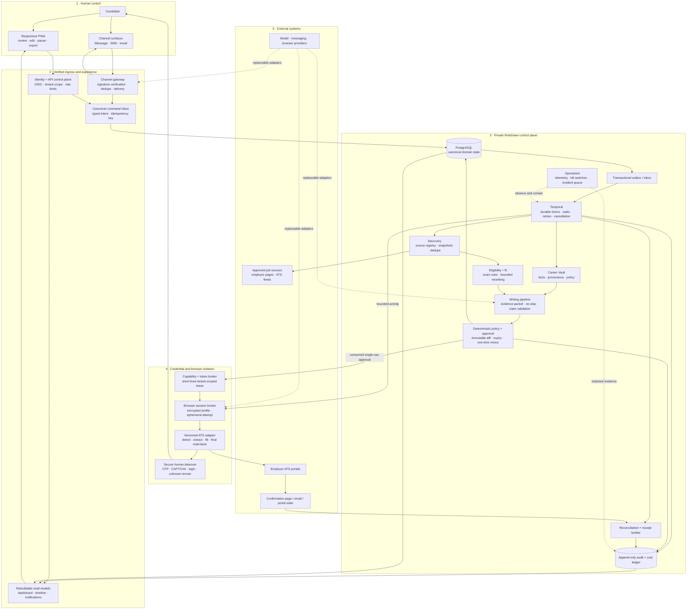

# RoleDawn system architecture map

The editable canvas is [`roledawn-system-architecture.excalidraw`](roledawn-system-architecture.excalidraw). Import it into Excalidraw with **Open → Open from device**, then ungroup a trust zone if you want to rearrange its individual components. The [backend operating model](backend-operating-model.md) contains the deeper job-catalog, candidate-relation, preparation, model, browser, and vendor diagrams added after this trust-zone overview.

This map explains the current recommended system to a founder. It does not create a new architecture decision. When this page or the canvas conflicts with the [decision log](../execution/decision-log.md), the newest accepted decision wins.

## The system in one sentence

RoleDawn receives a verified candidate command, commits it to durable domain state, lets a durable workflow coordinate bounded workers, requires deterministic approval for one immutable application, executes through an isolated ATS adapter, and reports success only when confirmation evidence exists.

It is not one always-running agent, browser, container, inbox, or phone number per candidate.

## GitHub-rendered system map

Solid arrows carry committed commands, bounded work, or confirmation evidence. Dashed arrows mark provider abstractions or operational observation. The only path to an employer-facing side effect crosses deterministic policy, a consumed single-use approval, a short-lived credential lease, and a final live read-back.

## How to read the canvas

The diagram moves left to right through five trust zones:

| Trust zone | What belongs there | What it may not own |
|---|---|---|
| Human control | Candidate identity, review, approval, pause, cancel, and takeover | Workflow state or provider delivery state |
| Verified ingress and experience | Web and messaging authentication, deduplication, typed commands, read APIs, and outbound delivery | Long-running work or submission authority |
| Private RoleDawn control plane | Domain state, workflows, matching, writing, policy, reconciliation, proof, projections, and operations | Raw provider credentials |
| Credential and browser isolation | Credential leases, browser sessions, ATS adapters, and takeover capabilities | Candidate policy or self-granted authority |
| External systems | Messaging providers, official job sources, employer ATS portals, and confirmation pages or messages | RoleDawn instructions, approval, or canonical truth |

The colors carry meaning:

- Blue: durable authority or encrypted records.
- Purple: replaceable workers and provider-neutral routes.
- Yellow: deterministic or human gates.
- Coral: external side effects and uncertain terrain.
- Green: human authorization or confirmed proof.
- Dashed outlines or paths: open vendor choices, credential leases, operational control, provider bridges, or takeover exceptions.

## Numbered flow

1. **Direct.** The candidate sets rules, reviews work, or sends a command from the PWA or a verified channel.
2. **Verify and deduplicate.** Ingress authenticates the provider event, resolves the verified binding, persists a canonical inbox event, and acknowledges promptly.
3. **Commit.** The API authorizes the principal and writes a typed domain command to PostgreSQL with an idempotency key and expected aggregate version.
4. **Orchestrate.** A transactional outbox event signals the named Temporal workflow. Temporal owns timers, waits, retries, cancellation, and replay—not candidate facts or approval.
5. **Find and match.** Discovery fetches an approved public source once, creates an immutable job version, retrieves potentially eligible searches through indexes, runs exact rules, and reranks only a bounded survivor set.
6. **Draft and check.** Writing workers receive the smallest permitted evidence packet. They draft with fact references, run the RoleDawn-owned no-slop policy, and fail validation on unsupported claims.
7. **Validate scope.** Deterministic policy builds one immutable pre-submit package and approval challenge. A model or webpage cannot grant authority.
8. **Approve once.** The candidate approves one named application revision. The approval binds the user, application, job version, material diff, artifact and policy versions, permitted action, expiry, and one-time nonce.
9. **Lease and execute.** After approval is consumed, the workflow requests a narrow credential capability and an isolated browser lease. Tokens never enter prompts, ordinary domain rows, screenshots, analytics, or normal logs.
10. **Submit once.** A versioned ATS adapter performs a final read-back, validates the immutable package, records one attempt identity, and makes at most one submit action at the consequential boundary.
11. **Reconcile.** Visible confirmation becomes evidence. Missing or conflicting evidence enters reconciliation under the same attempt ID; the system does not retry blindly.
12. **Prove and report.** The receipt builder, redacted append-only ledger, and rebuildable read models produce an honest customer timeline and notification. The UI says “submitted” only for confirmed evidence.

## The three authorities

These stores are complementary, not interchangeable:

| Authority | Owns | Does not own |
|---|---|---|
| PostgreSQL domain model | Candidate facts, policy, consent, jobs, application state, approvals, attempts, receipts, and domain events | Workflow retry history or raw secrets |
| Temporal workflow history | Timers, activity attempts, waits, signals, cancellation, and replay | Customer-facing truth, approval policy, or receipts |
| Append-only audit and cost ledger | Consequential proof, actors, versions, evidence references, latency, and cost attribution | Mutable application state |

Dashboard counts, notification timelines, model memory, chat history, browser replay, and provider delivery receipts are derived or contextual. None can authorize a side effect.

## Failure-safe loops

- **Material change:** a new answer, artifact, job version, portal field, certification, expiry, or takeover invalidates the existing approval.
- **OTP, CAPTCHA, login, or unknown certification:** the adapter checkpoints safely and issues a short-lived human-takeover capability. It never bypasses access controls.
- **Network loss near Submit:** the application enters reconciliation before any retry.
- **Provider outage:** the workflow remains durable; the PWA stays available; scoped kill switches stop the affected provider or adapter.
- **User pause or cancellation:** safety commands receive priority and are observed before the next consequential boundary.
- **State divergence:** repair work redelivers missing outbox events or opens an incident. It does not rewrite history or invent confirmation.

## Vendor status shown on the diagram

The architecture owns contracts before SDKs. Current choices that remain open include:

- Managed identity and the initial PostgreSQL host; Supabase is a benchmark candidate, not an authority decision.
- Primary and escalation model routes; model providers remain behind `ModelAdapter` and task-specific release gates.
- Managed browser provider.
- Token-broker buy versus build.
- Photon production readiness; it is a bounded iMessage-alpha candidate behind `ChannelAdapter`.
- Operational telemetry vendor.

Temporal is the current recommended workflow engine and is labeled accordingly. The database/workflow/ledger ownership contract must survive any vendor change.

## Canonical detail

- [Frontend-to-backend contract](frontend-backend-contract.md) — Queue-first screens, reads, commands, events, states, and backend ownership.
- [Implementation handoff](../execution/implementation-handoff.md) — build order, domain contracts, release gates, and alpha definition.
- [System architecture](system-architecture.md) — service boundaries, consistency contract, state ownership, recovery, and scaling stages.
- [Scale, cost, and capacity](scale-cost-and-capacity.md) — bounded work, queues, reservations, backpressure, and overload behavior.
- [Integrations and OAuth](integrations-and-oauth.md) — channel identity, asynchronous ingress, token brokering, OAuth, revocation, and vendor gates.
- [Job discovery](job-discovery.md) — approved source registry, stable job identity, parsing, freshness, closure, and deduplication.
- [ATS automation](ats-automation.md) — adapter ladder, final read-back, submission transaction, confirmation states, fixtures, and takeover.
- [Data, security, and trust](data-security-and-trust.md) — data classes, consent, approval payload, threat model, receipts, retention, and support access.
- [Model routing and evals](model-routing-and-evals.md) — typed task routes, context limits, tools, evaluation, release gates, and provider abstraction.
- [Evidence and writing policy](../product/evidence-and-writing-policy.md) — truth and taste gates for application materials.
- [Channel strategy](../product/channel-strategy.md) — the dashboard as canonical surface and messaging as a portable control layer.

## What to change in Excalidraw

Use the canvas for discussion and sequencing, but keep these invariants intact when moving boxes:

1. Webhooks commit before asynchronous work begins.
2. Models never sit on the authorization or secret path.
3. Approval is single-use and tied to one immutable diff.
4. The browser and ATS adapter remain isolated from ordinary application services.
5. Confirmation reconciliation sits between a submit attempt and a customer-visible receipt.
6. Human takeover remains available without exposing credentials to support or model context.
7. Open providers stay labeled as open until evidence and the decision log select them.
