# Scale, cost, capacity, and admission control

## Purpose

RoleDawn must stay available, safe, and economically bounded as sources, users, matches, and browser attempts grow. This document defines the workload shape, formulas, queues, admission rules, and scale gates.

Every numeric alpha value below is labeled **Hypothesis**. It is a planning input, not a verified benchmark, service-level commitment, product claim, or pricing validation. Replace it with measured p50, p75, p95, and worst-case values during staff dogfood and the concierge alpha.

## Workload principle

Fetch and interpret public facts once. Apply deterministic filters before candidate-specific model work. Reserve expensive drafting and browser capacity only for the small set of jobs likely to enter a user's queue.

```mermaid
flowchart LR
    S["Approved source schedule"] --> F["Fetch once globally"]
    F --> V["Immutable JobVersion"]
    V --> I["Public feature and retrieval index"]
    I --> C["Retrieve potentially eligible searches"]
    C --> H["Exact hard-rule evaluation"]
    H --> R["Bounded fit rerank"]
    R --> K["Top-K under user queue cap"]
    K --> D["Evidence and drafting"]
    D --> A["Approval"]
    A --> B["Browser execution"]
    B --> X["Confirmation or reconciliation"]
```



Never implement `new job versions × all active candidates` as a model-scored cross product.

## Alpha capacity assumptions

| ID | Hypothesis | Planning value | How to replace it |
|---|---|---:|---|
| H-CAP-01 | Maximum active alpha users | 25 | Count users with an active search in the prior seven days. |
| H-CAP-02 | Enabled employer/ATS sources | 300 | Count healthy enabled source records. |
| H-CAP-03 | Mean source poll interval | 60 minutes | Measure scheduled interval by source class and policy. |
| H-CAP-04 | Mean HTTP requests per poll | 1.5 | Measure requests including pagination and detail fetches. |
| H-CAP-05 | New or materially changed job versions per day | 1,500 | Count committed material `job_version` events. |
| H-CAP-06 | Potentially eligible searches retrieved per changed job | 10 | Measure retrieval candidate count before exact hard rules. |
| H-CAP-07 | Model-assisted fit evaluations per user per day | 30 | Count accepted fit tasks after hard filters and dedupe. |
| H-CAP-08 | Prepared applications per active user per day | 3 | Measure queue items reaching draft review. |
| H-CAP-09 | Authorized submit attempts per active user per day | 2 | Measure consumed single-use approvals. |
| H-CAP-10 | Browser minutes per authorized attempt, p75 | 8 minutes | Record provider session time including bounded recovery. |
| H-CAP-11 | Messages delivered or received per active user per day | 12 | Count canonical inbound/outbound messages, excluding provider retries. |
| H-CAP-12 | Browser concurrency cap | 5 sessions | Benchmark provider capacity, spend, and support coverage. |
| H-CAP-13 | Internal operations review time per prepared application, p75 | 4 minutes | Time staff review during alpha. |
| H-CAP-14 | Raw changed-source response retention | 14 days | Replace after source-policy, debugging, and counsel review. |

These values intentionally describe a controlled alpha, not the eventual market. A plan is invalid if it needs higher volume to make the first cohort look successful.

## Capacity formulas

### Discovery requests

For source `s` with polling interval `P_s` minutes and `R_s` mean requests per poll:

```text
fetch_requests_per_day = SUM_s(CEIL(1440 / P_s) × R_s)
```

Illustrative hypothesis using H-CAP-02 through H-CAP-04:

```text
300 sources × 24 polls/day × 1.5 requests/poll
= 10,800 requests/day
```

This is a capacity example, not permission to send that traffic. Per-source terms, rate limits, conditional requests, freshness need, jitter, and request budgets override the average.

### Matching work

```text
retrieval_candidates_per_day
= SUM_job_version(retrieved_active_searches(job_version))

exact_eligibility_checks_per_day
= retrieval_candidates_per_day

fit_model_calls_per_day
<= active_users × fit_evaluation_cap_per_user

prepared_applications_per_day
<= active_users × prepared_queue_cap_per_user
```

Illustrative hypothesis:

```text
1,500 changed job versions × 10 retrieved searches
= 15,000 deterministic eligibility checks/day

25 users × 30 fit evaluations
= no more than 750 model-assisted fit tasks/day

25 users × 3 prepared applications
= no more than 75 prepared applications/day
```

The retrieval and exact-filter stages absorb most fan-out without model tokens.

### Browser work

```text
browser_minutes_per_day
= authorized_attempts × mean_attempt_minutes
 + reconciliation_attempts × mean_reconciliation_minutes
 + explicitly_budgeted_preview_minutes

mean_browser_concurrency
= browser_minutes_per_day / browser_service_minutes_per_day
```

Illustrative hypothesis before reconciliation overhead:

```text
25 users × 2 attempts/user/day × 8 minutes
= 400 browser minutes/day
```

Burst capacity, ATS concentration, login/CAPTCHA waits, and retries matter more than the daily mean. Human-takeover wait time must not hold an expensive active browser when the state can be safely checkpointed.

### Messaging line economics

```text
line_cost_per_active_user
= monthly_line_cost / active_users_bound_to_line
```

Use the current provider quote only as a dated vendor input. A project-dedicated line shared by many verified bindings can be viable; a paid dedicated line per candidate cannot be assumed to fit consumer pricing.

### Variable cost per outcome

```text
variable_cost_per_confirmed_application
= (
    model_cost
  + browser_and_proxy_cost
  + workflow_and_message_cost
  + variable_storage_and_egress
  + payment_fees
  + variable_support_labor
  + credits_and_refunds
  ) / confirmed_applications

gross_margin
= 1 - (variable_cost / recognized_revenue)
```

Report cost by user, plan, ATS, adapter version, model route, and outcome. A cheap token that creates retries or support work is not a cheaper route.

### Budget reservation

Before an expensive activity:

```text
estimated_activity_cost
= route_estimate + browser_estimate + expected_retry_reserve

admit only if
  user daily cap remains
  AND plan allowance remains
  AND tenant dollar cap remains
  AND provider/ATS queue has capacity
  AND global incident policy permits work
```

Commit a reservation with an idempotency key. On completion, settle actual cost and release the remainder. On cancel or timeout, release safely. Concurrent workers may not overspend the same allowance.

## Matching architecture

### Stage 1: global public work

- Fetch one approved source globally.
- Parse deterministic ATS fields first.
- Resolve employer, requisition, URL, and immutable job version.
- Derive reusable public features once: role family, level, locations, work mode, employment type, salary evidence, authorization language, and requirements.
- Optionally compute one public job embedding per job/model version.

### Stage 2: candidate generation

Retrieve active searches through indexed hard dimensions:

- Country and permissible work location.
- Role-family/title taxonomy and level.
- Remote, hybrid, or on-site rule.
- Employment type and schedule.
- Employer/industry inclusion or exclusion.
- Sponsorship/authorization rule where explicit.
- Posting age and source group.

Candidate generation may be implemented in PostgreSQL first. A search or vector service becomes justified only when measured query latency, write volume, or recall requires it.

### Stage 3: exact eligibility

Run deterministic checks against the exact job and search-policy versions. A model may interpret ambiguous job language into a typed proposal, but deterministic policy applies the result.

### Stage 4: bounded rerank

- Rerank only survivors.
- Enforce a per-user evaluation budget.
- Retain missing evidence and uncertainty, not just a score.
- Do not use a fit score as eligibility or permission.
- Generate narrative explanation only for queue candidates.

### Stage 5: queue admission

Admit only when the job is fresh, source is healthy, application URL is valid, user has not applied, daily queue capacity remains, and the estimated work budget is available.

## Queue topology

| Queue | Partition/fairness key | Priority rule | Consequential side effect? |
|---|---|---|---|
| Channel ingress | Provider and binding | Security/opt-out, approval, user command, then chat | No; commits commands only |
| Source fetch | Source/ATS/region | Due time, freshness breach, then backfill | No |
| Parse and identity | Parser version/ATS | New changed content before backfill | No |
| Candidate retrieval | Job version/region | Fresh job versions first | No |
| Fit and drafting | User and task risk | Needs-user and approved queue caps before speculative work | No |
| Browser execution | ATS, user, region | Approved attempts, takeover resume, then bounded preview | Yes |
| Reconciliation | ATS and submit attempt | Highest operational priority | Resolves uncertain side effect |
| Notifications | User/channel | Security and takeover, then approvals, then digest | External message only |

Use weighted fair scheduling so one tenant, ATS, or high-volume source cannot starve others. Maintain separate concurrency and dollar limits by user, tenant, ATS, provider, and global environment.

## Admission rules

### Reject before enqueue

- Disabled or policy-review source.
- Closed/stale job or unhealthy source beyond its freshness budget.
- Hard-rule failure.
- Missing canonical employer, requisition identity, or application URL.
- Candidate/requisition duplicate.
- User pause, deletion, expired consent, or plan suspension.
- Queue/day/dollar cap exhausted.

### Pause before expensive work

- Model route outside its promoted version or privacy policy.
- Adapter outside validated version range.
- Provider budget or concurrency pressure.
- Missing exact fact needed for a material artifact.
- Pending job version change.

### Reject before consequential work

- No current immutable approval.
- Approval hash, policy, artifact, answer, or job version changed.
- Unknown certification or sensitive answer.
- CAPTCHA, login, OTP, or blocked portal state.
- Existing uncertain submit attempt not reconciled.

## Alpha operating gates

All numeric thresholds in this section are **Hypotheses** until measured. Safety invariants are requirements, not averages.

| Gate | Hypothesis or invariant | Required response when missed |
|---|---|---|
| Unauthorized submissions | **Invariant:** zero | Stop all submit workers and open an incident. |
| Duplicate confirmed submissions | **Invariant:** zero | Stop affected adapter; reconcile and add regression fixture. |
| Unsupported submitted claims | **Invariant:** zero | Stop affected writing route and revalidate cohort. |
| Confirmed receipt coverage | **Invariant:** 100% of customer-visible confirmed applications | Show `Reconciling` or `Unknown`; never synthesize success. |
| Healthy-source freshness | **Hypothesis:** p95 within 2× configured interval | Slow expansion; repair source or adjust honest freshness copy. |
| Channel command persistence | **Hypothesis:** p95 under 2 seconds | Fail over to PWA status and investigate ingress/outbox. |
| Approval acknowledgement | **Hypothesis:** p95 under 5 seconds | Show durable pending state; do not ask user to approve twice. |
| Pause/cancel effectiveness | **Hypothesis:** committed within 5 seconds and observed before next consequential boundary | Freeze work and inspect signal/outbox divergence. |
| Browser queue age for approved attempts | **Hypothesis:** p95 under 10 minutes | Reduce admissions or add bounded capacity. |
| Browser concurrency utilization | **Hypothesis:** alert above 70% for 15 minutes | Shed speculative previews; preserve approved/reconciliation work. |
| Variable cost | **Hypothesis:** p75 below the plan margin gate in GTM | Reduce allowance, narrow terrain, raise price, or remain concierge. |
| Internal review capacity | **Hypothesis:** p75 no more than 4 minutes per prepared application | Do not add users until failure sources are reduced. |

## Overload behavior

Degrade in this order:

1. Stop backfills and low-priority source expansion.
2. Delay low-fit explanation and speculative drafting.
3. Tighten per-user queue caps.
4. Preserve approvals, pause/cancel, takeover, reconciliation, and receipts.
5. Disable a failing ATS/provider through its kill switch.
6. Stop new admissions rather than allowing silent queue growth.

Never degrade approval validation, deduplication, sensitive-answer policy, confirmation evidence, or reconciliation.

## Temporal scale rules

- Model, network, database, and browser calls run in activities, never workflow code.
- Workflow histories carry identifiers and hashes, not resumes, screenshots, or large model outputs.
- Use stable workflow IDs for applications and source schedules.
- Heartbeat and make long activities cancellable.
- Use workflow code versioning for in-flight deployments.
- Use `continue-as-new` for indefinitely running search/source workflows before histories grow unbounded.
- Reconciliation has a separate high-priority queue.
- A retried activity uses the same domain idempotency key and returns a committed result when one exists.

## Scale stages and triggers

### Alpha: single region

- Shared control plane and PostgreSQL authority.
- Separate worker queues by workload class.
- Managed browser and messaging providers.
- Human review of every pre-submit package.

### Private beta: isolate noisy work

Trigger additional worker pools, replicas, or partitions when measured queue age, provider throttling, database load, or noisy-neighbor incidents exceed the alpha gates. Partition browsers and reconciliation by ATS and region before splitting domain services unnecessarily.

### Growth: cell architecture

Keep the public job catalog logically separate from private candidate cells:

```text
Global or replicated public plane
  employer / source / job / job_version / public features

Regional private cell
  workspace / user / Career Vault / policies / matches
  applications / approvals / browser profiles / connections / receipts
```

Each workspace receives a `home_region`. Private data, browser profiles, credential references, workflows, and audit remain in that cell unless an explicit migration is performed. A cell failure limits blast radius; a global public-catalog failure stops new discovery but does not erase or corrupt active applications.

Do not implement multi-region writes before a measured residency, latency, or availability need. Document the seam and test backup/restore now.

## Capacity review

Review weekly during alpha:

1. Actual versus assumed values for H-CAP-01 through H-CAP-14.
2. Queue age, utilization, retries, and cancellation latency by workload.
3. Model cost per accepted result, not request.
4. Browser and support cost per confirmed application.
5. Source fetch volume, freshness, changes, and useful matches per request.
6. Tenant/user/ATS concentration and noisy-neighbor events.
7. Every safety breach or near miss before growth metrics.

Update the assumptions table with measured cohort/date evidence. Do not silently convert a hypothesis into a commitment.
