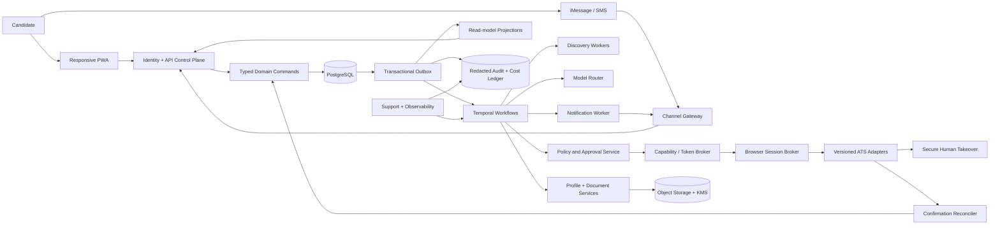
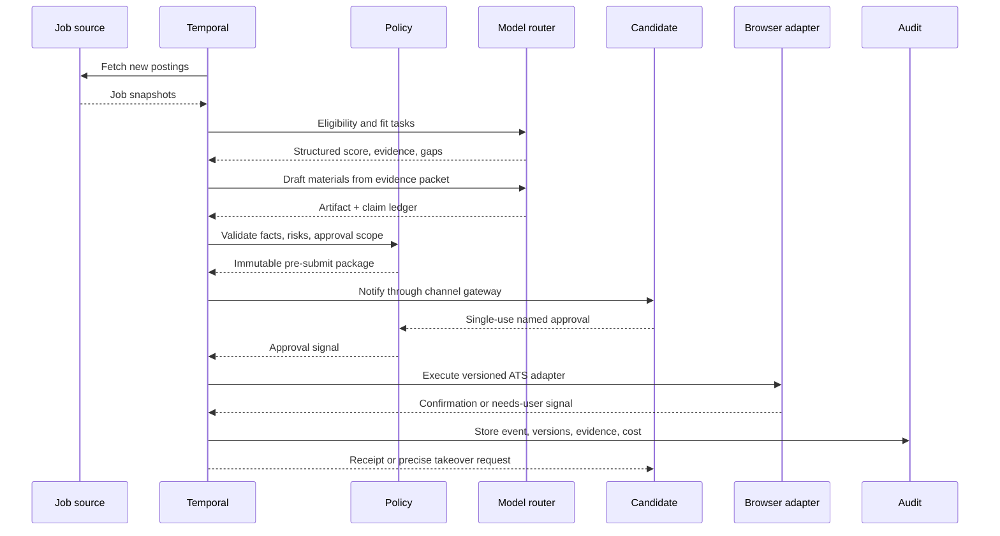
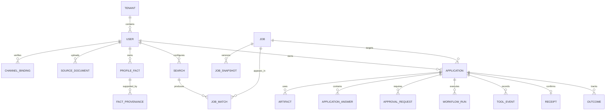

# System architecture

Companion specifications: the [backend operating model](backend-operating-model.md) is the canonical end-to-end job, candidate, preparation, model, and execution design; the [frontend-to-backend contract](frontend-backend-contract.md) maps every screen to reads, commands, events, and ownership; [scale, cost, and capacity](scale-cost-and-capacity.md) defines bounded work and overload behavior; [integrations and OAuth](integrations-and-oauth.md) defines provider resources, user bindings, credential references, and connector authority. The [implementation handoff](../execution/implementation-handoff.md) is the canonical build sequence.

## Architecture decision

Build RoleDawn as a durable, event-driven SaaS. Do not run one permanently active general-purpose agent, VM, or container per customer.

“Works 24/7” means:

- Search schedules and application workflows survive restarts.
- Workers wake when a timer, message, approval, or retry needs work.
- Work pauses safely for people and resumes from recorded state.
- Candidate identity, policy, credentials, facts, and audit remain durable even when no compute is running.

Each user has a logical agent, not a dedicated daemon.

## System view

PostgreSQL, Temporal, and the audit ledger have different authority; the dashboard and messages do not. The exact ownership and recovery contract appears below.

## Experience-to-runtime map

| Candidate surface | Read authority | Command destination | Long-running work |
|---|---|---|---|
| Queue and Application Workspace | Application projections from PostgreSQL domain events | Application and approval modules | One Temporal workflow per active application |
| Browse Jobs and Swipe | Discovery and matching projections | Saved-job, job-decision, and application commands | Source polling and bounded matching workflows |
| Career Vault | Candidate facts, sources, and usage policy in PostgreSQL | Vault and document-ingestion modules | Scanning, parsing, extraction, and affected-approval invalidation |
| Settings | Search, authority, notification, consent, and data-rights projections | Policy, channel, export, and deletion modules | Rechecks, exports, deletion, and channel lifecycle workflows |
| Onboarding | The same Vault, search, authority, and channel records used after activation | Existing module commands; no wizard-only truth | Resumable document and first-match workflows |

These are logical modules, not a mandate for one microservice per screen. The lean alpha should deploy one Next.js web application, one modular TypeScript API/control plane, bounded Temporal worker pools, PostgreSQL, object storage, and managed browser infrastructure. Split a module only after measured isolation, queueing, cost, security, or scaling pressure justifies it.

## Recommended stack

| Layer | MVP recommendation | Reason |
|---|---|---|
| Web | Next.js/React PWA on managed edge hosting | Fast onboarding/dashboard iteration; mobile-capable without native duplication |
| Identity | Managed OIDC with MFA/passkeys available | Avoid building authentication and recovery; channel bindings remain separate |
| API/control plane | TypeScript, Fastify or NestJS, containers on AWS ECS Fargate | Shared types with web, predictable long-lived services, no Kubernetes requirement |
| Workflow | Temporal Cloud, one workflow per application plus scheduled discovery workflows | Durable timers, retries, signals, cancellation, and human waits across days |
| Database | Managed PostgreSQL with `tenant_id`, row-level policies, PITR, and migration discipline | Canonical relational state and transactional invariants |
| Narrative retrieval | `pgvector` or external vector index behind a retrieval interface | Useful for source passages; never authoritative for exact facts |
| Documents | S3-compatible object storage with KMS envelope encryption and malware scanning | Durable versioned artifacts and isolated ingestion |
| Secrets | AWS Secrets Manager + KMS, tenant-scoped short-lived worker credentials | Keep passwords/tokens outside prompts, DB rows, and normal logs |
| Browser | Benchmark Browserbase + Playwright first; persistent encrypted profile per user/ATS tenant, ephemeral session per attempt; Stagehand/Orgo behind owned fallbacks | Deterministic adapter first, managed replay/takeover, provider portability |
| Messaging | Photon alpha behind `ChannelAdapter`; PWA and consented SMS fallback | Tests iMessage quickly while containing provider/platform risk |
| AI | OpenAI Responses API and Agents SDK where useful, behind task router/provider interface | Structured tools, approval/tracing support, and routing flexibility |
| Observability | OpenTelemetry + Sentry or Datadog; separate redacted append-only audit ledger | Operational telemetry and candidate/auditor proof serve different purposes |

Avoid Kubernetes, a self-hosted browser fleet, custom auth, fine-tuning, and native mobile until measured constraints require them.

The specific database/auth provider and primary model routes remain open. Supabase Postgres/Auth is the recommended alpha benchmark, not a settled provider or an implicit replacement for PostgreSQL's domain contract, Temporal's workflow authority, or RoleDawn's deterministic policy service. OpenAI is the first model-route benchmark and Anthropic the alternative; both must pass the same task-level evals.

## Service boundaries

### Identity and API control plane

- Authenticates web sessions.
- Binds and verifies messaging identities.
- Resolves tenant/user context.
- Serves read models to the dashboard.
- Accepts user commands but does not execute long work synchronously.

### Policy and approval service

- Evaluates whether a tool action is read-only, draft, or consequential.
- Resolves facts by exact type and usage policy.
- Creates single-use approval challenges.
- Rejects expired, ambiguous, modified, out-of-scope, or replayed approvals.
- Owns standing-authorization bounds and revocation.

This service is deterministic. Model output and webpage text cannot grant authority.

### Temporal workflow service

- Owns in-flight execution history, timers, waits, retries, and replay for application workflows.
- Schedules discovery and queue preparation.
- Coordinates activities with idempotency keys.
- Waits on approval, OTP, CAPTCHA takeover, support, and reconciliation signals.
- Applies retry policies based on side-effect risk.

Temporal is authoritative for in-flight workflow execution: timers, activity attempts, signals, retries, and replay. PostgreSQL is authoritative for durable domain facts and externally meaningful application state. Temporal history is not the user-facing audit; significant transitions are committed as redacted domain events through the consistency contract below.

### Job-discovery service

- Maintains the reviewed employer/ATS source registry and request budgets.
- Polls official sources incrementally with cursors, conditional requests, and jitter.
- Resolves stable job/requisition identity, immutable versions, aliases, changes, and closure.
- Emits committed job-version events for deterministic eligibility and matching.
- Measures coverage, freshness, detection lag, parser health, and apply-link validity.

See [job-discovery architecture](job-discovery.md) for the implementable night-shift subsystem.

## State authority and consistency contract

| Concern | Authority | Notes |
|---|---|---|
| Candidate facts, policies, consent, jobs, artifacts, approvals, current application state, receipts | PostgreSQL domain tables | Transactional invariants, optimistic `version`, tenant policy |
| Timers, activity attempts, waits, retry schedule, cancellation, workflow replay | Temporal workflow history | One stable workflow ID per application or source schedule |
| Proof of consequential actions and confirmations | Append-only domain audit ledger | Redacted immutable evidence; not a mutable state store |
| Dashboard lists, counts, search, notifications | Derived read models | Rebuildable from domain events; never permission authority |
| Provider messages and webhooks | Canonical message inbox/outbox records | Provider delivery state is not user authorization |

### Domain write path

1. The API or workflow activity calls a domain command with `command_id`, expected aggregate version, actor, and typed intent.
2. One PostgreSQL transaction validates tenant/policy/state, updates the aggregate, increments its version, writes a domain event/audit reference, and inserts a transactional outbox row.
3. An outbox dispatcher publishes the event or signals the named Temporal workflow.
4. Consumers store `event_id` in an inbox/dedupe table before applying an idempotent projection or signal effect.
5. Retries with the same command/event ID return the committed result instead of creating a second transition.

No service dual-writes PostgreSQL and Temporal without the outbox/inbox boundary.

### Workflow transition path

Temporal decides that a transition should be attempted, but a domain activity commits it to PostgreSQL using the expected application version. If another command changed the application, the activity receives a version conflict, reloads authoritative domain state, and the workflow deterministically replans or pauses. The committed domain event then updates read models and notifications.

### Inbound approval path

The channel gateway verifies and deduplicates the provider webhook, resolves the binding, and commits the candidate command. The policy service consumes the single-use approval in PostgreSQL and writes an outbox signal. Temporal resumes only after that committed approval signal arrives. A duplicate or out-of-order message cannot consume it twice.

### External side-effect boundary

Before Submit, a unique `submit_attempt_id` and approval/diff hash are committed. After the one external click, confirmation or uncertainty is committed under the same attempt. Because an ATS cannot offer a shared database transaction, exactly-once behavior comes from locks, immutable attempt identity, and reconciliation—not blind retry.

### Divergence repair

A scheduled reconciler compares active PostgreSQL applications with Temporal workflow ID, run status, search attributes, and last acknowledged domain version. On divergence it prevents new consequential work, rebuilds read projections where possible, re-delivers missing outbox events, or opens an audited operator incident. It never edits history or marks a submit confirmed merely to make systems agree.

### Profile and document services

- Isolate upload parsing and OCR.
- Store source documents and immutable versions.
- Manage typed facts, provenance, sensitivity, confidence, and allowed contexts.
- Build evidence packets for drafting without exposing unrelated private material.
- Validate artifacts against the evidence ledger.

### Browser session broker

- Allocates an encrypted persistent ATS profile to one user.
- Creates an ephemeral session for one application attempt.
- Enforces one active session per user/ATS where needed.
- Applies egress allow-lists, download quarantine, timeout, and cost caps.
- Redacts secrets and sensitive screens from ordinary replay.
- Produces a secure, revocable human-takeover link.

### ATS adapters

- Detect the ATS and employer tenant.
- Extract the authoritative live job and form schema.
- Fill tested fields deterministically.
- Escalate unknown terrain, never silently improvise a certification.
- Produce a complete pre-submit diff and confirmation evidence.

### Model router

- Accepts a typed task, risk level, context budget, and latency/cost target.
- Selects model, prompt version, tools, and fallback policy.
- Does not own workflow state or permission.
- Emits structured results with confidence and evidence references.

## Request and event flow

## Multi-tenancy

- Every domain row contains `tenant_id`; database access is scoped at both application and database layers.
- Worker credentials are short-lived and tenant-scoped.
- Browser profiles, object paths, encryption context, audit streams, and channel bindings use internal tenant/user IDs.
- No shared per-tenant memory file, unrestricted agent workspace, or global credential store.
- Support access is just-in-time, reasoned, approved where appropriate, logged, and unable to reveal secrets by default.

## Data model overview

Additional entities: `answer_policy`, `consent_grant`, `browser_profile`, `browser_session`, `adapter_version`, `model_run`, `cost_event`, `deletion_request`, and `support_access_event`.

## Scaling model

### Alpha: 10–25 users

- One region.
- Shared API and Temporal worker services.
- Managed browsers.
- Three ATS adapters.
- Manual support and review dashboard.

### Private beta: 100–500 users

- Separate worker queues by discovery, drafting, browser, and reconciliation.
- Concurrency and dollar caps per tenant/user.
- Workday/iCIMS/Oracle adapter pools.
- Confirmation email and support console.
- Canary tenants and staged adapter flags.

### Growth

- Partition queues by ATS, risk, and region.
- Read replicas/materialized read models for dashboard load.
- Noisy-neighbor isolation for browser workloads.
- Regional data boundaries where required.
- Consider internal browser fleet or Kubernetes only when managed economics, latency, or compliance justify the operational cost.

## Failure and recovery policy

| Failure | Behavior |
|---|---|
| Read-only fetch timeout | Retry with bounded exponential backoff and same idempotency key |
| Model schema failure | Repair once or route to stronger model; never pass unvalidated output |
| Browser failure before any side effect | Retry within cap or request takeover |
| Network loss near Submit | Enter `Reconciling`; inspect portal/email before any retry |
| CAPTCHA/login/OTP | Save state and request user takeover; do not bypass |
| Form/schema drift | Stop adapter, flag version, capture sanitized fixture, route draft-only/human path |
| Channel outage | Keep workflow state; notify in PWA and consented fallback channel |
| Vendor outage | Backoff, surface precise status, preserve cancel/kill capability |
| User pause | Cancel or park unstarted work; stop before next consequential boundary |

## Buy-versus-build

Buy early: identity, Temporal Cloud, managed browser, object storage, observability, malware scanning, payments, iMessage bridge.

Build as core IP: Career Vault schema/provenance, policy/approval engine, ATS adapter contracts/fixtures, state/reconciliation, receipt, model eval/routing, and outcome intelligence.

## Hermes evaluation

Hermes can accelerate internal dogfooding because it includes tools, browser control, cron, memory, channels, and delegation. It is not the production control plane.

If evaluated:

- Pin a commit and image.
- Run one isolated environment per task or test tenant.
- Disable unrestricted shell, self-created skills, uncontrolled memory, and broad tools.
- Give it short-lived tenant-scoped capabilities.
- Keep Temporal/Postgres canonical.
- Export every action to RoleDawn audit.

Adopt only if a controlled benchmark shows it reduces implementation cost without weakening policy, replay, isolation, or eval results.

## Architecture fitness tests

- Kill a worker during every workflow phase and verify safe resume.
- Deliver every channel webhook twice and out of order.
- Change a material artifact after approval and verify rejection.
- Drop the network immediately before and after Submit; verify reconciliation without duplicate.
- Inject instructions into job pages/resumes; verify they remain data, not commands.
- Attempt cross-tenant IDs in every API and worker path.
- Verify secrets never appear in model input, trace, screenshot, support UI, or analytics.
- Restore database/object backups and replay a workflow in a non-production environment.
