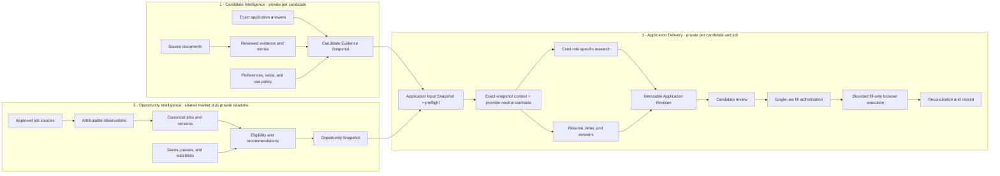
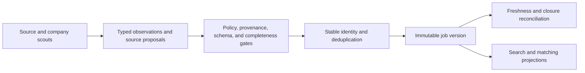

# Three-system product architecture

## Decision

RoleDawn is one product composed of three systems:

1. **Candidate Intelligence** builds the private, candidate-approved record of
   who the person is, what they have done, how they want to present themselves,
   and what the product may use.
2. **Opportunity Intelligence** maintains the shared, attributable record of
   employers and jobs, then relates that market to each candidate through
   eligibility, recommendations, saves, passes, and watchlists.
3. **Application Delivery** combines one approved candidate snapshot with one
   immutable job version to research, prepare, review, fill, submit, reconcile,
   and prove one application.

The architecture already follows this shape. The useful change is to make the
boundaries explicit so each new feature has one owner and one durable contract.

The target reusable handoff is:

> **Candidate Evidence Snapshot + Opportunity Snapshot + Application Policy = one immutable Application Revision.**

That revision is still a draft. One single-use authorization may release a
fill-only session that ends at pre-submit review. A later, separately scoped
authorization may release one submit attempt. A receipt requires external
confirmation evidence.

The deployed first slice materializes a narrower **Application Input Snapshot**
inside System 3. It binds one exact job version to the candidate's current
reviewed résumé, approved narrative-evidence version references, approved
exact-fact version references, application policy, and candidate input epoch.
It is immutable and specific to one application. It does not replace the
planned reusable Candidate Evidence Snapshot owned by System 1.

## The shared platform is not a fourth product system

The three systems share one control plane:

- Supabase/PostgreSQL for Auth-linked tenancy and durable domain truth;
- private object storage for source and generated documents;
- typed commands, optimistic versions, domain events, and the transactional
  outbox;
- future durable workflow coordination for waits, retries, cancellation, and
  recovery;
- provider-neutral model, research, rendering, and browser adapters;
- deterministic policy, approval, audit, deletion, and cost controls.

This shared platform prevents three separate products from inventing three
versions of the same candidate, employer, job, or application. It does not blur
ownership: each durable record below still belongs to one system.

## System 1: Candidate Intelligence

### Job to be done

Turn scattered candidate material into a private, reusable evidence base that
can support accurate applications without inventing details or repeatedly
asking the same questions.

The knowledge base is more than a text file. It has four layers:

1. **Sources:** original résumés and later portfolios, work samples, notes, or
   candidate-provided records.
2. **Evidence:** source-linked roles, projects, accomplishments, skills,
   metrics, and story passages.
3. **Exact facts:** identity, contact, location, authorization, sponsorship,
   and other candidate-approved form answers.
4. **Presentation policy:** target roles, résumé mode, voice preferences,
   allowed uses, exclusions, and answer scope.

Search embeddings may help retrieve narrative evidence. They never become the
authority for identity, dates, work authorization, legal attestations, or
another exact form field.

### Current state

| Capability | Status | Evidence or boundary |
|---|---|---|
| Auth-linked personal candidate and tenant isolation | **Verified live** | Hosted Milestone 0 and candidate-profile acceptance |
| Guided first-run onboarding | **Implemented and browser-accepted locally** | Four database-derived steps cover résumé, job goals, exact application answers, and a truthful readiness gate; protected routes return incomplete candidates to the correct step |
| Private PDF/DOCX source upload | **Verified live for development dogfood** | Immutable source versions and private Storage paths |
| Deterministic résumé text extraction and candidate editing | **Verified live** | PDF/DOCX extraction, review, replacement, and deletion lifecycle |
| Reusable exact application answers | **Verified live** | Candidate-self RLS, immutable versions, replay safety, and `PT409` stale-write protection |
| Target roles and job-search goals | **Implemented and hosted** | Candidate-private structured search profile feeds advisory fit labels; the founder record remains incomplete rather than receiving guessed defaults |
| Sensitive uncertainty | **Verified live** | **I'm not sure** remains `NEEDS_REVIEW` and cannot enter a packet |
| Source-linked exact résumé evidence | **Verified live** | Run `20260816235101` passed 10 checkpoints plus cleanup across deterministic passages, candidate review, isolation, replay/stale-write controls, immutable citations, and exact-document deletion |
| Candidate Evidence Snapshot | **Not built** | Reviewed items are not yet frozen with exact answers, policy, stories/voice, and gaps as a reusable Candidate Intelligence handoff |
| Story development and candidate voice | **Not built** | No persistent story, voice, or presentation-policy model |
| Retrieval index | **Not built** | No vector or full-text evidence retrieval path |
| Public-upload safety | **Not ready** | Malware quarantine, killable parser isolation, and OCR remain open |

### Work remaining

#### Foundation required for the first application

- Preserve the accepted immutable passages and candidate-reviewed versions;
  rerun the hosted harness after evidence-authority or source-lifecycle changes.
- Assemble approved evidence, exact answers, allowed-use policy, and explicit
  gaps into one deterministic Candidate Evidence Snapshot.
- Propose richer structured facts and stories with passage citations only when
  each proposal remains candidate-reviewable.
- Extend the current readiness view from required setup into evidence quality,
  story gaps, and per-role preparation readiness.
- Add candidate voice and richer truthful résumé-tailoring preferences without
  turning preferences into unsupported claims.

#### Quality expansion

- Ask focused follow-up questions when a story lacks scope, action, result, or
  evidence. Suggested language must remain a proposal until the candidate
  approves it.
- Add voice samples and writing preferences without turning tone into factual
  authority.
- Support more source types and source-linked work samples.
- Add retrieval and deduplication across repeated documents.

#### Production hardening

- Quarantine and malware scanning.
- Killable, resource-isolated parsing and OCR.
- Retention controls, export, consent history, and deletion scheduling.

### Exit contract

System 1 emits a versioned **Candidate Evidence Snapshot** containing only:

- immutable source and passage references;
- verified fact-version references;
- exact candidate-attested answers;
- sensitivity and allowed-use policy;
- presentation preferences and policy versions; and
- explicit gaps that another system may ask the candidate to resolve.

It does not emit a résumé, cover letter, match decision, or submit authority.

## System 2: Opportunity Intelligence

### Job to be done

Maintain a fresh, attributable map of the job market once, then help each
candidate find the small set of jobs worth their attention.

The system has two data planes:

- **Shared market truth:** employers, approved sources, raw observations,
  source listings, canonical jobs, immutable versions, freshness, and closure.
- **Private candidate relations:** eligibility, recommendation runs, seen,
  saved, passed, queued, watchlisted companies, and watchlisted searches.

Candidate behavior never belongs on a shared `jobs` row.

### Many scouts, one catalog

Multiple workers or agents may discover companies, inspect sources, fetch
boards, classify postings, or propose merges. They do not write arbitrary prose
directly into the canonical catalog.

“Polish” means normalize, classify, enrich, and link with provenance. It never
means overwriting the employer's source text or hiding the original observation.

### Current state

| Capability | Status | Evidence or boundary |
|---|---|---|
| Shared employer/source/job/version schema | **Implemented** | Forward migrations and RLS policies exist |
| Greenhouse, Lever, and Ashby adapters | **Implemented and tested** | Fixed-origin adapters, normalized versions, and bounded fetches |
| One pasted official link to one canonical job version | **Verified live** | Hosted resolver run completed once without submission |
| Replay-safe identity and deduplication | **Verified live for the narrow resolver** | Same canonical URL cannot create duplicate intake/application state |
| First operated source and conditional poller | **Verified live** | Anthropic is the only allowlisted tenant; the hosted catalog currently has 480 jobs, 464 open jobs, and 492 immutable versions; the latest worker-service run committed 464 observations |
| Recurring worker service | **Verified locally; not deployed** | Independent catalog, preparation, kit, and fill lanes expose liveness/readiness, avoid overlap, back off on failure, recover leases, and stop gracefully |
| Durable observations and ingestion-run operations | **Implemented for the first source** | Complete snapshots write run/observation/listing/job/version state; incomplete loads fail closed |
| Freshness, closure, and reopening | **Implemented in the commit contract; manually exercised once** | Closure applies only from an authoritative complete snapshot; scheduled operations and alerting remain open |
| Company scouting and shared employer intelligence | **Not built** | No reviewed company-source workflow |
| Search and saved jobs | **Verified live at the candidate boundary** | Authenticated `/search` and `/saved` expose a safe 15-field projection in opaque cursor pages of 24 with candidate-private save state; run `20260816235350` passed |
| Queue from catalog | **Verified live at the candidate boundary** | Replay-safe command binds the current job version and records preparation intent only; stale-version, replay, isolation, and no-submission-authority checks passed |
| Company/job watchlists | **Not built** | No persistent watch rule or notification runtime |
| Advisory fit | **Implemented and tested** | Read-time `Good fit`, `Needs review`, and `Eligibility issue` labels use search goals plus verified facts; only explicit eligibility conflicts can block, missing evidence stays reviewable, and no unsupported percentage is shown |
| Persisted ranking and learning | **Not built** | No versioned fit-run record, calibrated ranker, candidate feedback loop, or downstream-outcome evaluation exists |

### Work remaining

#### Catalog operations

- Deploy scheduling and health alerts around the current leased conditional
  poller; preserve one source lease and complete-snapshot closure guards.
- Expand beyond Anthropic only through reviewed provider/tenant ownership,
  polling budgets, adapter versions, rights, and policy evidence.
- Add source, adapter, freshness, duplicate, and broken-apply-link monitoring.

#### Candidate opportunity tools

- Preserve the implemented persistent Search, Saved, and queue-from-catalog
  contracts without adding unsupported match scores.
- Add passes, company watchlists, and search watchlists as candidate-specific
  relations.
- Notify candidates from committed catalog changes, not an agent's memory.

#### Recommendation engine

1. Apply deterministic eligibility rules first.
2. Retrieve a bounded survivor set with indexed dimensions.
3. Run evidence-based fit reasoning only on those survivors.
4. Persist the job version, candidate snapshot, policy version, score
   components, explanation, gaps, and model release.
5. Evaluate recommendation quality from candidate actions and downstream
   outcomes without turning a score into permission to apply.

### Research placement

Reusable employer facts, products, leadership, funding events, and source
citations belong in System 2 when they can serve many candidates. A claim about
why this team is hiring for this exact job belongs in System 3 because it must
be bound to one job version, research run, and application revision.

### Exit contract

System 2 emits a versioned **Opportunity Snapshot** containing:

- employer and canonical job identity;
- the exact immutable job version and source/apply URLs;
- source provenance, freshness, listing state, and adapter version;
- normalized requirements and application terrain;
- optional employer intelligence with dated citations; and
- candidate-specific eligibility, decision, or recommendation references.

It does not edit candidate evidence, create application prose, or submit.

## System 3: Application Delivery

### Job to be done

Turn one candidate-approved opportunity into a high-quality application, then
execute it safely and report only what can be proved.

Application Delivery is one stateful production line per candidate and job:

```mermaid
flowchart LR
    Q["Queued application"] --> I["Freeze exact inputs + preflight"]
    I --> R["Cited company + role research"]
    R --> E["Resolve permitted evidence"]
    E --> D["Draft résumé, letter, and answers"]
    D --> V["Validate claims, policy, and quality"]
    V --> P["Render and persist immutable revision"]
    P --> H{"Needs candidate input?"}
    H -->|"edit or answer"| D
    H -->|"ready"| A["Named fill-only authorization"]
    A --> B["Ephemeral application session"]
    B --> F["Fill, upload, and final read-back"]
    F --> J["Pre-submit candidate review"]
    J --> S["Separate submit authorization + one attempt"]
    S --> C["Confirm or reconcile"]
    C --> X["Evidence-backed receipt"]
```

The repeatable “skills” in this system become versioned task policies,
structured schemas, tools, validators, renderers, and evaluation fixtures. They
are not mutable agent memory and do not grant their own authority.

### Current state

| Capability | Status | Evidence or boundary |
|---|---|---|
| Persistent application Queue and detail | **Verified live** | RLS-scoped newest-first applications and durable pasted-link intent |
| Application/revision/artifact/approval/attempt/receipt schema | **Implemented** | Database structure exists; final submit and receipt runtime remain disconnected |
| Immutable Application Input Snapshot | **Verified live for ready and blocked paths** | Founder snapshot `a6a98e45-305b-496f-bd46-754b870a2a4b` is `READY_FOR_DRAFTING` with 12 approved evidence refs, one exact-fact ref, and zero blockers; blocked snapshots, stable hashing, retry replay, and stale-input denial are also accepted |
| Deterministic preparation preflight | **Verified live** | The worker binds exact job/candidate/policy versions under a candidate input epoch and emits a version-bound `application.drafting_requested` event only for a ready snapshot |
| Exact-snapshot drafting context | **Implemented and tested offline** | Exact-ID readers have no `latest` method; the builder rechecks snapshot/job/résumé/evidence hashes and excludes exact fact values from narrative context |
| Provider-safe drafting adapter and strict parser | **Implemented; live local acceptance passed** | Candidate identity, exact facts, raw document IDs, and raw reviewed résumé text stay outside the provider request; `AS_UPLOADED` is preserved server-side; one Terra proposal passed bounded parsing and deterministic checks |
| Cited provider-neutral research contract | **Implemented and tested offline** | Research proposals require allowlisted primary-source types, citations, conflict state, exact snapshot/job binding, freshness, and deterministic bundle hashing |
| Research/revision/evidence provenance | **Deployed foundation; no produced records** | Migration `20260817025617` adds append-only research bundles, mandatory snapshot/research binding on revisions, immutable revision-evidence refs, RLS, insert guards, and rollback acceptance |
| Immutable packet validation | **Implemented offline** | Evidence citations, use policy, résumé modes, no-slop checks, material diff, and byte hashing pass deterministic tests |
| Provider-neutral computer-session contract | **Implemented and credentialed synthetic acceptance passed** | Coordinator uses the database session ID as provider idempotency; Browserbase connected over CDP, preserved exact-origin/no-submit guards, and released explicitly without candidate or employer data |
| Research, drafting, validation, and revision runtime | **Implemented for the current bounded kit path** | One durable application kit can bind exact inputs, research, generated content, evidence, material diff, and immutable artifacts; broader provider and quality evaluation remain open |
| PDF/DOCX rendering and artifact persistence | **Implemented for the current kit path** | Candidate-visible immutable artifact bytes and hashes are stored privately and materialized only from the authorized versions |
| Candidate packet review and fill authorization | **Implemented; hosted rollback accepted** | Application detail exposes the artifacts and material diff; `FILL_APPLICATION_ONCE` is separate from submit authority and is consumed once |
| Fill materializer and coordinator | **Implemented and tested locally** | Materializer verifies exact authorized fact/artifact versions; the coordinator provisions, activates, fills, checkpoints, tears down, and completes at `PRE_SUBMIT_REVIEW` |
| Recovery fencing | **Verified live and tested locally** | Lease ownership and the original `computer_session_id` fence recovery; hosted crash drills proved provisioning replay and fail-safe active-session handling without re-driving |
| Browser fill and file upload | **Accepted only against a synthetic ATS in installed Chrome** | The harness filled ordinary fields and uploaded a PDF, left a sensitive field blank, and blocked a deliberate submit call; the deterministic Greenhouse-style driver has not opened a real ATS |
| Human takeover foundation | **Implemented in repository; hosted proof pending** | An owner-scoped route returns Live View only for an active, unexpired candidate session and keeps provider IDs server-only. A process-owned supervisor retains the guarded runtime through review/takeover and awaits a service-only release reconciliation; the migration is not deployed and no candidate takeover has passed end to end |
| Submit, confirmation, reconciliation, and receipt | **Not built** | Nothing can submit a real application today |

### Work remaining

#### Preparation

- Keep the exact-snapshot, evidence-provenance, semantic-validation, material
  diff, and immutable-artifact checks on every produced revision.
- Expand fixture and human review coverage before treating one successful kit
  as broad quality proof.
- Preserve `AS_UPLOADED` server-side and fail closed on unsupported claims or
  unresolved exact and sensitive answers.

#### Execution

- Validate Browserbase credentials behind the explicit gate while keeping
  provider identifiers outside domain contracts.
- Run the deterministic Greenhouse-style no-submit driver against one founder
  form; it may fill and upload only the exact authorized artifacts.
- Add final read-back, short-lived takeover, redaction, locking, teardown, and
  an explicit stop for OTP, CAPTCHA, certification, sensitive uncertainty, or
  portal drift.

#### Submission and proof

- Preserve the separate fill-only authorization already implemented. Add a new
  submit authorization only after live-form read-back produces an immutable
  pre-submit diff.
- Commit one attempt identity before the external submit boundary.
- Reconcile uncertainty under that same attempt before any retry.
- Show **Submitted** only when confirmation evidence supports it.

### Exit contract

System 3 emits either:

- a reviewable immutable application revision;
- a precise request for candidate input or takeover;
- a skipped, failed, paused, or uncertain state with recovery context; or
- an evidence-backed receipt for one confirmed attempt.

It never converts “the agent clicked” into “the employer received it.”

## Where current product surfaces belong

The sidebar describes the candidate journey. It does not need to mirror backend
ownership one-for-one.

| Product surface | Primary system | Notes |
|---|---|---|
| Résumé source, Verified facts, Application answers | Candidate Intelligence | Private sources, exact source-linked evidence, exact facts, and policy |
| Application Kits and application detail | Application Delivery | Read model for preparation and later execution state |
| Cover Letters | Application Delivery | Candidate voice preferences live in System 1; each generated letter belongs to one application revision |
| Search and Saved | Opportunity Intelligence | Search reads shared jobs; save is a private candidate-job relation |
| Company and job watchlists | Opportunity Intelligence | Watch rules are private; underlying company/job records are shared |
| Auto Apply | Application Delivery | Candidate policy configures it, but execution and approval authority belong here |
| Queue status and notifications | Application Delivery read model | Derived from committed application events |
| Onboarding | Composed experience | Writes Candidate Intelligence first, then optional Opportunity rules; it is not a fourth store |
| iMessage, SMS, email, mobile | Shared channel layer | Control and notification surfaces over the same commands and read models |
| Interview Buddy and Mock Interviews | Later composed product | May consume all three systems; neither is required for the application MVP |

## Build sequence

The systems should not be completed independently. Build thin vertical slices
through their contracts in dependency order.

### Completed foundation: produce and authorize one no-submit kit

The deployed Application Delivery seam is:

`exact job version + candidate input epoch + reviewed résumé + approved evidence/fact version references + policy releases → immutable Application Input Snapshot`

The ready and blocked paths, retry replay, stale-version denial, exact-snapshot
context assembly, provider-safe drafting, cited research, deterministic and
semantic validation, immutable revision/artifact persistence, material review,
and fill-only authorization now form the bounded kit path. Hosted fill authority
and session lifecycle were accepted in a rolled-back transaction. No provider
session or employer system was touched.

The completed foundation proves:

- one leased consumer claims the version-bound event once and replay returns the
  same durable outcome;
- every read uses the event's exact snapshot/application/run locator;
- a cited research bundle binds to that snapshot and expires under policy;
- provider output passes strict parsing, then deterministic and semantic checks;
- `AS_UPLOADED` never asks a model to recreate the résumé;
- unsupported claims and unresolved exact or sensitive answers fail closed;
- a revision cannot be inserted without matching snapshot, research, and
  evidence provenance;
- materialized fill inputs come only from the exact authorized fact and artifact
  versions; and
- no employer form, browser session, or submit side effect occurs.

The reusable Candidate Evidence Snapshot remains planned in System 1 for
cross-application readiness, story, voice, and gap management. It is not the
same row or authority as the deployed per-application snapshot.

### Next: complete one real fill-only computer path

The Browserbase adapter has passed a credentialed synthetic run and the
candidate-owned Live View lookup exists. Add a worker-owned retained-session
supervisor, then fill one founder-owned Greenhouse application in an ephemeral
session. Upload the exact authorized artifact, stop at pre-submit review, and
keep the guarded session alive only long enough for inspection or takeover.
The founder performs any final click. Use those runs to measure form coverage,
takeover rate, output corrections, latency, and accepted-output cost. Reuse a
narrow, encrypted candidate-by-ATS context only when account continuity
requires it; do not assign one permanent computer to every candidate.

### Then: controlled submit and receipt

Connect single-use approval, one attempt, confirmation capture, reconciliation,
and receipt truth before enabling autonomous final submission.

### In parallel: schedule and harden the first catalog source

The first Anthropic board and conditional poller are verified live, and the
four-lane worker service has local health and execution proof. Search, Saved,
queue-from-catalog, and deterministic advisory fit are connected. Deploy the
service with source-health monitoring without widening the allowlist.
Watchlists, persisted ranking, and recommendation evaluation remain later; a
massive catalog does not need to block the first successful application.

## What to defer

- A permanent agent or VM per candidate.
- General web crawling or unsupported job-board scraping.
- Broad Workday, iCIMS, or Oracle coverage before one ATS shadow path works.
- Model fine-tuning before task-level prompts, schemas, and evals establish a
  measurable baseline.
- Standing authorization or bulk submission before precise approval and
  reconciliation work.
- Native mobile, iMessage, billing, and interview features before the core
  review-to-receipt loop works.

## Governing boundaries

1. System 1 owns candidate truth and permitted use.
2. System 2 owns market truth, provenance, and freshness.
3. System 3 owns per-application state and consequential execution.
4. Models may propose; deterministic services and candidates approve.
5. Shared data is fetched and normalized once. Candidate relationships remain
   private.
6. Every cross-system handoff is immutable and versioned.
7. No dashboard, message, model memory, browser session, or agent transcript is
   a source of authority.

Related specifications: [backend operating model](backend-operating-model.md),
[Career Vault résumé intake](career-vault-resume-intake.md), [job discovery](job-discovery.md),
[job-ingestion runtime](job-ingestion-runtime.md), [pasted-link application engine](pasted-link-application-engine.md),
and [ATS automation](ats-automation.md).
