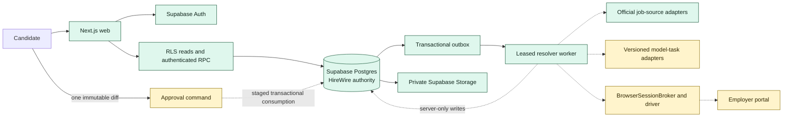
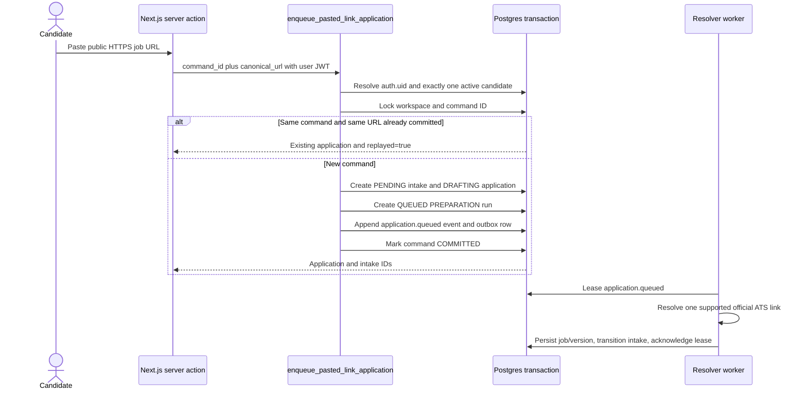
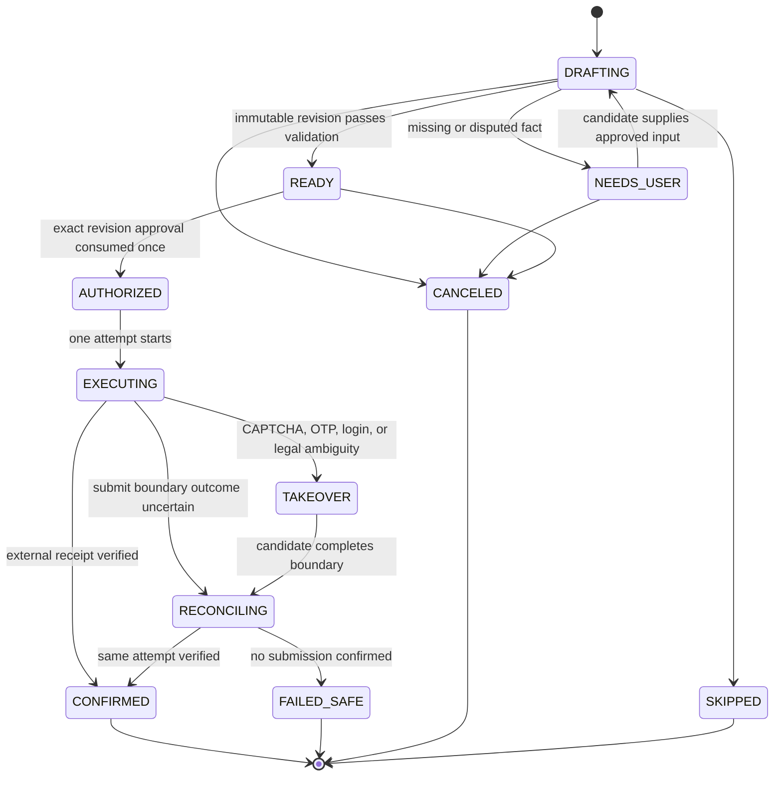

# Supabase HireWire backend operating model

This is the operator source of truth for the backend being built now. It records
the verified hosted Milestone 0 baseline, the boundaries that remain unbuilt,
and the order in which to add later workers and external side effects. For the
longer-range design, use the [architecture operating model](../architecture/backend-operating-model.md).
For the first product slice, use the [pasted-link engine](../architecture/pasted-link-application-engine.md).

**Naming:** HireWire is the internal name used in the Supabase migration headers and in this runbook for the RoleDawn control plane. RoleDawn remains the customer-facing working brand. This does not settle product-name or trademark clearance.

## Status at a glance

In this document, **Verified live** means exercised against the founder-owned
HireWire development project. **Verified in source** means implemented and
tested locally but not necessarily connected end to end.

| Status | Current truth |
|---|---|
| **Verified live — hosted baseline** | Eleven forward migrations through `20260812134739`; two-user Auth and RLS isolation; replay-safe workspace bootstrap; atomic pasted-link enqueue; same-command replay and same-URL deduplication; database-backed Queue/detail reads; bounded outbox retry, dead-letter, support-only inspection, audited requeue, and cascading cleanup; plus one official Anthropic Greenhouse resolution through the configured server-only worker. |
| **Verified in source — connected slice** | Supabase SSR authentication helpers; RLS-scoped reads; private document buckets; typed Greenhouse, Lever, and Ashby resolution; the leased one-shot `application.queued` worker; and a provider-neutral computer-session contract. |
| **Unbuilt — later milestones** | Document upload broker, scanner, parser, reviewed-fact workflow, packet builder, model runtime, durable workflow runner, managed-browser/CUA adapter, approval issue/consume commands, submit command, takeover, reconciliation, and real receipt capture. |
| **Recommendation — production authority** | Adopt the Supabase-backed HireWire control plane as the first production authority for identity-linked tenancy, PostgreSQL domain state, private object storage, transactional commands, semantic events, and the outbox. Keep workflow, model, browser, and policy behavior behind RoleDawn-owned adapters. |
| **Open question** | Production origin, redirect allowlist, SMTP posture, retention policy, production recovery posture, and later provider secrets remain unset. |

## Verified hosted Milestone 0 baseline

The fail-closed hosted acceptance run `20260812135034` completed against the
founder-owned HireWire development project on 2026-08-12.

- The remote ledger contained 11 forward migrations through
  `20260812134739`.
- Anonymous domain reads were denied. Two ordinary Auth sessions proved
  workspace isolation, stable personal bootstrap, and cross-tenant denial.
- The pasted-link command proved same-command replay, mismatched-payload
  rejection, normalized same-URL deduplication, and RLS-scoped Queue/detail
  reads.
- The outbox proved bounded retry, fifth-attempt dead-letter, support-only
  recovery inspection, optimistic audited requeue, and cascading cleanup.
- The configured server-only one-shot worker claimed and completed an
  `application.queued` message, resolving an official Anthropic Greenhouse job
  into the shared catalog. The canonical job and its current immutable version
  remained after ephemeral acceptance tenants were removed.
- The run created no approval consumption, attempt, receipt, or submission
  authority.

This is an accepted control-plane and narrow resolver baseline. It is not a
packet-generation, browser/CUA, form-filling, approval, or submission runtime.

## What exists now

| Component | Verified implementation | Present limit |
|---|---|---|
| Authentication | Cookie-aware browser/server clients, claim validation, login action, and confirmation route in [`src/lib/supabase`](../../src/lib/supabase), [`src/server/auth/session.ts`](../../src/server/auth/session.ts), and [`src/app/login`](../../src/app/login). Two ordinary hosted sessions and cross-tenant denial passed in run `20260812135034`. | Production Auth origins and SMTP are not configured or verified. |
| Identity and tenancy | `workspaces`, `workspace_memberships`, and `candidates`; private authorization/URL helpers; replay-safe personal bootstrap; RLS and explicit grants in [migration 01](../../supabase/migrations/20260812021031_identity_and_tenancy.sql). | Hosted Auth and cross-tenant RLS acceptance passed on 2026-08-12. |
| Shared job catalog | Employer/source registry, ingestion runs, immutable observations, source listings, canonical jobs, and immutable job versions in [migration 02](../../supabase/migrations/20260812021042_job_catalog.sql). | The direct-link worker persists one resolved official job/version; broad source scheduling and closure reconciliation are not connected. |
| Application control plane | Pasted-link intake, candidate decisions, applications, operational runs, append-only domain events, command deduplication, outbox, and `enqueue_pasted_link_application()` in [migration 03](../../supabase/migrations/20260812021405_application_runtime.sql). [Migration 06](../../supabase/migrations/20260812031348_worker_outbox_and_intake_commands.sql) adds worker claim, acknowledgement, failure, and intake-transition commands. | Deployed and accepted. Packet, approval, attempt, and receipt transitions remain unimplemented. |
| Career Vault and proof | Versioned source documents and facts, packet revisions, fact references, artifacts, one-time approval records, attempts, receipts, append-only triggers, and private buckets in [migration 04](../../supabase/migrations/20260812021416_career_vault_and_packets.sql). | Upload capabilities, scanning, parsing, packet creation, approval issuance/consumption, attempts, and receipts have no server command implementation. |
| Job-source adapters | Fixed endpoint construction, bounded HTTP fetching, response/record limits, raw hashes, typed normalization, and direct-link resolution for Greenhouse, Lever, and Ashby in [`src/server/ingestion`](../../src/server/ingestion). | The worker persists direct-link resolution only. There is no broad scheduler, closure reconciler, or live polling deployment. |
| Worker and computer boundary | [`src/server/workers/outbox-worker.ts`](../../src/server/workers/outbox-worker.ts) leases a bounded `application.queued` batch and dispatches [`application-queued.ts`](../../src/server/workers/application-queued.ts), which resolves one supported official link and persists its job/version. The configured hosted worker completed one Anthropic Greenhouse resolution in run `20260812135034`. [`ComputerSessionBroker`](../../src/domain/computer-session-broker.ts) defines scoped session creation, navigation checks, immutable artifact mounts, TTLs, read-only live-view references, close, and destroy. | The browser broker remains a network-free contract with no production adapter and no click, type, upload, or submit authority. |

## Authority and component ownership

PostgreSQL is the source of truth. Chat history, model memory, browser state, worker memory, and provider dashboards are not.



Solid green components exist in source; Auth, RLS, the database command path,
outbox recovery, and the narrow resolver worker have hosted acceptance evidence.
Yellow dotted paths remain later runtime work.

| Concern | Authority | Execution owner | Hard boundary |
|---|---|---|---|
| Login identity | Supabase Auth user ID | Supabase Auth and Next.js session layer | Email or channel identity never substitutes for `auth.uid()`. |
| Tenant membership | PostgreSQL membership rows | Database RLS and private helper | The client never supplies an authoritative `workspace_id`. |
| Candidate truth and policy | Versioned candidate/fact rows | Server commands and controlled workers | Models cannot write verified facts or sensitive answers. |
| Job identity and content | Canonical job and immutable job-version rows | Ingestion/resolution worker | Provider payloads are observations, not candidate state. |
| Application state | `applications`, `application_runs`, events, command dedup | Transactional command functions | Workers propose transitions; one database transaction commits them. |
| File bytes | Private Storage objects plus hashed metadata rows | Server-minted short-lived upload/download capabilities | No broad `storage.objects` policy and no public bucket. |
| Long-running work | **Recommendation:** one durable workflow per queued application when external waits begin | Shared workflow workers | Workflow history coordinates work; it does not replace PostgreSQL authority. |
| Submission | One consumed approval bound to one immutable revision and one attempt | Server approval command plus bounded browser worker | A worker or model cannot issue its own approval or create a second attempt. |
| Confirmed outcome | Receipt plus external evidence | Reconciliation worker and database command | A browser screenshot or model statement alone cannot mark `CONFIRMED`. |

## Paste-link command flow

The enqueue command and direct-link resolver worker are deployed in HireWire.
Hosted run `20260812135034` proved this flow with an official Anthropic
Greenhouse posting. The worker has preparation authority only.



### Current command contract

1. The web layer generates one UUID `command_id` and preserves it across transport retries.
2. The RPC derives candidate and workspace from `auth.uid()`; the browser does not choose either.
3. The request hash binds the command to the URL. Reusing the command with a different URL fails.
4. One transaction creates `job_intakes`, `applications`, a queued `PREPARATION` run, `application.queued`, the outbox row, and the committed command result.
5. Replaying the same committed command returns the original application. A new
   command for the same candidate and normalized canonical URL also returns that
   aggregate. A command ID reused with a different payload is rejected.
6. This command grants preparation authority only. It never grants submit authority.

**Verified:** the browser/domain layer and SQL command accept only a bounded
public HTTPS hostname shape. The worker parses the candidate URL, constructs a
provider-owned API endpoint, and allows only four fixed API origins. Its fetch
port rejects credentials, fragments, redirects, and oversized responses. It
never sends a raw intake URL to the privileged fetch client.

**Verified live:** the server action normalizes the public URL before the RPC,
and the database enforces one intake/application aggregate per candidate and
normalized canonical URL. Same-command replay, same-URL/new-command replay, and
mismatched-payload rejection passed hosted acceptance.

## Job ingestion and catalog flow

**Verified:** [`loadRegisteredJobSource()`](../../src/server/ingestion/load-source.ts) implements the solid portion below: provider-owned endpoint construction, conditional-fetch input, byte and record caps, JSON parsing, normalization, issues, and a raw SHA-256.

```mermaid
flowchart LR
    SR["job_sources registry"] --> Q["Scheduled source claim"]
    Q --> F["SourceFetchPort"]
    F --> N["Greenhouse / Lever / Ashby adapter"]
    N --> X["Normalized snapshot plus raw hash"]
    X -. "one transaction" .-> IR["ingestion_runs and immutable observation"]
    IR -.-> L["source listings"]
    L -.-> J["canonical jobs"]
    J -. "content changed" .-> V["new immutable job version"]
    V -.-> E["domain event and outbox"]
```



**Recommendation — worker transaction:**

1. Claim only a registered source with `policy_status = 'ALLOWLISTED'` and polling enabled.
2. Build the provider endpoint from the stored provider and tenant key; never accept an arbitrary fetch origin.
3. Send the previous ETag. A `304` records a successful observation without reparsing or reranking.
4. Persist the ingestion run, immutable source observation, source-listing upserts, canonical job resolution, new job versions, and catalog events atomically.
5. Add a new `job_versions` row only when normalized content has materially changed.
6. Mark missing listings closed only after a complete snapshot; partial or failed snapshots cannot close jobs.
7. Publish downstream matching work through the outbox after commit.

**Verified live:** the outbox lease, acknowledge, capped retry, fifth-attempt
dead-letter, support-only inspection, optimistic audited requeue, and worker
resolution paths passed hosted run `20260812135034`. The one-shot worker consumes
only `application.queued`; it is not a broad catalog poller, research agent,
packet builder, browser driver, or submitter.

## Packet, approval, and browser state model

The state names below exist in the schema. The transition edges are the required contract, but they are a **Recommendation** until transition RPCs enforce them.



Hard invariants:

- A packet is one immutable `application_revisions` row tied to one immutable `job_version`, exact fact-version references, a material diff, a manifest, and a SHA-256 packet hash.
- Any material change creates a new revision and invalidates earlier approval eligibility.
- Approval permits only `SUBMIT_APPLICATION_ONCE`, expires, can be revoked, and binds candidate, application, revision, diff hash, and nonce hash.
- `approval_consumptions` is append-only and unique per approval. `application_attempts` is unique per consumption and idempotency key.
- A crash or disconnect near Submit sets the same attempt to `UNCERTAIN` and the application to `RECONCILING`. It never creates an automatic second submit.
- Only verified portal, email, or external-receipt evidence creates a receipt and permits `CONFIRMED`.
- Provider session IDs, signed live-view URLs, credentials, and mount paths remain inside adapters. Domain rows keep only RoleDawn IDs and opaque references.
- Close and destroy the disposable computer after evidence capture; retain the minimum safe metadata needed for reconciliation.

## Server versus worker authority

| Actor | May | Must not |
|---|---|---|
| Browser client with publishable key | Authenticate, make RLS-scoped reads, present immutable diffs, and request a candidate-scoped command through the web server. | Hold a privileged key, write operational tables directly, choose a workspace, mint upload access, or claim success. |
| Next.js server with candidate session | Validate input, call candidate-scoped RPCs, shape read models, mint a command ID, and later broker short-lived Storage capabilities. | Use a privileged worker key for an ordinary candidate command or bypass database authorization. |
| PostgreSQL command function | Derive identity, lock/dedupe, validate current aggregate version, commit state/event/outbox atomically. | Call a model or browser, wait on a remote provider, or infer a fact. |
| Shared worker with server-only privileged credential | Claim bounded work, call approved adapters, write through service-only repositories/commands, heartbeat, and record provenance/cost. | Accept candidate identity from an untrusted payload, expose credentials, authorize submission, or retry an uncertain submit. |
| Model task adapter | Return schema-validated research, evidence selection, drafts, or abstention from a fixed snapshot. | Receive database/browser secrets, issue commands, verify candidate facts, alter policy, or declare a side effect. |
| Browser driver | Navigate only allowed domains, fill the current immutable packet, expose read-only takeover, and invoke one permitted action after release. | Broaden its own tool grant, change packet content, solve CAPTCHA, infer legal answers, or retry Submit. |

## Environments and configuration

| Environment | Data plane | External side effects | Current status |
|---|---|---|---|
| Local | Next.js against configured development services; a full local Supabase stack remains optional | Official read-only ATS endpoints only through the bounded resolver | **Verified in source:** tests, typecheck, lint, documentation links, production build, and whitespace gates pass. |
| Hosted development | Founder-owned HireWire Supabase project | Official read-only ATS endpoints only through the bounded resolver | **Verified live:** 11 migrations through `20260812134739`; configured worker; run `20260812135034` accepted Auth, RLS, enqueue/read models, outbox recovery, official resolution, and cleanup. |
| Staging | Separate hosted project and worker secrets; production-like RLS | Browser fill in shadow mode; no RoleDawn-controlled final click | **Recommendation:** required before controlled submission. |
| Production | Separate hosted project, production origin, secret manager, worker deployment, backups, alerts | Graduated adapters only; one named approval per attempt | **Not deployed.** Do not share a project or privileged key with staging. |

### Current environment variables

| Setting | Exposure | When required | Source |
|---|---|---|---|
| `NEXT_PUBLIC_SUPABASE_URL` | Browser-safe project URL | Authenticated web in every environment | [`.env.example`](../../.env.example) |
| `NEXT_PUBLIC_SUPABASE_PUBLISHABLE_KEY` | Browser-safe only with correct RLS and grants | Authenticated web in every environment | [`.env.example`](../../.env.example) |
| `APP_BASE_URL` | Server configuration | Auth email redirects and canonical origin | [`.env.example`](../../.env.example) |
| `SUPABASE_SECRET_KEY` | Server-only worker credential | Running the one-shot resolver worker and hosted acceptance harness | [`.env.example`](../../.env.example); configured in the ignored development environment and never exposed to the browser |
| Model, browser, scanner, and SMTP credentials | Server-only secret references | Only when each adapter graduates | **Open:** do not collect or configure before its milestone. |

## Deployment sequence

1. **Preserve the accepted ledger.** Eleven forward migrations through
   `20260812134739` are recorded in HireWire. Read the remote ledger before every
   schema change, never edit an applied migration, and ship only reviewed
   forward migrations.
2. **Rerun the hosted gate after control-plane changes.** Use the fail-closed
   Milestone 0 harness to prove Auth, RLS, replay/deduplication, read models,
   outbox recovery, official resolution, no receipt, and bounded cleanup.
3. **Build packet preparation without side effects.** Add quarantined document
   intake, scanning/parsing, candidate-reviewed facts, a durable packet worker,
   immutable artifacts, and deterministic evidence/no-slop validation.
4. **Add browser shadow mode.** Implement one allowlisted CUA/browser adapter
   that can fill a test form from an immutable packet but has no final-click
   capability.
5. **Graduate approval and submit separately.** Implement issue/consume/start-
   attempt commands, takeover, uncertain-state reconciliation, and evidence-
   backed receipts. Submission remains disabled until failure injection proves
   one approval produces at most one attempt.
6. **Repeat in separate staging and production projects.** Never use
   `supabase db reset --linked` against a data-bearing project. Apply only
   reviewed forward migrations and retain repair instructions per migration.

## Operator commands

Run from the repository root.

```bash
npm ci
npm test
npm run lint
npm run typecheck
npm run build
```

Local Supabase, after Docker is installed:

```bash
npx supabase --version
npx supabase start
npx supabase db reset --local --no-seed
npx supabase db lint --local --schema public,private --level warning --fail-on error
npx supabase status
```

Hosted development verification, after confirming the active target:

```bash
npx supabase login
npx supabase link --project-ref <DEVELOPMENT_PROJECT_REF>
npx supabase migration list --linked
npx supabase db push --linked --dry-run
npx supabase db push --linked
npx supabase migration list --linked
npx supabase db lint --linked --schema public,private --level warning --fail-on error
npm run acceptance:m0
```

Do not put access tokens, database passwords, privileged keys, model keys, or browser-provider keys in commands, Git, logs, screenshots, or model prompts.

## Failure and reconciliation rules

| Failure | Required response |
|---|---|
| Same command arrives again | Return the committed result only when command type and request hash match. Otherwise reject. Never create a second aggregate. |
| Command is stuck `STARTED` | Reconcile the transaction/result before deciding whether to reject or resume. Do not mint a replacement command silently. |
| Job-source fetch fails or is partial | Record failure and retryability; do not close missing jobs. Back off on `429` and transient server failures. |
| Outbox delivery fails | Release the current lease through the failure command, retain retry metadata, and retry only after `available_at`. Acknowledge idempotently after the same message completes. |
| Worker heartbeat expires during preparation | Reclaim only after the lease expires; rerun an idempotent step against the same immutable input revision. |
| Model returns invalid or unsupported content | Reject the output, record route/release/error, retry only within the pre-submit budget, or move to `NEEDS_USER`. Never weaken evidence rules. |
| Upload scan or parse fails | Keep bytes quarantined or reject/delete according to policy; do not create approved facts from the file. |
| Browser hits CAPTCHA, OTP, credentials, or ambiguous attestation | Move to `TAKEOVER`; ask the candidate for the exact action. Do not solve, guess, or bypass. |
| Connection fails before a known submit boundary | Close safely or resume the same bounded run if the adapter proves no submit occurred. |
| Connection fails at or after Submit | Mark the same attempt `UNCERTAIN`, enter `RECONCILING`, and inspect portal/email/external proof. Never auto-retry Submit. |
| No confirmation can be established | End `FAILED_SAFE` or request support review; do not call it submitted. |
| Remote migration fails | Stop deployment, preserve logs, inspect remote migration history, and apply a reviewed forward repair. Never reset a data-bearing project. |

## Model and tool adapter boundaries

Existing owned boundaries are [`SourceFetchPort`](../../src/server/ingestion/contracts.ts) and [`BrowserSessionBroker`](../../src/domain/computer-session-broker.ts). Add model and interaction ports with the same shape:

- Inputs are immutable IDs, hashes, policy releases, and bounded evidence snapshots—not mutable chat history.
- Outputs are versioned, schema-validated proposals with citations/provenance, token/latency/cost metadata, and an explicit abstention path.
- Provider names and IDs remain inside adapters. Domain rows store app-owned IDs plus `adapter_release`, `parser_release`, `renderer_release`, or an equivalent policy release.
- A model can research, select evidence, tighten a résumé, draft a cover letter, and propose form answers. Deterministic validators decide whether output can enter a packet.
- The internal no-slop policy and evaluation suite may reproduce the desired writing behavior; do not copy or redistribute third-party skill text.
- Interaction tooling is separate from computer lifecycle. The browser broker provisions, scopes, closes, and destroys; a versioned driver receives only the current state's actions.
- Neither adapter receives approval authority. The database releases one action only after authenticated single-use consumption.

## Cost and scaling levers

| Lever | Operating rule |
|---|---|
| Shared catalog | Fetch each employer source once, not once per candidate. Reuse canonical versions across matching and applications. |
| Conditional ingestion | Preserve ETags, honor `304`, cap response bytes and records, and append a version only on material content change. |
| Bounded fan-out | Retrieve by exact/indexed eligibility first; model-rerank only a measured top-K. Do not score every candidate against every job. |
| On-demand workers | Run shared workers from durable queues. Do not keep one container or agent alive per candidate. |
| Model routing | Route each typed task to the lowest-cost model that passes its eval; cache company research and immutable evidence selections by content hash. |
| Packet reuse | Render only changed artifacts. Deduplicate source bytes and generated artifacts by SHA-256 while retaining required provenance. |
| Browser minutes | Provision as late as possible, use short TTLs, cap concurrency by provider/domain, capture evidence, then destroy. Never idle a browser while waiting for approval. |
| Database load | Use indexed keyset pagination, narrow candidate read models, append-only events, and measured worker batches. Add Realtime only for a proven UI need; no publication is configured now. |
| Retry budget | Retry only idempotent pre-submit work with capped exponential backoff. Uncertain submit work consumes reconciliation capacity, not another attempt. |
| Retention | Set explicit retention for raw observations, quarantined uploads, session evidence, and logs before beta; deletion must preserve only legally/operationally required proof. |

## Exact next three milestones

| Milestone | Build | Exit gate |
|---|---|---|
| **1. Produce one durable pasted-link packet** | Implement private upload capability, scanning/parsing boundary, candidate fact review, packet worker, immutable packet/artifacts, deterministic validators, and a versioned model-task port. | One resolved URL advances to a reviewable immutable revision from reviewed facts, survives worker restart, exposes a material diff, and creates no submission authority. |
| **2. Run a browser/CUA shadow session** | Implement a real `BrowserSessionBroker` adapter plus separate driver; mount only immutable artifacts; fill one fixture or allowlisted test form; require takeover for credentials, OTP, CAPTCHA, and ambiguous attestations; omit final-click authority. | A disposable session fills from the exact packet, records bounded evidence and cost, survives injected interruption safely, and closes/destroys without submitting. |
| **3. Graduate controlled approval and submit** | Add transactional approval issue/consume/start-attempt commands, one narrowly allowlisted submit action, takeover, uncertainty, reconciliation, receipts, audit, and cost ledger. | Failure injection proves one approval → at most one attempt, no retry after uncertain Submit, same-attempt reconciliation, and safe destroy. Only then may one explicitly named candidate-approved test application use a graduated adapter. |

Broad catalog scheduling follows these three gates; it must reuse the same registry, version, event, and outbox contracts rather than create a parallel job model.

## What Zack must provide, and when

| Gate | Zack provides | Why it is needed |
|---|---|---|
| **Already supplied and accepted** | Founder-owned HireWire Supabase development project, the HireWire internal control-plane name, two temporary acceptance identities, and server-only development worker configuration. | These inputs enabled the verified hosted Milestone 0 baseline. The acceptance identities and ephemeral tenant data were removed after the run. |
| **Before the production project is created** | Production organization/project owner, region and plan, exact web origin, database-password custodian, backup/recovery target, and who may access production logs. | Development credentials and data must never become the production boundary by accident. |
| **Before external users** | Production SMTP/domain sender, support inbox, privacy/terms URLs, retention/deletion decision, and approved invitation cohort. | Default development email and undefined retention are not a beta operating model. |
| **Before milestone 1 data tests** | One consented test résumé without unnecessary protected data; its verified fact corrections; 5–10 official job URLs in the first role family; the first employer/source allowlist; preferred tailoring mode. | These create a truthful golden set for parsing, provenance, packet quality, and resolver tests. |
| **Before milestone 1 model activation** | Maximum accepted-output budget and permission to configure the selected model vendor after blind eval. | Provider credentials and spend should follow the eval, not precede it. |
| **Before milestone 2 vendor work** | Browser-vendor account after benchmark selection; allowed test portals; separate non-personal test credentials where permitted; human-takeover availability; maximum browser cost per run. | The adapter needs a lawful, bounded environment and an operator for OTP/CAPTCHA/credential boundaries. |
| **Before any real final click** | Explicit approval for one named application and immutable diff, plus consent to retain the attempt evidence. | This is the submission authority. Product or infrastructure setup is not blanket authorization. |
| **Before paid beta** | Pricing/caps, refund rule, support owner and hours, incident contact, legal review, data export/deletion process, and consent language for outcome proof. | These are operating controls, not post-launch polish. |

## Release checklist

- Every migration passes local reset, lint, and remote dry-run before apply.
- Anonymous users have no domain-table access; authenticated users have only intended workspace reads and explicit RPC execution.
- Privileged credentials exist only in server/worker secret stores.
- No sensitive field is generated from embeddings, browser state, or model inference.
- Every material packet change creates a new revision and invalidates old approval eligibility.
- Every external side effect has command deduplication, idempotency, audit, failure recovery, and a named authority.
- Uncertain submission state is reconciled before any retry.
- Buckets remain private and capabilities are short-lived and workspace-checked.
- Costs are recorded per source load, model task, document render, browser session, and attempt before pricing claims.
- Public proof remains disabled until the outcome type and candidate consent are documented.

Related authority: [decision log](decision-log.md), [current state](current-state.md), [job-ingestion runtime](../architecture/job-ingestion-runtime.md), [frontend/backend contract](../architecture/frontend-backend-contract.md), and [data security and trust](../architecture/data-security-and-trust.md).
