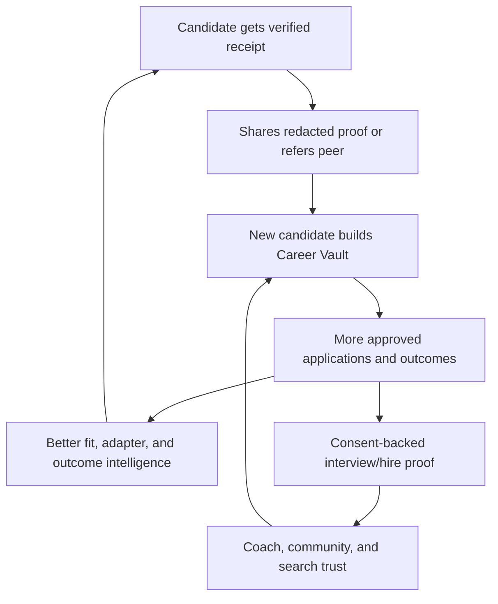

# Go-to-market plan

## Strategic choice

Do not market RoleDawn as “Tsenta, but with a different logo.” Tsenta already owns cheap, high-volume, broad-surface execution. RoleDawn should own the trusted night shift: verified facts, visible changes, one-decision approvals, honest failures, and application receipts.

## Launch offer

### Post-alpha Founding 50

- Founder-assisted Career Vault setup.
- Ten jointly reviewed applications.
- Greenhouse, Lever, and Ashby support only.
- Nightly queue and iMessage approval.
- Direct founder support.
- Locked founding price for an explicit period.

Suggested price experiments after the 10–25-user concierge alpha:

- **Founding:** $99/month, 30 confirmed applications.
- **Pro:** $149/month, 75 confirmed applications plus recruiter-inbox routing when available.

These are test cells. The only billable event is `confirmed_application`: confirmation evidence tied to the correct candidate and requisition. Matches, drafts, failed attempts, canceled attempts, unresolved/uncertain attempts, and duplicates do not consume allowance. A duplicate caused by RoleDawn is credited even if two portals confirm it.

### Unit-economics gate

At full allowance, the proposed prices create this revenue envelope:

| Test plan | Full-use revenue per confirmed application | Maximum p75 fully loaded variable cost for 65% gross margin |
|---|---:|---:|
| Founding: $99 / 30 | $3.30 | $1.16 |
| Pro: $149 / 75 | $1.99 | $0.70 |

Fully loaded variable cost includes model tokens, browser/proxy time, workflow and message usage, payment fees, refunds/credits, and variable support labor. Do not publish a plan if the prior cohort's p75 cost exceeds its threshold. Reduce allowance, raise price, narrow supported ATS terrain, or keep the service concierge-priced. Recalculate on actual utilization as well as full use; low utilization must not hide a structurally bad unit.

## Positioning tests

Run one variable at a time against qualified traffic:

| Angle | Hero | What it tests |
|---|---|---|
| Night shift | Your job search has a night shift. | Delegation and 24/7 relief |
| Text control | The job-application agent in your messages. | Channel-native convenience |
| Trust | Nothing invented. Nothing outside your rules. | Reputation/safety pain |
| Speed | Wake up early to the roles that fit. | First-applicant urgency without volume hype |

Primary metric: qualified visitor → completed Career Vault or booked concierge setup. Do not optimize clicks from people who want mass spam.

## Channel priority

### 1. Design-partner outbound

Founder-led outreach to people actively posting about layoffs, application fatigue, new-grad searches, or repeated ATS work. Offer a controlled concierge pilot, not “unlimited AI applications.”

### 2. Career coaches and outplacement

Give coaches a partner workspace that shows queue, edits, receipts, and outcomes while keeping candidate authority. Test referral fees or revenue share only with clear disclosure.

### 3. Alumni, campus, and professional communities

Run “bring your resume, leave with your Career Vault” workshops. Start with alumni groups and role-specific communities with real active searches; add campuses for density and referrals.

### 4. High-intent search and answer engines

Publish current, evidence-based pages for:

- `RoleDawn vs Simplify`
- `RoleDawn vs Tsenta`
- `Best way to apply through Workday without repeating every field`
- `How AI job applications can stay truthful`
- `What an application receipt should contain`
- ATS-specific guides and supported-status pages.

Ship `/llms.txt`, machine-readable pricing/features, public changelog, status, privacy, security, subprocessors, and comparison methodology. This copies Tsenta's strong GEO discipline without copying its claims.

### 5. Creator cohorts

Partner with a small number of credible job-search creators to document one honest week: approvals, edits, skips, failures, takeovers, and receipts. Do not script a frictionless montage.

### 6. Referrals

Trigger after a confirmed positive moment, not at signup. Reward both people with service credit. A shared redacted receipt must be optional and candidate-controlled.

## Growth loops



### Receipt loop

Optional card: “Confirmed 12 minutes after posting,” with employer hidden by default, timestamp, ATS family, and referral link. Only publish real measured events.

### Outcome loop

Ask candidates to record recruiter response, interview, offer, and hire separately. Request proof/consent only after value is delivered. Use data to improve fit and build credible proof.

### Preference loop

Every skip, edit, “why,” and approval updates a bounded preference model. Show the user what changed. Do not silently convert one edit into a permanent rule.

### Adapter loop

Every safe failure becomes a redacted fixture and regression test. Reliability compounds and lowers support cost.

## Social proof governance

The landing-page logo wall is a future module, not launch decoration.

Required record:

```text
candidate consent
employer
outcome type: interview / offer / hire
evidence reviewed
outcome date
cohort attribution rule
permission scope and expiry
```

Label groups precisely: **Interviewed at**, **Offered by**, **Hired at**. State that employer logos identify candidate outcomes and do not imply endorsement.

Before credible outcomes exist, publish operating proof with denominators:

- “97 of 100 authorized attempts confirmed, Aug 10–24, 2026.”
- “Median 7 minutes from approval to confirmation, n=82.”
- “18% of prepared applications were edited before approval, n=110.”

Examples are format guidance, not current claims.

## First 90 days

### Days 1–30: truth discovery

- Interview 30 candidates.
- Observe 15 full application sessions.
- Launch a landing waitlist with the four positioning tests.
- Recruit ten design partners.
- Record why people refuse resume upload, channel connection, or approval.
- Publish a transparent build log and trust contract.

### Days 31–60: start concierge alpha

- Run the first ten design partners through the controlled alpha.
- Capture redacted real receipts.
- Charge at least some users to test willingness to pay.
- Measure support minutes and direct cost.
- Publish supported-ATS status and known limitations.

### Days 61–90: expand only inside alpha

- Expand to no more than 25 alpha users if safety gates hold.
- Run one seven-day creator cohort.
- Partner with two alumni, campus, coach, or outplacement groups.
- Prepare the referral loop; do not scale it before confirmation and support metrics stabilize.
- Publish the first aggregate report only if sample size and privacy gates are met.

### After day 90: Founding 50

- Invite up to 50 paid users only after the 10–25-user alpha passes safety, reliability, and unit-economics gates.
- Test the $99/30 and $149/75 confirmed-application packages.
- Keep final candidate approval and adapter-specific rollout controls.
- Move toward a 100–500-user private beta only after this cohort is supportable.

## Interview plan

Ask for behavior, not feature opinions:

1. Show me the last three applications you completed.
2. Where did the time go?
3. What did you copy, change, omit, or abandon?
4. Which question made you stop or worry?
5. Have you tried autofill, AI writing, or auto-apply? Show me what happened.
6. What would have to be true before you let a tool click Submit?
7. Which alert belongs in a text and which needs a dashboard?
8. Would you rather approve ten prepared applications or let five go automatically? Why?
9. What proof would make you trust a “submitted” status?
10. What would make you cancel after the first week?

Do not ask “Would you use an iMessage job agent?” until after the observed workflow.

## Funnel

```text
Qualified visitor
→ starts text or books setup
→ creates account
→ uploads resume
→ verifies minimum Career Vault
→ defines active search
→ reviews first match
→ approves first application
→ receives confirmed receipt
→ returns in week two
→ records recruiter response/interview
→ refers or renews
```

Instrument loss and stated reason at each step. Activation is the first confirmed receipt, not account creation.

## Metrics hierarchy

### North Star

**Eligible confirmed applications with documented outcomes.** Report the denominator and time window.

### Growth

- Qualified acquisition cost.
- Career Vault completion.
- Time to first verified match and receipt.
- Week 1/2/4 active-search retention.
- Paid conversion and search-duration LTV.
- Referral rate after receipt/outcome.

### Quality

- Factual correction and unsupported-claim rate.
- Approval, edit, skip, and pause rate.
- Confirmed success and takeover rate by adapter.
- Recruiter response and interview yield by fit band/cohort.

### Economics

- Model, browser, proxy, workflow, and support cost per confirmed application.
- Gross margin by plan and ATS.
- Refund/dispute rate.
- Support minutes per user/week.

### Guardrails

- Unauthorized submissions: zero.
- Duplicate confirmed submissions: zero.
- Sensitive answers without source/policy: zero.
- Employer-logo/outcome claims without proof/consent: zero.

## Pricing method

Test packaging through concierge sales before a public grid:

- Price sensitivity interview after observed value.
- Three paid offers with clear confirmed-application caps.
- Monthly versus four-week search sprint.
- Candidate-paid versus coach/outplacement-sponsored.
- Refund behavior for failed versus confirmed work.

Avoid an application counter that rewards volume disconnected from eligibility or outcome.

## Launch assets

- Landing page from [blueprint](../product/landing-page-blueprint.md).
- 60-second product walkthrough showing one real flow.
- Public trust contract, privacy, security controls, subprocessors, and supported-ATS status.
- Three redacted, consented receipts.
- Two complete case studies including edits and failures, not only wins.
- Founder letter: why the product asks before it acts.
- Comparison methodology and current changelog.
- `/llms.txt` and machine-readable product/pricing facts.

## Brand/content guardrails

- No “revolutionary,” “effortless,” “dream job,” “supercharge,” “unlock,” “magic,” or “guaranteed.”
- No fake text conversations or hidden illustrative labels.
- No robot, stock-candidate, or application-volume theater.
- No “official” ATS language without a real agreement.
- No implication that employers endorse candidate use.
- No social proof without precise outcome, permission, denominator where aggregate, and date.
