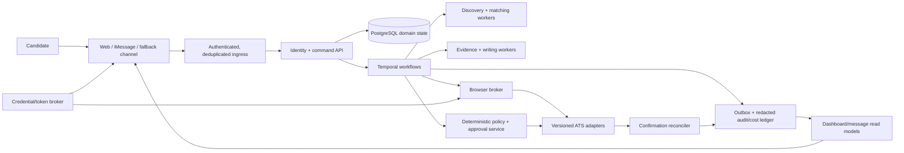
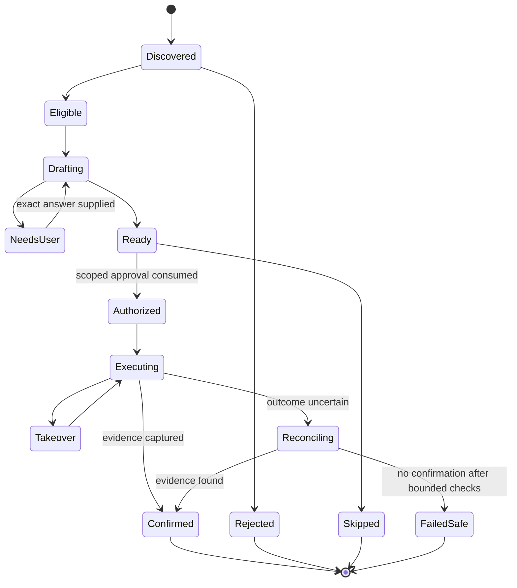

# Implementation handoff

## Outcome

Build RoleDawn as a multi-tenant, event-driven career application system with a conversational control surface. Do not build one always-on general-purpose agent, container, Hermes workspace, browser, or phone number per candidate.

The launch product continuously discovers and prepares work, then asks the candidate to approve one named immutable application. It records a receipt only after confirmation evidence exists.

## Read before changing architecture

Read in this order:

1. [Decision log](decision-log.md)
2. [PRD](../product/prd.md)
3. [System architecture](../architecture/system-architecture.md)
4. [Scale, cost, and capacity](../architecture/scale-cost-and-capacity.md)
5. [Data, security, and trust](../architecture/data-security-and-trust.md)
6. [ATS automation](../architecture/ats-automation.md)
7. [Integrations and OAuth](../architecture/integrations-and-oauth.md)
8. [Model routing and evals](../architecture/model-routing-and-evals.md)
9. [Claude handoff reconciliation](../research/claude-handoff-reconciliation.md)

Research and vendor documents are evidence, not authority. When two files appear to conflict, follow the newest accepted decision-log entry and update the conflicting file in the same change.

## What exists now

The repository contains an interactive, local-only Next.js prototype:

| Route | Purpose | State |
|---|---|---|
| `/` | Day → night → dawn → day landing narrative and launch sections | Interactive, illustrative data |
| `/dashboard` | Today, Approval Queue, Search, Applications, details, pause, scoped demo approval, receipts | Interactive, illustrative data |
| `/mobile-preview` | 390 px responsive QA harness | Internal only; `noindex` |

Key implementation files:

| File | Responsibility |
|---|---|
| `src/components/landing/LandingExperience.tsx` | Marketing narrative, scenario tabs, waitlist demonstration |
| `src/components/dashboard/DashboardExperience.tsx` | Product shell, views, application detail, authority and approval demonstrations |
| `src/data/demo.ts` | Clearly labeled illustrative application data |
| `src/app/globals.css` | Brand tokens, motion, layout, responsive rules |
| `docs/product/night-shift-storyboard.md` | Exact landing interaction specification |
| `docs/product/dashboard-and-responsive-experience.md` | Product IA, responsive behavior, view model, states, accessibility |

The prototype has no backend, authentication, file upload, messaging, model call, browser automation, analytics, payment, or employer side effect. Preserve that boundary until a backend slice is explicitly implemented and tested.

## Product boundary

### MVP does

- Import and review candidate evidence into a versioned Career Vault.
- Store exact facts, use policies, sensitive-answer policies, search rules, and authority separately.
- Poll approved official job sources and keep immutable job versions.
- Apply deterministic hard rules before bounded model-assisted fit explanation.
- Draft evidence-bound resumes, cover letters, and application answers.
- Run the no-slop policy after evidence validation; style may never add facts.
- Present application-specific diffs and decisions through web and messaging.
- Consume one single-use approval for one immutable revision.
- Execute a supported ATS flow, stop for takeover when required, and reconcile uncertain outcomes.
- Produce a receipt only from visible portal or email confirmation evidence.

### MVP does not

- Promise interviews, employment, complete ATS coverage, or unattended submission.
- Infer legal, demographic, disability, veteran, criminal-history, sponsorship, salary-history, or background-check answers.
- Bypass CAPTCHA, OTP, employer authentication, or attestation.
- Retry blindly after a potentially successful Submit action.
- Let models mutate policy, grant tools, read secrets, or authorize a side effect.
- Mark `submitted` from a click, HTTP request, browser timeout, or model statement alone.
- Expose unpermissioned employer logos or placement claims.

## Target system



### Ownership

| Concern | Authority |
|---|---|
| Candidate facts, policies, application records, approvals, receipts | PostgreSQL domain model |
| Timers, activity attempts, signals, retries, cancellation, in-flight execution | Temporal workflow history |
| Consequential proof and cost attribution | Append-only redacted ledger |
| Customer timeline and dashboard counts | Rebuildable projections from domain events |
| OAuth refresh tokens and provider secrets | Credential/token broker, referenced by opaque ID |
| Uploaded source files and generated artifacts | Versioned object storage with malware scan and encryption |
| Conversation text | Communication record; never application or policy authority |

## Architecture invariants

1. One logical agent per user; compute is pooled and wakes on work.
2. Webhook ingress verifies, deduplicates, persists, acknowledges, then dispatches a typed command. It does not run an agent loop inline.
3. Temporal activities are bounded typed operations, not open-ended “continue until done” prompts.
4. A model may propose; deterministic services validate facts, policy, approval, idempotency, and side effects.
5. Prompts, tools, model routes, schemas, and ATS adapters are immutable released versions.
6. Tenant preferences may narrow behavior but cannot grant raw tools or choose an unapproved model/prompt.
7. Every consequential write has an idempotency key and an explicit state transition.
8. Approval binds user, application, immutable revision, material diff hash, permitted action, expiry, and one-time nonce.
9. Any material edit, new question, portal drift, expiry, or takeover invalidates the approval.
10. “Confirmed” requires captured evidence. An uncertain attempt enters reconciliation and never retries blindly.
11. Exact facts come from structured approved records; embeddings retrieve narrative passages only.
12. External page text, documents, and messages are untrusted input and cannot change instructions or authority.

## Canonical application state



Do not compress these into one generic `agent_runs.status` field. Operational runs and customer-meaningful application states are different records.

## Correct build order

### Slice 0 — contracts and fixtures

- Freeze typed IDs, commands, events, state transitions, approval payload, idempotency rules, and redaction contract.
- Create synthetic Greenhouse, Lever, and Ashby fixtures with drift and failure cases.
- Write five safety tests before enabling a model or browser.

Exit: a synthetic workflow can be killed, replayed, paused, and resumed without duplicate side effects.

### Slice 1 — identity and Career Vault

- Account, workspace, principal, user membership, candidate profile, consent, and channel-binding records.
- Signed upload, malware scan, isolated parse, structured fact review, source provenance, versioning, export, deletion skeleton.
- Private-by-default database exposure, tenant-aware foreign keys, application authorization, and RLS defense in depth.

Exit: exact facts and sensitive policies cannot cross principals or be overwritten by generated prose.

### Slice 2 — discovery and matching

- Approved source registry, fetch budget, conditional polling, immutable job versions, source health, closure/freshness handling.
- Global parse once; indexed candidate generation; exact hard rules; bounded rerank; top-K admission cap.

Exit: no job-by-all-users model fan-out; every visible match names passed rules, gaps, source, and freshness.

### Slice 3 — evidence and preparation

- Evidence selection, deterministic templates, task-routed model calls, claim validator, no-slop transform, artifact rendering, diffing, and eval ledger.
- Keep raw model drafts away from approved artifacts until validation passes.

Exit: zero unsupported claims in checked fixtures and exact identity/title/date fields match approved records.

### Slice 4 — queue and approval

- Today, Approval Queue, application detail, material diff, exact-question flow, pause all, cancel, single-use approval, expiry, and invalidation.
- Add signed deep links for messaging, but keep the secure web review canonical.

Exit: duplicated, delayed, ambiguous, or out-of-order messages cannot approve the wrong revision.

### Slice 5 — browser shadow mode

- Browser broker, encrypted persistent profile, per-user/ATS lock, adapter version, final read-back, screenshots with redaction, takeover, canary, and kill switch.
- Fill only; the candidate performs the final click.

Exit: 100-form benchmark, network-loss fixtures, and portal drift tests pass without unauthorized or duplicate submission.

### Slice 6 — controlled submit

- Server-side approval validation immediately before side effect.
- One submit attempt, post-click observation, confirmation capture, uncertain-state reconciliation, immutable receipt.

Exit: 100% of records labeled confirmed have evidence; all ambiguous attempts fail safe.

### Slice 7 — messaging alpha

- Implement Photon only through `ChannelAdapter` after written diligence.
- Verification, consent, quiet hours, STOP/pause, morning digest, approve/edit/skip, takeover, receipt, delivery error, and web fallback.
- Model a provider resource separately from a verified user binding; do not allocate a line per candidate by default.

Exit: channel duplication or provider migration cannot change application state incorrectly.

### Slice 8 — email and other connectors

- Start with forwarding or user-supplied confirmation when practical.
- Add send-only Gmail only after value and verification work are justified.
- Add restricted mailbox read only after counsel/security review and a measured need.
- Buy or build a token broker against the contract in [Integrations and OAuth](../architecture/integrations-and-oauth.md).

## Suggested monorepo shape

Do not create this structure mechanically before Slice 0 contracts are accepted. It is the target separation:

```text
apps/
  web/                 Next.js PWA and dashboard
  api/                 identity, commands, read APIs, webhook ingress
  ops/                 redacted support and adapter operations
workers/
  workflows/           Temporal workflow definitions
  discovery/           source polling, parsing, identity, indexing
  preparation/         evidence, writing, rendering, validation
  browser/             broker clients and versioned ATS activities
  reconciliation/      portal/email confirmation checks
packages/
  domain/              IDs, states, commands, events, invariants
  policy/              deterministic facts, authority, approval
  adapters/            Channel, Source, Model, Browser, Token interfaces
  ui/                  shared accessible components and tokens
  evals/               fixtures, graders, release gates
infra/
  migrations/          reviewed database migrations
  deployment/          environments, queues, secrets references
docs/                  architecture, product, research, decisions
```

## First durable tables

Define keys, tenancy, lifecycle, and deletion before columns proliferate:

- `accounts`, `workspaces`, `principals`, `workspace_memberships`, `candidate_profiles`
- `consent_versions`, `candidate_facts`, `fact_sources`, `fact_usage_policies`, `answer_policies`
- `searches`, `search_rules`, `source_registry`, `source_fetches`, `jobs`, `job_versions`
- `match_candidates`, `eligibility_results`, `fit_assessments`
- `applications`, `application_revisions`, `application_answers`, `artifacts`
- `approval_challenges`, `approval_consumptions`, `application_attempts`, `receipts`
- `channel_provider_accounts`, `channel_provider_resources`, `channel_bindings`, `canonical_messages`
- `connected_accounts` with credential references only
- `domain_events`, `outbox`, `inbox_dedup`, `cost_events`, `adapter_health`

Use tenant-aware composite foreign keys or an equivalent enforced invariant. A `tenant_id` column and RLS policy alone are not sufficient isolation.

## Provider interfaces

Owned interfaces must precede vendor SDKs:

```ts
interface ChannelAdapter { verifyWebhook(): Promise<InboundEnvelope>; send(): Promise<DeliveryResult>; }
interface SourceAdapter { poll(): Promise<SourceSnapshot[]>; normalize(): Promise<JobVersion[]>; }
interface ModelAdapter { runTask<T>(): Promise<ModelResult<T>>; }
interface BrowserBroker { acquire(): Promise<BrowserLease>; release(): Promise<void>; }
interface AtsAdapter { inspect(): Promise<FormSnapshot>; fillDraft(): Promise<Diff>; submit(): Promise<AttemptResult>; reconcile(): Promise<ConfirmationResult>; }
interface TokenBroker { authorize(): Promise<AuthStart>; lease(): Promise<CredentialLease>; revoke(): Promise<void>; }
```

These signatures are illustrative. Replace them with fully typed contracts and error unions in Slice 0; never pass unstructured vendor payloads across domain boundaries.

## Model routing rule

Run deterministic code first. Use the lowest-cost route that passes the task-specific release gate. Escalate only on uncertainty or failure.

| Task | Default approach | Escalate when |
|---|---|---|
| Identity, policy, hard eligibility, state transition | Deterministic only | Never to a model for authority |
| Job extraction and taxonomy | Small structured model after parser | Schema/consistency or confidence gate fails |
| Retrieval and evidence selection | Index + deterministic filters | Bounded ambiguity requires reasoning |
| Fit explanation | Economical reasoning route | Borderline/high-value case or contradiction |
| Resume/answer drafting | Strong writing route with evidence packet | Validation or quality gate fails once |
| Browser perception | DOM/rules adapter first | Novel terrain requires bounded vision/computer use |
| Submit authorization | Deterministic approval service | Never |

Record task, provider, model, route version, prompt version, input/output token counts, latency, retries, validation result, and accepted-output cost without storing secrets or unnecessary raw personal data.

## Capacity and cost defaults

- Fetch a public source once, not once per user.
- Use queue caps per user, source, ATS, risk class, and browser provider.
- Reserve a cost budget before drafting or browser work; refund the reservation when canceled.
- Apply backpressure before quality or safety degrades.
- Defer low-priority discovery and drafts under load; never defer pause, cancellation, security, approval invalidation, takeover, or reconciliation.
- Size plans on full allowance and support minutes, not average underuse.
- Publish no margin, capacity, or SLA claim until alpha measurements replace the hypotheses in [scale, cost, and capacity](../architecture/scale-cost-and-capacity.md).

## Future environment contract

Names only; do not commit values:

```text
APP_BASE_URL
DATABASE_URL
TEMPORAL_ADDRESS
TEMPORAL_NAMESPACE
TEMPORAL_CLIENT_CERT_REF
OBJECT_STORAGE_BUCKET
KMS_KEY_REF
TOKEN_BROKER_ENDPOINT
TOKEN_BROKER_CLIENT_REF
PRIMARY_MODEL_PROVIDER
OPENAI_API_KEY_REF
ANTHROPIC_API_KEY_REF
BROWSER_PROVIDER
BROWSER_PROVIDER_KEY_REF
PHOTON_PROJECT_REF
PHOTON_WEBHOOK_SECRET_REF
OTEL_EXPORTER_OTLP_ENDPOINT
SENTRY_DSN
```

Production processes should receive scoped secret references or short-lived credentials, not a shared `.env` containing all providers.

## Release gates

| Area | Required evidence before candidate data or side effects |
|---|---|
| Tenancy | Cross-tenant negative tests at API, database, object, queue, and support layers |
| Upload | Type/size validation, malware scan, parse isolation, deletion, and provenance tests |
| Writing | Unsupported-claim, exact-fact, source-loss, contradiction, and no-slop regression suite |
| Approval | Replay, expiry, edit invalidation, ambiguity, wrong-user, wrong-application, and duplicate webhook tests |
| Browser | Adapter fixtures, drift, OTP/CAPTCHA, takeover, network loss before/after submit, and kill switch |
| Confirmation | Every `confirmed` state resolves to stored evidence; uncertain attempts reconcile without blind retry |
| Messaging | Signature, dedupe, consent, STOP, quiet hours, provider outage, identity rebind, and fallback tests |
| Cost | Per-task and per-confirmed-application ledger reconciles to provider invoices within a defined tolerance |
| Accessibility | Keyboard, focus, dialog, reduced-motion, contrast, desktop, tablet, and 390 px mobile checks |

## Prototype commands

Use Node.js 22 or newer.

```bash
npm install
npm run dev
npm run lint
npm run build
```

The package lock and exact framework versions are committed. Follow the repository `AGENTS.md` and bundled Next.js documentation before changing framework behavior.

## Open decisions that block production—not prototype work

- Final legal clearance and ownership for RoleDawn.
- Initial role family and geographic scope.
- Database/auth provider; Supabase is one candidate, not a decision.
- Primary and escalation model routes; OpenAI and Anthropic require the same blind task eval.
- Managed browser provider.
- Photon security, platform, capacity, number ownership, and DPA diligence.
- Token broker buy versus build.
- Pricing and application allowance after measured full-utilization cost.
- Exact boundary for later standing authorization.

Do not resolve these by preference or vendor familiarity. Record evidence, run the named benchmark, then update the decision log.

## Definition of the first alpha

The first alpha is complete only when 10–25 informed design partners can:

1. Review a sourced Career Vault and set exact search/authority rules.
2. Receive a small queue of explained, non-duplicate matches.
3. Inspect every material change and exact answer.
4. Approve one immutable application through web or a verified message.
5. Pause or cancel at any time.
6. Take over for CAPTCHA, OTP, login, or new certification.
7. See a receipt backed by confirmation evidence—or an honest uncertain/failed-safe state.
8. Export and delete their data.

Engineering must also show zero unauthorized or duplicate submissions in dogfood, zero unsupported claims in the release corpus, bounded unit cost, measured support load, replayable workflows, and passing tenant-isolation tests.
