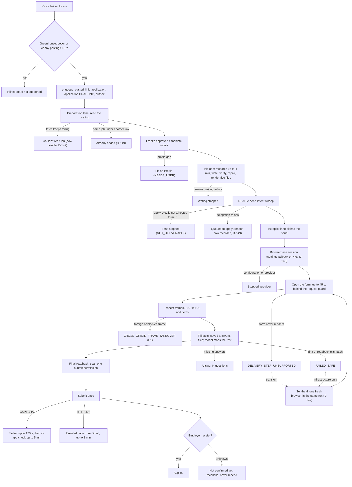

# Reliability review, 2026-10-01

The founder reported that the latest run "stopped right away" and asked for the
whole pipeline to be made reliable, observable and fast. This review was done
overnight **without production access**: the session's network policy blocked
Supabase, Netlify, Browserbase, OpenAI and the employer sites, and the attached
Supabase connector belongs to another account. Every cause below is therefore
**Inference** unless marked **Verified**. The first `npm run ops:why` after the
next stop replaces inference with the recorded cause.

## Summary

| | |
|---|---|
| What was built (D-149) | Stop diagnostics on every non-confirmed send and `npm run ops:why`; one fresh-browser retry for transient pre-submit stops; a longer first page load; Browserbase project selection, settings fallback and region; writing-lane time budget and retry fixes; intake states that no longer stick silently; a migration that records why a send request cannot start. |
| What was not changed | No delivery guard was loosened. The auto-mode safety classifier refused relaxing the frame check and reading the Ashby protocol for relaxation, so those are proposals P1–P5 below. |
| What you do in the morning | Deploy, apply migration `20261001040000`, run `npm run ops:why`, decide P1–P6 (see [Morning checklist](#morning-checklist)). |

## Why the latest run stopped (ranked)

The latest run was the first live send after D-146/D-147 (CAPTCHA solving,
recording and logs on) and D-148. The recorded worker event names the code;
`npm run ops:why` explains it.

| Rank | Likely cause | Code you would see | Status after D-149 |
|---|---|---|---|
| 1 | A third-party iframe on the page (video, social widget, analytics) is refused by the guard. Chrome swaps in its own error page (`chrome-error://chromewebdata/`, origin `null`), and the form reader stops on that "foreign frame". **Verified locally** with real Chromium on 2026-10-01. | `AGENTS_FILL_CROSS_ORIGIN_FRAME_TAKEOVER` | Diagnosed by `ops:why` (frames list); fix is **P1**. |
| 2 | The form did not render within 15 s in a cold cloud browser, or a new ATS asset was refused so it could not render. | `DELIVERY_STEP_UNSUPPORTED` | First load now waits 45 s and the send retries once with a fresh browser; refused assets are listed. A refused-asset render failure needs **P3** or a reviewed allowlist entry. |
| 3 | The Browserbase API key sees more than one project. | `BROWSERBASE_PROJECT_SCOPE_INVALID` | Set `BROWSERBASE_PROJECT_ID`. |
| 4 | Ashby changed its public client, so a GraphQL query text no longer matches the reviewed hash at page load. | `DELIVERY_ASHBY_REQUEST_*_QUERY_DOCUMENT` or `*_OPERATION_UNKNOWN` | Diagnosed; fix is re-review or **P5**. |
| 5 | Browserbase rejected the new session settings. | Provider 4xx | The send now retries once with the settings that produced the three confirmed Greenhouse applications. |
| 6 | The link was not a supported hosted posting, so Home rejected it inline. | Inline message | Unchanged; a general adapter is **P6**. |

## The pipeline, step by step

| Step | Code | Where it can stop | How you see it now |
|---|---|---|---|
| Paste | `src/app/(candidate)/apply-actions.ts`, `src/server/ingestion/job-reference.ts` | Unsupported board or URL shape; inactive candidate | Inline message |
| Read posting | `src/server/workers/application-queued.ts` | Fetch failures, closed posting, duplicate job | Intake guidance; final transient failure and duplicates are now visible (D-149) |
| Freeze inputs | `src/server/workers/application-preparation.ts` | Missing résumé, evidence or career profile | Finish Profile |
| Write | `src/server/workers/application-kit.ts`, `application-writing-pipeline.ts` | Model errors, verifier, quality blocks, time | Writing stopped; `writing-check` events |
| Queue send | `delegate_ready_send_intents` | Not deliverable; stale revision; earlier attempt | Send stopped; recorded reason after migration `20261001040000` |
| Browser | `src/server/workers/application-delivery-runtime.ts` | Provider config, quota, rate, connection | `stop-diagnosis` stage `browser-start` |
| Form | `application-delivery-browser.ts`, `agents-browser-tools.ts`, `application-delivery-driver.ts` | Render, frames, CAPTCHA, unsupported controls, drift, Ashby contract | `stop-diagnosis`: phase, page, frames, refused requests, solver events, replay |
| Submit | `begin_application_autopilot_submit` | Final drift, CAPTCHA, emailed code | Phase `submit` or `emailed-code` |
| Receipt | `receipt()` in the delivery browser | Unknown outcome | Not confirmed yet; reconcile only |

## What has broken so far

From the [current state](current-state.md) and the [decision log](decision-log.md)
(D-118 to D-148). About twenty consecutive live runs between 2026-09-30 and
2026-10-01 each stopped before submission on a different exact-match check;
each needed a code change and a deploy. Three Greenhouse applications were
confirmed before that sequence.

| Category | Examples (decision) | Count |
|---|---|---|
| Ashby contract exactness | Action-ID rotation (D-126), frame URL lag (D-127/D-128), location label (D-129), disabled controls at final click (D-130), composite definition ID (D-137), mixed-location mount (D-138), Enterprise token prefix (D-145) | 8+ |
| CAPTCHA and human checks | Idle hidden reCAPTCHA document (D-139), visible checks at final click (D-144), check images blocked (D-145), Lever hCaptcha | 5 |
| Field readback exactness | Lever parser overwrite (D-138), filename case (D-139), paragraph breaks (D-142), native maxLength (D-143), React Select on Linux | 5 |
| Answers and questions | Optional parser fields (D-140), region dropped by mapper (D-141), recall excluded same send (D-143) | 3 |
| Operations | Writing failure release, OpenAI credits, LinkedIn connection stall (D-148) | 3 |

**Pattern.** The delivery path fails closed on anything it has not reviewed.
That keeps submissions exact, but every new page detail becomes a stop and a
deploy cycle. Production agents that report high write-task success use a
different shape: observe, classify, and repair inside the run, keeping the
hard stop at final readback and the single submit (sources below). D-149 adds
the observe and classify half; P1–P5 are the repair half, which changes guards
and so needs your decision.

## What changed in D-149

| Area | Change | Evidence |
|---|---|---|
| Diagnostics | Every non-confirmed send records a `stop-diagnosis` event: coordinator stage, driver phase, page origin and path, frames, refused requests by reason and destination (no queries or values), solver console events, Browserbase session ID. | `delivery-diagnostics.test.ts` (including a real-browser refused request), `application-autopilot-worker.test.ts` |
| `npm run ops:why` | Explains each recent application: stage, cause, next step, proposal, replay link, refused requests, frames, events. | `stop-diagnosis.test.ts`; SQL validated against all migrations in PGlite |
| Self-heal | One fresh browser in the same run for `DELIVERY_STEP_UNSUPPORTED`, unexpected exceptions and model or provider errors, before any permit, attempt or question. Guard verdicts never retry. | Coordinator tests: retries once, never after a permit, a question or a guard verdict |
| First load | 45 s instead of 15 s for the first page in a fresh cloud browser. | Slow-render fixture test |
| Browserbase | `BROWSERBASE_PROJECT_ID`; on a definitive 4xx, one retry with the proven pre-D-146 settings; default region `us-east-1`. | Runtime tests |
| Writing | Transient context reads retry; verifier credit exhaustion is terminal; research capped at 4 minutes; repair rounds only if they fit 13 minutes. | Kit and research tests |
| Intake | Final transient fetch failure becomes "Couldn't read job"; the same job under another link becomes "Already added". | Queued-handler and guidance tests |
| Send queue | Migration `20261001040000` records why an open send request cannot start. **Not yet applied.** | `supabase/checks/send_intent_delegation_failures.sql` |

## Decisions for you

Each proposal loosens a fail-closed guard **before** submission. None changes
the sealed single-use permission, exact final readback or the receipt rule.
They were not implemented because the session's safety classifier treats
guard changes as security decisions that belong to you.

| ID | Proposal | Fixes | Risk | Recommendation |
|---|---|---|---|---|
| P1 | Skip Chrome's own error page (`chrome-error://chromewebdata/`) and browser-extension frames in the form reader; read `about:srcdoc` frames like `about:blank`. A frame that really loads from another origin still stops. | Rank 1 above, verified locally | Very low: an error page has no content or controls. | Approve |
| P2 | Ignore `chrome-extension://` service workers when checking the isolated context. | Possible stop with the solver on | Low: the provider already controls the browser. | Approve if `ops:why` shows `DELIVERY_SERVICE_WORKER_UNSUPPORTED` |
| P3 | Before submit, let unreviewed **GET** subresources load (scripts, styles, fonts, images) and record them, instead of refusing them. POSTs and the final request stay exact. | Forms that cannot render after an ATS asset change | Medium: a third-party script could read the page. | Approve with recording, or allowlist each host `ops:why` reports |
| P4 | Run delivery in Browserbase's default context so its CAPTCHA solver and stealth apply. Today candidate pages use a new isolated context, where the solver likely never engages (**Inference**; `solverStarted` in `ops:why` will show it). | CAPTCHAs needing a person; possibly fewer Greenhouse emailed codes | Medium: shares the provider's default profile. | Test on one Greenhouse send after `ops:why` shows `solverStarted 0` |
| P5 | Ashby: accept a known operation whose query text changed, still behind every variable, echo and value check; pass unknown read-only queries; block unknown mutations quietly instead of stopping. | Ashby stopping at page load after each client release | Medium | Approve for read-only queries first |
| P6 | A general delivery path for other boards (Workday, SmartRecruiters, career sites) with the same readback, sealed single submit and a receipt from the employer's page or email. | "Any link works" | High: new adapter surface; account boards need O-012. | Plan as the next build |

## Best practices applied to RoleDawn

Sources were gathered on 2026-10-01; vendor and benchmark figures are claims,
not independent facts.

| Practice | RoleDawn today | Next |
|---|---|---|
| Separate transient, repairable, candidate-needed, terminal and unknown outcomes; retry only transient ones automatically ([Temporal retry policies](https://github.com/temporalio/documentation/blob/main/docs/encyclopedia/retry-policies.mdx), [Skyvern production guide](https://github.com/Skyvern-AI/skyvern/tree/main/docs/developers/going-to-production)) | Stop guidance has retry classes; D-149 adds in-run self-heal for infrastructure. | Add the database retry cap and quota backoff already proposed in the playbook. |
| Validate in code after each step; validation loops gave the largest measured gains ([Skyvern 2.0](https://www.skyvern.com/blog/skyvern-2-0-state-of-the-art-web-navigation-with-85-8-on-webvoyager-eval/), vendor claim) | Exact readback on every write, sealed final review. | Repair on mismatch with one alternate write strategy before stopping (needs a decision like P1–P5). |
| Write tasks are about half as reliable as reads on live sites ([Online-Mind2Web](https://github.com/OSU-NLP-Group/Online-Mind2Web), [WebBench](https://github.com/Halluminate/WebBench)) | Deterministic fills for known facts; the model maps only the rest. | Keep the model off exact facts; grow board templates from `ops:why` stops. |
| One trace per run with step, duration, stop class and replay ([OpenTelemetry GenAI agent spans](https://github.com/open-telemetry/semantic-conventions-genai/blob/main/docs/gen-ai/gen-ai-agent-spans.md)) | Worker events per send and model turn; Browserbase recording (D-147); now `stop-diagnosis` and `ops:why`. | Count stop codes weekly and turn the top one into a fixture test. |
| Co-locate the browser with the workers; cache page reads ([Browserbase multi-region](https://docs.browserbase.com/optimizations/latency/multi-region), vendor claim) | Region now defaults to `us-east-1`; React Select reads cached (D-104). | Measure `openMs`, `readMs`, `modelMs` in `ops:status -- --app`. |
| CAPTCHA solver signals `browserbase-solving-started` and `-finished` in the page console ([Browserbase example](https://github.com/browserbase/sdk-node/blob/main/examples/playwright-captcha.ts)) | Counted in diagnostics. | Use them to end the 120 s wait early once P4 is decided. |

## Morning checklist

1. Deploy `claude/nifty-clarke-atdrn4` after merging: `npm run deploy` (it builds).
2. Apply migration `20261001040000_record_send_intent_delegation_failures.sql` by the [hosted migration steps](../../AGENTS.md#hosted-migrations); types are unchanged (same signature).
3. If the Browserbase key can see several projects, set `BROWSERBASE_PROJECT_ID` in Netlify and redeploy.
4. Run `npm run ops:why`. For last night's run it explains the recorded failure code (the new diagnostics start with this deploy); its Browserbase recording (D-147) is in the dashboard under that time. Every later stop also shows refused requests, frames and a replay link.
5. Paste one Greenhouse link (the only board with confirmed receipts) and watch `npm run ops:status -- --app <id>`.
6. Decide P1–P6. P1 is a two-line change with a ready regression test (a page with a blocked iframe).
