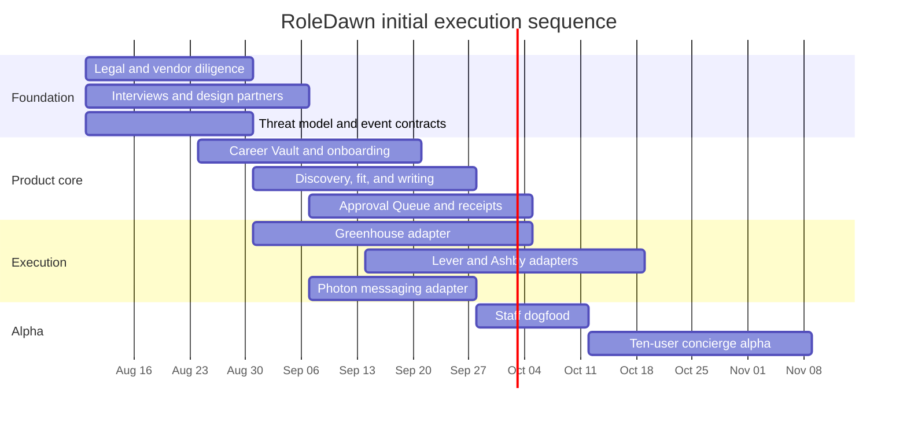

# Execution roadmap

## Operating rule

Build trust depth before surface breadth. The first milestone is not “an agent that can browse.” It is one application that survives failure, asks the right person at the right time, submits once, and proves what happened.

The [implementation handoff](implementation-handoff.md) translates this company roadmap into the canonical engineering slice order. In particular, contracts and safety fixtures precede vendor SDKs; the Career Vault and approval loop precede Gmail; messaging follows a working web control path; and controlled submission follows browser shadow mode.

## Phase map

Dates are a sequencing model, not a commitment. A small team should adjust after staffing and counsel/vendor response times are known.

## Phase 0 — foundation and proof, weeks 1–3

### Company and legal

- Counsel review: ATS terms, candidate authority/attestations, messaging consent, privacy, automated decision concerns, consumer billing, endorsements, and employer-logo use.
- Draft plain-language privacy/data map and initial subprocessor list.
- Define unsupported use cases and enforcement.
- Begin RoleDawn trademark clearance and reserve approved domains/handles only after founder sign-off.

### Customer discovery

- Recruit 20–30 interviewees across early/mid-career, new-grad, layoff, OPT, and career-change cohorts.
- Select ten design partners with current searches and standardized role targets.
- Observe actual application sessions; measure time by discovery, tailoring, form filling, login, question handling, and tracking.
- Test iMessage versus push/email preference rather than assuming it.

### Technical proof

- Benchmark 100 real application forms without submitting.
- Classify ATS, auth, question, file, certification, CAPTCHA, and confirmation patterns.
- Write typed domain/event contracts, state machine, approval spec, and threat model.
- Build the first redacted fixture set and failure-injection tests.
- Diligence Photon and two browser vendors.

### Exit gates

- Counsel identifies a viable controlled MVP path or explicit changes.
- At least ten candidates agree to a design partnership under informed scope.
- Greenhouse/Lever/Ashby cover a meaningful share of the selected searches.
- One end-to-end synthetic workflow pauses/resumes across a worker kill.
- Photon has an acceptable alpha risk posture and web fallback is designed.

## Phase 1 — product core, weeks 3–7

### Build

- Authentication, tenant/user model, channel binding, and consent records.
- PDF upload, scan, isolated parse, Career Vault review, fact versions, and provenance.
- Search rules with hard constraints, preferences, and caps.
- Job ingestion and immutable snapshots.
- Deterministic eligibility plus model-assisted fit explanation.
- Evidence selection, tailored materials, no-slop pass, claim validator, and artifact rendering.
- Approval Queue, secure review links, application diff, single-use token, global pause.
- Temporal application workflow and redacted audit/cost ledger.

### Internal operations

- Support console with scoped redacted visibility.
- Eval runner for job parsing, writing, application questions, approvals, and prompt injection.
- Dashboard for model/adapter version, cost, latency, and failures.
- Data export and deletion skeleton before real user data.

### Exit gates

- Zero unsupported claims across the checked-in writing corpus.
- Identity/title/date/employer exact-field tests pass at defined threshold.
- Duplicate/out-of-order channel messages cannot reuse an approval.
- A material edit invalidates approval.
- Secrets do not appear in stored prompts, traces, screenshots, or analytics in automated tests.

## Phase 2 — execution alpha, weeks 5–10

### ATS adapters

For Greenhouse, Lever, and Ashby:

1. Fixture extraction.
2. Live shadow extraction.
3. Draft-only fill.
4. Human final click.
5. Single-application approval and controlled submit.

Implement:

- Browser broker, persistent encrypted profile, per-ATS locks.
- Human takeover.
- Final read-back/diff.
- Confirmation page capture.
- Uncertain-submit reconciliation.
- Daily non-submitting canaries and adapter kill switch.

### Messaging

- Photon `ChannelAdapter` and signed webhook verification.
- Test message, morning digest, approval, ambiguity, pause, opt-out, takeover, and receipt.
- PWA fallback for every action.

### Exit gates

- Zero unauthorized or duplicate submissions in staff dogfood.
- 100% confirmed applications have evidence.
- Network-loss tests before/after Submit never retry blindly.
- CAPTCHA/login/OTP/new certifications always pause.
- Candidate can cancel, pause all, export, and delete.

## Phase 3 — concierge alpha, weeks 9–12

### Cohort

- Ten to 25 users.
- U.S. English.
- One to three role families chosen from discovery data.
- Greenhouse/Lever/Ashby only.
- Final approval for every application.
- Human operations review every pre-submit package.

### Service design

- Founder-led 30-minute Career Vault setup.
- Ten jointly reviewed applications per user before normal queue behavior.
- Private support channel with response targets.
- Weekly structured interview on anxiety, trust, edits, failures, outcomes, and willingness to pay.

### Measure

- Vault completion and time-to-first-match.
- Factual correction, approval, takeover, confirmed success, and reconciliation.
- Time saved and support minutes.
- Cost per prepared and confirmed application.
- Recruiter response and interview yield with precise denominators.
- Day 7/14/28 retention.

### Go/no-go

Proceed when:

- Safety invariants remain at zero violations.
- Users repeatedly approve, return, and describe reduced burden.
- Supported adapters achieve stable confirmation with bounded takeover/support.
- Direct cost and support load can fit a plausible paid plan.

Pause expansion if one trust failure repeats, if support is hiding systemic adapter errors, or if outcome quality deteriorates as volume rises.

## Phase 4 — post-alpha Founding 50, following 4–6 weeks

- Invite no more than 50 paid users after the 10–25-user alpha passes safety, reliability, and unit-economics gates.
- Test the confirmed-application packages defined in the GTM plan.
- Preserve final candidate approval for every application.
- Operate the referral loop at limited volume.
- Confirm that support, browser, and model cost remain inside the full-utilization margin envelope.

## Phase 5 — private beta, following 6–10 weeks

- 100–500 users with waitlist and fit screening.
- Add Workday, iCIMS, and Oracle one adapter at a time.
- Confirmation-email ingestion and portal reconciliation.
- Profile variants and role-family evidence views.
- Billing, allowance definitions, refunds, and cancel flows.
- Referral and outcome-evidence systems.
- Restricted standing authorization for proven flows only.
- Security assessment, penetration test, incident drill, public subprocessors, and SOC 2 readiness.

Do not add native mobile until data shows the PWA/message loop is a retention bottleneck.

## Phase 6 — partnership moat

- Greenhouse sourcing/candidate ingestion route.
- iCIMS partner/Apply Network route.
- Oracle Marketplace Direct Apply.
- Workday and job-board partnerships.
- Coach, outplacement, university, and employer-sponsored distribution.
- Replace brittle browser steps with contractually authorized APIs.

## Phase 7 — scale

- Worker queues partitioned by ATS, region, and risk.
- Noisy-neighbor controls and regional data boundaries.
- Internal browser fleet only if managed-browser economics/compliance justify it.
- SOC 2 Type II after an operating period.
- Native mobile only with a clear capability/retention case.

## Team plan

Lean alpha team:

- Founder/product/GTM: customer discovery, policy, partnerships, concierge ops.
- Senior automation engineer: browser broker, ATS adapters, fixtures, recovery.
- Full-stack product engineer: onboarding, dashboard, API, messaging.
- Applied AI engineer or strong product engineer: evidence pipeline, routing, evals.
- Fractional design/brand: product system and landing implementation.
- Fractional counsel/security early; expand before beta.

Do not hire a large multi-agent research team before the adapter and trust loop is proven.

## Weekly operating review

1. Safety incidents and near misses.
2. User-reported factual corrections.
3. Adapter confirmation/takeover/reconciliation by version.
4. Approval behavior and abandonment reasons.
5. Recruiter response/interview outcomes by fit band.
6. Cost and support minutes per confirmed application.
7. Top three failure fixtures added.
8. One decision to keep, reverse, or test next.

## Founder action list for the next seven days

- Approve or reject the RoleDawn name direction.
- Schedule counsel and Photon diligence.
- Recruit the first ten design partners.
- Choose two initial role families for observation.
- Create the 100-form benchmark list.
- Turn the landing blueprint into a clickable mobile-first prototype.
- Define the first five safety evals before writing production agent code.
