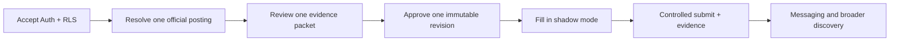

# Execution roadmap

## Operating rule

Build trust depth before surface breadth. Do not restore Browse, Swipe, Career
Vault fixtures, the marketing landing page, or a sample workspace to the runtime
while the persistent pasted-link path is incomplete.

The current activation path is:

## Milestone 0 — persistent foundation acceptance

**Status: complete.** Hosted HireWire run `20260812135034` verified the
persistent control plane, cross-tenant RLS boundary, command and URL
idempotency, bounded dead-letter recovery, and one official-source resolver run.

### Build and verify

- Keep all eleven hosted migration versions aligned with their immutable local
  files; use forward-only migrations for every later change.
- Preserve the gated acceptance harness and rerun it after changes to Auth,
  tenancy, commands, Queue reads, resolver behavior, or outbox recovery.
- Keep secrets ignored and server-only.

### Exit gate

One supported posting persists once, remains visible after reload, resolves once,
and is invisible to another candidate. No employer side effect exists.

**Exit gate met:** run `20260812135034`. No receipt or submission authority was
created.

## Milestone 1 — reviewed candidate evidence

- Add quarantined resume upload, malware scanning, isolated parsing, and source
  hashes.
- Let the candidate review structured facts and allowed uses.
- Add retention, export, and deletion skeletons before real candidate documents.
- Keep sensitive answers explicit, scoped, and never model-inferred.

Exit: one candidate can approve an exact fact set without cross-tenant or
generated-prose mutation.

## Milestone 2 — immutable no-submit packet

- Consume `application.job_resolved` with a durable worker.
- Capture immutable job, candidate, fact, policy, and source snapshots.
- Benchmark task-routed model providers against cited fixtures.
- Validate every claim, run deterministic no-slop checks, render PDF/DOCX, and
  persist exact artifact hashes.
- Expose packet, changes, questions, and provenance in application detail.

Exit: one reviewable application packet contains zero unsupported claims and no
submission authority.

## Milestone 3 — browser shadow mode

- Benchmark managed browser providers across 100 forms without submitting.
- Implement Greenhouse first behind the owned browser/ATS contracts.
- Add final read-back, redaction, takeover, per-application locks, and kill
  switches.
- Stop for login, OTP, CAPTCHA, unknown certification, sensitive answer, or
  portal drift. The founder performs the final employer click.

Exit: draft-only fill survives drift and network-loss tests without an
unauthorized or duplicate side effect.

## Milestone 4 — controlled submit and reconciliation

- Issue one short-lived approval tied to the named candidate, job version,
  packet, diff, action, expiry, and nonce.
- Consume it transactionally immediately before one submit attempt.
- Capture confirmation evidence or enter same-attempt reconciliation.
- Add pause, cancel, operator incident, and immutable receipt paths.

Exit: every confirmed state has external evidence; uncertain attempts never
retry blindly.

## Milestone 5 — messaging and concierge alpha

- Complete Photon legal, security, reliability, and portability diligence.
- Add messaging only behind `ChannelAdapter`, with signed ingress, dedupe,
  consent, STOP, quiet hours, and web fallback.
- Recruit 10–25 informed design partners in one to three repeatable role
  families.
- Human-review every packet before submission during alpha.

Measure factual corrections, approvals, takeover, confirmation, reconciliation,
time saved, support minutes, cost per prepared/confirmed application, recruiter
response, interviews, and retention with exact denominators.

## Parallel founder work

- Counsel review of ATS terms, attestations, privacy, messaging, billing, and
  employer-logo/outcome claims.
- Twenty candidate interviews and ten design-partner commitments.
- RoleDawn trademark clearance and approved domain/handle reservation.
- Browser, model, token-broker, and Photon diligence using the recorded gates.
- Pricing research only after measured full-utilization cost and support load.

## Explicitly later

- Broad catalog polling and licensed job-data partnerships.
- Gmail or restricted mailbox access.
- Standing authorization.
- Workday, iCIMS, and Oracle adapters.
- Native mobile.
- Public placement logos or outcome claims without consented evidence.

The [implementation handoff](implementation-handoff.md) owns the engineering
sequence. The [current state](current-state.md) owns what exists now.
