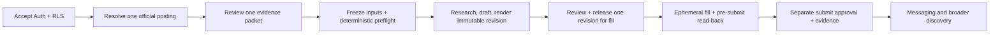

# Execution roadmap

## Product-system frame

The roadmap advances three linked systems rather than three independent apps:

1. [Candidate Intelligence](../architecture/three-system-product-architecture.md#system-1-candidate-intelligence) owns private candidate evidence and policy.
2. [Opportunity Intelligence](../architecture/three-system-product-architecture.md#system-2-opportunity-intelligence) owns the shared attributable job market plus private candidate-job relations.
3. [Application Delivery](../architecture/three-system-product-architecture.md#system-3-application-delivery) owns one candidate-and-job workflow from preparation through proof.

The fastest route to value remains a thin vertical slice. The first
per-application input freeze and deterministic preflight are now deployed. The
ready preflight and one complete no-submit Application Kit are now verified for
founder dogfood: official-posting research, Terra drafting, deterministic plus
semantic validation, exact-fact merge, one atomic revision, four private
QA-passed PDF/DOCX artifacts, and candidate downloads. Guided onboarding,
candidate search goals, deterministic fit reasons, material review, single-use
fill-only authority, exact execution materialization, provider-neutral session
coordination, leases, recovery, Browserbase synthetic acceptance, and candidate-
owned Live View lookup now form the founder-alpha foundation. A four-lane
worker service passed a live local run but is not hosted. The next delivery
gate is one real Greenhouse-first fill-to-read-back with a retained guarded
review session.

## Operating rule

Build trust depth before surface breadth. Search and Saved are now persistent
surfaces over one reviewed source; do not add Swipe, synthetic match scores,
more catalog breadth, the marketing landing page, or a sample workspace before
candidate review and browser shadow mode preserve the accepted trust boundary.

The current activation path is:

```mermaid
flowchart LR
    A["Accept Auth + RLS"] --> B["Resolve one official posting"]
    B --> C["Review one evidence packet"]
    C --> P["Freeze inputs + deterministic preflight"]
    P --> D["Research, draft, render immutable revision"]
    D --> E["Review + release one revision for fill"]
    E --> F["Ephemeral fill + pre-submit read-back"]
    F --> G["Separate submit approval + evidence"]
    G --> H["Messaging and broader discovery"]
```

## Milestone 0 — persistent foundation acceptance

**Status: complete.** Hosted HireWire run `20260812135034` verified the
persistent control plane, cross-tenant RLS boundary, command and URL
idempotency, bounded dead-letter recovery, and one official-source resolver run.

### Build and verify

- Keep every hosted migration version aligned with its immutable local file;
  use forward-only migrations for every later change. The current remote/local
  ledger is aligned at 41 entries; compare exact names after every addition.
- Preserve the gated acceptance harness and rerun it after changes to Auth,
  tenancy, commands, Queue reads, resolver behavior, or outbox recovery.
- Keep secrets ignored and server-only.

### Exit gate

One supported posting persists once, remains visible after reload, resolves once,
and is invisible to another candidate. No employer side effect exists.

**Exit gate met:** run `20260812135034`. No receipt or submission authority was
created.

## Milestone 1 — reviewed candidate evidence

**Status: partial, founder dogfood handoff verified.** Private résumé ingestion/review, exact application answers,
and source-linked exact-passage evidence review are implemented. Evidence run
`20260816235101` passed all 10 hosted checkpoints plus cleanup, including
two-user isolation, direct-write and stale-write denial, immutable citations,
and exact-document deletion of the new evidence records. The deterministic
Candidate Evidence Snapshot, story development, voice policy, and retrieval are
not connected.

Founder dogfood now has one real reviewed résumé segmented by
`resume-passages/2` into 17 source-linked items: 12 approved and five still in
review. One application-scoped input snapshot references the 12 approved
versions. That proves the current review-to-preflight seam, not the separate
reusable Candidate Evidence Snapshot.

- Add quarantined résumé upload, malware scanning, isolated parsing, and OCR
  around the existing source hashes and reviewed-text lifecycle.
- Preserve the accepted deterministic source passages and candidate
  approve/edit/reject/use controls; rerun the hosted harness after changes to
  evidence authority, source lifecycle, or deletion.
- Assemble only approved evidence versions, exact answers, use policy, and
  explicit gaps into one deterministic Candidate Evidence Snapshot.
- Add story and voice proposals only as cited, candidate-reviewed versions.
- Add retention, export, and deletion skeletons before real candidate documents.
- Keep sensitive answers explicit, scoped, and never model-inferred.

Exit: one candidate can approve an exact evidence set and capture a reproducible
snapshot without cross-tenant or generated-prose mutation.

## Parallel slice — first opportunity catalog

**Status: implemented and accepted at the current candidate boundary.**
Anthropic is the only allowlisted tenant. The latest worker-service proof
observed 464 open jobs; the hosted catalog now has 480 jobs and 492 immutable
versions. Earlier conditional acceptance completed as HTTP 304 `NOT_MODIFIED`.
Search and Saved use opaque cursor pages of 24 and show deterministic fit labels
and reasons from candidate goals plus verified eligibility. Run
`20260816235350` passed all 12 hosted checkpoints plus cleanup, including
candidate isolation, replay and stale-version controls, preparation-only
queueing, direct table denial, and an unchanged shared catalog. The service is
not deployed; broader sources, persisted fit runs, watchlists, and learned
ranking remain outside the accepted boundary.

- Deploy the existing worker service and add source-health alerts around the
  current one-source lane.
- Keep allowlist expansion behind employer/source, rights, completeness, and
  adapter review.
- Add watchlists, eligibility, and recommendations only after their versioned
  contracts and evaluation sets exist.

Exit for this parallel slice: the source runs on schedule, one incomplete poll
cannot mass-close jobs, and stale-source state is visible to an operator.

## Milestone 2 — immutable no-submit packet

**Status: complete for one founder Application Kit.** The exact
job/candidate/policy input freeze, deterministic blocker evaluation, immutable
snapshot commit, retry replay, and stale-version denial are verified live. The
Application Kit worker consumed the ready handoff, created official-posting
research, ran strict parsing plus deterministic and semantic gates, merged exact
facts outside the model, committed one current revision, and persisted exactly
four private QA-passed résumé/cover-letter PDF/DOCX artifacts.

The first delivery attempt failed closed on timestamp parsing and created no
revision or artifact. Replay succeeded on attempt two without duplicate rows.
Application detail renders all four authenticated downloads and the explicit
no-submit statement. No approval, attempt, or receipt exists.

- Deploy the accepted worker service and add latency, cost, retry, queue-lag,
  and stuck-run alerts.
- Expose exact citations, unanswered questions, and the material diff in
  application detail.
- Unify PDF/DOCX typography in renderer v2 without weakening exact-byte and
  provenance binding.

**Exit met:** one reviewable application packet contains validated cited facts,
exact hashes, and no submission authority. See the
[hosted acceptance record](application-kit-hosted-acceptance.md).

## Milestone 3 — browser shadow mode

**Status: retained-review foundation complete in repository; hosted proof and real ATS open.** Hosted
rollback acceptance proves revision-bound fill authority, one-time consumption,
computer-session lifecycle, RLS, immutable checkpoints, and structural
separation from submit authority. Local tests prove exact authorized data and
byte materialization, database-session provider idempotency, teardown,
lease-fenced recovery, and a real-Chrome synthetic no-submit interlock. The
candidate UI shows material changes and can issue fill-only authority. A
credential-gated Browserbase adapter, deterministic Greenhouse-style no-submit
driver, worker-service fill lane, and candidate-owned Live View route exist.
Synthetic Browserbase acceptance passed. No real employer form has run, and the
new process-owned supervisor plus release-reconciliation migration have not been
deployed or exercised in a founder-owned candidate takeover.

- Benchmark managed browser providers across 100 forms without submitting.
- Run the Greenhouse-style driver against one founder-owned real form without
  submitting.
- Add a review-session supervisor that keeps the CDP/network guard alive, marks
  the session paused, and tears it down on candidate close, TTL, or worker loss.
- Add final read-back, redaction, per-application locks, kill switches, and
  cost/lease/teardown alerts.
- Stop for login, OTP, CAPTCHA, unknown certification, sensitive answer, or
  portal drift. The founder performs the final employer click.

Exit: one real founder draft-only fill reaches read-back, survives drift and
network-loss tests, and produces zero submit requests. See the
[fill-to-review acceptance](application-fill-foundation-acceptance.md).

## Milestone 4 — controlled submit and reconciliation

- Issue one short-lived `SUBMIT_APPLICATION_ONCE` approval tied to the named candidate, job version,
  packet, diff, action, expiry, and nonce.
- Consume it transactionally immediately before one submit attempt.
- Capture confirmation evidence or enter same-attempt reconciliation.
- Add pause, cancel, operator incident, and immutable receipt paths.

Exit: every confirmed state has external evidence; uncertain attempts never
retry blindly.

## Milestone 5 — messaging and concierge alpha

- Complete Photon legal, security, reliability, and portability diligence.
- Add messaging only behind `ChannelAdapter`, with signed ingress, dedupe,
  consent, STOP, quiet hours, and web fallback.
- Recruit 10–25 informed design partners in one to three repeatable role
  families.
- Human-review every packet before submission during alpha.

Measure factual corrections, approvals, takeover, confirmation, reconciliation,
time saved, support minutes, cost per prepared/confirmed application, recruiter
response, interviews, and retention with exact denominators.

## Parallel founder work

- Counsel review of ATS terms, attestations, privacy, messaging, billing, and
  employer-logo/outcome claims.
- Twenty candidate interviews and ten design-partner commitments.
- RoleDawn trademark clearance and approved domain/handle reservation.
- Browser, model, token-broker, and Photon diligence using the recorded gates.
- Pricing research only after measured full-utilization cost and support load.

## Explicitly later

- Broad catalog expansion, licensed job-data partnerships, watchlists, and
  matching. The first manual Anthropic source plus Search/Saved is enough to
  harden scheduling and prove the Application Delivery handoff before
  adding breadth.
- Gmail or restricted mailbox access.
- Standing authorization.
- Direct Workday, iCIMS, and Oracle submission adapters. Their documented APIs
  are employer/tenant scoped; the
  [ATS matrix](../research/ats-api-ingestion-matrix.md) owns provider order and
  evidence.
- Native mobile.
- Public placement logos or outcome claims without consented evidence.

The [implementation handoff](implementation-handoff.md) owns the engineering
sequence. The [current state](current-state.md) owns what exists now.
