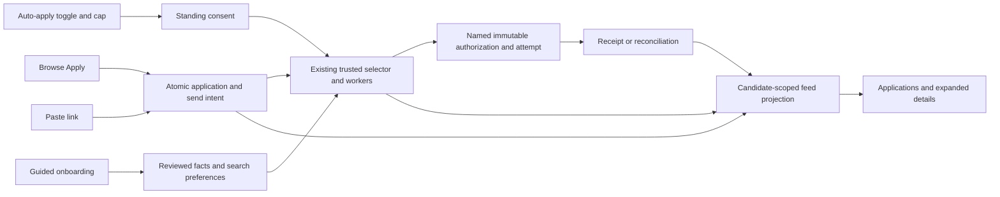

# Applications and Browse simplification plan

## 1. The product to build

**Recommendation:** give RoleDawn two primary pages: **Applications** and **Browse**. Applications opens to an auto-apply toggle, a small daily-limit control, a paste-link field, and one feed. Browse lets the candidate inspect imported jobs and apply. Application documents, questions, receipts, and activity appear when a row is opened. Profile and preferences remain accessible through a quiet secondary menu.

The founder requested a plan for another AI to implement. This document does not authorize this research task to change application code, run migrations, enable auto-apply, or send employer applications. It describes the intended implementation, dependencies, and acceptance criteria.

**Verified:** most of the required backend already exists. Build on the current working tree, including September 28 changes. The active dashboard renders `HomeView`; older `CandidateQueue` and `AutoApplyPanel` components are not the implementation starting point. There are extensive pre-existing working-tree changes; preserve them.

**Verified research scope:** AIApply's public onboarding was inspected in Chrome, including its branching questionnaire, visuals, controls, and required work-authorization screen. Its authenticated application workspace was not inspected. Post-login behavior below comes from AIApply's official help articles and is labeled accordingly. RoleDawn's current local Home, Jobs, and application detail were inspected in the browser at `http://127.0.0.1:3001`; its onboarding was inspected in source because the active account redirects past it. See the [research study](../research/aiapply-onboarding-study-2026-09-28.md) for the question inventory, URLs, and limits.

## 2. What we are missing

| Area | Verified RoleDawn today | Change to make |
|---|---|---|
| Main page | Greeting/date, paste-link, review checkbox, separate Needs-you list, profile checklist, large autopilot panel, application feed, top matches | Put the feed immediately below compact controls. Eliminate duplicate lists and move matches into Browse. |
| Onboarding | Résumé, a large Basics screen with separate grouped saves, job goals, optional stories | Small question screens with one Save and continue action, clear progress, resumability, and optional work deferred. |
| Auto-apply | Standing consent, selector, enrollment provenance, worker execution, DB attempt limits, pause | Compact switch using existing server authority; add a real per-candidate quantity setting. |
| Applications | Existing durable records, readable labels, receipts, events; latest 100 records only | Cursor-paginated feed, full-account filter counts, common status projection for feed and detail. |
| Browse | Imported catalog, search, filters, saves, Apply; title opens employer page; Details shows a short excerpt | In-app detail drawer with full description and contextual Apply. Keep Browse position after applying. |
| Application detail | Documents, short answers, explanation, questions, receipt route, activity already exist | Reuse as progressively disclosed sections in a drawer; preserve existing deep links. |
| Apply reliability | Queue creation and send-intent creation are separate; a failed intent write can be ignored | Atomic enqueue-with-intent command, or explicit partial success until that command ships. |
| Preferences | Core search profile and exact answers persist; review-first is localStorage-only | Persist manual application mode in the DB; retain existing preference during migration. |
| Targeting | Roles, location strings, US/CA countries, work modes, employment types | Optional structured salary floor, seniority and company exclusions only when matching actually enforces them. |

**Inference:** the largest perceived design problem is hierarchy. The application feed and the auto-apply switch are below several competing sections. Changing colors alone will leave the main problem intact.

## 3. What to take from AIApply

**Verified browser observation:** AIApply uses a pale canvas, white rounded answer cards, generous spacing, a narrow centered question column, prominent sans-serif questions, a segmented progress indicator, clear selected borders/checkmarks, and one dominant Continue action. Several questions use large single-choice buttons; others use multi-select cards, country autocomplete, or a salary slider. Its remote-work answer reveals follow-up questions.

**Recommendation:** adopt that question rhythm and visual hierarchy. Keep RoleDawn's own name, colors, components, and writing. Omit the product-choice page because this release has one purpose. Omit motivational questions that do not change matching or application execution. Do not reproduce AIApply's outcome claims, testimonial panels, product illustrations, or conversion interstitials.

**First-party documentation:** AIApply describes a jobs feed, job detail tabs for overview/fit/review, submitted files and answers, and a separate application-volume preference. That supports the proposed feed-to-detail structure, but it is not verification of its delivery success or current authenticated layout. [Application monitoring](https://support.aiapply.co/en/articles/15555591-how-can-i-monitor-my-applications-and-credits), [Auto Apply controls](https://support.aiapply.co/en/articles/15692829-how-auto-apply-works).

## 4. Screen specifications

### Applications: the default page

Keep `/dashboard` as the canonical route for the first release; change its visible label to Applications. Avoid a routing migration during a visual simplification.

```text
RoleDawn        Applications   Browse                         Profile menu

Applications                           Auto-apply [OFF]   Up to 10/day ▾

[ Paste a job link…                                           ] [Apply]

All        In progress        Needs you (2)        Applied       More ▾

[initial]  Role title                   Preparing             Added today
           Company · Location                                  Open ›
───────────────────────────────────────────────────────────────────────
[initial]  Role title                   Needs you              Added yesterday
           Company · Location                                  Answer ›
───────────────────────────────────────────────────────────────────────
[initial]  Role title                   Applied                Applied Sep 25
           Company · Location                                  Open ›

                              Load more
```

The number in this sketch is illustrative. Existing candidates keep their current effective plan limit; the implementation must not silently reduce it or enable sending.

**Required behavior:**

1. One chronological list contains automatic, Browse, and pasted-link applications. Sort by immutable `queued_at DESC, id ASC`; status refreshes must not move rows unexpectedly. Applied date may be shown separately.
2. Collapsed rows show role, company, location, one status, and a date. Remove the five-dot workflow rail from collapsed rows. Use initials when no appropriate logo source exists.
3. Needs-you is a filter and an inline row state, not a second list of the same jobs. Show one short, actionable reason. Routine retries remain quiet; unresolved questions, unavailable status, and submission uncertainty must remain visible.
4. Put canceled/skipped/failed filters in More if needed. Keep every state retrievable. Mobile filters must remain reachable rather than being hidden below 720 px.
5. A successful paste creates or reuses one application and inserts its server-confirmed row. Clear the input only after durable success. Retain it on failure. Duplicate links open the existing application.
6. The Apply label follows the actual command. Default manual behavior is send when ready, as already accepted in D-092. A user who has chosen review-first sees **Prepare**. Preparation-only ATS jobs show **Prepare application** and explain that final completion happens on the employer site.
7. Do not auto-open a full detail page after every Apply. A small confirmation and a **View application** link are enough. An application with a required question can offer **Answer** directly.
8. Remove greeting/date hero, dashboard profile marketing/checklist, top matches, repeated header autopilot indicator, and the large Sent/Tried/Daily-limit panel. Keep profile maintenance in the secondary menu and onboarding.

**Empty and error states:** empty feed offers Paste a job link and Browse jobs; a filtered-empty feed offers Clear filter. If the feed fails to load, preserve controls and show a retry state. If automation state fails to load, display unavailable/retry rather than fabricating OFF. Never show optimistic Applied.

### Auto-apply switch and quantity

**Verified:** D-078 and D-085 already permit named-job delegation and standing account consent. A candidate does not need a separate manual approval click for every automatic job. Trusted code still creates and consumes one immutable, named submission authorization underneath. Preserve that design.

**Recommendation:** the normal surface has only **Auto-apply**, the switch, and **Up to N/day**. Use **Auto-apply** consistently; remove competing Autopilot terminology from customer-facing controls.

- First activation opens one compact setup sheet showing approved search scope, quantity, and what enabling does. Primary action: **Turn on auto-apply**. This is the explicit standing-consent action, not a second approval queue. Later switches reuse the existing versioned consent mechanism.
- Start with presets 5, 10, 20, and the current plan maximum, plus a numeric custom value bounded by the server. These are proposed UI choices, not throughput claims. The current plan allows 1–24 attempts per UTC day, with at least one hour between automatic attempts.
- The sheet states that the limit covers automatic submission attempts; some attempts need attention or remain unconfirmed. Keep technical accounting out of the normal feed header. Show the UTC reset converted to the user's local time inside the sheet so the day boundary is explicit.
- Quantity is a ceiling, not a promised count or a request to relax fit criteria. No suitable jobs means waiting. Changing the limit does not change search countries, qualifications, sensitive answers, or supported ATS coverage.
- OFF stops unsent automatic work through the existing cancellation path. Independently manual-origin items retain their own cancel action. A record originally enrolled in auto-apply remains governed by its automatic authority even if a later manual click opens it; do not imply that click bypasses OFF. Offer an explicit resume path when appropriate. An in-flight or uncertain submission stays visible and reconcilable.
- Decreasing the cap below attempts already started blocks further automatic attempts until reset; it does not undo completed work. Increasing it requires an explicit saved change. Neither change resets the UTC counter or hourly spacing.
- Profile changes retain the current pause behavior. Show one compact **Review changes to resume** action. Do not silently re-enable.
- Store no automation authority in React state or localStorage. A spinner can represent a pending settings write; a rejected/stale write must restore authoritative state.

### Browse: inspect and apply

Keep `/search`. Put **For you**, **All jobs**, and **Saved** inside this page; they are views, not extra primary navigation. Move the current top-match query here. All jobs must preserve access to the imported catalog. A slow or unavailable recommendation query must not block All jobs or Applications.

Use one search field plus Filters. The filter sheet contains location, work mode, employment type, and only additional fields supported by the backend. Results show role/company/location, available salary, freshness, and application state. Avoid unexplained numeric fit percentages.

Clicking the row/title opens an in-app drawer containing the full job description, attributed posting link, known compensation/work arrangement, short evidence-backed fit reasons, and the current application capability. Keep the official posting link secondary. Apply persists one job-specific intent; then the row reads Queued or View application without losing scroll position. A saved job is not an application.

Use the existing `/saved` route as a compatibility entry to the Saved view. Do not delete saved records. No new swipe, interview, analytics, or cover-letter primary pages are required.

### Expanded application

Use a side drawer on desktop and a full-height sheet on mobile. Preserve `/applications/[applicationId]` as the deep-link and standalone fallback. Share data and components so drawer and full route cannot disagree.

Order the expanded content as: status and required action; concise **What happened** summary; documents and submitted answers; job details; expandable activity and receipt. Reuse authenticated document and receipt routes. Show only committed evidence. Do not expose raw provider logs, internal IDs, hidden model reasoning, or another candidate's data.

The initial summary should be deterministic text from durable events, for example: “Your documents are ready. The employer asks when you can start.” A generative trace summary is unnecessary for this release. Existing detail reads at most 50 events and 25 runs; label that Recent activity or add activity pagination before calling it complete history.

## 5. Visual implementation brief

All dimensions below are **recommendations**, not measured AIApply CSS.

| Element | Direction |
|---|---|
| Palette | Reuse `--canvas: #f7f8fc`, white surfaces, `--ink: #0b1020`, and RoleDawn yellow `#ffd166` with dark text for the primary action. Use status colors sparingly. |
| Typography | Use existing Manrope throughout app headings and controls. Reserve serif typography for generated documents; remove mono/date eyebrows from primary app pages. |
| Layout | Workspace max width about 1040 px; onboarding question column 560–640 px. Desktop margins 24–40 px; mobile margins 16–20 px. |
| Question cards | 16–20 px radii, 1 px border, clear selected outline/checkmark; 56–64 px tall single-choice targets. |
| Type scale | Workspace heading 28–32 px; onboarding question 32–40 px desktop / 26–30 px mobile; body 15–16 px with comfortable line height. |
| Feed | 80–96 px desktop rows; allow natural wrapping on mobile. One shared list surface and dividers rather than multiple nested cards. |
| Controls | At least 44 px touch targets; real labels; one primary action. Visible keyboard focus and sufficient contrast for text and boundaries. |
| Motion | Short state transitions; no simulated work or fake progress. Respect reduced motion. Status polling must not cause rows or focus to jump. |

At a 390×844 mobile viewport, aim to show navigation, automation controls, paste field, filters, and the start of the first row without scrolling. Treat this as a review target, not a fixed-height layout. At large text sizes, allow content to grow. Sticky onboarding Continue must stay above the keyboard and safe area, with matching content padding.

## 6. Onboarding: small questions over the existing profile

**Recommendation:** organize the flow under four progress sections: **Résumé → Your details → Job preferences → Ready**. Each section can contain short screens. Show true progress through required screens; optional questions do not reduce completed progress. Avoid marketing slides between questions.

| Screen / proposed copy | Input and persistence | Requirement |
|---|---|---|
| Start with your résumé | Existing private PDF/DOCX upload, extraction and review | Required by current activation gate. Do not add a fake no-résumé path without a separate product decision. |
| Does this look right? | Reviewed résumé and structured experience review, using current document/evidence contracts | Explicitly confirm candidate content; unreviewed extraction remains a proposal. |
| What name should applications use? | Given, family and legal name; preferred name optional, using existing fact keys | One grouped Save and continue. Do not infer legal name from account display name. |
| How can employers reach you? | Application email, phone; LinkedIn/website optional | Existing exact-fact records. No résumé upload substitutes for attestation. |
| Where are you based? | City, region, country | Required current location. Street/postal address stays optional or application-specific. |
| What roles are you looking for? | Chips for existing target roles, max 8 | Preserve limits and allow edits. Suggestions require candidate selection. |
| Where would you like to work? | Explicit US/CA countries and preferred locations, max 12 | Distinguish current residence from job geography. Remote does not mean worldwide eligibility. |
| Which work arrangements suit you? | Remote / hybrid / on-site | Existing multi-select `work_modes`. |
| What type of work do you want? | Full-time / part-time / contract / internship / temporary | Existing `employment_types`. |
| What minimum pay would you consider? | Optional numeric minimum + currency + period | Ship only with structured search-preference support and matching rules. Include Skip / No minimum. |
| Can you work in your selected countries? | Country-scoped authorization and sponsorship questions; Yes / No / Not sure, or skip | Reuse sensitive exact facts. Preserve D-069: unresolved answers do not block account activation; named jobs may need them. |
| You're ready | Short summary with Edit links; **Open Applications** | Run existing DB readiness and activation command. Default auto-apply remains off until explicit enablement. |

Optional stories, voice, extended application answers and voluntary self-identification remain in secondary Profile settings. Offer them after the user reaches the product, without a permanent dashboard checklist or unsupported claims that they produce interviews. Preserve the existing explicit, revocable save of voluntary answers; do not silently populate defaults.

**Save behavior:** one action validates, persists, and advances. On failure, remain on the screen with the answer intact. Back preserves saved work. Draft cursor/progress never overrides the DB readiness function. Resume at the earliest incomplete required screen; version the wizard so changing question order does not corrupt progress. Consolidate the currently inconsistent page and domain step definitions.

**What to omit from AIApply's questionnaire:** job-search duration, familiarity with AI, reasons for liking remote work, and motivational goal categories. They add questions without a current RoleDawn decision that consumes the answers. RoleDawn also does not need AIApply's detailed visa-type catalog when its current contract asks country-specific authorization and sponsorship.

## 7. Database and API changes

### Reuse the existing system of record

Keep `applications`, `job_intakes`, `jobs`/`job_versions`, `application_runs`, `application_send_intents`, `application_autopilots`, `application_attempts`, `receipts`, `domain_events`, `candidate_search_profiles`, candidate fact/version tables, source documents, career profiles, stories, and auto-apply settings/enrollments. Do not create a parallel applications table, a client-only queue, or a new agent framework for this UI.



### Required changes for this release

| Change | Proposed contract | Important implementation detail |
|---|---|---|
| Per-candidate quantity | Add nullable `requested_daily_cap` to `candidate_auto_apply_settings`; null preserves plan default | Validate against plan max; effective cap is the smaller requested/plan cap. Update state RPC, selector checks and actual attempt-insertion guard. Keep hourly pacing. |
| Versioned settings command | Extend/replace `set_auto_apply_enabled` with a command carrying enabled, requested cap, expected settings revision and command ID | Preserve existing `version` as the consent epoch for enrollment compatibility; add `settings_revision` for settings concurrency. Toggle/reconsent advances consent as today; cap-only edits advance settings revision without invalidating immutable enrollment authority. Stale selector leases reload/restart; final attempt guard always reads current cap under lock. Older command signatures remain compatible during rollout. |
| Durable manual preference | Candidate-owned `candidate_application_preferences`: candidate/workspace FK, `manual_apply_mode` (`SEND_WHEN_READY` / `REVIEW_FIRST`), version, timestamps | Reuse an appropriate existing typed preference store if found at implementation time. Backfill must not silently discard an existing review-first preference. Offer one-time explicit import from that browser, not automatic authorization. |
| Atomic Apply | Candidate-scoped enqueue/reuse + optional send intent in one DB transaction; input includes command ID, URL or exact job/version, selected mode, expected preference version | Delegate to existing dedup/intake logic. Fresh creation records explicit chosen mode; reuse returns existing state without upgrading authority. Return application ID, durable intent state, replay marker, capability and version. An existing review-first packet needs a separate version-bound Send this application action. Canceled/submitted/uncertain records cannot be restarted by duplicate enqueue. |
| Feed read contract | Paginated candidate-scoped projection; cursor on `(queued_at DESC, id ASC)`; bounded page size; filter/search parameters; separate full-scope counts | Continue with an earlier timestamp, or equal timestamp and greater ID. Bind cursor to filter/search parameters. Counts cover the candidate's whole search scope before the selected status filter. Merge refreshes by ID without dropping older loaded pages. Reuse the queue index if sufficient; keep candidate reads ownership-scoped. |
| Common display state | One typed projection of application, current preparation/autopilot, open send intent, active enrollment, questions and receipt | No stored duplicate UI state. Historical enrollment is origin evidence, not current permission to send. |
| Wizard progress | Small candidate-owned `candidate_onboarding_progress` record: wizard version, last completed step, optional skipped step IDs, optimistic version, updated time | Save alongside successful canonical writes, or recompute progress on resume. Do not store sensitive questionnaire answers in arbitrary JSON or localStorage. |

**Quantity accounting:** today's pilot cap is fixed at 24; selectable 1–24 is proposed functionality. The current DB cap counts attempts started in the UTC day, including uncertain outcomes. Current `confirmedToday` counts confirmations among attempts started that day; it is not a count of receipts received today. Keep counters off the main screen. If showing an Applied-today metric later, define it using receipt time and a declared timezone. A local-calendar daily cap requires stored timezone and DST-safe reset logic; defer that change in this release.

**Security and lifecycle:** new candidate records need owner-scoped RLS, appropriate grants and existing identity-derived command patterns. Views must preserve invoker/ownership semantics. Migrations must preserve export/deletion paths and older immutable packets. Test stale writes, replay with changed payload, concurrent workers, profile invalidation and pause. Follow current Supabase docs and the installed skill when implementing; create migrations through the CLI rather than inventing filenames.

### Optional DB enhancements, after the two-page release

1. **Structured compensation preference.** Search-profile fields such as `minimum_compensation_amount`, `compensation_currency`, `compensation_period` (`YEAR` / `HOUR`) and `allow_undisclosed_compensation`. Existing `compensation.expected_salary` is an employer-form answer, not a matching floor. Never overwrite or infer it from the preference. Compare only compatible currency/period values; unknown salary stays unknown. Show salary filters only when ingestion supplies usable provenance-backed salary data.
2. **Seniority and exclusions.** Add versioned desired seniority and excluded canonical company IDs, with a documented fallback for unresolved employers. Enforce in both recommendations and auto-selection before showing controls. Missing job classification must not become invented certainty.
3. **Matching feedback.** If needed, extend existing candidate-job decision records with explicit reason codes such as wrong role/location/pay. Feedback may propose preference changes; it cannot silently expand consent or learn sensitive exclusions.
4. **Immutable origin.** If the feed needs an origin label, add `PASTED_LINK`, `BROWSE`, `AUTO_APPLY`, `LEGACY_UNKNOWN` to enqueue provenance. Preserve historical ambiguity; do not guess all legacy records. Current entry path and later manual actions are different facts.
5. **Employer outcomes.** Replies/interviews/offers/rejections would need separately sourced outcome records. They are outside this release. Submission status and agent activity do not prove an employer outcome.

## 8. A shared status contract

**Recommendation:** derive both the feed and detail from the same function, expanding the existing `presentApplication` contract. Prioritize receipt-backed completion and uncertain final dispatch over cosmetic preparation stages. Fail closed to **Status unavailable** on read errors.

| Label | Required evidence | Candidate action |
|---|---|---|
| Queued | Durable application/intake or authorized pending work; not yet running | Open; cancel if still permitted |
| Preparing | Import/research/drafting/validation/rendering or form filling before final dispatch | Usually none |
| Needs you | Required answer, takeover, review-first packet, or other specific candidate blocker | Answer / Review / Resume / Finish on employer site |
| Sending | Current autopilot `SUBMITTING` and persisted attempt at final dispatch boundary | Wait; do not offer a new send |
| Confirming | Uncertain/reconciling attempt, or inconsistent confirmed state without a receipt | Inspect/reconcile; never automatically resubmit |
| Applied | `CONFIRMED` plus committed receipt tied to the application/attempt | View receipt and files |
| Failed | Known intake/preparation or safe execution failure | Specific safe recovery only |
| Canceled / Skipped | Persisted terminal state | View history |

Today the feed and detail have separate status logic. An old auto-enrollment can produce Sending soon even after closure. The application aggregate can be RECONCILING while its current autopilot is SUBMITTING. Fix those projections before removing explanatory UI. Do not label confirmed-without-receipt as Sent, and do not infer Canceled from a global OFF switch.

Expose `requiresCandidateAction` independently of the label: a recoverable Failed item can appear in Needs you. An explicitly paused autopilot displays Paused with Resume inside detail; a ready packet without send authority displays Needs you with Review. A closed `NO_PROGRESS` enrollment must resolve from the current run/failure state, never Sending soon. Preparation failure uses Failed even if an older aggregate still says DRAFTING. Distinguish Queued from Preparing using actual run/lease status.

## 9. Implementation sequence and file map

| Phase | Deliverable | Main existing touchpoints |
|---|---|---|
| 0. Baseline | Preserve dirty tree; inventory current routes/migrations; capture desktop/mobile before images; document current real-ATS coverage | `AGENTS.md`, README, founder brief, decision log; local Next guides in `node_modules/next/dist/docs/` |
| 1. Truthful commands and reads | Atomic Apply, durable manual mode, common status projection, feed pagination/counts | `src/app/(candidate)/apply-actions.ts`; `src/server/dashboard/queue.ts`; `src/domain/application-presentation.ts`; `src/domain/dashboard-queue.ts`; `src/components/app/useReviewFirst.ts` |
| 2. Applications and shell | Two navigation items; compact switch/paste; single feed; responsive filters. Keep quantity read-only until phase 4 enforcement ships. | `src/components/ui/AuthenticatedAppShell.tsx`; `src/app/(candidate)/dashboard/page.tsx`; `src/components/home/HomeView.tsx` and CSS; `src/server/home/home-data.ts` |
| 3. Browse and detail | Move recommendations; drawer/full-page shared detail; full job descriptions; preserve Browse scroll | `src/components/opportunities/OpportunityCatalog.tsx`; `src/server/opportunities/catalog.ts`; `src/app/(candidate)/search/page.tsx`; `src/app/(candidate)/saved/page.tsx`; `src/app/(candidate)/applications/[applicationId]/page.tsx` |
| 4. Quantity controls | Candidate cap, settings command, concurrency-safe enforcement, concise consent sheet | `src/domain/account-auto-apply.ts`; `src/server/auto-apply/`; `src/server/workers/auto-apply.ts`; new additive migration over `20260917011226_account_auto_apply.sql` and later enrollment migrations |
| 5. Guided onboarding | Question shell, one-step save, resumable progress, refreshed copy, optional extras deferred | `src/app/onboarding/page.tsx` and CSS; `src/domain/candidate-onboarding.ts`; `src/server/candidate/onboarding.ts`; `src/components/onboarding/SearchGoals.tsx`; `src/components/profile/AnswersForm.tsx`; `ResumePanel.tsx` |
| 6. Polish and acceptance | Responsive/a11y checks, state recovery, visual review, docs aligned | `src/app/globals.css`; `src/components/app/ui.module.css`; affected domain/server tests; acceptance harnesses |

Existing shared UI primitives should be adapted before creating new parallel styling. Suggested reusable pieces are QuestionStep, ChoiceCard, ApplicationsToolbar, ApplicationRow, ApplicationDrawer and JobDrawer; names are recommendations, not claims they already exist.

Roll out additive DB compatibility first, then updated readers/commands, then screens. A UI rollback must preserve existing settings, applications, consent history and receipts. Do not re-run migrations or mutate the hosted database as part of a design preview. At implementation time, update stale README/founder-brief descriptions and record the final implemented decision with evidence.

## 10. Acceptance criteria

### Product and visual

- Exactly two primary destinations: Applications and Browse. Profile, preferences, data controls, and old deep links remain reachable.
- The first Applications viewport exposes switch, quantity, paste field, filters and the start of the feed on ordinary desktop/mobile sizes. No duplicated Needs-you feed, profile campaign card, top matches or operational metric panel.
- A new user completes required onboarding with one Save and continue per screen; refresh/back/cross-device resume preserves saved facts and does not infer sensitive answers.
- Browse opens full in-app detail, applies without a forced navigation, and correctly displays already-queued jobs.
- Drawers support keyboard focus, Escape, return focus, back navigation, scroll restoration, mobile keyboard, 200% zoom, large text and reduced motion. All filters stay available at 390 px.
- No invented progress, employer logos, match percentages, throughput promises or interview claims.

### Persistence and sending

- Paste→Browse, Browse→paste, auto→manual, repeated clicks and concurrent starts yield one canonical application and no duplicate dispatch. Existing queued/preparation-only records are not silently upgraded to send mode by a duplicate read.
- Send-intent failure never produces a success message claiming sending is enabled. Stale settings/preference versions are surfaced without overwriting newer choices.
- Feed pages reach beyond 100 records without gaps/duplicates. Server counts cover the full candidate scope. New inserts do not cause stable older pages to skip records.
- Applied always requires a committed receipt; feed/detail agree. Closed enrollment cannot imply sending soon. Unknown reads do not become OFF, empty, or no intent.
- Two candidates cannot read or modify each other's progress, preferences, feed, artifacts or receipts; anonymous/direct writes remain denied.
- Concurrent workers and cap changes obey effective daily capacity and hourly spacing. An uncertain attempt consumes capacity and cannot trigger another submission.
- Switching OFF cancels only unsent automatic work, preserves independently manual-origin intents, and leaves uncertainty reconcilable. A later manual click cannot bypass automatic ownership of an auto-origin record. Profile edits pause auto-apply as today.
- Greenhouse/Lever delivery and Ashby preparation labels come from the capability registry. Current source marks both implemented delivery adapters `liveEmployerAccepted: false`; do not promote synthetic acceptance to real-employer proof.

Run the affected domain/server tests, typecheck, lint and build after implementation, then browser acceptance against controlled fixtures/test accounts. Run hosted/RLS acceptance only in the intended test environment. A UI or workflow test does not authorize a real employer submission.

## 11. Copy and implementation boundaries

Use short labels: Applications, Browse, Auto-apply, Up to N/day, Paste a job link, Apply, Prepare, Needs you, What happened, View receipt. Keep support limitations contextual. Replace the current Ashby overclaim and the onboarding promise to accept any link. Remove unsupported story-to-interview claims.

Keep the existing database/workers/provider adapters. Defer interview tools, a landing-page redesign, paid plans, messaging, local-day capacity, new ATS adapters and broad questionnaire expansion. The first release is complete when the two-screen experience is clear and every visible status/control reflects durable state.

## Implementer starting instruction

Read this plan and its research study, then recheck the current working tree before editing. Implement phases 1–6 using the existing RoleDawn contracts. Preserve user edits, current application records and approval/receipt boundaries. Do not activate auto-apply or send a real application during implementation or verification. Report which acceptance criteria passed and which deployment or real-ATS checks remain unverified.
