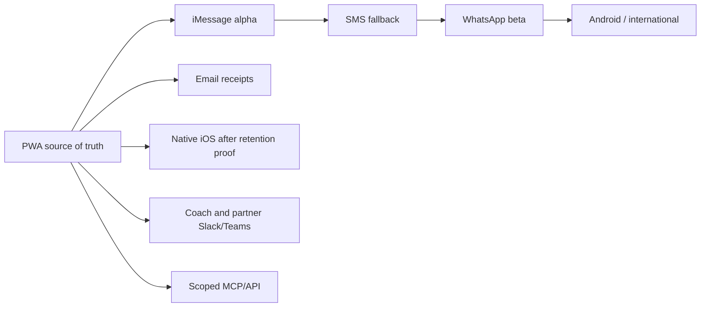

# Channel strategy

## Principle

One RoleDawn agent, many interfaces. A user should not get separate memories, rules, queues, or personalities in iMessage, WhatsApp, web, or mobile. Every surface reads and writes the same durable candidate, application, policy, and event state.

The dashboard is the canonical visual surface. Messaging channels are low-friction command, notification, and exception surfaces. Channel providers do not own identity, memory, or permission.

## iMessage constraint and decision

Apple does not provide a general public server-side API for an arbitrary personal iMessage bot. Messages for Business is a sanctioned, branded, generally user-initiated business conversation, and a Messages app extension runs inside an active conversation rather than as a cloud background agent. Photon offers a managed bridge to iMessage, but its platform authorization, device/number model, security, delivery, and suspension behavior remain vendor risks.

Decision: use Photon only for a bounded alpha behind `ChannelAdapter`. The PWA is mandatory, and consented SMS/email can carry fallback notifications. Do not advertise permanent iMessage availability until written diligence and live reliability tests pass.

Photon go/no-go requires:

- Written explanation of Apple/platform authorization and suspension handling.
- DPA, subprocessors, retention/deletion, regions, security evidence, and incident process.
- Number ownership/portability and a documented provider-exit path.
- Signed webhooks, deduplication keys, delivery/error callbacks, versioning, and support/SLA terms.
- A test cohort that meets the product's binding, delivery, ordering, opt-out, and takeover completion thresholds.

Fallback triggers include an unresolved authorization concern, inability to execute a DPA, unacceptable delivery or duplicate behavior, no portable number/identity path, a provider enforcement incident, or material API degradation. When triggered, stop new iMessage bindings, preserve existing workflow state, and route the user to the PWA plus consented fallback—not an invisible provider swap.

## Surface roles

| Surface | Best use | Poor use | Timing |
|---|---|---|---|
| iMessage | U.S. consumer acquisition, digest, one-item approval, quick facts, status, takeover links | Long diffs, global consent, sensitive editing | Alpha through Photon adapter |
| PWA/dashboard | Onboarding, Career Vault, full diff, pipeline, receipts, rules, security, billing, export/delete | Passive interruption | Alpha, canonical UI |
| SMS/RCS | Delivery fallback, broad device reach, urgent takeover | Rich review, attachments, private sensitive detail | Alpha fallback after consent; RCS when provider support is mature |
| WhatsApp | International/mobile-first users, rich messages, identity continuity | U.S.-only acquisition assumption | Private beta behind Meta-approved adapter |
| Email | Morning digest, receipts, recruiter correspondence, recovery | Conversational control or secrets | Alpha for account/receipt; inbox routing later |
| Native iOS | Push, biometric re-auth, live activity, richer takeover, camera/document scan | Early product validation | After PWA/message retention proves the loop |
| Android | Push and native control for non-iPhone growth | iMessage-specific acquisition | After iOS/product-market evidence or WhatsApp-led expansion |
| Telegram | Opt-in international/technical communities | Mainstream U.S. trust signal | Later experiment |
| Slack / Teams | Coach, outplacement, university, or employer-sponsored workflow | Personal job search as default | B2B phase |
| MCP / API | User-owned assistants and partner workflows with scoped access | Raw submission authority or identity bypass | Read-only/status first; approved actions later |

## Launch sequence



Do not launch every channel at once. Each adds consent, identity linking, rendering, delivery, opt-out, support, and security edge cases. The adapter contract makes breadth possible without multiplying agents.

## Common channel contract

```text
ChannelAdapter
├── send(message_envelope) -> provider_result
├── verify_webhook(headers, body) -> verified_event
├── normalize(verified_event) -> canonical_message
├── delivery_status(provider_event) -> canonical_status
├── bind_identity(challenge) -> channel_binding
├── revoke(binding_id)
└── capabilities() -> text / rich card / attachment / reaction / receipt
```

Canonical message fields:

- Internal tenant/user/channel-binding IDs.
- Provider and opaque provider message ID.
- Direction, timestamp, thread/conversation correlation.
- Normalized text and attachment references.
- In-reply-to ID and workflow/application correlation.
- Dedupe key, delivery state, sensitivity, retention class.

Provider webhooks are signed, deduplicated, acknowledged quickly, and processed asynchronously. An inbound message becomes a typed intent only after identity and workflow context resolve.

## Cross-channel identity

- Account identity comes from managed authentication, not a phone number alone.
- Each channel is verified and bound to one account through a challenge.
- Merging two accounts or moving a phone number requires step-up authentication.
- A lost device or recycled number can be revoked from the security dashboard.
- Approvals may require recent web re-authentication for high-risk changes.
- A command on one channel is immediately visible in the canonical dashboard and other active surfaces.

## Cross-channel approval rule

The wording may change by channel; authority does not. Every approval resolves to the same server-side single-use object. Rich buttons, typed `YES 1842`, a web click, or a future biometric action all consume one immutable approval token.

No channel can broaden a user's standing rules. No provider delivery receipt means the user read or authorized a message.

## Conversation design

Default to a single RoleDawn conversation per user. Preserve continuity but keep commands explicit:

- One morning digest instead of one alert per match.
- One named application per approval message.
- Secure web link for large diffs or sensitive information.
- Quiet hours and urgency rules shared across channels.
- If the preferred channel fails, show the fallback reason; do not silently spray all channels.

## Provider portability

- Keep provider IDs out of core domain tables.
- Persist canonical message text/events before provider formatting.
- Maintain template versions independent of provider syntax.
- Export phone/number ownership terms during vendor diligence.
- Test provider cutover with shadow delivery and no duplicate user notification.
- Always retain a web inbox and notification center.

## MCP and user-owned agents

A future RoleDawn MCP can let a user ask another assistant:

- List matches or application states.
- Explain a fit score.
- Retrieve a redacted receipt.
- Draft an edit request.

Start read-only. A remote assistant must never inherit submission permission merely because the user connected MCP. Consequential tools use RoleDawn OAuth scopes and the same approval service as every other channel.

## Channel success metrics

- Binding completion and verified-delivery rate.
- Digest open/reply rate.
- Approval latency and ambiguity rate.
- Secure-link completion.
- Duplicate/out-of-order event rate.
- Opt-out, fallback, and support rate.
- Retention/outcome difference by preferred channel.

The iMessage hypothesis succeeds only if it improves activation, approval speed, or retention without weakening comprehension and control.
