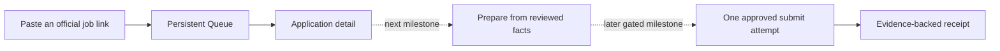

# Lean candidate application experience

## Product contract

RoleDawn gives candidates one place to see every selected job, what the agent is doing, and where a decision is required. The interface stays small enough to understand at a glance.

The executable frontend loop is:



The interface never implies that saving, viewing, queueing, or drafting grants submission authority.

## Lean UI rules

1. Show information only when it helps the candidate understand state or make a decision.
2. Keep one primary action per row, card, dialog, or mobile action rail.
3. Keep internal application, job, revision, approval, attempt, workflow, provider, and requisition identifiers in the data model. Do not render them in ordinary candidate UI.
4. Use company, role, location, source age, and posting snapshot as human-readable identity.
5. Put technical references in exported receipts or an optional support disclosure only when they solve a real support problem.
6. Keep activity inside an application. Do not create a global Activity Feed.
7. Keep Settings behind the account menu. Do not add it to primary navigation.
8. Use direct labels. Do not repeat a title with an eyebrow that says the same thing.
9. Keep prototype limitations visible without repeating them in every component.
10. Preserve stable row positions while work progresses.

## Information architecture

| Surface | Purpose | Primary action |
|---|---|---|
| Queue | See every selected job and current state | Open the next relevant step |
| Paste a job | Add one supported official posting | Create durable preparation intent |
| Application Workspace | Inspect and control one application | Resolve, edit, approve, or stop |
| Career Vault | Later: review the facts and files RoleDawn may use | Verify or correct evidence |
| Settings | Later: set preparation and account policy | Save a bounded preference |
| Onboarding | Later: establish evidence, rules, and authority | Activate draft-only preparation |

The current runtime has no multi-item primary navigation. Queue is the
authenticated home, Paste a job is a dialog, and Application Workspace is a
routed detail. Restore another destination only after it has persistent data
and accepted end-to-end evidence.

## Shared shell

The current shell contains the brand, Queue search, signed-in identity, and sign
out. Desktop and mobile use the same responsive route. A concise system notice
appears when the persistent Queue cannot be read. Global pause and multi-surface
navigation are later capabilities.

## Queue

Queue is the default authenticated screen and the canonical pipeline.

### Banner

- Heading: **Queue**.
- Action: **Paste a job link**.
- No eyebrow or redundant explanatory sentence.

### Default ordering

Sort by the time the application entered Queue:

```text
queued_at DESC, application_id ASC
```

Newest appears at the top and oldest at the bottom. Do not sort by `updated_at`; background progress must not make rows jump.

### Desktop row

Each row contains:

1. Company, role, and location.
2. One status label.
3. Latest meaningful update.
4. Candidate-friendly updated time.
5. One contextual action: Review, Answer, Check, Receipt, Details, or Progress.

Do not show requisition codes, application IDs, workflow IDs, internal revision IDs, raw model state, token counts, or browser session details.

### Mobile card

The same information becomes a compact card. Keep the status and latest update visible without opening the application. The full card is one target and meets a 44 CSS px minimum touch area.

### Search

Search company, role, and location only. Status filters are deferred until a
real candidate Queue is large enough to justify them.

### Empty and error states

- Empty Queue: Paste a job link.
- Empty search: clear the search.
- Stale projection: show the last refresh time and disable approval.
- Failed job link: preserve the pasted URL and offer correction.

## Later surfaces

Browse Jobs, Swipe, Career Vault, Settings, and onboarding remain product
specifications, not current routes. Their contracts below are retained to avoid
losing product intent; they do not describe implemented runtime capability.

### Browse Jobs

Browse is the deliberate catalog.

### Card content

- Company and role.
- Location and work mode.
- Posted time and source freshness.
- Short description.
- Up to two evidence-backed reasons it surfaced.
- One honest item to check.
- Save, Details, and Add to Queue.

Saving never creates an application. Adding creates one Queue item and no submission authority.

### Filters

Desktop may show compact inline controls. Mobile uses one **Filters** button that opens a sheet, with active filters summarized above the results. The first set is work mode, location, role family, experience, employment type, date, and saved jobs.

Salary, sponsorship, and source filters follow when the backend can return trustworthy normalized values.

### Job detail

The detail dialog or route shows the official job facts, why it surfaced, one gap, and the boundary around Add to Queue. Requisition IDs remain internal by default.

### Swipe

Swipe is a fast view over the same job records used by Browse. It is not a second job database.

Each card shows company, role, location, work mode, short summary, up to two reasons, and one check. Actions are Pass and Add to Queue. Support left/right keyboard controls and touch drag.

The action rail remains above the mobile bottom navigation and safe area. Add Undo before storing pass reasons as durable learning. A pass reason may propose a search-rule change; it never changes policy silently.

## Application Workspace

Route shape:

```text
/app/applications/:applicationId
```

The opaque route key is never displayed as page copy. Desktop may intercept the route into a wide panel; mobile uses a full page. Browser back and deep links must work.

### Header

- Company and role.
- Location and official-source link.
- Current status and next action.
- Last meaningful update.
- Pause or stale-state warning when relevant.

### Tabs

| Tab | Contents |
|---|---|
| Overview | State, next step, job snapshot, rules, unresolved risks |
| Match | Hard constraints, preferences, supporting evidence, honest gaps |
| Materials | Resume and cover-letter previews, changes, versions, download |
| Answers | Exact ATS prompts, proposed answer, source, requiredness, reuse scope |
| Activity | Candidate-facing semantic timeline for this application |
| Receipt | Immutable confirmation evidence and later outcome history |

Tabs may collapse into sections during the prototype, but the information boundaries remain distinct.

### Approval rail

The fixed action area names the company and role, files, material changes, open decisions, expiration, and permitted action. The candidate can edit, skip, cancel, or approve one unchanged revision.

Cancel and close must always dismiss the dialog without being blocked by confirmation-field validation. A material edit invalidates unused approval.

### Answer cards

Each blocking question shows:

- Exact employer wording.
- Required or optional.
- Proposed answer or blank state.
- Source and sensitivity.
- Use once or save as a narrowly scoped policy.
- Takeover requirement.

Do not generalize one application answer into a global policy without explicit scope and confirmation.

### Receipt and outcomes

The default receipt shows a human-readable receipt reference, company, role, files, submitted values, time, source, and confirmation evidence. Internal approval, attempt, workflow, and revision IDs remain in the audit/export record. The UI may say **Submitted** only when the application is `CONFIRMED` and a stored receipt exists.

Recruiter response, interview, rejection, offer, hire, and withdrawal are later outcome events. They never rewrite the immutable submission receipt.

### Career Vault

Career Vault groups documents, verified facts, answer policies, and blocking gaps.

The first server-backed version needs:

- Add and remove a source document.
- Review extracted facts.
- Verify, correct, or restrict a fact.
- See source provenance.
- See which applications a missing fact blocks.
- Export and deletion entry points.

On mobile, use a segmented view for Overview, Facts, Answers, and Files so verified facts are not buried below the document list.

### Settings

Settings is a secondary account utility with four summary cards and focused edit panels.

1. **Search rules:** roles, seniority, locations, work mode, salary floor, authorization, sponsorship, posting age, and exclusions. Separate Must match from Prefer.
2. **Application behavior:** prepare matching jobs, daily preparation cap, verified-fact tailoring, cover-letter policy, and unknown-question handling. Submission stays **Ask every time** for MVP.
3. **Notifications:** Needs-you alerts, ready summary, receipt alerts, morning summary, quiet hours, email, web, and later iMessage.
4. **Account and data:** identity, channels, sessions, Career Vault, export, deletion, and support.

“Auto-apply” may appear in explanatory copy. The section title is **Application behavior** because the MVP never grants unattended submission.

Changes affect future jobs by default. Rechecking existing Queue items requires an impact preview and separate confirmation.

### Onboarding

The resumable sequence is:

1. Create account.
2. Upload resume.
3. Review extracted facts.
4. Set hard rules and preferences.
5. See one sourced first match.
6. Resolve only facts that block that match.
7. Review draft-only authority.
8. Optionally connect iMessage.
9. Open Queue.

Do not end onboarding on an Activity Feed. Do not collect reusable ATS passwords or voluntary protected answers globally.

## Candidate-facing identifier policy

| Identifier | Stored | Shown by default |
|---|---:|---:|
| Company, role, location | Yes | Yes |
| Canonical job URL and source | Yes | In detail |
| Employer requisition ID | Yes | No |
| Internal job/application ID | Yes | No |
| Revision number | Yes | When it explains a material change |
| Revision hash/internal revision ID | Yes | No |
| Approval/attempt/workflow ID | Yes | No |
| Human-readable receipt reference | Yes | In receipt |

Internal identifiers remain necessary for dedupe, routing, approval binding, idempotency, reconciliation, and support. Hiding them is a presentation rule, not a data deletion rule.

## Required frontend states

Before enabling each later capability, deterministic tests must cover:

- Empty Queue.
- Preparing.
- Needs an exact fact.
- Ready for review.
- Approval expired or invalidated.
- Paused.
- Login, OTP, or CAPTCHA takeover.
- Checking an uncertain submission.
- Failed safely.
- Closed job.
- Confirmed receipt.
- Recruiter response, interview, rejection, offer, and withdrawal.
- Loading, no results, offline read-only, session expired, and server error.

Use a development-only state gallery to check every state at 390, 768, 1024, and 1440 CSS px.

## Accessibility and performance

- Visible focus for every control.
- Complete dialog focus management and Escape behavior.
- `aria-current` or equivalent for the current destination.
- No color-only status meaning.
- 44 CSS px touch targets for primary mobile controls.
- WCAG 2.2 AA contrast.
- Reflow at 320 CSS px and 200 percent zoom.
- Reduced-motion support for swipe, drawers, and status transitions.
- Stable shell and list skeletons during loading.
- No raw activity logs, chain-of-thought, secrets, or sensitive browser screenshots.

## Current runtime boundary

**Implemented locally:** Supabase Auth boundaries, persistent newest-first Queue,
paste-a-job intake for supported public postings, RLS-scoped database-backed
application detail, explicit empty/error states, and responsive layouts.

**Implemented but not accepted live:** official Greenhouse, Lever, and Ashby
resolution worker, pending hosted migrations and a server secret.

**Designed, not implemented end to end:** Career Vault, packet preparation,
approval, browser fill, reconciliation, receipts, Browse, Swipe, Settings,
onboarding, messaging, billing, analytics, and outcome tracking.

The backend requirements for each screen live in the [frontend-to-backend contract](../architecture/frontend-backend-contract.md). Current implementation status lives in [current state](../execution/current-state.md).

## Acceptance criteria

- Queue opens first and shows newest applications at the top.
- Queue order uses `queuedAt`, not status update time.
- No candidate-facing Queue row, detail header, approval dialog, Browse detail, or ordinary message exposes opaque IDs or requisition codes.
- “Your queue” has no redundant “Your job search” eyebrow.
- Every application state has one clear next action.
- The paste-link dialog closes by Cancel and Escape.
- Mobile actions never overlap fixed navigation or safe areas.
- Desktop and mobile show the same state and authority.
- `Submitted` requires `CONFIRMED` plus a stored receipt.
