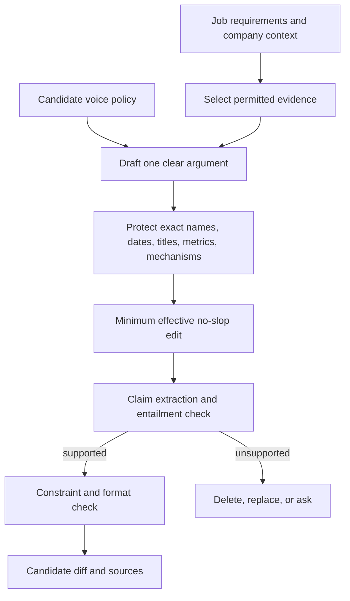

# Evidence and writing policy

## Goal

RoleDawn should write the strongest truthful version of the candidate's case without sanding their voice into generic application prose. This policy applies to resumes, cover letters, short answers, recruiter replies, follow-ups, and later interview preparation.

There are two separate gates:

1. **Truth gate:** Is every material claim supported and permitted?
2. **Taste gate:** Is the writing direct, specific, relevant, and recognizably the candidate's?

Taste cannot rescue an unsupported claim. Truth cannot excuse flat, generic prose.

## Inputs

- Verified Career Vault facts and source passages.
- Official titles, employers, dates, degrees, credentials, metrics, and outcomes.
- Current authoritative job snapshot.
- Candidate-selected writing samples and approved prior answers.
- Role-specific objective and length/format limit.
- Employer/product research with source and date where relevant.
- Current voice policy and protected phrases.

Do not use arbitrary prior model output as evidence. An approved sentence can be reused as a style/answer precedent only if its underlying facts remain valid.

## Voice intake

During onboarding or the first concierge session:

1. Ask for two to five writing samples the candidate actually wrote.
2. Ask which sample sounds most like them and why.
3. Identify a small set of observable signals: sentence length, formality, directness, humor, technical density, preferred nouns/verbs, and phrases to avoid.
4. Show one short before/after edit and let the candidate correct the profile.
5. Store a versioned voice policy separate from career facts.

Do not manufacture quirks, slang, opinions, or vulnerability to make the output seem human.

## Draft pipeline



## Truth rules

- Preserve official job titles exactly unless the artifact explicitly labels a functional descriptor separately.
- Do not extend tenure, formal ownership, scale, adoption, production status, compliance, or technical depth beyond evidence.
- Do not convert “worked with” into “led,” “built a demo” into “deployed,” or “customer” into “partner.”
- Do not infer a skill from a neighboring technology.
- Do not create a metric because specificity would read better.
- Do not claim excitement about a company/product without a reason grounded in real research or candidate input.
- When evidence conflicts, stop and ask or use the narrower supported version.

Every material sentence should carry fact IDs during generation. The customer view may show them as source chips rather than visible IDs.

## Taste rules

### Keep

- Concrete mechanisms, decisions, users, constraints, and results.
- A clear reason this candidate fits this role.
- Sentences the candidate would plausibly say aloud.
- Unevenness that reflects a real voice when it remains clear.
- One sharp company-specific connection when supported.

### Remove or rewrite

- Generic throat-clearing and scene-setting.
- Empty superlatives and claims of passion.
- Lists of adjectives where one fact can do the work.
- Repeated conclusion paragraphs.
- Fake quotes, fake anecdotes, fake vulnerability, or invented opinions.
- Overused AI/pitch language: unlock, transformative, cutting-edge, leverage, supercharge, journey, dream role, unique intersection.
- Excessive fragments, em dashes, rhetorical questions, or symmetrical three-part slogans.
- Claims that merely mirror the job description without candidate evidence.

The editor uses the minimum effective change. It does not rewrite a strong personal line only to make the output stylistically uniform.

## Cover-letter structure

Default to a short letter with a real argument:

1. Direct opening: role and the specific operating overlap.
2. One or two evidence paragraphs: problem, action/mechanism, and supported result.
3. Company/role connection grounded in current research.
4. Simple close.

Do not force this shape when a better candidate-authored structure exists. Avoid a resume recap and generic “thank you for considering” padding.

## Resume tailoring

Allowed:

- Reorder sections or bullets.
- Select the most relevant supported work.
- Tighten phrasing.
- Expand an acronym or clarify a mechanism already present in evidence.
- Use an employer keyword when it accurately names the candidate's work.

Not allowed:

- Invent a new skill, title, employer, project, metric, certification, or responsibility.
- Change dates to hide a gap.
- Upgrade “prototype” to “production.”
- Swap in a more senior title.
- Hide a required fact through a misleading omission.

## Application answers

- Exact fields use structured values, not generated prose.
- Behavioral answers use a named evidence episode.
- Motivation answers combine verified role/company context with candidate-approved preferences.
- Salary, work authorization, relocation, travel, protected information, and legal certification use explicit answer policy.
- If a text field invites optional disclosure, shorter is usually safer.

## Output schema

Each writing run records:

```text
artifact_id and version
application_id / job_snapshot_id
artifact type and constraint
fact IDs used by claim/span
voice policy version
research source IDs
prompt and model version
truth-validator result
taste-check result
candidate edits and approval
rendered file hash
```

## Evaluation

Hard failures:

- Any unsupported material claim.
- Wrong official title, employer, date, degree, credential, or number.
- Sensitive exact answer inferred or generated.
- Material candidate edit not reflected in the final artifact.

Quality measures:

- Candidate factual-correction rate.
- Edit distance after review.
- Voice-match rating from the candidate.
- Relevant evidence coverage.
- Generic/slop pattern rate.
- Recruiter response and interview yield by artifact/fit cohort, with careful denominators.

Maintain adversarial cases where the job description tempts the model to add a missing skill, scale, or title.

## Licensing and implementation note

The product can implement the behavior learned from a no-slop editing workflow: preserve real voice, make minimum effective edits, protect evidence, remove recognizable generic patterns, and read for naturalness. It should not ship or redistribute a third-party skill file or branded evaluation set without confirming license and permission. Translate the principles into RoleDawn-owned prompts, code, tests, and documentation.

