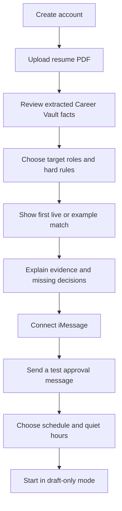

# Onboarding and messaging

## Experience principle

Earn sensitive information. The signup flow should reach a useful first match before asking for every field that might appear across every ATS.

Tsenta's public onboarding is operationally complete, but it asks for broad profile, work-authorization, optional demographic, and credential information early. RoleDawn should use progressive profiling: collect the minimum for a real result, then ask just in time with purpose and usage context.

## Signup flow



### Step 1: account

Use Google or email magic-link authentication. Explain that messaging is a control channel, not the only way back into the account.

### Step 2: resume import

- Accept PDF first; add DOCX after parsing quality is tested.
- Show file-size and data-use guidance before upload.
- Malware scan and parse in an isolated worker.
- Preserve the source file and extracted text as separate versioned objects.

### Step 3: Career Vault review

Display facts grouped into identity/contact, roles, employers, dates, education, skills, projects, and quantified outcomes. Each item shows:

- Value.
- Source passage and document.
- Confidence.
- Sensitivity.
- Allowed use.
- Verify, edit, or remove action.

The user must verify identity, contact, official titles, employer names, and dates before the first application can be approved.

### Step 4: search rules

Separate hard constraints from preferences:

- Target role families and levels.
- Locations, remote/hybrid/on-site, relocation.
- Minimum salary only if the user wants it enforced.
- Employment type and schedule.
- Work authorization and sponsorship policy, with explicit country.
- Employer/industry exclusions.
- Posting age and daily queue cap.

Do not ask optional demographic, disability, veteran, criminal-history, or accommodation questions globally. Introduce an answer policy when an application requires one, and make “always leave voluntary fields unanswered” the default.

### Step 5: first value

Show one real current match if available; otherwise use a clearly labeled demo. Explain:

- Why it qualifies.
- Which preferences it misses.
- Which resume evidence is relevant.
- What the next application would need.

### Step 6: connect iMessage

The user verifies the phone/email binding, sends or receives a test, and sees how to stop messages. The consent record includes number, timestamp, policy version, channel provider, and opt-out behavior.

### Step 7: draft-only activation

Set quiet hours, morning digest time, per-day match cap, and notification severity. Every MVP application requires candidate approval. The first 5–10 applications also receive internal operations review before execution; that extra internal review may later be reduced, but candidate approval remains the MVP rule.

## iMessage's role

iMessage is ideal for:

- New high-fit match alerts.
- Morning digest.
- YES / EDIT / SKIP / PAUSE controls.
- Short “why this match?” explanations.
- Missing exact facts.
- OTP handoff where policy and channel security permit.
- Failure/takeover alerts.
- Receipt notification and recruiter-response alert.

It is not ideal for:

- Full resume diffs.
- Long application questionnaires.
- Sensitive profile editing.
- Billing, data export/deletion, or security settings.
- Broad consent or ambiguous bulk approvals.

Those actions use a short-lived signed link to the PWA.

## Channel architecture behavior

Every inbound message is normalized to:

```json
{
  "channel": "imessage",
  "provider": "photon",
  "provider_message_id": "opaque",
  "binding_id": "internal-uuid",
  "direction": "inbound",
  "received_at": "2026-08-06T12:00:00Z",
  "text": "YES",
  "attachments": [],
  "dedupe_key": "provider-scoped-key"
}
```

Provider IDs never become user identity or workflow state. Webhooks are signature-verified, deduplicated, recorded, acknowledged quickly, and processed asynchronously.

## Approval conversation

### Safe happy path

> **RoleDawn — 11:47 PM**  
> Ramp posted a Solutions Consultant role 8 minutes ago. It passes your salary, location, and level rules. I changed three resume bullets and drafted one short answer. Travel needs your call. Review?

> **User**  
> Show me.

> **RoleDawn**  
> I emphasized your healthcare rollout and removed one irrelevant retail bullet. Every claim has a Career Vault source. Weekly travel is 25%; your saved rule allows up to 15%. Reply SKIP, CHANGE RULE, or OPEN REVIEW.

After secure review:

> **RoleDawn**  
> Approve Ramp — Solutions Consultant, requisition 1842, using Resume v7 and Answer Set v3? This approval expires in 20 minutes. Reply YES 1842.

The server resolves `YES 1842` only if:

- The sender matches the verified binding.
- Exactly one pending approval has that short code.
- The approval has not expired or been consumed.
- Its immutable diff hash still matches.
- No material facts or artifacts changed.

### Ambiguity behavior

If the user replies only “yes” with multiple pending approvals:

> I have three items waiting. I did not approve any of them. Reply with the code beside one application or open your Approval Queue.

### Failure behavior

> Workday asked for a CAPTCHA. I saved 23 fields and both files. Tap to take over. Nothing was submitted.

> The connection dropped after Submit. I am checking the portal and your confirmation inbox before I try anything else.

Never use “done,” “submitted,” or a green success state until confirmation evidence exists.

## Command grammar

Natural language may be interpreted, but consequential actions resolve to deterministic intents.

| Intent | Examples | Side effect policy |
|---|---|---|
| Explain | “Why this?” “What changed?” | Read-only |
| Queue | “What needs me?” | Read-only |
| Edit request | “Make the second answer shorter” | Creates new draft; invalidates prior approval |
| Skip | `SKIP 1842` | Cancels one unsubmitted item after exact resolution |
| Pause | `PAUSE ALL` | Stops discovery and prevents new application work |
| Approve | `YES 1842` | Single-use approval only; does not approve other items |
| Cancel | `CANCEL 1842` | Cancels if no confirmed submit; otherwise explains status |
| Stop channel | `STOP` | Provider-compliant opt-out and immediate channel disable |

## Photon evaluation

Photon is the recommended alpha bridge, not a platform assumption. Before production use, obtain written answers on:

- Apple/platform authorization and suspension risk.
- Shared versus dedicated line behavior.
- Number ownership and portability.
- Delivery ordering, retries, deduplication, and status callbacks.
- Data retention, deletion, regions, subprocessors, DPA, and security evidence.
- API versioning, incident communication, support, and SLA.
- Handling of attachments, reactions, group messages, edited messages, and opt-out.

Required fallback: every message action is also available in the PWA; high-priority notifications may fall back to verified SMS only with user consent.

## Notification policy

Default quiet hours: 10 p.m.–7 a.m. local time. Background work continues; non-urgent messages batch into the morning digest.

Interrupt quiet hours only for:

- An expiring user-requested approval.
- A user-started live takeover.
- Security or credential compromise.

Do not create artificial urgency. “Posted 11 minutes ago” is factual context; “apply now or lose it” requires evidence.

## Progressive permission

1. Read and score.
2. Draft and show changes.
3. Fill but stop before submit.
4. Approve one application.
5. After demonstrated accuracy, offer narrow standing rules with adapter, role, company, geography, expiry, daily cap, and revocation.

The interface must show current authority in plain language at all times.
