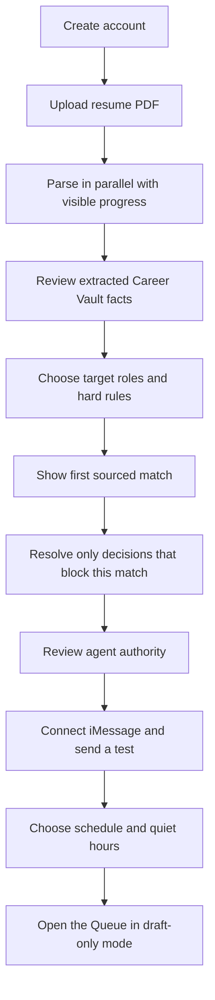

# Onboarding and messaging

## Experience principle

Earn sensitive information. The signup flow should show useful work before asking for every field that might appear across every ATS.

A founder-provided signed-in [Tsenta walkthrough](../research/evidence-manifests/tsenta-authenticated-onboarding-2026-08-11.md) confirmed a polished six-step intake after resume upload. Resume parsing runs in parallel, each screen explains why the information is useful, and the flow ends with explicit agent settings. Those are strong patterns. The same flow also requests a full address, broad sensitive answers, one application password, and submission authority before the user sees the dashboard.

RoleDawn should keep the visible progress and operational clarity, then use progressive profiling: collect the minimum needed to show a sourced result, and ask for additional facts when a named application actually needs them.

## Signup flow



The first match may be marked **preliminary** until exact work authorization or another hard rule is confirmed. Unverified facts can help the candidate understand the product; they cannot authorize or populate an application.

### Step 1: account

Use Google or email magic-link authentication. Explain that messaging is a control channel, not the only way back into the account.

### Step 2: resume import

- Accept PDF first; add DOCX after parsing quality is tested.
- Show file-size and data-use guidance before upload.
- Malware scan and parse in an isolated worker.
- Preserve the source file and extracted text as separate versioned objects.
- Keep the parser visible while the candidate completes other steps. Report actual states such as Uploaded, Scanning, Extracting, and Ready; do not simulate progress.

### Step 3: Career Vault review

Display facts grouped into identity/contact, roles, employers, dates, education, skills, projects, and quantified outcomes. Each item shows:

- Value.
- Source passage and document.
- Confidence.
- Sensitivity.
- Allowed use.
- Verify, edit, or remove action.

The user must verify identity, contact, official titles, employer names, and dates before the first application can be approved.

### Step 4: search rules

Separate hard constraints from preferences:

- Target role families and levels.
- Locations, remote/hybrid/on-site, relocation.
- Minimum salary only if the user wants it enforced.
- Employment type and schedule.
- Work authorization and sponsorship policy, with explicit country. The candidate may skip it initially, but RoleDawn cannot call a match eligible until it is confirmed.
- Employer/industry exclusions.
- Posting age and daily queue cap.

Do not ask optional demographic, disability, veteran, criminal-history, accommodation, clearance, or family-tie questions globally. Introduce an answer policy when a named application requires one, preserve the employer's exact wording and notice, and make “leave voluntary fields unanswered” the default.

### Step 5: first value

Show one real current match if available; otherwise use a clearly labeled demo. Explain:

- Why it qualifies.
- Which preferences it misses.
- Which resume evidence is relevant.
- What the next application would need.

The candidate should reach this screen before providing a street address, portal credential, or voluntary self-identification answer.

### Step 6: resolve blocking decisions

Ask only what the displayed opportunity needs. Each request shows:

- The exact employer or ATS wording.
- Why RoleDawn needs an answer now.
- Whether the field is required, optional, or unclear.
- Whether the answer will be used once, saved for a narrow scope, or left blank.
- The source, verification date, permitted use, and expiry for any saved policy.

A changed employer question, jurisdiction, application, or certification creates a new decision. Similar wording is not enough for automatic reuse.

### Step 7: agent authority

The MVP authority screen is a summary, not an autopilot upsell:

| Capability | MVP setting | Candidate-facing explanation |
|---|---|---|
| Find and evaluate roles | On | “I can search approved sources and check your saved rules.” |
| Prepare materials | On | “I can reorder and clarify verified facts. I cannot invent or upgrade them.” |
| Cover letters | On when requested | “I can draft from Career Vault sources when an application asks for one.” |
| Submit an application | Approval required | “I stop at a named review. One approval covers one unchanged application.” |

Offer two resume behaviors: **Use as uploaded** and **Tailor from verified facts**. Do not offer an “aggressive” mode. Review before submit is locked on for the MVP; there is no bulk approval.

### Step 8: connect iMessage

The user verifies the phone/email binding, sends or receives a test, and sees how to stop messages. The consent record includes number, timestamp, policy version, channel provider, and opt-out behavior.

### Step 9: draft-only activation

Set quiet hours, morning digest time, per-day match cap, and notification severity. Every MVP application requires candidate approval. The first 5–10 applications also receive internal operations review before execution; that extra internal review may later be reduced, but candidate approval remains the MVP rule.

Finish on the Queue with the first sourced match, its preparation state, and any exact decision that needs the candidate. Keep setup events inside that application rather than introducing a second global feed. A clearly labeled demonstration is acceptable when no live source is connected.

## Collection timing

| Timing | Data | Rule |
|---|---|---|
| During setup | Account identity, resume, verified contact method, target roles, broad geography, work mode, exclusions, and optional hard constraints | Collect only what helps produce or explain the first result. |
| Before eligibility is asserted | Exact country-scoped work authorization and sponsorship policy | Candidate-supplied, versioned, and never inferred from citizenship, resume text, or embeddings. |
| Just in time | Street address, current start date, travel/relocation detail, transportation, employer-specific certifications, portal questions, and sensitive answers | Show the named application, exact wording, purpose, scope, and leave-blank option where allowed. |
| Never as a global default | Voluntary demographic, disability, veteran, accommodation, clearance, family-tie, or criminal-history answers | Keep outside matching, ranking, drafting, embeddings, ordinary analytics, and support views. |
| Credential boundary | Employer-site account credentials | Do not collect one reusable application password. Use human takeover first; later, store unique origin-scoped secrets only through the credential broker. |

## Product copy

Use this progress-rail promise:

> Your resume is being checked while you finish setup. You can leave and come back.

Use this reason for progressive questions:

> Answer once when the answer is stable. Confirm again when the wording or stakes change.

Use this authority summary:

> RoleDawn can search, check rules, and prepare drafts while you're away. It stops before every application is submitted.

## iMessage's role

iMessage is ideal for:

- New high-fit match alerts.
- Morning digest.
- APPROVE / EDIT / SKIP / PAUSE controls.
- Short “why this match?” explanations.
- Missing exact facts.
- OTP handoff where policy and channel security permit.
- Failure/takeover alerts.
- Receipt notification and recruiter-response alert.

It is not ideal for:

- Full resume diffs.
- Long application questionnaires.
- Sensitive profile editing.
- Billing, data export/deletion, or security settings.
- Broad consent or ambiguous bulk approvals.

Those actions use a short-lived signed link to the PWA.

## Channel architecture behavior

Every inbound message is normalized to:

```json
{
  "channel": "imessage",
  "provider": "photon",
  "provider_message_id": "opaque",
  "binding_id": "internal-uuid",
  "direction": "inbound",
  "received_at": "2026-08-06T12:00:00Z",
  "text": "APPROVE",
  "attachments": [],
  "dedupe_key": "provider-scoped-key"
}
```

Provider IDs never become user identity or workflow state. Webhooks are signature-verified, deduplicated, recorded, acknowledged quickly, and processed asynchronously.

## Approval conversation

### Safe happy path

> **RoleDawn — 11:47 PM**  
> Ramp posted a Solutions Consultant role 8 minutes ago. It passes your salary, location, and level rules. I changed three resume bullets and drafted one short answer. Travel needs your call. Review?

> **User**  
> Show me.

> **RoleDawn**  
> I emphasized your healthcare rollout and removed one irrelevant retail bullet. Every claim has a Career Vault source. Weekly travel is 25%; your saved rule allows up to 15%. Reply SKIP, CHANGE RULE, or OPEN REVIEW.

After secure review:

> **RoleDawn**  
> Ramp — Solutions Consultant is ready with Resume v7 and Answer Set v3. This approval expires in 20 minutes. Reply APPROVE from this verified conversation or open the review.

The server resolves `APPROVE` only if:

- The sender matches the verified binding.
- The inbound message is bound to exactly one named pending approval through trusted conversation or reply context.
- The approval has not expired or been consumed.
- Its immutable diff hash still matches.
- No material facts or artifacts changed.

### Ambiguity behavior

If the user replies only “yes” with multiple pending approvals:

> I have three items waiting. I did not approve any of them. Open your Queue and choose the application you mean.

### Failure behavior

> Workday asked for a CAPTCHA. I saved 23 fields and both files. Tap to take over. Nothing was submitted.

> The connection dropped after Submit. I am checking the portal and your confirmation inbox before I try anything else.

Never use “done,” “submitted,” or a green success state until confirmation evidence exists.

## Command grammar

Natural language may be interpreted, but consequential actions resolve to deterministic intents.

| Intent | Examples | Side effect policy |
|---|---|---|
| Explain | “Why this?” “What changed?” | Read-only |
| Queue | “What needs me?” | Read-only |
| Edit request | “Make the second answer shorter” | Creates new draft; invalidates prior approval |
| Skip | “Skip Ramp — Solutions Consultant” or “skip this one” in a scoped thread | Cancels one unsubmitted item after exact resolution |
| Pause | `PAUSE ALL` | Stops discovery and prevents new application work |
| Approve | `APPROVE` in a trusted, single-application context | Single-use approval only; does not approve other items |
| Cancel | “Cancel Ramp — Solutions Consultant” | Cancels if no confirmed submit; otherwise explains status |
| Stop channel | `STOP` | Provider-compliant opt-out and immediate channel disable |

## Photon evaluation

Photon is the recommended alpha bridge, not a platform assumption. Before production use, obtain written answers on:

- Apple/platform authorization and suspension risk.
- Shared versus dedicated line behavior.
- Number ownership and portability.
- Delivery ordering, retries, deduplication, and status callbacks.
- Data retention, deletion, regions, subprocessors, DPA, and security evidence.
- API versioning, incident communication, support, and SLA.
- Handling of attachments, reactions, group messages, edited messages, and opt-out.

Required fallback: every message action is also available in the PWA; high-priority notifications may fall back to verified SMS only with user consent.

## Notification policy

Default quiet hours: 10 p.m.–7 a.m. local time. Background work continues; non-urgent messages batch into the morning digest.

Interrupt quiet hours only for:

- An expiring user-requested approval.
- A user-started live takeover.
- Security or credential compromise.

Do not create artificial urgency. “Posted 11 minutes ago” is factual context; “apply now or lose it” requires evidence.

## Progressive permission

1. Read and score.
2. Draft and show changes.
3. Fill but stop before submit.
4. Approve one application.
5. After demonstrated accuracy, offer narrow standing rules with adapter, role, company, geography, expiry, daily cap, and revocation.

The interface must show current authority in plain language at all times.
