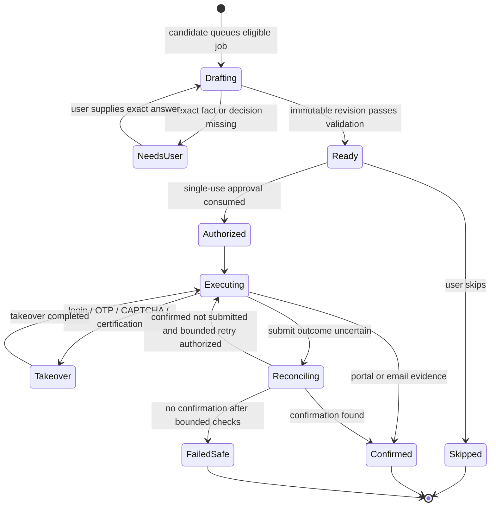

# Product requirements document

## Product objective

RoleDawn turns a candidate's verified history, search rules, and approvals into a continuously prepared job-application queue. It finds new roles, checks eligibility, drafts truthful materials, fills supported ATS forms, asks the user only for material decisions, submits after explicit authorization, and records a verifiable receipt.

## MVP promise

> Go to sleep. Wake up to a short queue of fitting, evidence-backed applications ready for approval.

The MVP does not promise silent or universal auto-apply. It supports Greenhouse, Lever, and Ashby first, uses browser execution, and requires final-submit approval for every application.

## Success criteria

### Safety gates

All must hold:

- Zero unsupported material claims in submitted artifacts or answers.
- Zero unauthorized submissions.
- Zero blind retries after an uncertain submit.
- Zero duplicate confirmed submissions for the same candidate and requisition.
- Zero sensitive answers produced from inference or embeddings.
- Every confirmed application has portal or email evidence.

### Product signals

Initial targets are hypotheses to validate, not marketing claims:

- At least 70% of activated design partners approve one application in the first week.
- Median time from approval to confirmed receipt under ten minutes on supported happy paths.
- At least 80% of prepared applications require no factual correction.
- At least 60% weekly retention across a four-week active search.
- Fewer than 20% of supported happy-path attempts require takeover after adapter stabilization.
- Users report meaningful reduction in time and anxiety in post-week interviews.

## Actors

| Actor | Authority |
|---|---|
| Candidate | Owns facts, preferences, consents, approvals, credentials, and final application identity |
| RoleDawn workflow | Schedules and coordinates bounded actions within recorded policy |
| Model | Extracts, ranks, maps, drafts, explains, and diagnoses; cannot authorize side effects |
| ATS adapter | Reads and fills one tested portal family within a versioned contract |
| Support operator | Assists only through audited, scoped support controls; cannot see secrets by default |
| Provider | Supplies channel, model, browser, storage, or workflow infrastructure behind an adapter |

## Core objects

- **Career Vault:** canonical structured facts, source documents, approved answer policies, and provenance.
- **Search:** role, location, salary, work mode, level, company, sponsorship, and exclusion rules.
- **Job snapshot:** immutable copy of the authoritative posting at decision time.
- **Application:** candidate–job workflow with one explicit state.
- **Artifact:** versioned resume, cover letter, short answer, or attachment linked to source facts.
- **Approval:** single-use authority tied to a named application and immutable diff.
- **Receipt:** final fields, artifacts, versions, timestamp, portal evidence, and reconciliation state.

## Primary user stories

### Onboarding

- As a candidate, I can upload a resume and see what RoleDawn extracted before it uses those facts.
- I can correct facts, mark them sensitive, choose permitted contexts, and see their source.
- I can define hard filters and optional preferences separately.
- I can defer sensitive answers until an actual application needs them.
- I can understand what an approval authorizes.

### Nightly preparation

- I receive a short morning queue ranked by eligibility and fit.
- Each item tells me when the job was posted, why it fits, what is uncertain, and what changed.
- I can ask “why,” edit, skip, pause the search, or approve one application by message.
- A long or sensitive review opens a signed secure web link.

### Execution

- The system fills deterministic fields from approved facts.
- It stops for CAPTCHA, OTP, login, a new certification, or an unsupported question.
- I can take over without losing completed fields.
- I receive a receipt only after confirmed submission.
- If submission is uncertain, I see “reconciling,” not a false failure or duplicate retry.

### Ongoing search

- I can change search rules and know which queued applications use the old or new version.
- I can cancel one item or pause everything.
- I can see recruiter replies and update interview/offer/rejection outcomes.
- I can export and delete my data.

## Functional scope

### P0: required for alpha

- Email/Google authentication plus one iMessage channel binding.
- Resume PDF ingest, malware scan, parsing, structured fact review, and provenance.
- Search rules with hard constraints and preferences.
- Continuous public job discovery for Greenhouse, Lever, and Ashby sources using the source registry, job identity, freshness, closure, and terms/rate controls in the [job-discovery architecture](../architecture/job-discovery.md).
- Eligibility filter, fit explanation, and deduplication.
- Evidence-bound resume selection/tailoring and short cover-letter drafting.
- No-slop quality pass and deterministic claim validator.
- Dashboard with queue, application state, diff, sources, takeover, and receipt.
- Photon messaging adapter plus web fallback.
- Single-application approval tokens.
- Deterministic browser adapters for Greenhouse, Lever, and Ashby.
- Human takeover for login, OTP, CAPTCHA, and new sensitive/legal questions.
- Immutable application events, confirmation evidence, pause/cancel, and support view.
- Basic subscription/cap enforcement and cost ledger.

### P1: private beta

- Workday, iCIMS, and Oracle adapters.
- Dedicated job-search inbox or restricted recruiter-email connection.
- Confirmation-email reconciliation.
- Profile variants and role-family evidence views.
- Referral and consent-backed outcome proof.
- Narrow, expiring standing authorization for a validated adapter and rule set.
- SMS/WhatsApp channel fallback.
- Billing, export/deletion automation, and support tooling.

### P2: later

- Native iOS application.
- Recruiter follow-up, networking, and interview preparation.
- Coach, outplacement, university, and employer-sponsored workspaces.
- Formal ATS/direct-apply partnerships.
- More countries, languages, and regional data boundaries.
- Aggregated RoleDawn Pulse reporting after privacy and sample-size gates.

### Explicitly out of scope for MVP

- CAPTCHA circumvention.
- Unbounded “apply everywhere” mode.
- LinkedIn scraping or actions that violate platform controls.
- Automatic answers to protected/sensitive questions without explicit policy.
- Applying to clearance-heavy, licensed, executive, or bespoke portfolio roles.
- Native mobile, autonomous salary negotiation, or interview impersonation.
- Arbitrary third-party skills, shell access, or self-modifying production agents.

## Application state machine



This is the canonical production application state machine. Discovery, eligibility, fit, and viewed/saved/passed/queued decisions live on separate candidate-job records; queueing is the boundary that creates an application in `Drafting`. Recruiter response, interview, rejection, offer, and hire are separate outcome events linked to a confirmed application; they do not rewrite submission history. `Canceled` is a valid terminal state from any non-confirmed step, with actor, reason, and recovery metadata. Confirmed applications remain in the audit record when a user cancels the broader search.

## Invariants

1. A job and an application are different records.
2. Candidate + employer tenant + requisition is deduplicated before any side effect.
3. Every artifact and answer is bound to fact, prompt, model, policy, and source versions.
4. The approval hash covers the job snapshot, field diff, artifacts, unresolved decisions, and submit scope.
5. Any post-approval material change invalidates approval.
6. Credentials and OTPs never enter prompts, embeddings, ordinary logs, or replay screenshots.
7. An uncertain submit is reconciled before retry.
8. Confirmation means a visible confirmation page, receipt ID, or confirmation email—not the absence of an error.

## Permission ladder

| Level | Behavior | Availability |
|---|---|---|
| 0 | Discover and score only | Onboarding |
| 1 | Draft and fill preview; never submit | Alpha |
| 2 | Candidate approves each immutable application | MVP default |
| 3 | Standing authorization for named adapter, constraints, expiry, and cap | Private beta after gates |
| 4 | Broader delegated search with exception policy | Future; must be earned by evidence |

No flow may enter standing authorization if it includes new legal certification, account creation, unknown sensitive answer, changed material artifact, CAPTCHA, or an adapter outside its validated version range.

## Dashboard information architecture

```text
Queue (default)
├── Every selected or pasted job
├── Newest queued first; background updates do not reorder rows
├── Status and latest meaningful update
├── Needs You and Ready filters
└── Application Workspace route for detail, approval, activity, and receipt

Browse Jobs
├── Search and filter the available job catalog
├── Save without creating an application
├── Open concise job details and match rationale
└── Add one job to Queue to start preparation

Swipe
├── One concise job at a time
├── Pass
├── Add to Queue
└── Paste a job link

Career Vault
├── Facts and provenance
├── Source documents
├── Answer policies
└── Profile versions

Settings (secondary utility)
├── Search rules
├── Application behavior; Ask every time is locked for MVP
├── Notifications and channels
└── Account, security, export, and deletion
```

Internal job, requisition, application, revision, approval, attempt, workflow, and provider identifiers remain in the domain model for routing, deduplication, authority, and audit. Ordinary candidate UI uses company, role, location, status, time, and human actions instead. See the [frontend specification](dashboard-and-responsive-experience.md) and [frontend-to-backend contract](../architecture/frontend-backend-contract.md).

## Acceptance tests for one confirmed application

- Job employer, title, location, requisition, canonical URL, and snapshot are stored.
- Eligibility and fit explanation name supporting and missing evidence.
- Every changed resume claim resolves to a source fact.
- Final pre-submit diff includes all answers and filenames.
- Approval is one-time, named, unexpired, and invalidated by material change.
- Adapter uses no broader authority than the approval.
- Any CAPTCHA, OTP, login, or unfamiliar certification pauses safely.
- Portal or email confirmation is captured and hashed.
- Receipt can be displayed without exposing secrets.
- Costs, latency, model/prompt versions, adapter version, and tool-event hashes are recorded.
