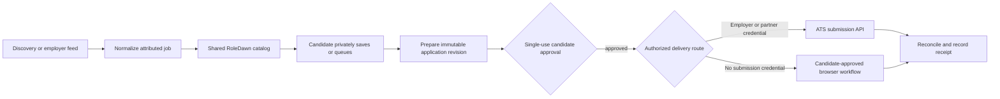

# ATS API and ingestion matrix

## Decision in one sentence

**Recommendation:** Build job discovery as an allowlisted, provider-adapter
pipeline. Treat application submission as a separate capability that is enabled
only when RoleDawn has either employer/partner authorization or a candidate-
approved browser workflow. A readable job feed is not submission authority.

## Evidence legend

- **Verified:** supported by the linked official vendor documentation.
- **Inference:** a conclusion from the official documentation, not a stated
  vendor promise.
- **Recommendation:** the proposed RoleDawn implementation choice.
- **Open question:** evidence or authorization still required before build or
  launch.

This matrix describes public and partner interfaces, not permission to collect,
store, redistribute, or submit data at arbitrary scale. Source rights, platform
terms, rate limits, candidate consent, and privacy obligations must be reviewed
per provider and tenant.

## The boundary that keeps the architecture honest

**Verified in RoleDawn:** the current catalog boundary is one allowlisted
Anthropic Greenhouse tenant with operator-invoked conditional polling. It must
not be widened before scheduling, rights review, source health, and failure
alerts are present. See [decision D-055](../execution/decision-log.md)
and [current state](../execution/current-state.md).

**Recommendation:** Keep three distinct adapter interfaces:

1. `JobDiscoveryAdapter` reads public or contract-authorized listings.
2. `EmployerSubmissionAdapter` writes only with a tenant or partner credential
   whose scope is recorded for that employer.
3. `CandidateBrowserAdapter` operates a browser after one immutable application
   is approved; it does not inherit discovery credentials or policy.

## Primary ATS matrix

| Provider | Discovery interface | Application form schema | Submission interface | RoleDawn route |
|---|---|---|---|---|
| **Greenhouse** | **Verified:** The [Job Board API](https://developers.greenhouse.io/job-board.html) exposes unauthenticated job-list and job-detail `GET` endpoints for a named board. | **Verified:** The job-detail endpoint can include application questions when requested. The same documentation notes that custom application forms need to mirror the configured fields. | **Verified:** Job Board `POST` submission uses Basic Auth with a Job Board API key. Greenhouse documents that an authorized employer user [creates the key for an integration](https://support.greenhouse.io/hc/en-us/articles/13446638483355-Create-a-job-board-API-key-for-an-integration). | **Recommendation:** Continue public, allowlisted discovery. Never treat the public board token as a write credential. Enable API submission only for an employer-authorized integration; otherwise use the approved browser route. |
| **Lever** | **Verified:** The official [Postings API](https://github.com/lever/postings-api) exposes published postings, descriptions, hosted URLs, and apply URLs from a named site. Internal or unlisted roles are not a complete public discovery source. | **Verified:** The public Postings API does not expose an arbitrary custom-question definition endpoint. Lever recommends the hosted application form when a custom form cannot stay synchronized. | **Verified:** Posting an application requires the employer's Postings API key. The documentation applies a two-request-per-second limit to application creation and requires `429` handling. | **Recommendation:** Add an allowlisted read adapter after the first-source operational gate. Use the hosted/browser form for consumer applications unless RoleDawn has an employer-issued key. |
| **Ashby** | **Verified:** Ashby's [Public Job Posting API](https://developers.ashbyhq.com/docs/public-job-posting-api) returns published job-board postings, descriptions, locations, hosted URLs, apply URLs, and optional compensation. | **Verified:** [Custom careers-page documentation](https://developers.ashbyhq.com/docs/creating-a-custom-careers-page) places application-form definitions and writes in Ashby's authenticated API, not the unauthenticated posting feed. | **Verified:** Ashby APIs use account credentials as documented in [authentication](https://developers.ashbyhq.com/reference/authentication). `applicationForm.submit` requires Candidates write permission. Ashby also offers [dedicated partner job feeds](https://developers.ashbyhq.com/docs/dedicated-partner-job-feeds) for customers that opt into a partner relationship. | **Recommendation:** Add public discovery after the first-source operational gate. Pursue a partner feed for scale. Do not call authenticated form or submit endpoints without recorded employer/partner authority. |
| **Workday** | **Verified:** Workday publishes tenant-connected APIs, including Recruiting APIs, through its [API overview](https://developer.workday.com/api-overview) and [REST API explorer](https://developer.workday.com/rest-api-explorer). Access is governed by the customer's tenant and security domains. | **Verified:** Recruiting and candidate data access depends on tenant configuration and permissions; it is not a universal public application-form schema. See Workday's official [REST API reference material](https://developer.workday.com/documentation/GUID-1c695f08-1663-4471-9aee-fda0097cc388/GUID-fcfe8306-6196-4c76-a9b0-8caeaeaf51f7-enHYPHENus.pdf). | **Inference:** No official, unauthenticated, cross-tenant candidate-submission API was found in the reviewed Workday documentation. The documented APIs are customer-tenant integrations. | **Recommendation:** Do not build a reverse-engineered Workday API adapter. Discover permitted jobs through employer pages, licensed feeds, or an employer integration. Use the candidate-approved browser route for consumer delivery until a formal Workday relationship exists. |

### What the matrix rules out

- **Verified:** Greenhouse, Lever, and Ashby expose useful public job-read
  surfaces.
- **Verified:** Their documented write APIs require employer or partner
  authorization.
- **Inference:** There is no single documented API credential that lets a
  consumer product submit to arbitrary employers across these ATSs.
- **Recommendation:** Do not make “ATS API coverage” synonymous with “automated
  application coverage.” Track discovery coverage and delivery coverage as
  separate product metrics.

## Prioritized secondary-provider backlog

Priority here means engineering-validation order, not provider market share.

| Priority | Provider | Official evidence and boundary | Proposed next proof |
|---:|---|---|---|
| **1** | **Recruitee** | **Verified:** The [Careers Site API](https://docs.recruitee.com/reference/intro-to-careers-site-api) is unauthenticated, can list jobs, and is described as operating from the candidate perspective. [`GET /offers`](https://docs.recruitee.com/reference/offers) returns published jobs. [`POST /offers/:offer_slug/candidates`](https://docs.recruitee.com/reference/offersoffer_idcandidates) accepts an application, answers, and files and triggers a confirmation email. | **Recommendation:** Build a sandbox or founder-dogfood proof only after terms, rate, abuse, consent, duplicate, and receipt behavior are reviewed. This is the strongest documented candidate-side API path, but public technical access is not by itself commercial permission. |
| **1** | **SmartRecruiters** | **Verified:** The [Customer API overview](https://developers.smartrecruiters.com/docs/customer-overview) says the Posting API exposes published-job snapshots and some posting endpoints are unauthenticated. The [Application API](https://developers.smartrecruiters.com/docs/application-api) exposes questions, submission, and status, but all application endpoints are protected and OAuth requires `candidate_applications_manage`. | **Recommendation:** Prototype public discovery, then apply for partner access before any submission work. Its explicit application-status endpoint makes it a strong authorized-delivery candidate. |
| **1** | **Workable** | **Verified:** The public [`api/accounts/:subdomain`](https://workable.readme.io/reference/jobs-1) endpoint returns an account's public jobs. The authenticated [`/jobs`](https://workable.readme.io/reference/jobs) and [`application_form`](https://workable.readme.io/reference/jobsshortcodeapplication_form) endpoints require `r_jobs`; [`POST /jobs/:shortcode/candidates`](https://workable.readme.io/reference/job-candidates-create) requires `w_candidates` and can create an applied candidate with answers and a résumé. | **Recommendation:** Add public discovery after the first three adapters. Treat form-schema and submission endpoints as employer-authorized integrations only. |
| **2** | **Teamtailor** | **Verified:** The [Teamtailor API](https://docs.teamtailor.com/) uses account API keys and scopes; even public-data scope requires a key. Admin write access can create candidates and job applications. Teamtailor's [Job Board API](https://partner.teamtailor.com/job_boards/) offers customer-enabled feeds and authenticated Direct Apply for partners. | **Recommendation:** Pursue the formal job-board partner route rather than per-customer scraping. Validate opt-in feed freshness, Direct Apply consent fields, regional endpoints, and revocation before implementation. |
| **2** | **BambooHR** | **Verified:** BambooHR's [Applicant Tracking API](https://documentation.bamboohr.com/reference/applicant-tracking) is account-scoped. The [create candidate application](https://documentation.bamboohr.com/reference/create-candidate) endpoint requires authorized ATS access and the `hiring:applications.write` OAuth scope. | **Recommendation:** Keep this employer-integration-only until BambooHR provides a reviewed public-job or partner-feed contract suitable for a multi-employer catalog. |
| **3** | **iCIMS** | **Verified:** The [Job Portal API](https://developer-community.icims.com/applications/applicant-tracking/job-portal) can retrieve portal postings but the documented examples use customer credentials. The [Profiles API](https://developer-community.icims.com/applications/applicant-tracking/profiles-api) and recruiting-workflow resources honor the customer's security configuration. | **Recommendation:** Complete the formal partner-access review before building. Do not infer a public consumer submission API from the ability of an authorized integration user to create person or recruiting-workflow records. |
| **3** | **Oracle Recruiting / Taleo** | **Verified:** Oracle publishes tenant APIs for [Recruiting job applications](https://docs.oracle.com/en/cloud/saas/human-resources/farws/api-recruiting-job-applications.html) and [recruiting candidates](https://docs.oracle.com/en/cloud/saas/human-resources/farws/op-recruitingcandidates-post.html). Oracle also documents the separate [Taleo API](https://docs.oracle.com/en/cloud/saas/taleo-enterprise/otwsu/c-taleoapi.html). These are organization-specific product families, not one public cross-tenant interface. | **Recommendation:** Split Oracle Cloud Recruiting and legacy Taleo into separate adapters only after a customer or partner supplies the exact product, tenant, credentials, and security contract. Use browser delivery for the consumer MVP. |
| **3** | **Jobvite** | **Verified:** Jobvite's official [Job Feed API guidance](https://careers.jobvite.com/careersite/job_feed_api.html) says the feed is paid, key/secret protected, and not fully open. It recommends backend caching and requires the Jobvite-hosted apply page. The [career-site integration guidance](https://careers.jobvite.com/careersite/integration.html) likewise keeps the application form on Jobvite. | **Recommendation:** Treat Jobvite as a contract/feed or browser provider. Do not plan a direct consumer submit adapter without new official partner documentation. |

## First ingestion tranche

### Tranche 0: preserve the accepted proof

**Verified in RoleDawn:** one Anthropic Greenhouse tenant is allowlisted and has
passed one complete operator-invoked load plus one conditional `304` poll. No
recurring scheduler is deployed. This is an ingestion proof, not general
Greenhouse coverage.

### Gate before any source expansion

**Recommendation:** Complete all of the following before enabling a second
tenant:

1. Deploy a scheduler that only leases `ALLOWLISTED` sources whose
   `polling_enabled` flag is true.
2. Store a dated rights review, source owner, allowed uses, attribution rule,
   rate policy, and revocation status on or beside each source registry record.
3. Alert on lease expiry, repeated failure, material count drop, schema drift,
   stale source health, and closure suppression.
4. Preserve response status, conditional-request metadata, raw-response hash,
   adapter release, parse issues, and complete-versus-partial status for every
   run.
5. Accept a snapshot atomically. A partial or failed poll may update health but
   must not close jobs.
6. Add replay, schema-drift, pagination, `429`, `304`, partial-page, and
   catastrophic-count-drop fixtures for every adapter.

### Tranche 1: the smallest useful expansion

**Recommendation:** Once the gate passes, expand in this order:

1. Add a small, reviewed Greenhouse tenant allowlist using the existing adapter.
2. Add one allowlisted Lever tenant and one allowlisted Ashby tenant; these
   providers already have pasted-link resolvers and official public posting
   surfaces.
3. Measure unique active jobs, update lag, parse failures, duplicate identities,
   closure reversals, and source-specific operating cost for two weeks before
   adding another provider.
4. Prototype public Recruitee, SmartRecruiters, and Workable discovery only
   after the first three adapters meet the same acceptance harness.

**Recommendation:** Keep application submission out of this tranche. Discovery
coverage should be able to grow without granting any worker permission to create
an ATS candidate or submit an application.

## Lean normalized job contract

RoleDawn already separates source observations, source listings, canonical
jobs, and immutable job versions. The normalized contract should remain small
and provider-neutral.

| Field | Required | Rule |
|---|---:|---|
| `source_provider` | yes | Stable adapter family such as `GREENHOUSE`, not a display label. |
| `source_tenant_key` | yes | Employer board/site/tenant key kept behind the source registry. |
| `external_job_id` | yes | Provider-issued listing identity. Identity key is provider + tenant + external job ID. |
| `source_url` | yes | Official HTTPS job-detail URL observed from the source. |
| `apply_url` | yes | Official HTTPS application URL; re-resolve before delivery. |
| `employer_name` | yes | Attributable source value, normalized for display but not silently merged across employers. |
| `title` | yes | Plain-text title. |
| `description_text` | yes | Sanitized plain text; raw markup does not enter search or model context by default. |
| `location_text` | no | Source-preserving display string. |
| `country_code` | no | ISO country code only when the source supplies or deterministic parsing establishes it. |
| `work_mode` | yes | `REMOTE`, `HYBRID`, `ONSITE`, or `UNKNOWN`; never infer remote from missing location. |
| `employment_type` | no | Provider value mapped to a documented provider-neutral vocabulary; preserve unknown. |
| `compensation_min`, `compensation_max` | no | Numeric only when explicitly sourced. |
| `compensation_currency`, `compensation_interval` | no | Required whenever compensation numbers are stored. |
| `published_at` | no | Source publication time, not RoleDawn ingestion time. |
| `source_updated_at` | no | Source update time when available. |
| `first_seen_at`, `last_seen_at` | yes | RoleDawn observation timestamps. |
| `lifecycle_state` | yes | `OPEN`, `STALE`, `CLOSED`, or `UNKNOWN`. |
| `content_hash` | yes | Hash of canonical normalized content; a new material hash creates an immutable version. |
| `observed_at`, `ingestion_run_id`, `adapter_release` | yes | Provenance needed to reproduce the normalized result. |

**Recommendation:** Store optional provider data in `normalized_data` only when
there is a named use. Keep a hash and private object reference for permitted raw
payload retention; do not make unbounded raw JSON part of the candidate-facing
contract.

## Identity, deduplication, and staleness policy

### Identity and deduplication

**Recommendation:**

1. Use `(source_provider, source_tenant_key, external_job_id)` as the source
   identity. Do not deduplicate on title, employer name, or description.
2. Canonicalize URLs by normalizing host case, removing fragments and known
   tracking parameters, and preserving parameters that identify the posting or
   application route.
3. Keep separately posted locations as separate canonical jobs unless the
   provider supplies one shared listing ID. A later `job_family` relation may
   group them for display without collapsing their application identity.
4. If one source listing changes its canonical identity unexpectedly, fail the
   ingestion run with an identity conflict; do not silently repoint candidate
   saves or queued applications.
5. Create a new immutable job version only when the normalized `content_hash`
   changes. A repeat observation updates health and `last_seen_at`, not history.
6. Candidate saves, passes, watchlists, and application rows reference the
   canonical job/version privately and never mutate the shared catalog.

### Staleness and closure

**Verified in RoleDawn:** the current commit path closes missing listings only
from a complete, issue-free snapshot that also passes a catastrophic-count-drop
guard. Failed or partial snapshots do not close jobs.

**Recommendation before widening sources:**

1. An explicit provider-closed status or a confirmed job-detail `404/410` may
   close the listing immediately after the source-specific adapter validates
   that response.
2. A listing missing from one otherwise accepted full snapshot becomes
   `STALE`. Hide it from default search but preserve saves and application
   history.
3. Close it after a second consecutive accepted full snapshot still omits it.
   Never advance this counter on `304`, partial, failed, rate-limited, or
   schema-drifted runs.
4. Reappearance reopens the same source identity and creates a new version only
   if content changed.
5. Show `last_verified_at` on job detail and re-resolve the current source/apply
   URL before a candidate can create a new queue item.
6. Make the expected poll interval provider-specific. Mark a source unhealthy
   when it misses two expected successful intervals; do not label every job
   closed because a source is unhealthy.

## Candidate search, filtering, and sorting

### Ship now

**Recommendation:** Keep all catalog operations server-side and cursor-based.
Expose only the safe normalized projection.

- Search title, employer, location, and description text.
- Filter by saved state, work mode, employment type, location text, and source
  publication date where present.
- Default to **Newest**: `coalesce(published_at, first_seen_at) DESC`,
  then canonical job ID as a stable tie-breaker.
- Offer **Recently verified** (`last_seen_at`), **Recently updated**
  (`source_updated_at`, nulls last), **Company A-Z**, and **Title A-Z** sorts.
- Hide `CLOSED` and `STALE` from default results; preserve them in Saved and
  Application Kits with an explicit unavailable state.
- Preserve `UNKNOWN` instead of guessing work mode, employment type,
  compensation, location, or freshness.

### Add after the data earns it

**Recommendation:**

- Add compensation filters only when amount, currency, and interval are all
  structured. Unknown compensation stays discoverable.
- Add eligibility filters only from deterministic candidate-approved location
  and work-authorization facts. Never infer a legal answer from résumé text or
  embeddings.
- Add watchlists by canonical employer/source tenant and explicit title query;
  record why a role matched the watchlist.
- Do not expose **Best match** until an immutable fit-assessment run records its
  candidate snapshot, job version, features, scoring release, explanation, and
  uncertainty. Until then, use factual sorts rather than a decorative score.

## Assumptions and open questions

- **Assumption:** The first consumer release does not depend on an ATS
  partnership. It can discover permitted jobs and use approved browser delivery
  while partnerships are evaluated.
- **Open question:** Which uses does counsel approve for each public endpoint:
  temporary processing, durable storage, search redisplay, model input, and
  commercial use are separate questions.
- **Open question:** Does Recruitee permit a third-party candidate agent to use
  its unauthenticated submission endpoint at RoleDawn scale, and what rate,
  duplicate, consent, and abuse controls apply?
- **Open question:** Which provider partner programs accept a candidate-side
  product rather than an employer, job board, or sourcing vendor?
- **Open question:** What polling interval is both operationally useful and
  permitted for each provider? No universal interval is assumed here.
- **Open question:** Which providers return a durable application identifier or
  queryable status that can support a trustworthy receipt? An HTTP success alone
  is not proof that an employer received a complete application.
- **Open question:** What licensed aggregator, if any, adds enough unique,
  current jobs to justify its contract, attribution, retention, and duplicate
  complexity after direct ATS coverage is measured?

## Submission roadmap implied by the research

**Recommendation:** The direct route is hybrid, not API-only and not CUA-only:

1. Use deterministic ATS submission adapters where RoleDawn has explicit
   employer/partner credentials and a tested form schema.
2. Use deterministic Playwright locators for browser forms when no authorized
   write API exists.
3. Use model-driven computer use only for bounded visual ambiguity, not for
   identity, legal-answer selection, CAPTCHA bypass, approval, or confirmation.
4. Bind every delivery attempt to one single-use approval and immutable
   pre-submit diff.
5. Reconcile uncertain outcomes before retrying and require employer-visible
   evidence before claiming a submission receipt.

This keeps the catalog scalable while preserving one rule across every ATS:
models may interpret and draft; the database, policy, approval, executor, and
reconciliation records decide what is allowed and what actually happened.
