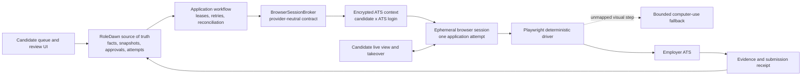

# Computer execution provider benchmark

## Decision in one sentence

**Recommendation:** ship the first founder dogfood executor with **Playwright on Browserbase**, persist only a narrowly scoped browser context for each candidate and ATS login, and create a fresh browser session for every application attempt. Keep **E2B** and **Cua** behind `BrowserSessionBroker` as full-desktop benchmarks; use **Orgo** only if a measured workflow genuinely needs a persistent desktop.

This is a provisional alpha choice, not a claim that Browserbase wins the production benchmark or supports every ATS.

## Why this is the shortest safe route

RoleDawn does not need one always-running computer per candidate to feel persistent. The durable product is the candidate's verified profile, evidence, job state, application snapshot, packet, approval, attempt, checkpoint, and receipt. Those belong in RoleDawn's database and private object storage. A remote computer is replaceable execution capacity.

The one browser state worth retaining is the minimum needed to resume an authenticated ATS account. Browserbase contexts can retain cookies and other Chromium profile data while individual sessions remain disposable. That fits the current browser-only application surface and keeps OS-level authority out of the common path.

**Do not build for alpha:** one global browser profile per user, one permanently running VM per user, or a provider-owned agent that can decide what to submit. Each option expands cost, credential exposure, cross-site tracking, recovery burden, and blast radius before RoleDawn has measured a need.

## The product pattern the founder was recalling

**Verified product description:** the likely reference is xAI's **Grok Bot**, announced August 11, 2026. xAI says Bots have a computer, sign into tools, remember conversations and workflows, and keep working until they need approval. The same announcement says Bots “share a computer of their own in the cloud.” See [B12](source-register.md).

**Open question:** xAI does not publish enough infrastructure detail to establish whether that computer is a permanently running VM, how it is scoped, how memory is stored, what isolation it provides, or what it costs per task.

**Inference:** Grok Bot validates a persistent *experience*, not a one-VM-per-user architecture. RoleDawn can provide the same continuity with database-backed memory, narrowly persisted authentication contexts, and compute that exists only during an application attempt.

## Recommended execution shape

### Persistence boundaries

| Layer | Persists | Does not become |
|---|---|---|
| RoleDawn PostgreSQL | Candidate-approved facts, evidence references, immutable application snapshots, policy, approvals, attempts, checkpoints, receipts | Model memory or a browser session log pretending to be truth |
| Private object storage | Source documents, rendered artifacts, bounded screenshots/traces under retention policy | A public file share or an indefinite recording archive |
| Candidate × ATS context | Cookies and site-local authentication only when that ATS requires an account | One global candidate identity spanning unrelated sites |
| Ephemeral session | Tabs, current page state, temporary downloads, in-progress interaction | Long-term memory or proof that a side effect happened |

Use a fresh, non-persistent context for applications that do not require an account. When a login is required, use one encrypted context per candidate and ATS tenant/login. Browserbase explicitly recommends one context per site and login and warns against concurrent use. See [B13](source-register.md).

### Session rules

1. Reserve an attempt and budget before creating compute.
2. Permit one active session per application and one writer per persisted context.
3. Default session TTL: 15 minutes; absolute alpha ceiling: 30 minutes.
4. Allow only the employer and required identity/CDN domains discovered through a reviewed adapter.
5. Use Playwright locators and deterministic form mappings first.
6. Escalate an unmapped visual step to a bounded computer-use tool; do not hand the model an unrestricted desktop by default.
7. Pause for candidate takeover on CAPTCHA, MFA, novel legal questions, account recovery, or any unresolved sensitive answer. Do not automate CAPTCHA bypass, even when a vendor sells that feature.
8. Require a single-use approval bound to the named application and immutable pre-submit diff before `Submit` becomes available.
9. After submission, reconcile the same attempt before retrying an uncertain result.
10. Release or destroy compute on success, blocker, cancellation, timeout, or reconciliation handoff. No idle keep-alive.

## Provider comparison

All capability statements below are from current provider documentation and remain vendor claims until RoleDawn benchmarks them.

| Option | Browser or desktop | Durable state | Candidate view / takeover | Public cost signal | RoleDawn fit |
|---|---|---|---|---|---|
| Browserbase | Managed Chromium browser | Encrypted contexts persist Chromium profile data until deletion; sessions last up to six hours | Interactive Live View can be embedded and supports human interaction | Developer: $20/month, 100 included browser hours, then $0.12/hour; Startup: $99/month, 500 hours, then $0.10/hour | **Recommended alpha primary.** Least authority for web-only ATS forms and direct Playwright support |
| E2B Desktop | Ubuntu full desktop | Pause/resume can retain memory and filesystem, or filesystem only; paused sandboxes are not compute-billed | VNC stream is documented; a secure end-candidate takeover contract still needs verification | Default documented compute is about $0.1089/hour; Hobby $0 base, Pro $150/month | Strong full-desktop benchmark when browser-only execution fails; broader authority than the common path needs |
| Orgo | Persistent cloud desktop | Desktop and disk survive stop/restart; configurable auto-stop | Vendor advertises live screen plus VNC/RDP | $29/month for one computer, $99 for four, $399 for sixteen; public usage-unit rates are absent | Persistent desktop fallback if measured workflows need native apps or long-lived desktop state |
| Cua | Open-source/BYOC computer abstraction and hosted sandbox interfaces | SDK documents ephemeral sandboxes plus persistent create/suspend/resume/delete lifecycle | Display URL is documented; secure scoped candidate takeover needs verification | No public hosted unit price; dedicated cloud fleets are by request | Useful portability and full-computer benchmark; not selected for alpha hosting |
| Grok Bot | Product, not an infrastructure provider | Vendor says Bots remember conversations/workflows | Vendor product experience | No task-level infrastructure price or architecture | Design reference only; cannot be selected as RoleDawn infrastructure |

See the dated primary sources and caveats in [B12–B16](source-register.md).

## Cost model

Browser minutes are unlikely to be the dominant cost if sessions are short and failures are controlled. Model calls, premium proxies, retries, human takeover, and support can dominate, so RoleDawn should measure **cost per confirmed application**, not cost per session.

### Illustrative Browserbase arithmetic

These are planning calculations from public prices, not quotes. They exclude model tokens, proxies, storage, taxes, failed attempts, and support.

| Volume assumption | Browser time | Illustrative plan arithmetic | Browser infrastructure estimate |
|---|---:|---|---:|
| 1,000 attempts/month at 10 minutes each | 166.7 hours | Developer includes 100 hours; 66.7 overage hours × $0.12 + $20 base | About $28/month |
| 10,000 attempts/month at 10 minutes each | 1,666.7 hours | Startup includes 500 hours; 1,166.7 overage hours × $0.10 + $99 base | About $215.67/month |

At the documented E2B default of two vCPU and 512 MiB RAM, compute is approximately $0.1089 per hour, or $0.01815 per ten-minute attempt, before plan base price and storage. Orgo's public pricing exposes computer slots but not enough usage detail to calculate cost per application. Cua does not publish a hosted unit price.

### Required metering

For every attempt, record:

- provider and region behind the broker;
- session start, stop, active seconds, and idle seconds;
- model tokens and calls by task;
- proxy and artifact bytes;
- deterministic actions versus model actions;
- takeover requested, accepted, and duration;
- retry and failure reason;
- terminal state: confirmed, blocked, cancelled, or uncertain;
- total cost attributed to the confirmed application or failed attempt.

Reserve a conservative per-attempt budget before launch, enforce provider concurrency ceilings, and stop the workflow when the budget or TTL is exhausted. Tune the reservation after measuring p50 and p95 accepted-output cost.

## Why not one persistent computer per candidate yet

| Concern | Always-on candidate VM | Context plus ephemeral session |
|---|---|---|
| Idle cost | Accrues or consumes a scarce slot while no application runs | Compute exists only while work runs |
| Credential scope | Multiple sites and unrelated secrets accumulate in one OS profile | One ATS login can be revoked without affecting others |
| Blast radius | A compromised desktop can expose the candidate's whole job-search environment | A session and site-scoped context limit exposure |
| Scaling | Candidate count drives VM inventory | Active attempts drive session count |
| Recovery | Long-lived machine drift becomes product state | Recreate compute and resume from database checkpoints |
| User continuity | Easy to mistake desktop history for authoritative memory | Continuity is explicit, queryable, and auditable in RoleDawn |

**Reversal trigger:** introduce a persistent full desktop only after benchmark evidence shows that a valuable, frequent workflow cannot be completed reliably with a browser context plus ephemeral sessions and that the retention, isolation, deletion, takeover, and per-active-user economics are acceptable.

## Alpha implementation sequence

1. **Completed for alpha:** finalize the provider-neutral broker and runtime boundaries for create, connect, release, destroy, recovery, and provider usage. Live View and persistent-context lifecycle remain gated capabilities.
2. **Completed locally:** implement one Browserbase adapter, one Playwright execution path, and one deterministic Greenhouse no-submit driver. No live Browserbase or employer-ATS claim is made yet.
3. **Schema foundation completed; runtime mapping gated:** store only an opaque provider context reference for a candidate × ATS origin. Do not enable persistence until an account-required founder test proves it is necessary.
4. **Open:** embed Live View behind a short-lived, candidate-authorized takeover token.
5. **Completed for fill authority:** bind the exact four-file revision and exact standard facts to a single-use `FILL_APPLICATION_ONCE` approval. A separate immutable submit diff and `SUBMIT_APPLICATION_ONCE` approval remain open.
6. **Open and requires explicit founder approval:** fill one founder dogfood application to pre-submit review, then separately authorize submission, reconcile the employer result, and store a receipt.
7. **Later benchmark:** run the same fixed forms through E2B and Cua only for steps Browserbase cannot complete; do not build three production adapters before the primary path works.
8. **Production selection gate:** expand the benchmark toward O-002's 100-form set, measuring completion, intervention, latency, recovery, and confirmed cost rather than provider demos.

## Benchmark acceptance gates

The selected production provider must pass all of these with RoleDawn's own tests:

- tenant and candidate isolation;
- site-scoped persistent login without cross-site state leakage;
- short-lived candidate takeover with explicit expiry and revocation;
- deterministic upload of the exact approved bytes;
- no action after approval expiry, cancellation, or input invalidation;
- no duplicate submit after disconnect or timeout;
- uncertain-state reconciliation before retry;
- complete trace redaction and configured retention/deletion;
- concurrency, cold-start, and regional behavior under load;
- p50/p95 active time, intervention rate, completion rate, and cost per confirmed application;
- provider outage and context-revocation recovery;
- verified deletion of sessions, contexts, recordings, and artifacts.

## Open questions before production

- Does Browserbase's embedded Live View provide the exact short-lived authentication and audit controls RoleDawn requires for candidate takeover?
- Which ATS flows genuinely require an account, and can each use a dedicated context without simultaneous writers?
- Can E2B or Cua expose candidate takeover without making a desktop publicly reachable or expanding model authority?
- What are Orgo's actual usage rates, deletion evidence, regional options, and slot-reuse rules?
- What retention, subprocessors, DPA, incident, and breach-notification terms apply to each provider?
- What completion and intervention rates emerge from RoleDawn's own fixed ATS test set?

Until those are answered, provider documentation establishes possible capability—not RoleDawn reliability, security, ATS coverage, or submission success.
